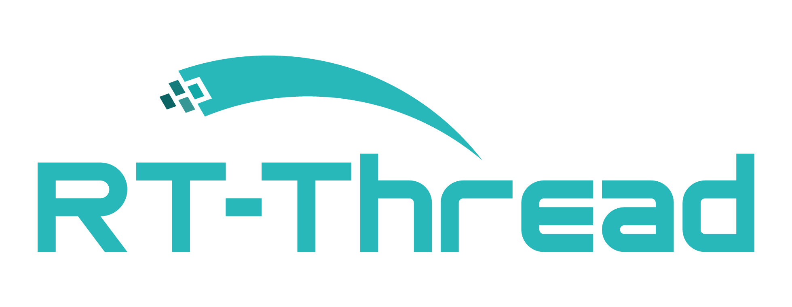
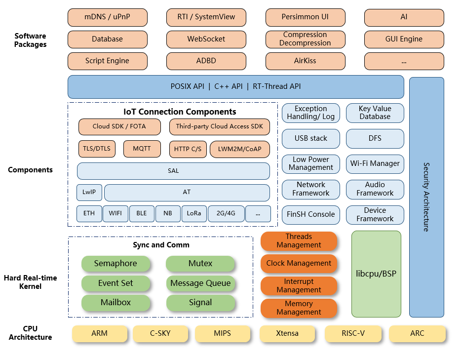
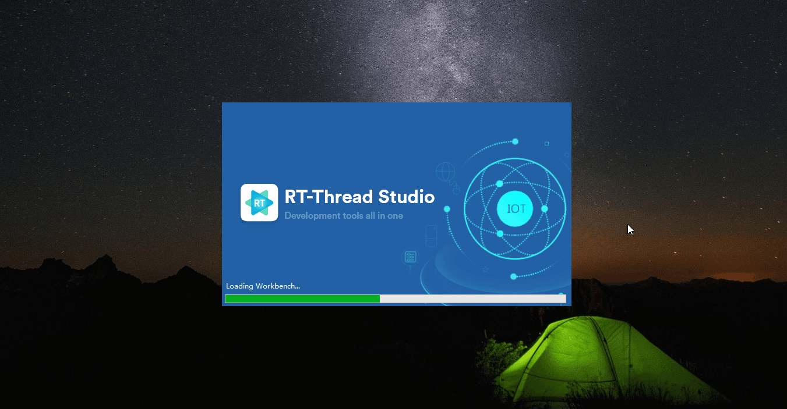
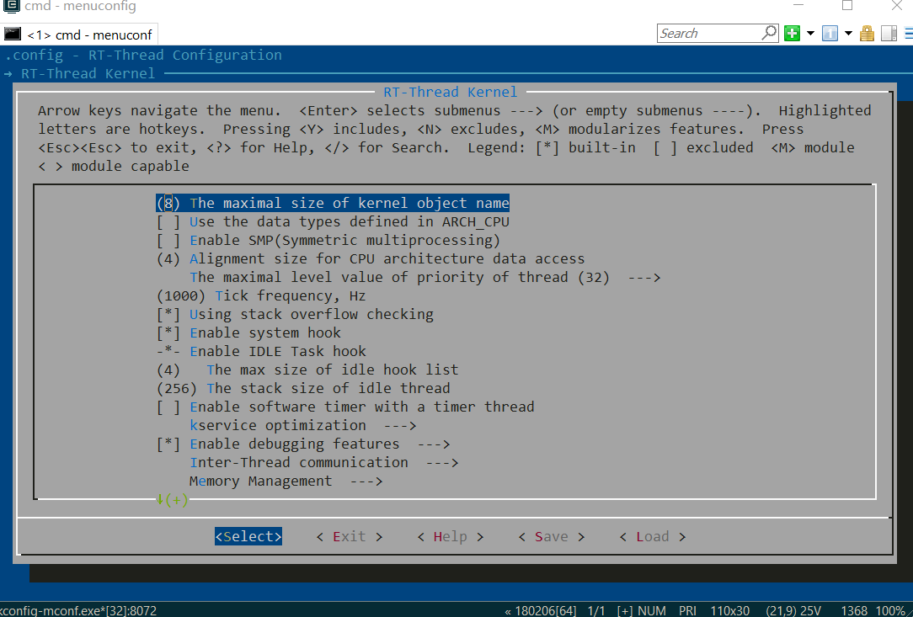

<p align="center">

</p>

[English](README.md) | [中文](README_zh.md) | **Español** | [Deutsch](README_de.md)

[](https://github.com/RT-Thread/rt-thread/stargazers)
[](https://gitee.com/rtthread/rt-thread/stargazers)
[](https://github.com/RT-Thread/rt-thread/blob/master/LICENSE)
[](https://github.com/RT-Thread/rt-thread/releases)
[](https://gitter.im/RT-Thread/rt-thread?utm_source=badge&utm_medium=badge&utm_campaign=pr-badge&utm_content=badge)
[](https://github.com/RT-Thread/rt-thread/pulls)
[](https://github.com/RT-Thread/rt-thread/pulls)

# RT-Thread

RT-Thread nació en 2006, es un sistema operativo en tiempo real (RTOS) de código abierto, neutral y basado en la comunidad.

RT-Thread está escrito principalmente en lenguaje C, fácil de entender y fácil de portar (puede ser rápidamente portado a una amplia gama de MCUs y chips de módulos). Aplica métodos de programación orientados a objetos al diseño de sistemas en tiempo real, lo que hace que el código sea elegante, estructurado, modular y muy adaptable.

RT-Thread tiene una versión estándar y una versión Nano. Para los sistemas de microcontroladores (MCU) con recursos limitados, la versión Nano, que requiere solo 3KB de memoria Flash y 1,2KB de memoria RAM, puede adaptarse con herramientas fáciles de usar. Para los dispositivos IoT con muchos recursos, RT-Thread puede utilizar la herramienta de gestión de paquetes de software en línea, junto con las herramientas de configuración del sistema, para lograr un corte modular intuitivo y rápido, importando sin problemas paquetes de software ricos; así, logrando funciones complejas como la interfaz gráfica de Android y efectos de deslizamiento táctil, efectos de interacción de voz inteligente, etc.

## Arquitectura RT-Thread

RT-Thread no sólo dispone de un núcleo en tiempo real, sino también de ricos componentes. Su arquitectura es la siguiente:





Incluye:

- Capa del kernel: El kernel de RT-Thread, la parte central de RT-Thread, incluye la implementación de objetos en el sistema del kernel, como el multihilo y su programación, el semáforo, el buzón, la cola de mensajes, la gestión de la memoria, el temporizador, etc.; libcpu/BSP (Chip Migration Related Files/Board Support Package) está estrechamente relacionado con el hardware y consiste en controladores periféricos y portación de la CPU

- Componentes y capa de servicios: Los componentes se basan en software de nivel superior sobre el núcleo de RT-Thread, como sistemas de archivos virtuales, interfaces de línea de comandos FinSH, frameworks de red, frameworks de dispositivos, etc. Su diseño modular permite una alta cohesión interna dentro de los componentes y un bajo acoplamiento entre ellos.

- [Paquete de software RT-Thread](https://packages.rt-thread.org/en/index.html): Un componente de software de propósito general que se ejecuta en la plataforma del sistema operativo RT-Thread IoT para diferentes áreas de aplicación, que consiste en información de descripción, código fuente o archivos de biblioteca. RT-Thread proporciona una plataforma de paquetes abierta con paquetes disponibles oficialmente o suministrados por los developers que proporcionan a los developers una selección de paquetes reutilizables que son una parte importante del ecosistema de RT-Thread. El ecosistema de paquetes es fundamental para la elección de un sistema operativo porque estos paquetes son altamente reutilizables y modulares, lo que facilita a los developers de aplicaciones la construcción del sistema que desean en el menor tiempo posible. RT-Thread es compatible con más de 370 paquetes de software.

## Características de RT-Thread

- Diseñado para dispositivos con recursos limitados, el núcleo mínimo requiere sólo 1,2 KB de RAM y 3 KB de Flash.
- Una variedad de interfaces estándar, como POSIX, CMSIS, entorno de aplicación C++.
- Tiene ricos componentes y un ecosistema de paquetes próspero y de rápido crecimiento.
- Estilo de código elegante, fácil de usar, leer y dominar.
- Alta escalabilidad. RT-Thread tiene una arquitectura de software escalable de alta calidad, acoplamiento suelto, modularidad, es fácil de adaptar y ampliar.
- Admite aplicaciones de alto rendimiento.
- Es compatible con todas las herramientas de compilación principales, como GCC, Keil e IAR.
- Admite una amplia gama de <a href="https://www.rt-thread.io/board.html">arquitecturas y chips</a>.

## Code Catalogue

  El catálogo de código fuente de RT-Thread se muestra como sigue:

| Name          | Descripción                                             |
| ------------- | ------------------------------------------------------- |
| BSP          | Board Support Package basado en la portación de varias placas de desarrollo |
| componentes    | Componentes, como finsh shell, sistema de archivos, pila de protocolos, etc.|
| documentación | Documentos relacionados, como el estilo de codificación, doxygen, etc.       |
| ejemplos      | Código de ejemplo relacionado                            |
| incluir       | Archivos de cabecera del kernel RT-Thread.                |
| libcpu        | Código de portabilidad de CPUs como ARM/MIPS/RISC-V, etc.|
| src           | Los archivos fuente del kernel RT-Thread. |
| herramientas  | Los archivos de script para la herramienta de construcción de comandos de RT-Thread. |

RT-Thread ha sido portado para casi 200 placas de desarrollo, la mayoría de los BSPs soportan el MDK, el entorno de desarrollo IAR y el compilador GCC, y han proporcionado un proyecto MDK e IAR por defecto, que permite a los usuarios añadir su propio código de aplicación directamente basado en el proyecto. Cada BSP tiene una estructura de directorio similar, y la mayoría de los BSPs proporcionan un archivo README.md, que es un archivo con formato markdown que contiene la introducción básica del BSP, y presenta cómo empezar a usar el BSP de forma sencilla.

# Recursos

## Arquitecturas Compatibles

RT-Thread es compatible con muchas arquitecturas, y ha cubierto las principales arquitecturas de las aplicaciones actuales. Arquitectura y fabricante de chips implicados:

- **ARM Cortex-M0/M0+**：manufacturers like ST
- **ARM Cortex-M3**：manufacturers like ST、Winner Micro、MindMotion, ect.
- **ARM Cortex-M4**：manufacturers like ST、Infineon、Nuvoton、NXP、[Nordic](https://github.com/RT-Thread/rt-thread/tree/master/bsp/nrf5x)、GigaDevice、Realtek、Ambiq Micro, ect.
- **ARM Cortex-M7**：manufacturers like ST、NXP
- **ARM Cortex-M23**：manufacturers like GigaDevice
- **ARM Cortex-M33**：manufacturers like ST
- **ARM Cortex-R4**
- **ARM Cortex-A8/A9**：manufacturers like NXP
- **ARM7**：manufacturers like Samsung
- **ARM9**：manufacturers like Allwinner、Xilinx 、GOKE
- **ARM11**：manufacturers like Fullhan
- **MIPS32**：manufacturers like loongson、Ingenic
- **RISC-V RV32E/RV32I[F]/RV64[D]**：manufacturers like Hifive、[Kendryte](https://github.com/RT-Thread/rt-thread/tree/master/bsp/k210)、[bouffalo_lab](https://github.com/RT-Thread/rt-thread/tree/master/bsp/bouffalo_lab)、[Nuclei](https://nucleisys.com/)、[T-Head](https://www.t-head.cn/)、[HPMicro](https://github.com/RT-Thread/rt-thread/tree/master/bsp/hpmicro)
- **ARC**：manufacturers like SYNOPSYS
- **DSP**：manufacturers like TI
- **C-Sky**
- **x86**

## IDE y compilador compatibles

Los principales IDE/compiladores soportados por RT-Thread son:

- RT-Thread Studio IDE
- MDK KEIL
- IAR
- GCC

## RT-Thread Studio IDE

[User Manual](https://www.rt-thread.io/document/site/rtthread-studio/um/studio-user-manual/) | [Tutorial Videos](https://youtu.be/ucq5eJgZIQg)

RT-Thread Studio IDE (también conocido como RT-Studio) es un entorno de desarrollo integrado construido por el equipo de RT-Thread. Cuenta con un sistema de configuración gráfica fácil de usar y una gran cantidad de paquetes de software y recursos de componentes. RT-Studio tiene las características de creación, configuración y gestión de proyectos, así como la edición de código, la gestión del SDK, la configuración de la construcción, la configuración de la depuración, la descarga del programa y la depuración. Buscamos que el uso de RT-Studio sea lo más intuitivo posible, reduciendo la duplicación de trabajo y mejorando la eficiencia del desarrollo.



## Herramienta Env

[User Manual](documentation/env/env.md) | [Tutorial Videos](https://www.youtube.com/watch?v=dEK94o_YoSo)

En la etapa inicial, el equipo de RT-Thread también creó una herramienta auxiliar llamada Env. Es una herramienta auxiliar con una TUI (interfaz de usuario basada en texto). Los desarrolladores pueden utilizar la herramienta Env para configurar y generar los proyectos GCC, Keil MDK e IAR.



# Cómo Empezar

[Guía de programación RT-Thread](https://www.rt-thread.io/document/site/tutorial/quick-start/introduction/introduction/) | [RT-Thread Studio IDE](https://www.rt-thread.io/studio.html) | [Kernel Sample](https://github.com/RT-Thread-packages/kernel-sample) | [RT-Thread Guía de iniciación](https://www.youtube.com/watch?v=ZMi1O-Rr7yc&list=PLXUV89C_M3G5KVw2IerI-pqApdSM_IaZo)

Basado en [STM32F103 BluePill](https://github.com/RT-Thread/rt-thread/tree/master/bsp/stm32/stm32f103-blue-pill) | [Raspberry Pi Pico](https://github.com/RT-Thread/rt-thread/tree/master/bsp/raspberry-pico)

## Simulator

El BSP de RT-Thread puede compilarse directamente y descargarse en la placa de desarrollo correspondiente para su uso. Además, RT-Thread también proporciona el BSP qemu-vexpress-a9, que puede utilizarse sin plataforma de hardware. Consulte la guía de inicio más abajo para más detalles. [Windows](documentation/quick-start/quick_start_qemu/quick_start_qemu.md) | [Linux Ubuntu](documentation/quick-start/quick_start_qemu/quick_start_qemu_linux.md) | [Mac OS](documentation/quick-start/quick_start_qemu/quick_start_qemu_macos.md)

# Licencia

RT-Thread es un software de código abierto y ha sido licenciado bajo la Licencia Apache Versión 2.0 desde la v3.1.1. La información sobre la licencia y los derechos de autor puede verse generalmente al principio del código:

```c
/* Copyright (c) 2006-2018, RT-Thread Development Team
 *
 * SPDX-License-Identifier: Apache-2.0
 * ...
 */
```

# Comunidad

RT-Thread está muy agradecido por el apoyo de todos los desarrolladores de la comunidad, y si tienes alguna idea, sugerencia o pregunta en el proceso de uso de RT-Thread, se puede llegar a RT-Thread por los siguientes medios, y también estamos actualizando RT-Thread en tiempo real en estos canales. Al mismo tiempo, cualquier pregunta se puede hacer en [la sección de problemas del repositorio de RT-Thread](https://github.com/RT-Thread/rt-thread/issues) or [en el foro de RT-Thread](https://club.rt-thread.io/), y los miembros de la comunidad la responderán.

[Website](https://www.rt-thread.io) | [Github](https://github.com/RT-Thread/rt-thread) | [Twitter](https://twitter.com/rt_thread) | [LinkedIn](https://www.linkedin.com/company/rt-thread-iot-os/posts/?feedView=all) | [Youtube](https://www.youtube.com/channel/UCdDHtIfSYPq4002r27ffqPw) | [Facebook](https://www.facebook.com/RT-Thread-IoT-OS-110395723808463/?modal=admin_todo_tour) | [Medium](https://rt-thread.medium.com/)

# Contribución

Si estás interesado en RT-Thread y quieres unirte al desarrollo de RT-Thread y convertirte en un contribuidor de código, por favor consulta la [Guía de Contribución de Código.](.github/CONTRIBUTING.md).
