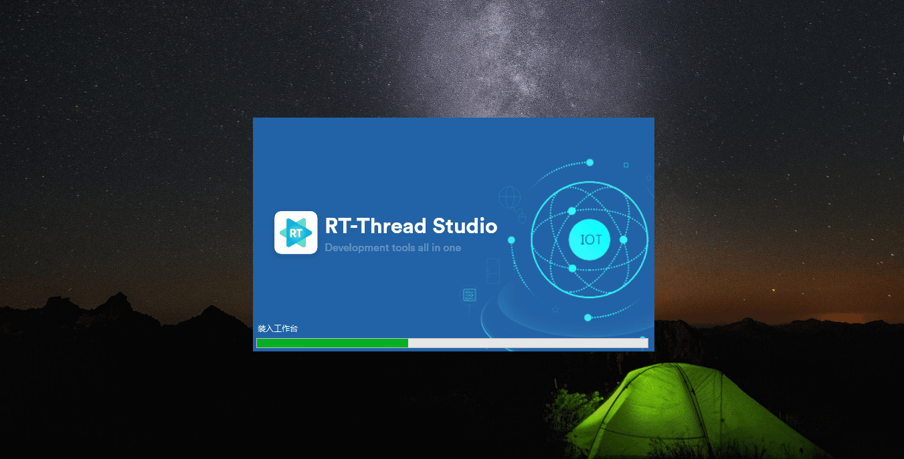

<p align="center">

</p>

[English](README.md) | **中文** | [Español](README_es.md) | [Deutsch](README_de.md)

[](https://github.com/RT-Thread/rt-thread/stargazers)
[](https://gitee.com/rtthread/rt-thread/stargazers)
[](https://github.com/RT-Thread/rt-thread/blob/master/LICENSE)
[](https://github.com/RT-Thread/rt-thread/releases)
[](https://gitter.im/RT-Thread/rt-thread?utm_source=badge&utm_medium=badge&utm_campaign=pr-badge&utm_content=badge)
[](https://github.com/RT-Thread/rt-thread/pulls)
[](https://github.com/RT-Thread/rt-thread/pulls)

## 简介

RT-Thread诞生于2006年，是一款以开源、中立、社区化发展起来的物联网操作系统。
RT-Thread主要采用 C 语言编写，浅显易懂，且具有方便移植的特性（可快速移植到多种主流 MCU 及模组芯片上）。RT-Thread把面向对象的设计方法应用到实时系统设计中，使得代码风格优雅、架构清晰、系统模块化并且可裁剪性非常好。

RT-Thread有完整版和Nano版，对于资源受限的微控制器（MCU）系统，可通过简单易用的工具，裁剪出仅需要 3KB Flash、1.2KB RAM 内存资源的 NANO 内核版本；而相对资源丰富的物联网设备，可使用RT-Thread完整版，通过在线的软件包管理工具，配合系统配置工具实现直观快速的模块化裁剪，并且可以无缝地导入丰富的软件功能包，实现类似 Android 的图形界面及触摸滑动效果、智能语音交互效果等复杂功能。

## **RT-Thread架构**

RT-Thread是一个集实时操作系统（RTOS）内核、中间件组件的物联网操作系统，架构如下：


- 内核层：RT-Thread内核，是 RT-Thread的核心部分，包括了内核系统中对象的实现，例如多线程及其调度、信号量、邮箱、消息队列、内存管理、定时器等；libcpu/BSP（芯片移植相关文件 / 板级支持包）与硬件密切相关，由外设驱动和 CPU 移植构成。

- 组件与服务层：组件是基于 RT-Thread内核之上的上层软件，例如虚拟文件系统、FinSH命令行界面、网络框架、设备框架等。采用模块化设计，做到组件内部高内聚，组件之间低耦合。


- RT-Thread软件包：运行于 RT-Thread物联网操作系统平台上，面向不同应用领域的通用软件组件，由描述信息、源代码或库文件组成。RT-Thread提供了开放的软件包平台，这里存放了官方提供或开发者提供的软件包，该平台为开发者提供了众多可重用软件包的选择，这也是 RT-Thread生态的重要组成部分。软件包生态对于一个操作系统的选择至关重要，因为这些软件包具有很强的可重用性，模块化程度很高，极大的方便应用开发者在最短时间内，打造出自己想要的系统。RT-Thread已经支持的软件包数量已经达到450+。


## RT-Thread的特点

- 资源占用极低，超低功耗设计，最小内核（Nano版本）仅需1.2KB RAM，3KB Flash。

- 组件丰富，繁荣发展的软件包生态 。

- 简单易用 ，优雅的代码风格，易于阅读、掌握。

- 高度可伸缩，优质的可伸缩的软件架构，松耦合，模块化，易于裁剪和扩展。

- 强大，支持高性能应用。

- 跨平台、芯片支持广泛。


## **代码目录**

RT-Thread源代码目录结构如下图所示：

| 名称          | 描述                                                    |
| ------------- | ------------------------------------------------------- |
| BSP           | Board Support Package（板级支持包）基于各种开发板的移植 |
| components    | RT-Thread 的各个组件代码，例如 finsh，gui 等。          |
| documentation | 相关文档，如编码规范等                                  |
| examples      | 相关示例代码                                            |
| include       | RT-Thread 内核的头文件。                                |
| libcpu        | 各类芯片的移植代码。                                    |
| src           | RT-Thread 内核的源文件。                                |
| tools         | RT-Thread 命令构建工具的脚本文件。                      |

目前RT-Thread已经针对将近90种开发板做好了移植，大部分 BSP 都支持 MDK﹑IAR开发环境和GCC编译器，并且已经提供了默认的 MDK 和 IAR 工程，用户可以直接基于这个工程添加自己的应用代码。 每个 BSP 的目录结构高度统一，且都提供一个 README.md 文件，包含了对这个 BSP 的基本介绍，以及相应的说明，方便用户快速上手。

Env 是RT-Thread推出的开发辅助工具，针对基于RT-Thread操作系统的项目工程，提供编译构建环境、图形化系统配置及软件包管理功能。其内置的 menuconfig 提供了简单易用的配置剪裁工具，可对内核、组件和软件包进行自由裁剪，使系统以搭积木的方式进行构建。

[下载 Env 工具](https://www.rt-thread.org/download.html#download-rt-thread-env-tool)

[Env 用户手册](https://www.rt-thread.org/document/site/#/development-tools/env/env)


# 资源文档

## **硬件支持**

RT-Thread RTOS 支持许多架构，并且已经涵盖了当前应用中的主要架构。涉及的架构和芯片制造商有：

- ARM Cortex-M0/M0+：如芯片制造商 ST
- ARM Cortex-M3：如芯片制造商 ST、全志、灵动等.
- ARM Cortex-M4：如芯片制造商 ST、Infineon、Nuvoton、NXP、[Nordic](https://github.com/RT-Thread/rt-thread/tree/master/bsp/nrf5x)、GigaDevice、Realtek、Ambiq Micro等
- ARM Cortex-M7：如芯片制造商 ST、NXP
- ARM Cortex-M23：如芯片制造商 GigaDevice
- ARM Cortex-M33：如芯片制造商 ST
- ARM Cortex-R4
- ARM Cortex-A8/A9：如芯片制造商 NXP
- ARM7：如芯片制造商Samsung
- ARM9：如芯片制造商Allwinner、Xilinx 、GOKE
- ARM11：如芯片制造商Fullhan
- MIPS32：如芯片制造商loongson、Ingenic
- RISC-V RV32E/RV32I[F]/RV64[D]：如芯片制造商sifive、[嘉楠Kendryte](https://github.com/RT-Thread/rt-thread/tree/master/bsp/k210)、[博流](https://github.com/RT-Thread/rt-thread/tree/master/bsp/bouffalo_lab)、[芯来Nuclei](https://nucleisys.com/)、[平头哥T-Head](https://www.t-head.cn/)
- ARC：如芯片制造商SYNOPSYS
- DSP：如芯片制造商 TI
- C-Sky
- x86


## **支持的 IDE 和编译器**

RT-Thread主要支持的IDE/编译器包括：

- MDK KEIL

- IAR

- Gcc

- RT-Thread Studio

使用基于 Python 的 [scons](http://www.scons.org/) 进行命令行生成。

RT-Thread Studio演示：





## **快速上手**

RT-Thread BSP可以直接编译并下载到相应的开发板使用。此外，RT-Thread还提供 qemu-vexpress-a9 BSP，无需硬件平台即可使用。有关详细信息，请参阅下面的入门指南。

[QEMU 入门指南(Windows)](documentation/quick-start/quick_start_qemu/quick_start_qemu.md)

[QEMU 入门指南(Ubuntu)](documentation/quick-start/quick_start_qemu/quick_start_qemu_linux.md)


## 文档

[文档中心](https://www.rt-thread.org/document/site/ ) | [编程指南](https://www.rt-thread.org/document/site/#/rt-thread-version/rt-thread-standard/programming-manual/basic/basic )

[应用 RT-Thread 实现蜂鸣器播放器教程](https://www.rt-thread.org/document/site/#/rt-thread-version/rt-thread-standard/tutorial/beep-player/README?id=%e5%ba%94%e7%94%a8-rt-thread-%e5%ae%9e%e7%8e%b0%e8%9c%82%e9%b8%a3%e5%99%a8%e6%92%ad%e6%94%be%e5%99%a8) | [分布式温度监控系统教程](https://www.rt-thread.org/document/site/#/rt-thread-version/rt-thread-standard/tutorial/temperature-system/README?id=%e5%88%86%e5%b8%83%e5%bc%8f%e6%b8%a9%e5%ba%a6%e7%9b%91%e6%8e%a7%e7%b3%bb%e7%bb%9f ) | [智能车连载教程](https://www.rt-thread.org/document/site/#/rt-thread-version/rt-thread-standard/tutorial/smart-car/README?id=%e6%99%ba%e8%83%bd%e8%bd%a6%e8%bf%9e%e8%bd%bd%e6%95%99%e7%a8%8b%e7%ae%80%e4%bb%8b )

## 例程

[内核示例](https://github.com/RT-Thread-packages/kernel-sample)  | [设备示例代码](https://github.com/RT-Thread-packages/peripheral-sample ) | [文件系统示例代码](https://github.com/RT-Thread-packages/filesystem-sample ) | [网络示例代码](https://github.com/RT-Thread-packages/network-sample ) | [RT-Thread API参考手册](https://www.rt-thread.org/document/api/ )

[基于STM32L475 IoT Board 开发板SDK](https://github.com/RT-Thread/IoT_Board) | [基于W601 IoT Board 开发板SDK](https://github.com/RT-Thread/W601_IoT_Board)

## 视频

RT-Thread视频中心提供了一系列RT-Thread相关教程及分享内容。

如：内核入门系列 | Env系列 | 网络系列 | Nano移植系列 |  RT-Thread Studio系列 | 柿饼UI系列 | 答疑直播系列 | 社区作品系列

更多详情，请前往 [视频中心](https://www.rt-thread.org/page/video.html)

# **许可协议**

RT-Thread 系统完全开源，遵循 Apache License 2.0 开源许可协议，可以免费在商业产品中使用，并且不需要公开私有代码，没有潜在商业风险。

```
/*
 * Copyright (c) 2006-2018, RT-Thread Development Team
 *
 * SPDX-License-Identifier: Apache-2.0
 */
```

# 社区支持

RT-Thread非常感谢所有社区小伙伴的支持，在使用RT-Thread的过程中若您有任何的想法，建议或疑问都可通过以下方式联系到 RT-Thread，我们也实时在这些频道更新RT-Thread的最新讯息。同时，任何问题都可以在 [论坛](https://club.rt-thread.org/index.html) 中提出，社区成员将回答这些问题。

[官网]( https://www.rt-thread.org) | [论坛]( https://www.rt-thread.org/qa/forum.php) | [哔哩哔哩官方账号](https://space.bilibili.com/423462075?spm_id_from=333.788.b_765f7570696e666f.2) | [微博官方账号](https://weibo.com/rtthread?is_hot=1) | [知乎官方账号](https://www.zhihu.com/topic/19964581/hot)

RT-Thread微信公众号：


# 贡献代码

如果您对RT-Thread感兴趣，并希望参与RT-Thread的开发并成为代码贡献者，请参阅[代码贡献指南](https://www.rt-thread.org/document/site/#/rt-thread-version/rt-thread-standard/development-guide/github/github)。

## 感谢以下小伙伴对本仓库的贡献！

<a href="https://github.com/RT-Thread/rt-thread/graphs/contributors">
  
</a>
