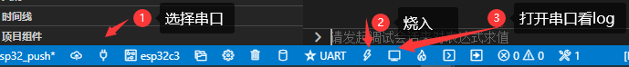

# ESP32-C3 BSP Introduction

[中文](README_ZH.md) | English

This document records the execution instruction of the BSP (board support package) for the [ESP32-C3](http://luatos.com/t/esp32c3) development board.

The document is covered in two parts:

- Board Resources Introduction
- Quickly Get Started

## Resources Introduction

We tested 2 development boards, it all works, but due to the different LED pins of the two development boards, so we'll need to select the corresponding development board in the menuconfig. 

- [LUATOS_ESP32C3](https://wiki.luatos.com/chips/esp32c3/board.html)


- [HX-DK-商](https://docs.wireless-tech.cn/doc/7/)


The mainly-used resources of LUATOS_ESP32C3 are shown as follows:

- MCU: [esp32-c3](https://www.espressif.com/sites/default/files/documentation/esp32-c3_datasheet_en.pdf)，Main Frequency 160MHz, 407.22 CoreMark; 2.55 CoreMark/MHz
- Built-in Chip: 384KB ROM, 400KB SRAM
- Peripherals
  - Red LED: 2, LED: D4 (IO12), D5（IO13）
  - Button: 2, K1（BOOT） K2(RST)
  - SPI FLASH: 4M
- Common-used interfaces: USB, UART, etc.

### For more details about this board, please refer to [Here](https://wiki.luatos.com/chips/esp32c3/board.html).

## **Peripheral Condition**

Each peripheral supporting condition for this BSP is as follows:

| **On-board Peripherals** | ****Support**** | ****Remark****                                               |
| ------------------------ | --------------- | ------------------------------------------------------------ |
| GPIO                     | Support         |                                                              |
| UART                     | Support         | Using LUATOS_ESP32C3 development board requires connecting serial port to USB chip UART0_TX and UART0_RX (such as CP2102) |
| JTAG debug               | Support         | ESP32C3 usb-linked development boards can be debugged        |

## Quickly Get Started

First of all, we'll need to build the IDE, Espressif officially recommends the IDF. 
When installing the IDF, please select version 4.4. If you are familiar with the official IDF command line, you can also use the command line to perform the `idf.py build` directly in the `bsp/esp32_c3`, which has been tested and proved that it's functional

### ESP-IDF Adds RT-Thread patch

The IDF was running the FreeRTOS, so we'll need a few modifications to get to RT-Thread. 
Copy the `rtt.patch` file to the IDF code directory, and then execute the next few commands on the `git bash` command line to mark the patch.

```
cd esp/esp-idf
git checkout v4.4
git am rtt.patch
```

If you don't want to use the patch file and have uploaded the code to GitHub, you can now go to [tangzz98/esp-idf](tangzz98/esp-idf) to download the latest `freertos_wrapper` branch code. After the modification, the original IDF example is still kept in normal use, they won't interfere with each other.

#### Compile and Download

Right-click `bsp/ESP32_C3` and use vscode to open the project

Compile and select the button at the bottom:


Here we usually use the serial port to download, you need to choose the corresponding serial port according to your own development board (if there is JTAG, you can also use JTAG to download and debug)



Once the project is successfully downloaded, the system runs automatically, the red LED will blink in 1s on cycles.

## Notes

- The basic functions are now supported, but it needs more, welcome any contributions and feedback. 


Maintainer: 

- [supperthomas](https://github.com/supperthomas) email address: [78900636@qq.com](mailto:78900636@qq.com)

Special thanks to [chenyingchun0312](https://github.com/chenyingchun0312) for providing support on the RISC-V part working.

