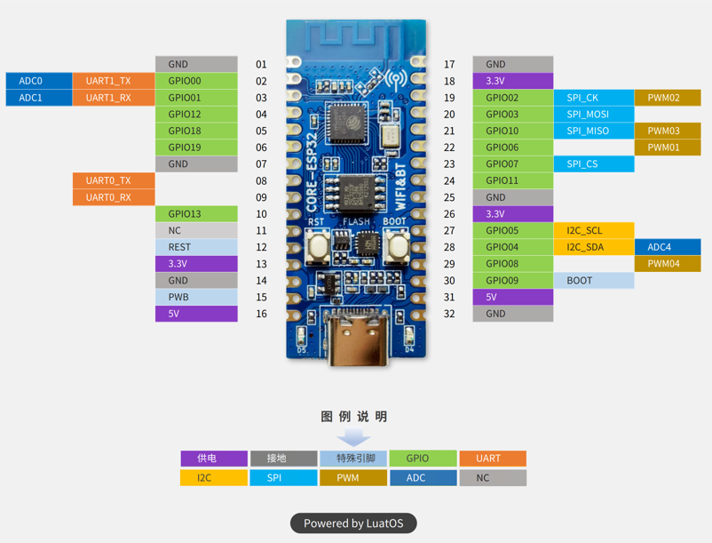
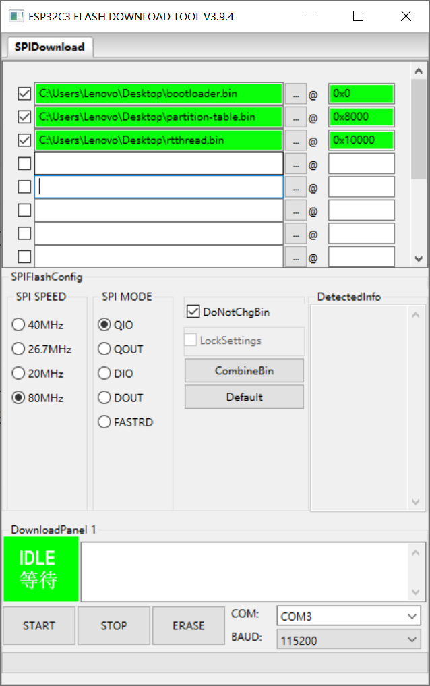

# ESP32-C3 BSP 说明

中文 | [English](README.md)

## 简介

本文档为基于RT-THREAD的乐鑫ESP32-C3的[ESP32C3](http://luatos.com/t/esp32c3) BSP (板级支持包) 说明。

主要内容如下：

- 开发板资源介绍
- BSP 快速上手

通过阅读快速上手章节开发者可以快速地上手该 BSP，将 RT-Thread 运行在开发板上。

## 开发板介绍

目前测试了两款开发板，运行都正常，由于两款开发板LED小灯引脚不同，请在menuconfig中选择自己手上的开发板。已测开发板外观如下图所示：

- [LUATOS_ESP32C3](https://wiki.luatos.com/chips/esp32c3/board.html)



- [HX-DK-商](https://docs.wireless-tech.cn/doc/7/)


该LUATOS_ESP32C3开发板常用 **板载资源** 如下：

- MCU：[esp32-c3](https://www.espressif.com/sites/default/files/documentation/esp32-c3_datasheet_en.pdf)，主频  160MHz， 407.22 CoreMark; 2.55  CoreMark/MHz
- 芯片内置：384KB ROM,  400KB SRAM,
- 常用外设
  - 红色LED：2个，LED: D4 (IO12), D5（IO13）
  - 按键：2个，K1（BOOT） K2(RST)
  - SPI FLASH: 4M 
- 常用接口：USB UART等

开发板更多详细信息请参考 [ESP32-C3开发板介绍](https://wiki.luatos.com/chips/esp32c3/board.html)。

## 外设支持

本 BSP 目前对外设的支持情况如下：

| **片上外设**      | **支持情况** | **备注**                              |
| :----------------- | :----------: | :------------------------------------- |
| GPIO              |     支持     |  |
| UART              |     支持     | 使用LUATOS_ESP32C3开发板需要在UART0_TX和UART0_RX连接串口转USB芯片（如CP2102）|
| JTAG调试          |     支持     | ESP32C3采用USB方式和PC链接的开发板可以调试                                |
| WIFI              | 部分支持 | 目前存在一些问题，例如不能在ISR中使用`rt_mq_recive`等 |
| BLE             | 部分支持 | 目前存在一些问题，例如`NimBLE`启动一段时间后运行错误 |
| GDBStub         | 支持 | 通过开启`BSP_ENABLE_GDBSTUB`开关即可使用ESP-IDF所提供的GDB，其会在芯片出错后进入GDB模式 |
| HWTIMER         | 支持 |
注：

1、WIFI和BLE不能同时启用，在使用BLE驱动时注意在`menuconfig`中关闭`RT_USING_WIFI`和`LWIP`开关。另外由于能力有限且缺乏调试设备，WIFI和BLE驱动运行都有问题，如果可以解决联系[timwcx@qq.com](mailto:timwcx@qq.com)。

2、BLE驱动仅支持`NimBLE`，并且由`esp-idf`中的`bluetooth`组件提供，使用BLE驱动可以参考`bsp/ESP32_C3/packages/ESP-IDF-latest/examples/bluetooth/nimble`下的样例程序，注意在调用`NimBLE`相关接口之前要调用`esp_timer_init()`函数初始化时钟驱动。

一种运行BLE样例的方案是将样例程序加入到`scons`编译并在`bsp/ESP32_C3/main/main.c`中调用时钟初始化程序和样例程序入口。

```c
int main(void) {
  ...
#ifdef BSP_USING_BLE
    esp_timer_init(); //调用时钟初始化程序
    app_main();   //调用BLE样例程序入口
#endif
  ...
}
```

3、关于GDBStub组件的使用，文档见[ESP-IDF关于GDBStub官方文档](https://docs.espressif.com/projects/esp-idf/zh_CN/latest/esp32c3/api-guides/tools/idf-monitor.html?#gdbstub-gdb)，目前个人提供了一个调试脚本`esp32c3.gdb`，具体使用方法如下。

```sh
wcx@tim  ~/rt-thread/bsp/ESP32_C3   esp32 ±  sudo riscv32-esp-elf-gdb # 进入gdb调试
GNU gdb (crosstool-NG esp-2022r1-RC1) 9.2.90.20200913-git
Copyright (C) 2020 Free Software Foundation, Inc.
License GPLv3+: GNU GPL version 3 or later <http://gnu.org/licenses/gpl.html>
This is free software: you are free to change and redistribute it.
There is NO WARRANTY, to the extent permitted by law.
Type "show copying" and "show warranty" for details.
This GDB was configured as "--host=x86_64-build_pc-linux-gnu --target=riscv32-esp-elf".
Type "show configuration" for configuration details.
For bug reporting instructions, please see:
<http://www.gnu.org/software/gdb/bugs/>.
Find the GDB manual and other documentation resources online at:
    <http://www.gnu.org/software/gdb/documentation/>.

For help, type "help".
Type "apropos word" to search for commands related to "word".
(gdb) source esp32c3.gpb  # 加载gdb脚本
0x3fca8c30 in __stack_start__ ()
(gdb) 
```


## 环境搭建及编译

1. 下载 RISC-V 工具链：

    ```sh
    wget https://github.com/espressif/crosstool-NG/releases/download/esp-2022r1-RC1/riscv32-esp-elf-gcc11_2_0-esp-2022r1-RC1-linux-amd64.tar.xz
    tar xf riscv32-esp-elf-gcc11_2_0-esp-2022r1-RC1-linux-amd64.tar.xz
    ```

  2. 配置工具链的路径：

     在`bsp/ESP32_C3/rtconfig.py`文件中将`RISC-V`工具链的本地路径添加到`EXEC_PATH`变量中，或者通过设置 `RTT_EXEC_PATH`环境变量指定路径，例如：

     ```sh
     export RTT_EXEC_PATH=/opt/riscv32-esp-elf/bin
     ```

  3. 编译

     安装 esptool 用于转换 ELF 文件为二进制烧录文件：

     ```sh
     pip install esptool
     ```

     在 Linux 平台下进入`bsp/ESP32_C3/`执行以下命令进行配置：

     ```
     scons --menuconfig
     ```

     它会自动下载env相关脚本到`~/.env`目录，然后执行：

     ```sh
     source ~/.env/env.sh
     
     cd bsp/ESP32_C3/
     pkgs --update
     ```

     它会自动下载`RT-Thread-packages/esp-idf`和`RT-Thread-packages/FreeRTOS-Wrapper`，更新完软件包后，执行 `scons` 来编译这个板级支持包。

     如果编译成功，将生成`rtthread.elf`、`rtthread.bin`文件。

## 下载烧录

Windows 下可以使用「乐鑫科技」提供的 flash 工具进行烧录

Linux 下可以使用先前下载的 esptool 进行烧录

### Windows

1. 烧录工具下载

    当前bsp测试使用 [Flash Download Tools](https://www.espressif.com.cn/sites/default/files/tools/flash_download_tool_3.9.4_0.zip) 工具进行烧录无误。

2. 烧录工具配置

    芯片型号选择`ESP32-C3`

    将二进制文件与偏移地址配置如下：

    | 二进制文件          | 偏移地址 |
    | ------------------- | -------- |
    | bootloader.bin      | 0x0      |
    | partition-table.bin | 0x8000   |
    | rtthread.bin        | 0x10000  |

    其中`bootloader.bin`和`partition-table.bin`可在`bsp/ESP32_C3/builtin_imgs`文件夹下找到，配置完成后截图如下，之后点击`START`即可下载。

    

### Linux

```sh
  esptool.py -b 115200 --before default_reset --after hard_reset write_flash --flash_mode dio --flash_size detect --flash_freq 80m 0x0 path/to/your/bootloader.bin 0x08000 path/to/your/partition-table.bin 0x010000 path/to/your/rtthread.bin
```

当多个 ESP 设备连接时，可以使用 -p 指定某个设备

如果失败，可考虑是否是因为 user 权限不够，无法直接访问串口。
或参考乐鑫[官方文档](https://docs.espressif.com/projects/esptool/en/latest/esp32/troubleshooting.html)进行查错。

## 注意事项

- 目前RTTHREAD支持起来了，后续会需要继续完善一些其他功能，刚开始使用ESP32，欢迎小伙伴一起来讨论和贡献。感兴趣的可以通过公众号`Thomas的小火车`来联系

## 联系人信息

维护人:

-  [supperthomas](https://github.com/supperthomas) 邮箱：<78900636@qq.com>
-  [tangzz98](https://github.com/tangzz98) 邮箱：<tangz98@outlook.com>

## 特别感谢

- 感谢[chenyingchun0312](https://github.com/chenyingchun0312) 提供了RISCV的强力支持
