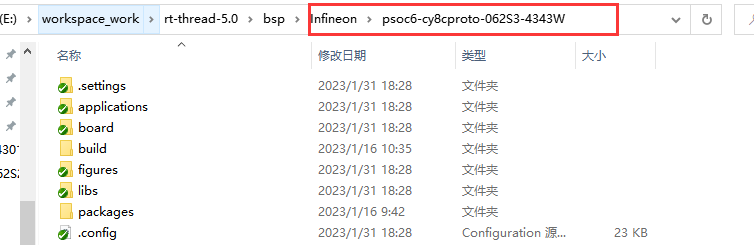

# Infineon Psoc6-evaluationkit-062S2 Introduction

## Overview

This chapter is a description of the BSP (Board Support Package) provided by `RT-Thread` for the `PSoC6 CY8CKIT-062S2-43012` development board.

The main contents are as follows:

- Introduction to Development Board Resources
- BSP Quick Start
- Advanced Usage

By reading the Getting Started chapter developers can quickly get up and running with the BSP and get RT-Thread running on the board. In the RT-Thread Document Center , more advanced features will be introduced to help developers utilize `RT-Thread` to drive more on-board resources.

## Hardware Introduction

The `Psoc6-evaluationkit-062S2` is a development board from RT-Thread in conjunction with Infineon that integrates a 32-bit dual-core CPU subsystem (ARM Cortex-M4 and ARM Cortex-M0) with a single-cycle multiplication 150-MHz Arm Cortex-M4F CPU (floating-point and memory protection unit), and a 100-MHz Cortex M0+ CPU with single-cycle multiplication and MPU to fully utilize the performance of the PSoC6 dual-core chips.

The core of the board **Onboard resources** are listed below:

- MCU: CY8C624ABZI-S2D44, Cortex-M4 at 150MHz, Cortex-M0 at 100MHz, 2MB Flash and 1MB SRAM
      For more details on the MCU manual, please refer to the document [PSoC 6 MCU: CY8C62x8, CY8C62xA Datasheet (infineon.com)](https://www.infineon.com/dgdl/Infineon-PSOC_6_MCU_CY8C62X8_). CY8C62XA-DataSheet-v17_00-EN.pdf?fileId=8ac78c8c7d0d8da4017d0ee7d03a70b1)
  
- On-board resources: microSD card, touch slider, Arduino interface

- Development Environment: ModusToolbox 2.0/MDK V5
  	PSoC® Creator™ Download Link [ModusToolbox™ Software - Infineon Technologies](https://www.infineon.com/cms/en/design-support/tools/sdk/ modustoolbox-software/)
  
  ## Peripheral Support
  
  
| **On-chip peripherals** | **Support** | **Note** |
| :----------: | :----------: | :------: |
|  USB to Serial  |     Support     |  UART0   |
|     GPIO     |     Support     |    —     |
|     UART     |     Support     | UART0-5  |
|    Touch     |     Support     | Touchscreen slider |
  ## Quick Start

This BSP is developed with `MDK V5` and `RT-Thread Studio` as the development environment (compiler: ARMClang / GCC), and we describe how to get the system up and running.

  ### Developed with MDK V5

#### Hardware Connection

  Use the data cable to connect the development board to the PC.

 #### Compile and Download

  1、Download Packages: Enter `pkgs --update` command in ENV environment, download the required HAL library packages, the files will be stored in `Packages` directory.

  2、Generate MDK Project: Enter `SCons ---target==MDK5` command in ENV environment, ENV will automatically generate MDK5 project.

  3、Configure the Project:

First of all, open MDK. If there is no `Infineon-PSoC6` chip support package installed, you will be prompted to install it online, follow the prompts to install it. If you have network problems, you can enter the [keil](https://www.keil.com/dd2/pack) official website to download the installation package, offline installation.


  4、 Compile the Project: After installing the chip support package, compile it in the `MDK` project.

  5. Download the Project:

The default configuration of the project is to use the on-board `DAP-LINK` to download the program using the `SWD` method, use the data cable to connect to the development board, and then click the download button directly after compilation.

### Developing with RT-Thread Studio

#### Importing a Project

* First open the `RT-Thread Studio` development tool, tap File->Import-> RT-Thread Studio project into the workspace in the upper left corner.


* Next, select the `psoc6-evaluationkit-062S2` development board support package directory to import.



#### Compile and Download

* Click the Build option in the upper left corner of the IDE to compile the project.


* When compiling without error warning, click `Debug` or `Download` option for debugging/downloading.

  Note: If there is no message displayed on the serial terminal after clicking Download and downloading successfully, please press the reset button manually to restart the operation.

  

## Run Result

After downloading the program successfully, the system will run automatically. Open the terminal tool serial assistant, and select the baud rate as 115200. After reset the device, the LED will flash at 500HZ, and you can see the output information of `RT-Thread` in the terminal:

Note: It is recommended to use a serial debugging assistant, such as `MobaXterm`.

```
 \ | /
- RT -     Thread Operating System
 / | \     4.1.1 build Jul 25 2022 18:03:35
 2006 - 2022 Copyright by RT-Thread team
msh >
```

## Contact
Maintainer:

- [Rbb666](https://github.com/Rbb666)


