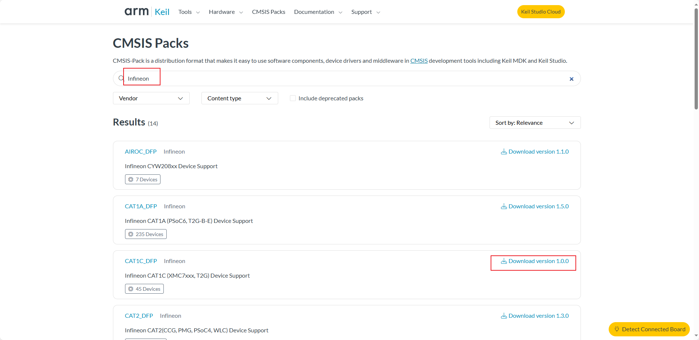
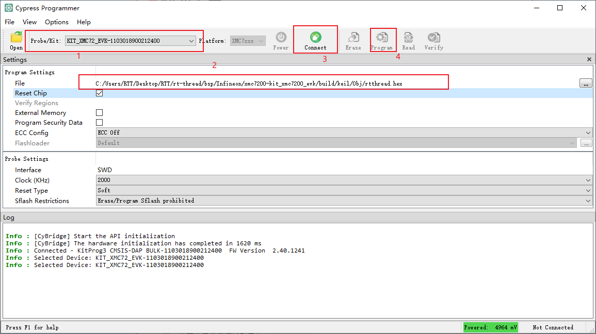

# Infineon XMC7200-kit_xmc7200_evk 说明

## 简介

本文档为 `RT-Thread` 为 ` xmc7200-kit_xmc7200_evk`开发板提供的 BSP (板级支持包) 说明。

主要内容如下：

- 开发板资源介绍
- BSP 快速上手
- 进阶使用方法

通过阅读快速上手章节开发者可以快速地上手该 BSP，将 RT-Thread 运行在开发板上。在进阶使用指南章节，将会介绍更多高级功能，帮助开发者利用 `RT-Thread` 驱动更多板载资源。

## 开发板介绍

` xmc7200-kit_xmc7200_evk` 是英飞凌推出的一款32位双核CPU子系统（ ARM Cortex-M7 和 ARM Cortex-M0）的开发板。该XMC7200D专为工业应用而设计，是一款真正的可编程嵌入式片上系统，集成了多达两个 350MHz Arm® Cortex-M7® 作为主应用处理器，一个 100MHz Arm® Cortex-M0®+ 。

开发板外观详细信息：[KIT_XMC72_EVK - Infineon Technologies](https://www.infineon.com/cms/en/product/evaluation-boards/kit_xmc72_evk/)

该开发板核心 **板载资源** 如下：

- MCU：XMC7200D-E272K-8384AA，Cortex-M7主频 350MHz，Cortex-M0主频 100MHz，8MB Flash 和 1MB SRAM
	    MCU手册更多详细信息请参考文档 [[KIT_XMC72_EVK XMC7200 evaluation kit guide](https://www.infineon.com/dgdl/Infineon-PSOC_6_MCU_CY8C62X8_CY8C62XA-DataSheet-v17_00-EN.pdf?fileId=8ac78c8c7d0d8da4017d0ee7d03a70b1)
- 开发环境：
  	Cypress programmer 下载链接 [Cypress Programmer - Infineon Developer Center](https://softwaretools.infineon.com/tools/com.ifx.tb.tool.cypressprogrammer)

## 外设支持

本 BSP 目前对外设的支持情况如下：

| **片上外设** | **支持情况** | **备注** |
| :----------: | :----------: | :------: |
|  USB 转串口  |     支持     |  UART3   |
|     GPIO     |     支持     |    —     |
|     UART     |     支持     | UART0-3  |

## 快速上手

本 BSP 是以 `MDK V5` 和 `Cypress programmer` 为开发环境（编译器：ARMClang / GCC），接下来介绍如何将系统运行起来。

### 使用 MDK V5 开发

#### 硬件连接

使用数据线连接开发板到 PC。

#### 编译下载

1、下载软件包：在ENV环境下输入`pkgs --update`命令，将所需要的HAL库软件包下载下来，文件会存放在`Packages`目录下。

2、生成MDK工程：在ENV环境下输入`SCons --target==MDK5`命令，ENV会自动生成MDK5工程

3、配置工程：

首先打开 MDK ，若没有安装 `Infineon-XMC7200` 的芯片支持包会提示在线安装，根据提示安装即可。若受网络问题，可以进入 [Arm Keil | CMSIS Packs](https://www.keil.arm.com/packs/)官网下载安装包，离线安装。



4、 编译此工程：在安装好芯片支持包后，在 `MDK`工程中进行编译，生成HEX文件。

5、下载此工程：

在Cypress programmer中首先找到刚刚MDK生成的`.hex`文件，一般在`Build/Keil/Obj`目录下，然后在软件中选择此文件，点击Connect连接到开发板，然后再点击Program下载文件即可完成



## 运行结果

下载程序成功之后，系统会自动运行。打开终端工具串口助手，选择波特率为 115200。复位设备后，LED 将会以 500HZ 的频率闪烁，而且在终端上可以看到 `RT-Thread` 的输出信息：

注：推荐使用串口调试助手如：`MobaXterm`

```c
 \ | /
- RT -     Thread Operating System
 / | \     5.1.0 build May 25 2024 18:03:35
 2006 - 2024 Copyright by RT-Thread team
msh >
```

## 联系人

维护人:

- [LZerro](https://github.com/LZerro)