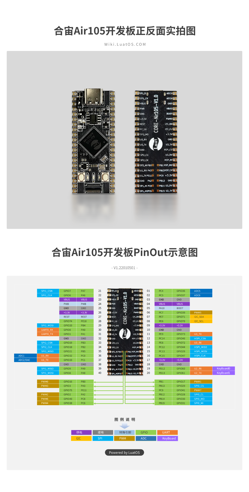

# AIR105开发板 BSP 说明

## 简介

本文档为 合宙 开发团队为 AIR105开发板提供的 BSP (板级支持包) 说明。

主要内容如下：

- 开发板资源介绍
- BSP 快速上手
- 进阶使用方法

通过阅读快速上手章节开发者可以快速地上手该 BSP，将 RT-Thread 运行在开发板上。在进阶使用指南章节，将会介绍更多高级功能，帮助开发者利用 RT-Thread 驱动更多板载资源。

## 开发板介绍

AIR105 是合宙推出的一款基于 ARM Cortex-M4 内核的10mm x 10mm 大小的MCU，最高主频为 204Mhz，不仅提供UART/GPIO/I2C/ADC/SPI等基础外设，更提供DAC/USB/DCMI/HSPI等高级外设接口，内置充电功能，支持5V/3.3V供电，同时自带5v转3.3V的LDO，4M字节Flash，640K字节RAM。

开发板外观如下图所示：



该开发板常用 **板载资源** 如下：

- MCU：Air105，主频 204MHz，4M FLASH ，640KB RAM
- 调试下载接口，UART0 To Type-c USB 接口

开发板更多详细信息请参考合宙Air105 [合宙Air105开发板介绍](https://wiki.luatos.com/chips/air105/board.html)。

## 外设支持

本 BSP 目前对外设的支持情况如下：

| 片上外设 | **支持情况** |
| -------- | ------------ |
| GPIO     | 支持         |
| UART     | 支持         |
| SPI      | 支持         |
| I2C      | 支持         |
| RTC      | 支持         |
| WDT      | 支持         |


## 使用说明

使用说明分为如下两个章节：

- 快速上手

    本章节是为刚接触 RT-Thread 的新手准备的使用说明，遵循简单的步骤即可将 RT-Thread 操作系统运行在该开发板上，看到实验效果 。

- 进阶使用

    本章节是为需要在 RT-Thread 操作系统上使用更多开发板资源的开发者准备的。通过使用 ENV 工具对 BSP 进行配置，可以开启更多板载资源，实现更多高级功能。


### 快速上手

本 BSP 为开发者提供 GCC 工程，支持 GCC 开发环境。下面介绍如何将系统运行起来。

#### 硬件连接

使用数据线连接开发板到 PC。

#### 编译下载

1. 在 bsp 下打开 env 工具。
2. 输入`menuconfig`。
3. 输入`scons`进行编译。

编译完成会自动打包bl : bootloader.bin和下载工具:soc_download.exe在bsp目录下生成rtthread_air105.soc，使用[Luatools](http://cdndownload.openluat.com/Luat_tool_src/last_release/Luatools_v2.exe)下载进开发板即可。

#### 运行结果

下载程序成功之后，系统会自动运行。

连接开发板对应串口到 PC , 在终端工具里打开相应的串口（1500000-8-1-N），复位设备后，可以看到 RT-Thread 的输出信息:


```bash
 \ | /
- RT -     Thread Operating System
 / | \     4.1.0 build Feb 22 2022 09:53:22
 2006 - 2022 Copyright by RT-Thread team
msh >
```
### 进阶使用

此 BSP 默认只开启了 GPIO 和 串口0 的功能，如果需使用更多高级功能，需要利用 ENV 工具对BSP 进行配置，步骤如下：

1. 在 bsp 下打开 env 工具。

2. 输入`menuconfig`命令配置工程，配置好之后保存退出。

3. 输入`pkgs --update`命令更新软件包。

4. 输入`scons`进行编译。

   

**Luatos同样也上线了RTthread 软件包，仓库：https://github.com/openLuat/luatos-soc-rtt**

## 注意事项

**bootloader.bin和soc_download.exe如不存在会自动下载，请保持网络通畅**

**烧录前请设置波特率为1500000**

**air105必须启用看门狗，默认启用**

**更多资料参考[WIKI](https://wiki.luatos.com/)**

## 联系人信息

维护人:

- [**合宙Luat**](https://gitee.com/openLuat)
- [**淘宝地址**](https://item.taobao.com/item.htm?spm=a1z10.5-c-s.w4002-24045920841.15.29395bcdUExSHR&id=666216389131)

