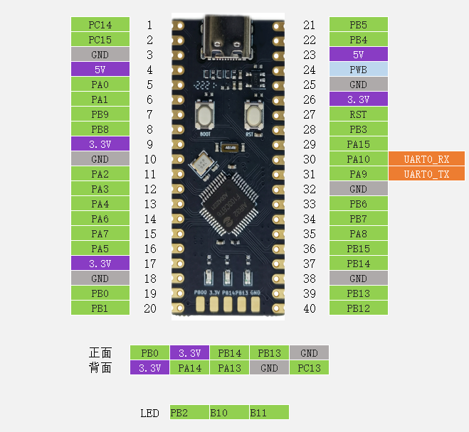

# AIR32F103开发板 BSP 说明

## 简介

本文档为 合宙 开发团队为 AIR32F103开发板提供的 BSP (板级支持包) 说明。

主要内容如下：

- 开发板资源介绍
- BSP 快速上手
- 进阶使用方法

通过阅读快速上手章节开发者可以快速地上手该 BSP，将 RT-Thread 运行在开发板上。在进阶使用指南章节，将会介绍更多高级功能，帮助开发者利用 RT-Thread 驱动更多板载资源。

## 开发板介绍

Air32F103为系列芯片，首发型号为Air32F103CBT6，其外设和硬件设计兼容市场上一些主流F103型号，主频最高可达216M，96K RAM+128K Flash，每个IO都可设置独立的内部上下拉电阻。

开发板外观如下图所示：



该开发板常用 **板载资源** 如下：

- MCU：Air32F103CBT6，主频 216MHz，128K FLASH ，96K RAM
- 调试下载接口，UART0 To Type-c USB 接口

开发板更多详细信息请参考 [合宙Air32F103开发板 - LuatOS 文档](https://wiki.luatos.com/chips/air32f103/board.html)。

## 外设支持

本 BSP 目前对外设的支持情况如下：

| 片上外设 | **支持情况** |
| -------- | ------------ |
| GPIO     | 支持         |
| UART     | 支持         |
| SPI      | 支持         |
| I2C      | 支持         |
| ADC      | 支持         |
| TIM      | 支持         |
| WDT      | 支持         |

## 使用说明

使用说明分为如下两个章节：

- 快速上手

  本章节是为刚接触 RT-Thread 的新手准备的使用说明，遵循简单的步骤即可将 RT-Thread 操作系统运行在该开发板上，看到实验效果 。

- 进阶使用

  本章节是为需要在 RT-Thread 操作系统上使用更多开发板资源的开发者准备的。通过使用 ENV 工具对 BSP 进行配置，可以开启更多板载资源，实现更多高级功能。


### 快速上手

本 BSP 为开发者提供 MDK4、MDK5  工程，并且支持 GCC 开发环境。下面以 MDK5 开发环境为例，介绍如何将系统运行起来。

#### 硬件连接

使用数据线连接开发板到 PC，打开电源开关。

#### 编译下载

双击 project.uvprojx 文件，打开 MDK5 工程，编译并下载程序到开发板。

> 工程默认配置使用 DapLink 下载程序，在通过 DapLink 连接开发板的基础上，点击下载按钮即可下载程序到开发板

#### 运行结果

下载程序成功之后，系统会自动运行，观察开发板上 LED 的运行效果，红色 LED0 会周期性闪烁。

连接开发板对应串口到 PC , 在终端工具里打开相应的串口（115200-8-1-N），复位设备后，可以看到 RT-Thread 的输出信息:

```bash
 \ | /
- RT -     Thread Operating System
 / | \     5.0.0 build Dec 27 2022 10:44:04
 2006 - 2022 Copyright by RT-Thread team
SYSCLK: 216Mhz, 
HCLK: 216Mhz, 
PCLK1: 108Mhz, 
PCLK2: 216Mhz, 
ADCCLK: 108Mhz
msh >
```

### 进阶使用

此 BSP 默认只开启了 GPIO 和 串口1 的功能，如果需使用 Flash 等更多高级功能，需要利用 ENV 工具对BSP 进行配置，步骤如下：

1. 在 bsp 下打开 env 工具。

2. 输入`menuconfig`命令配置工程，配置好之后保存退出。

3. 输入`pkgs --update`命令更新软件包。

4. 输入`scons --target=mdk4/mdk5/iar` 命令重新生成工程。

## 注意事项


## 联系人信息

维护人:

- [**Dozingfiretruck (打盹的消防车)**](https://github.com/Dozingfiretruck)
- [**淘宝地址**](https://item.taobao.com/item.htm?spm=a1z10.5-c-s.w4002-24045920841.15.29395bcdUExSHR&id=666216389131)

