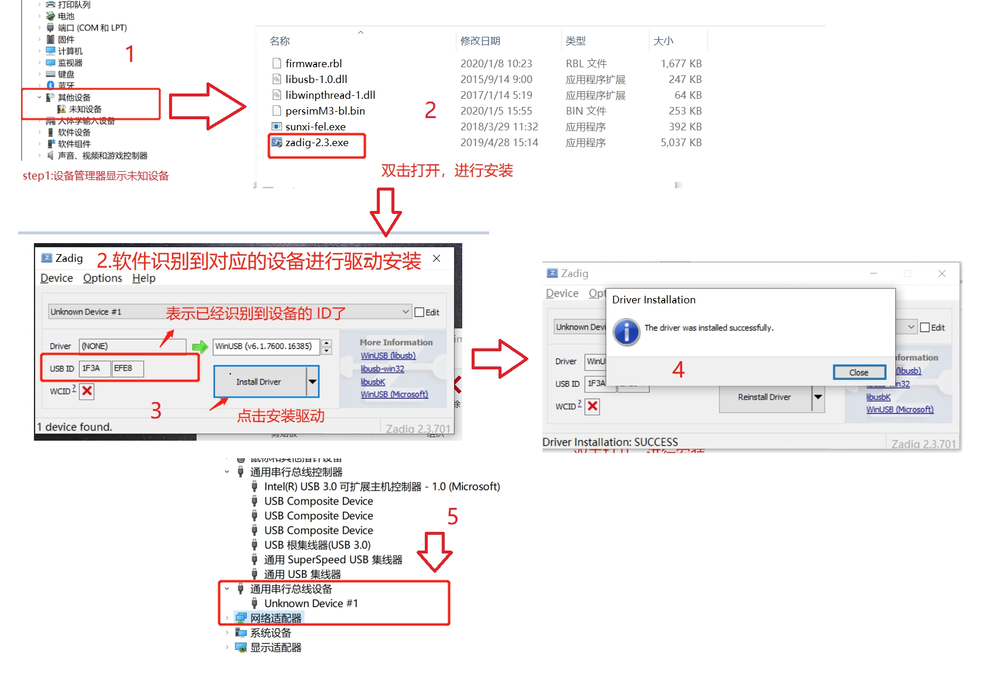
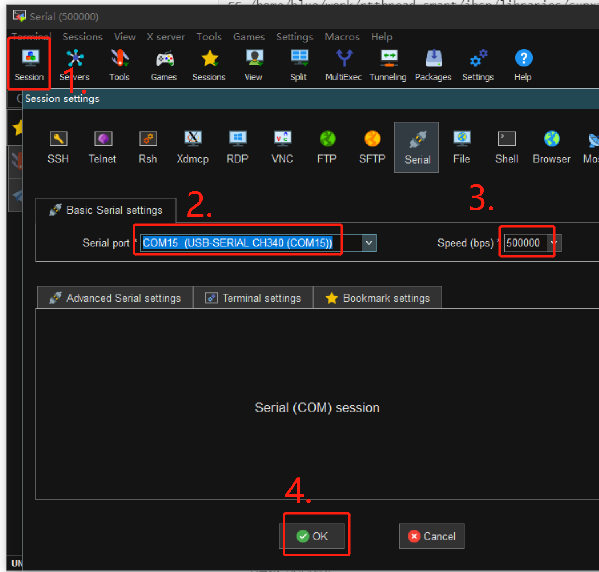
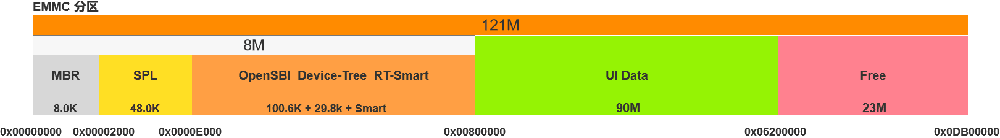
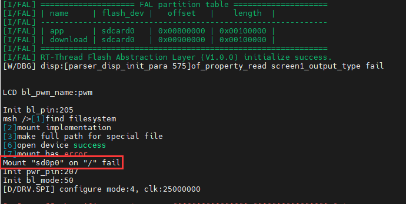

# 基于柿饼M7运行 RT-Smart

## 准备工作

#### 开发环境

推荐使用 ubuntu20.04(虚拟机/docker/服务器) + Window10/11

- ubuntu：用于编译、开发、打包镜像
- windows：用于下载打包好的镜像

#### 常用工具

**Ubuntu:**

```bash
sudo apt install libncurses5-dev scons gcc qemu-system
```

- qemu：用于仿真运行RISC-V程序
- gcc：用于编译menucofig的程序
- libncurses5-dev ：menucofig功能依赖此库
- scons：编译RT-Smart需要的构建工具

**Windows:**

- vscode：windows上安装，用于远程连接ubuntu系统，可以在win上体验原生的linux开发环境。
- MobaXterm：终端工具，可以ssh远程ubuntu系统，也可以通过串口连接柿饼M7模块
- env_riscv_1.1.3.zip：针对risc-v平台的ENV工具。

#### 相关仓库权限

- https://gitee.com/rtthread/rt-thread ：rtthread内核仓库，以submodule的形式存在于rtthread-smart仓库中，这里使用的是rt-smart分支

获取上面的仓库权限，并将rtthread-smart克隆到ubuntu系统目录下。目录结构如下所示：

在做好上面的准备后，就可以真正的开始搭建RT-Smart的开发环境了。

## 模拟仿真环境搭建

在真实的硬件上开发之前，可以先搭建基于QEMU的模拟仿真环境。

参考这篇文章，完成 qemu-riscv64 上 RT-Smart 环境搭建：https://gitee.com/guozhanxin/rtthread-smart/tree/master/docs/risc-v64

最后能够在 qemu-riscv64 上正常运行RT-Smart系统，并运行一个 `hello.elf` 用户态应用。

```
msh /bin>hello.elf
msh /bin>hello world!
```

## 真实硬件环境搭建

#### 硬件连接

按照下图中的连接方式，为开发板供电，并使用USB转TTL工具连接串口调试。


#### 驱动安装

1. 按住下载模式按钮的情况下为开发板上电。

2. 解压tools目录下fel驱动安装.zip文件。参照如下所示的“驱动安装示意图”，安装fel驱动。



#### 连接串口工具

打开 MobaXterm 终端工具，并连接到对应的端口，波特率为：500000。

>  注意：如果系统没有固件的话，不会有任何输出，是正常现象。



#### 制作系统固件

参照 qemu-riscv64 上编译内核的步骤，配置环境变量，并使用 scons 命令编译 RT-Smart 内核

编译完内核之后，会自动执行打包命令 `./mksdimg.sh` 打包出sd.bin镜像文件。此文件将在后面的步骤中借助下载工具，下载到 D1s 上运行。

#### 烧录系统内核

我们借助fel工具烧录系统内核。

1. 解压tools目录下的 xfel_v1.2.9.7z 文件，里面包含三个文件

```shell
boot0_sdcard_sun20iw1p1_f133.bin   ---- 第一次烧录需要烧录此boot文件
sd.bin                             ---- 打包好的系统内核镜像
xfel.exe                           ---- 烧录工具
```

2. 解压tools目录下 env_riscv_1.1.3.zip 文件，打开env工具，并进入解压好的 xfel_v1.2.9 目录下。运行下面的命令烧录系统内核

- 烧录boot镜像： xfel.exe write 8192 boot0_sdcard_sun20iw1p1_f133.bin
- 烧录内核镜像： xfel.exe sd write 57344 sd.bin
- 复位系统： xfel.exe reset

>  注意：执行烧录命令前，需要使开发板处于fel下载模式（按住下载按钮并上电）

日志如下所示：

```shell
11714@DESKTOP-VEL6MD9 E:\workspace\d1s-smart\env_riscv_1.1.3
> cd E:\workspace\d1s-smart\xfel_v1.2.9

11714@DESKTOP-VEL6MD9 E:\workspace\d1s-smart\xfel_v1.2.9
> xfel.exe write 8192 boot0_sdcard_sun20iw1p1_f133.bin
ERROR: Can't found any FEL device  ----  如果开发板没有处于fel下载模式的话，会提示错误。

## 第一次使用需要先烧录boot镜像文件
11714@DESKTOP-VEL6MD9 E:\workspace\d1s-smart\xfel_v1.2.9
> xfel.exe write 8192 boot0_sdcard_sun20iw1p1_f133.bin
100% [================================================] 48.000 KB, 364.927 KB/s

## 烧录内核镜像文件
11714@DESKTOP-VEL6MD9 E:\workspace\d1s-smart\xfel_v1.2.9
> xfel.exe sd write 57344 sd.bin
write 7240Kbytes
swap buf:00023E00,len=512, cmdlen=512
Found SD card 126877696 bytes
100% [================================================] 7.070 MB, 219.468 KB/s

## 复位系统
11714@DESKTOP-VEL6MD9 E:\workspace\d1s-smart\xfel_v1.2.9
> xfel.exe reset
usb bulk recv error
```

如果此时连接着 MobaXterm 终端工具，可以看到系统以及正常启动，并可以通过 **msh** 命令和系统交互了。

```bash
[I/I2C] I2C bus [i2c2] registered

 \ | /
- RT -     Thread Smart Operating System
 / | \     5.0.0 build Oct 20 2022
 2006 - 2020 Copyright by rt-thread team
lwIP-2.0.2 initialized!
winusb class register done.
set samplerate:48000
set samplebits:16
set channels:2
set volume:80%
hal_sdc_create 0
card_detect insert
Initial card success. capacity :121MB
sdmmc bytes_per_secotr:200, sector count:3c800
found part[0], begin: 8388608, size: 90.0MB
found partition:sd0 of mbr at offset 0000000000004000, size:000000000002d000
found part[1], begin: 102760448, size: 23.0MB
found partition:sd1 of mbr at offset 0000000000031000, size:000000000000b800
hal_sdc_create 1
card_detect insert
Initial card success. capacity :7624MB
sdmmc bytes_per_secotr:200, sector count:ee4000
found part[0], begin: 512, size: 4194303.1023GB
found partition:sd0 of mbr at offset 0000000000000001, size:ffffffffffffffff
[I/sal.skt] Socket Abstraction Layer initialize success.
[D/FAL] (fal_flash_init:47) Flash device |                  sdcard0 | addr: 0x00000000 | len: 0x07900000 | blk_size: 0x00000200 |initialized finish.
```

#### 运行用户态应用(可选)

在 D1s 上运行系统应用有两种方式：一种是制作 `sdroot.bin` 并借助 `xfel工具` 烧录到 `sdmmc` 对应的位置上；二是使用 romfs 的方式，和内核镜像编译在一起，然后整个的烧录到 `sdmmc` 上。

**1、借助 romfs 运行用户态应用**

romfs 方式优点：打包、调试方便，无需外部 emmc 挂载文件系统，使能 romfs 文件系统即可使用，缺点是 romfs 是只读文件系统。

这部分可以参考 qemu-riscv64 上运行用户态应用的部分。使用 python 命令将 userapps 下 root 目录下的用户态应用打包为  `romfs.c` ，并重新编译系统内核，重复上面的系统内核烧录步骤。最后复位并运行系统。参照下面的运行日志，运行对应的用户态应用。

```bash
msh />cd bin
msh /bin>ls
Directory /bin:
syslogd.elf         423024
ping.elf            368104
webserver.elf       510216
hello.elf           366096
em.elf              601336
pong.elf            367024
syslog.elf          391128
vi.elf              528096
hdc_test.elf        367520
ntp.elf             392168
mmapctrl.elf        366992
pmq.elf             371600
webclient.elf       413784
lwIPKit.elf         998504
msh /bin>hello.elf
msh /bin>hello world!
```

**2、在存储设备上运行用户态应用**

sdroot.bin 挂载方式优点：使用 emmc 存储设备的文件系统是可读可写的，更加灵活方便。

首先下载 RT-Smart 用户态应用代码：

```
git clone https://github.com/RT-Thread/userapps.git
```


拷贝之前克隆好的 rtthread rt-smart 分支的仓库到 `userapps` 目录下，进入 `userapps` 目录，使用 scons 编译用户态程序，然后运行 `./mksdcard.sh` 打包脚本，将生成的 `sdroot.bin` 复制到 window 下存在 `xfel.exe ` 的目录下，使用以下命令即可烧录用户态程序到存储设备 :

```bash
xfel.exe sd write 8388608 sdroot.bin
```

参照下面的运行日志，运行对应的用户态应用：

```C
msh />ls
Directory /:
bin                 <DIR>
data                <DIR>
Directory /bin:
syslogd.elf         423024
ping.elf            368104
webserver.elf       510216
hello.elf           366096
em.elf              601336
pong.elf            367024
syslog.elf          391128
vi.elf              528096
hdc_test.elf        367520
ntp.elf             392168
mmapctrl.elf        366992
pmq.elf             371600
webclient.elf       413784
lwIPKit.elf         998504
msh /bin>hello.elf
msh /bin>hello world!
```

## D1S-EMMC 分区示意图



## Q&A

Q：使用 `VSCode` 发现有些已经定义的宏变灰，头文件报错：

A：打开 `VSCode`，按下 “Crtl+Shift+P” 打开 `VSCode` 的控制台，然后输入 “C/C++: **Edit configurations(JSON)** ”，打开 C/C++编辑配置文件，添加如下配置选项

```json
{
    "configurations": [
        {
            "name": "Linux",
            "includePath": [
                "${workspaceFolder}/**",
                "${workspaceFolder}/bsp/allwinner/d1s",
                "${workspaceFolder}/include",
                "${workspaceFolder}/components/drivers/include",
                "${workspaceFolder}/bsp/allwinner/libraries/sunxi-hal/include"
            ],
            "defines": [],
            "compilerPath": "/usr/bin/gcc",
            "cStandard": "gnu17",
            "cppStandard": "gnu++14",
            "intelliSenseMode": "linux-gcc-x64"
        }
    ],
    "version": 4
}
```

---

Q：开机后，出现了 **mount** 失败的错误



A：原因是没有下载 all_bin/sdroot.bin(用户态) 固件导致，重新烧录 all_bin/sdroot.bin 到 8388608 地址后，即可 mount 成功，，烧录命令如下：

```bash
xfel.exe sd write 8388608 all.bin/sdroot.bin
```
