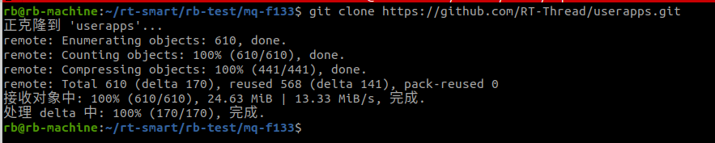
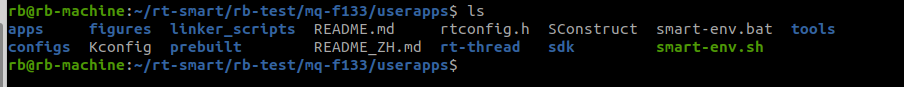
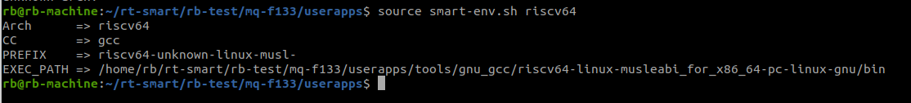
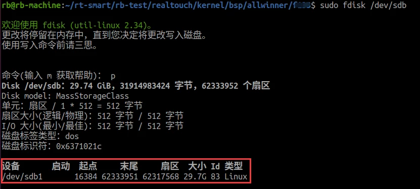
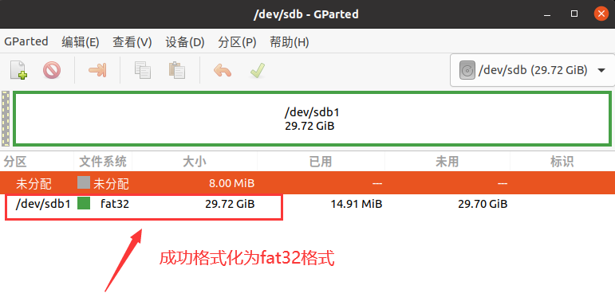
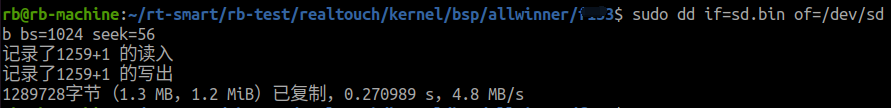
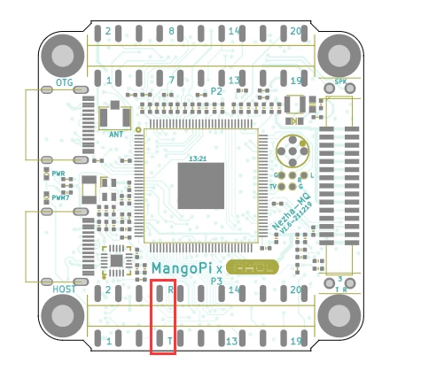
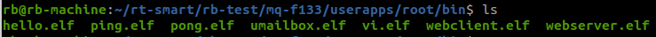

# 基于麻雀D1运行 RT-Smart

### 下载代码

下载 RT-Smart 用户态应用代码：

```
git clone https://github.com/RT-Thread/userapps.git
```



进入到 `userapps` 目录，克隆 RT-Thread rt-smart 分支

```shell
git clone -b rt-smart https://gitee.com/rtthread/rt-thread.git
```



### 配置工具链

在 userapps\tools 目录下运行 `get_toolchain.py` 的脚本，会下载对应的工具链并展开到 userapps\tools\gun_gcc 目录。后面的工具链名称可以是 arm | riscv64。

因为 D1S 是 RISCV-64 架构的，所以输入下面的命令：

```
python3 get_toolchain.py riscv64
```

在 userapps 目录下，运行 `smart-env.sh` 配置工具链路径，目前支持的参数可以是 arm | riscv64

```
source smart-env.sh riscv64
```




### 编译内核程序

进入 `rt-thread/bsp/allwinner/d1s` 目录下，执行以下命令拉取一下软件包

* 注：若系统没有安装 env，需要手动输入 `scons --menuconfig` 命令手动下载 env

```shell
source ~/.env/env.sh
pkgs --update
```

使用 scons 命令进行编译，编译成功后会在 `userapps/rt-thread/bsp/allwinner/d1s` 目录下生成 sd.bin，这个文件就是我们需要烧录到开发板中的文件，它包括了 uboot.dtb，opensbi，rtthread.bin。

### 烧录程序

1、首先准备一张容量在 128G 以内的空白 TF卡

2、使用 fdisk 分区。将 TF卡 挂载到 ubuntu 系统后，使用 df 查看设备路径。笔者使用的 32GB TF卡，扇区大小 512 字节，我们需要预留前 8M 的空间，那么计算得知分区扇区开始于：16384，使用命令：`sudo fdisk /dev/sdb`，选择：o，n，p，1，16384，回车。

```shell
Command (m for help): o
Created a new DOS disklabel with disk identifier 0x3668b987.

Command (m for help): n
Partition type
   p   primary (0 primary, 0 extended, 4 free)
   e   extended (container for logical partitions)
Select (default p): p
Partition number (1-4, default 1): 1
First sector (2048-62410751, default 2048): 16384
Last sector, +sectors or +size{K,M,G,T,P} (16384-62410751, default 62410751): 

Created a new partition 1 of type 'Linux' and of size 29.8 GiB.

Command (m for help): w
The partition table has been altered.
```

正确的分区效果如下：



然后格式化 sdb1 分区为 fat32 格式：

```shell
$ sudo mkfs -t fat /dev/sdb1
```

这里可以使用 **Gparted** 工具可视化查看一下分区状况：



3、接下来使用以下命令烧录 RT-SMART 内核：

```shell
sudo dd if=boot0_sdcard_sun20iw1p1.bin of=/dev/sdb bs=1024 seek=8
sudo dd if=sd.bin of=/dev/sdb bs=1024 seek=56
```

* 注：**boot0_sdcard_sun20iw1p1.bin** 文件在 `userapps/rt-thread/bsp/allwinner/d1s/tools` 路径下
* 这里的 /dev/sdb 设备要根据自己的选择

下面是烧录成功的显示：



### 启动 RT-Smart

方式二（TF 卡）启动：

此时将 TF 卡放入开发板，串口0（底部排针的7，8脚），串口波特率 500000，然后上电，如下 RT-Smart 已经成功启动



```shell
 \ | /
- RT -     Thread Smart Operating System
 / | \     5.0.0 build Nov  1 2022
 2006 - 2022 Copyright by rt-thread team
lwIP-2.0.2 initialized!
hal_sdc_create 0
card_detect insert
Initial card success. capacity :30436MB
sdmmc bytes_per_secotr:200, sector count:3b72400
found part[0], begin: 8388608, size: 29.732GB
found partition:sd0 of mbr at offset 0000000000004000, size:0000000003b6e400
hal_sdc_create 1
card_detect insert
Initial card failed!!
[E/drv-sdmmc] init sdmmc failed!
[E/drv-sdmmc] sdmmc_init failed!
[I/sal.skt] Socket Abstraction Layer initialize success.
[D/FAL] (fal_flash_init:47) Flash device |                  sdcard0 | addr: 0x00000000 | len: 0x76e480000 | blk_size: 0x00000200 |initialized finish.
[I/FAL] ==================== FAL partition table ====================
[I/FAL] | name       | flash_dev |   offset   |    length  |
[I/FAL] -------------------------------------------------------------
[I/FAL] | download   | sdcard0   | 0x00800000 | 0x00800000 |
[I/FAL] | easyflash  | sdcard0   | 0x01000000 | 0x00100000 |
[I/FAL] | filesystem | sdcard0   | 0x01100000 | 0x00c00000 |
[I/FAL] =============================================================
[I/FAL] RT-Thread Flash Abstraction Layer initialize success.
Hello RISC-V
[W/DBG] disp:[parser_disp_init_para 575]of_property_read screen1_output_type fail
msh />Mount "sd0p0" on "/" success
msh />
```

### 编译用户态程序

进入 `userapps` 目录下，使用 scons 编译用户态程序，编译好的文件会生成在 `root/bin` 目录下。



### 运行用户态程序

从 `root/bin` 目录下拷贝出 hello 程序，到 TF卡 的文件系统中。


拔出 TF 卡，插入到开发板，上电。即可体验属于自己的 helloworld 程序了。

```shell
msh /bin>ls
Directory /bin:
dbkit_client.elf    616960
elmFATKit.elf       373880
em.elf              585504
hdc_test.elf        339976
hello.elf           339624
lvgl.elf            1382168
lwIPKit.elf         976784
mmapctrl.elf        339976
ntp.elf             363560
ping.elf            344208
pmq.elf             345176
pong.elf            339624
syslog.elf          364736
syslogd.elf         377560
vi.elf              446568
webclient.elf       358048
msh /bin>
msh /bin>hello.elf
msh /bin>hello world!
```
