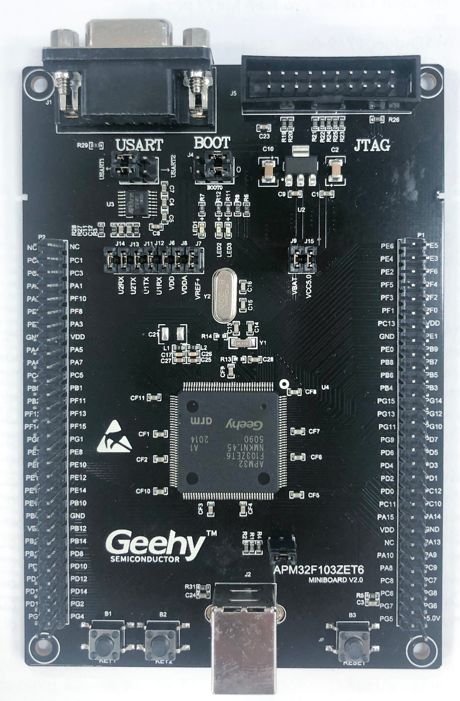

# APM32F103ZE MINI BOARD BSP 说明

## 简介

本文档为 APM32F103ZE MINI 开发板（MINI BOARD）的 BSP (板级支持包) 说明。

主要内容如下：

- 开发板资源介绍
- BSP 快速上手

通过阅读快速上手章节开发者可以快速地上手该 BSP，将 RT-Thread 运行在开发板上。

## 开发板介绍

APM32F103ZE MINI BOARD，采用标准JTAG/SWD调试接口，引出了全部的IO。开发板外观如下图所示：




该开发板常用 **板载资源** 如下：

- MCU：APM32F103C8T6，主频 96MHz，512KB FLASH ，128KB RAM
- 外部 RAM：无
- 外部 FLASH：无
- 常用外设
  - LED：2个，（黄色，PE5/PE6）
  - 按键：2个，K1（兼具唤醒功能，PA0），K2（PC13）
- 常用接口：RS232转串口、、USB SLAVE
- 调试接口：标准 JTAG/SWD


## 外设支持

本 BSP 目前对外设的支持情况如下：

| **板载外设** | **支持情况** | **备注**                              |
| :----------- | :----------: | :------------------------------------ |
| RS232转串口  |     支持     | 使用 UART1/ UART2(通过跳线选择)       |
| **片上外设** | **支持情况** | **备注**                              |
| GPIO         |     支持     | PA0, PA1... PG15 ---> PIN: 0, 1...143 |
| UART         |     支持     | UART1/2                               |

## 使用说明

本章节是为刚接触 RT-Thread 的新手准备的使用说明，遵循简单的步骤即可将 RT-Thread 操作系统运行在该开发板上，看到实验效果 。


### 快速上手

本 BSP 为开发者提供MDK5 工程。下面以 MDK5 开发环境为例，介绍如何将系统运行起来。

#### 硬件连接

使用数据线连接开发板到 PC，打开电源开关。

#### 编译下载

双击 project.uvprojx 文件，打开 MDK5 工程，编译并下载程序到开发板。

> 工程默认配置使用 J-Link 仿真器下载程序，在通过 J-Link 连接开发板的基础上，点击下载按钮即可下载程序到开发板

#### 运行结果

下载程序成功之后，系统会自动运行，LED 闪烁

连接开发板对应串口到 PC , 在终端工具里打开相应的串口（115200-8-1-N），复位设备后，可以看到 RT-Thread 的输出信息:

```bash
 \ | /
- RT -     Thread Operating System
 / | \     4.0.4 build Aug 20 2021
 2006 - 2021 Copyright by rt-thread team
msh >
```
## 注意事项

- 可在极海官方网站进行所需资料下载，如pack安装包和MINI开发板原理图等（www.geehy.com）;

## 联系人信息

-[abbbcc ](https://gitee.com/abbbcc)