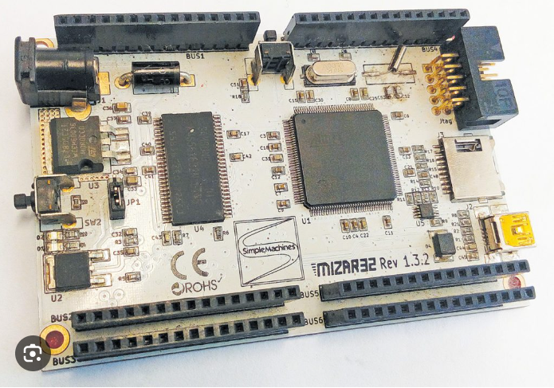
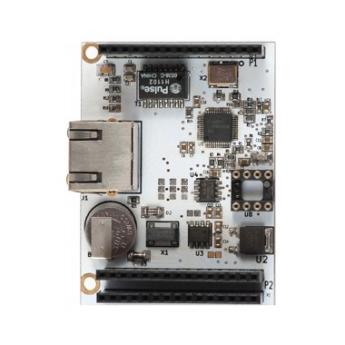
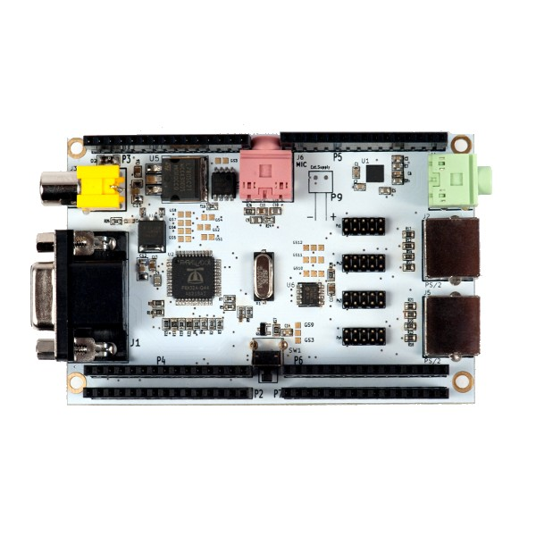
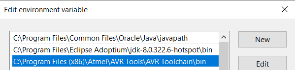
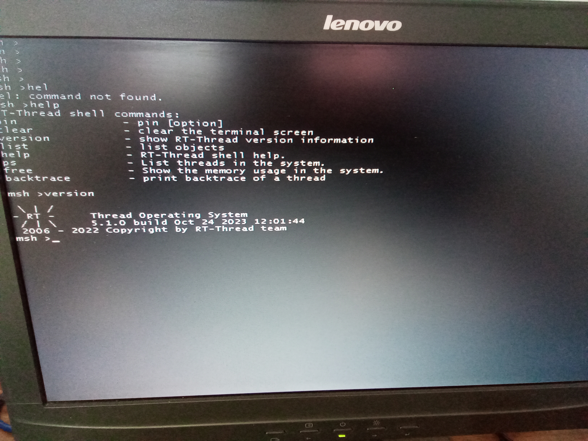

# SimpleMachines' Mizar32 Development Board

## Introduction

The Mizar32 is a 32-bit computer based on the AVR32 processor. It is
clocked at 66MHz and has 32MB of main memory. It supports mass storage
on SD card, a USB connector, an on-board LED, two buttons, a JTAG port
and six bus connectors.



The bus connectors let you add other stackable hardware modules such
as serial ports, ethernet, a 16x2 character LCD display and a
VGA/keyboard/mouse/audio board based on the 8-core Parallax Propeller
processor.

The Mizar32 is designed by SimpleMachines, Italy.

This board support package aims at adding RT-Thread support for the
following Mizar32 development boards.

| Model     | Flash | SRAM | SDRAM |
| --------- | ----- | ---- | ----  |
| Mizar32-A | 512KB | 64KB | 32MB  |
| Mizar32-B | 256KB | 64KB | 32MB  |
| Mizar32-C | 128KB | 64KB | 32MB  |

## Specification

- Main processor: AVR32 UC3A0 @ 66 MHz
- Internal fast SRAM: 32KB or 64KB with single-cycle access time
- On-board SDRAM: 32MB with 2-cycle access time
- Internal Flash memory: 128/256/512KB with single-cycle access time
- External Flash memory: up to 4GB on micro SD card.
- Internal operating Voltage: 3.3V with 5V input tolerant I/O
- Digital I/O Pins: 66
- Timer/Counter: 3 channel, 16-bit.
- Analog-to-Digital input pins: 8 with 10-bit resolution measuring 0-3.3v at up to 384,000 samples per second
- Stereo audio bitstream Digital-to-Analog Converter with 16 bit resolution at up to 48kHz
- Pulse Width Modulation channels (PWM): 7
- Universal Sync/Async RX/TX (USART): 2
- Serial Periperal Interface (SPI): 2
- Two-Wire Interface (TWI): 1, I2C-compatible at up to 400kbit/s
- Universal Serial Bus (USB): 1 OTG host with dedicated cable.
- Debug Port: JTAG connector
- Ethernet MAC 10/100: 1 (requires add-on hardware module)
- Oscillators: 2 (12MHz and 32768Hz)
- Buttons: Reset button, user button
- LEDs: Power LED, User LED
- Power supply: 5V USB or 7.5V-35V DC, 80mA (base board) to 222mA (with all add-on modules)
- Dimensions: 96,5mm x 63,5mm
- Weight: 42.5 grams
- Temperature range: -45 to +85°C

## Embedded Hardware Interfaces

- MicroSD
- USB
- JTAG
- Add-on bus connectors 1-6 interfaces on the Add-on Bus
- 12 General Purpose I/O pins
- 2 UARTs: one basic, one with modem control signals
- 2 SPI
- I2C interface with 2-way splitter
- 8 ADC inputs
- 3 high-resolution timers
- Ethernet

## Optional Stacked Modules







This README is essentially a work-in-progress. I will try to further
and documentation as and when I further the device driver base for the
Mizar32 target.

If you feel like reaching out to me for questions pertaining to the
target development board, you can write to me: ramangopalan AT gmail
dot com.

## Supported compiler

This BSP is built with the AVR32 GCC that comes with the Microchip
Studio. I am using the Microchip Studio version 7.0.2594. Make sure
that avr32-gcc.exe is visible on your command line. Add the binary
directory to you PATH.



I use Git Bash (Windows) for compiling the RT-Thread system. Once you
set your path correctly, invoke Git Bash to query avr32-gcc.exe's
version. The output should look similar to this:

```bash
$ avr32-gcc.exe --version
avr32-gcc.exe (AVR_32_bit_GNU_Toolchain_3.4.2_435) 4.4.7
Copyright (C) 2010 Free Software Foundation, Inc.
This is free software; see the source for copying conditions.  There is NO
warranty; not even for MERCHANTABILITY or FITNESS FOR A PARTICULAR PURPOSE.
```

If you see this, you're all set to compile RT-Thread for Mizar32.

## Program firmware

### Step 1: download the RT-Thread codebase and navigate to bsp/avr32uc3a0.

```bash
$ cd bsp/avr32uc3a0/
```

### Step 2: build

```bash
scons -c
scons
```

### Step 3: flash

If everything went well, scons should have generated an elf file:
rtthread-uc3a0256.elf. Let us program the file. The program 'atprogram'
comes with Microchip Studio. I didn't have to do much here. Just make sure
`atprogram.exe' is in your PATH.

```bash
atprogram -t atmelice -i jtag -d at32uc3a0256 program -f rtthread-uc3a0256.elf
```

Note that you should already see the on-board LED (PB29) blink if your
programming was successful. I use the Atmel ICE programmer. To access
msh with the default menuconfig's configuration, you'll need the VGA
shield. Connect the target board to a 12 VDC wall adapter. Also
connect the shield to a VGA monitor and a PS/2 keyboard.

## Running Result

The output information on serial port for `ps' the command should look like this:

```bash
0x000003c0 tidle0    31  ready   0x00000054 0x00000100    67%   0x00000009 OK
0x00001650 tshell    20  running 0x000000b4 0x00001000    13%   0x0000000a OK
0x00001350 led1       5  suspend 0x0000007c 0x00000400    12%   0x00000005 EINTRPT
```

Here is a picture of the RT-Thread session on the VGA monitor:



## Peripheral Support

| Drive | Support | Remark  |
| ----- | ------- | ------- |
| UART  | Support | UART0/1 |
| GPIO  | Support | -       |
| I2C   | -       | -       |
| RTC   | -       | -       |
| SPI   | -       | -       |
| TIMER | -       | -       |
| WDT   | -       | -       |

