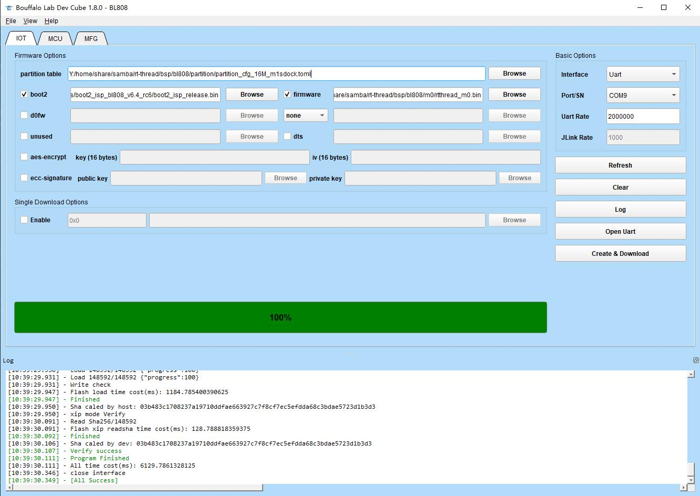

# 博流智能 BL808板级支持包说明

## 1. 简介

BL808 是高度集成的 AIoT 芯片组，具有 Wi-Fi/BT/BLE/Zigbee 等无线互联单元，包含多个 CPU 以及音频编码译码器、视频编码译码器和 AI 硬件加速器，适用于各种高性能和低功耗应用领域。

BL808 系列芯片主要包含无线和多媒体两个子系统。

无线子系统包含一颗 RISC-V 32-bit 高性能 CPU（m0），集成 Wi-Fi/BT/Zigbee 无线子系统，可以实现多种无线连接和数据传输，提供多样化的连接与传输体验。
多媒体子系统包含一颗 RISC-V 64-bit 超高性能 CPU（d0），集成 DVP/CSI/ H264/NPU 等视频处理模块，可以广泛应用于视频监控/智能音箱等多种 AI 领域

多媒体子系统组成部分如下：

- NPU HW NN 协处理器 (BLAI-100)，适用于人工智能应用领域
- 摄像头接口
- 音频编码译码器
- 视频编码解码器
- 传感器
- 显示接口

电源管理单元控制低功耗模式。此外，还支持各种安全功能。

外围接口包括 USB2.0、 Ethernet、 SD/MMC、 SPI、 UART、 I2C、 I2S、 PWM、 GPDAC/GPADC、 ACOMP、 PIR、 Touch、
IR remote、 Display 和 GPIO。

支持灵活的 GPIO 配置， BL808 最多可达 40 个 GPIO。  

芯片规格包括如下：

| 硬件 | 描述 |
| -- | -- |
|芯片型号| bl808 |
|CPU| 三核异构RISC-V CPUs： <br />RV64GCV 480MHz<br/>RV32GCP 320MHz<br/>RV32EMC 160MHz |
|RAM| 768KB SRAM + 64MB UHS PSRAM |
| 外设 | 内嵌AES与SHA256算法加速器 |
| AI NN 通用硬件加速器 | BLAI-100 用于视频/音频检测/识别，100GOPS 算力 |
| 摄像头接口 | DVP 和 MIPI-CSI |
| 显示接口 | SPI、DBI、DPI(RGB) |
| 无线 | 支持 Wi-Fi 802.11 b/g/n<br/>支持 Bluetooth 5.x Dual-mode(BT+BLE)<br/>支持 Wi-Fi / 蓝牙 共存 |

## 2. 编译说明

BL808是多核异构架构，分为m0和d0，每个核需要单独编译，并烧录到对应的位置。

### 2.1. 交叉编译期路径设置
下载risc-v的工具链，[下载地址1](https://occ.t-head.cn/community/download?id=4073475960903634944)或[下载地址2](https://dl.sipeed.com/shareURL/others/toolchain)

Windows下请使用使用[env工具][1]，使用命令 `tar -xvf Xuantie-900-gcc-elf-newlib-mingw-V2.6.1-20220906.tar.gz` 解压交叉编译器，使用Windows下解压工具直接解压可能出现Windows下编译错误。

在`rtconfig.py`中将risc-v工具链的本地路径加入 `EXEC_PATH` 或通过 `RTT_EXEC_PATH` 环境变量指定路径

Windows：
```
set RTT_EXEC_PATH=C:\Users\xxxx\Downloads\Xuantie-900-gcc-elf-newlib-x86_64-V2.6.1\bin
```

Linux:
```
export RTT_EXEC_PATH=/opt/Xuantie-900-gcc-elf-newlib-x86_64-V2.6.1/bin
```

### 2.2. 编译

Windows下推荐使用[env工具][1]，在console下进入bsp/bl808目录中，选择需要编译的核心，m0或d0，运行：

    cd bsp/bl808/m0
    menuconfig
    pkgs --update

如果在Linux平台下，可以先执行：

    scons --menuconfig

它会自动下载env相关脚本到~/.env目录，然后执行

    source ~/.env/env.sh
    
    cd bsp/bl808/m0
    pkgs --update

更新完软件包后，执行 `scons -j10` 或 `scons -j10 --verbose` 来编译这个板级支持包。或者通过 `scons --exec-path="GCC工具链路径"` 命令，在指定工具链位置的同时直接编译。

如果编译正确无误，会产生rtthread.elf、rtthread_m0.bin文件。其中rtthread_m0.bin需要烧写到设备中进行运行。  

## 3. 烧写及执行

连接好串口，然后使用[Bouffalo Lab Dev Cube](https://dev.bouffalolab.com/download)工具进行烧写bin文件。



### 3.1 运行结果

如果编译 & 烧写无误，当复位设备后，会在串口上看到RT-Thread的启动logo信息：


## 4. 驱动支持情况及计划

| 驱动 | 支持情况  |  备注  |
| ------ | ----  | :------:  |
| UART | 支持 | UART0，用于shell，默认波特率2000000 |
| GPIO | 支持 |  |
| I2C | 支持 | 软件 I2C1，默认 SCL——20，SDA——21 |

## 5. 联系人信息

维护人：[flyingcys](https://github.com/flyingcys)

## 6. 支持开发板列表

|        | 开发板型号 |
| ------ | ---------- |
| Sipeed | M1s Dock   |
|        |            |


## 7. 参考
* 芯片[datasheet][2]

  [1]: https://www.rt-thread.org/page/download.html
  [2]: https://github.com/bouffalolab/bl_docs

## 8. FAQ

- 在 windows 环境下，通过 UART 接口将开发板连接至电脑时，仅能识别到两个 USB converter 设备，但是识别不到对应的串口设备。
  - 进入到设备管理器中，右击对应的 USB converter 设备，进入到属性中的高级设置，钩选 vcp 选项，刷新后即可看到对应的串口设备。
  - 也可通过安装以下驱动解决问题： https://dl.sipeed.com/shareURL/MAIX/tools/ftdi_vcp_driver
- 使用 TypeC 数据线将电脑与板子的 UART 口连接起来，此时电脑上会出现两个串口 （如果出现鼠标不能动的现象请拔掉 USB 并且查看 [更新板载 bl702 固件](https://wiki.sipeed.com/hardware/zh/maix/m1s/other/start.html#给板载-bl702-进行烧录) 相关内容来修复问题)。
