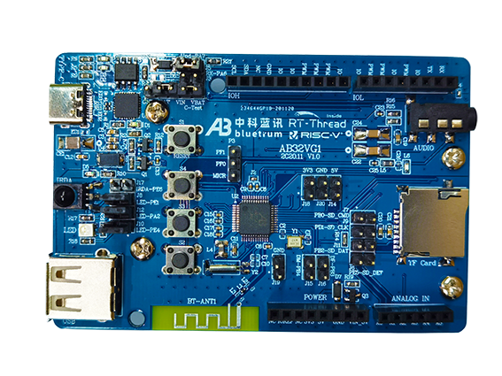

# AB32VG1 骄龙开发板 BSP 说明

## 简介

主要内容如下：

- 开发板资源介绍
- BSP 快速上手
- 进阶使用方法

通过阅读快速上手章节开发者可以快速地上手该 BSP，将 RT-Thread 运行在开发板上。在进阶使用指南章节，将会介绍更多高级功能，帮助开发者利用 RT-Thread 驱动更多板载资源。

## 开发板介绍

ab32vg1-prougen 是 中科蓝讯(Bluetrum) 推出的一款基于 RISC-V 内核的开发板，最高主频为 120Mhz，该开发板芯片为 AB32VG1。

开发板外观如下图所示：



该开发板常用 **板载资源** 如下：

- MCU：AB32VG1，主频 120MHz，可超频至 192MHz，8Mbit FLASH ，192KB RAM。
- 常用外设
  - LED: RGB灯
  - 按键: 3 个, USER(s2,s3) and RESET(s1)
- 常用接口：USB 转串口、SD 卡接口

## 外设支持

本 BSP 目前对外设的支持情况如下：

| **板载外设** | **支持情况** | **备注**                                  |
| :----------- | :----------: | :---------------------------------------- |
| USB 转串口   |     支持     |                                           |
| SD卡         |     支持     |                                           |
| IRDA         |   即将支持   |                                           |
| 音频接口     |     支持     |                                           |
| **片上外设** | **支持情况** | **备注**                                  |
| GPIO         |     支持     | PA PB PE PF                               |
| UART         |     支持     | UART0/1/2                                 |
| SDIO         |     支持     |                                           |
| ADC          |   即将支持   |                                           |
| SPI          |   即将支持   | 软件 SPI                                  |
| I2C          |     支持     | 软件 I2C                                  |
| RTC          |   即将支持   |                                           |
| WDT          |     支持     |                                           |
| FLASH        |   即将支持   |                                           |
| TIMER        |     支持     |                                           |
| PWM          |     支持     | LPWM 的 G1 G2 G3 之间是互斥的，只能三选一 |
| USB Device   |   暂不支持   |                                           |
| USB Host     |   暂不支持   |                                           |

## 使用说明

使用说明分为如下两个章节：

- 快速上手

    本章节是为刚接触 RT-Thread 的新手准备的使用说明，遵循简单的步骤即可将 RT-Thread 操作系统运行在该开发板上，看到实验效果 。

- 进阶使用

    本章节是为需要在 RT-Thread 操作系统上使用更多开发板资源的开发者准备的。通过使用 ENV 工具对 BSP 进行配置，可以开启更多板载资源，实现更多高级功能。


### 快速上手

本 BSP 为开发者提供 GCC 开发环境。下面介绍如何将系统运行起来。

#### 硬件连接

使用数据线连接开发板到 PC，打开电源开关。

#### 编译下载

通过 `RT-Thread Studio` 或者 `scons` 编译得到 `.dcf` 固件，通过 `Downloader` 进行下载

#### 运行结果

下载程序成功之后，系统会自动运行，观察开发板上 LED 的运行效果，红色 LED 会周期性闪烁。

连接开发板对应串口到 PC , 在终端工具里打开相应的串口（115200-8-1-N），复位设备后，可以看到 RT-Thread 的输出信息:

```bash
 \ | /
- RT -     Thread Operating System
 / | \     4.0.3 build Dec  9 2020
 2006 - 2020 Copyright by rt-thread team
msh >
```
### 进阶使用

此 BSP 默认只开启了 GPIO 和 串口0 的功能，如果需使用 SD 卡、Flash 等更多高级功能，需要利用 ENV 工具对BSP 进行配置，步骤如下：

1. 在 bsp 下打开 env 工具。

2. 输入`menuconfig`命令配置工程，配置好之后保存退出。

3. 输入`pkgs --update`命令更新软件包。

4. 输入`scons` 命令重新编译工程。

## 注意事项

波特率默认为 1.5M，需要使用 [Downloader](https://github.com/BLUETRUM/Downloader) 下载 `.dcf` 到芯片，需要编译后自动下载，需要在 `Downloader` 中的下载的下拉窗中选择 `自动`；目前暂时屏蔽 uart1 打印

使用 `romfs` 时，需要自己生成 `romfs.c` 进行替换，操作参考[使用 RomFS](https://www.rt-thread.org/document/site/tutorial/qemu-network/filesystems/filesystems/#romfs)

编译报错的时候，如果出现重复定义的报错，可能需要在 `cconfig.h` 中手动添加以下配置

```
#define HAVE_SIGEVENT 1
#define HAVE_SIGINFO 1
#define HAVE_SIGVAL 1
```

## 维护人信息

- [greedyhao](https://github.com/greedyhao)
