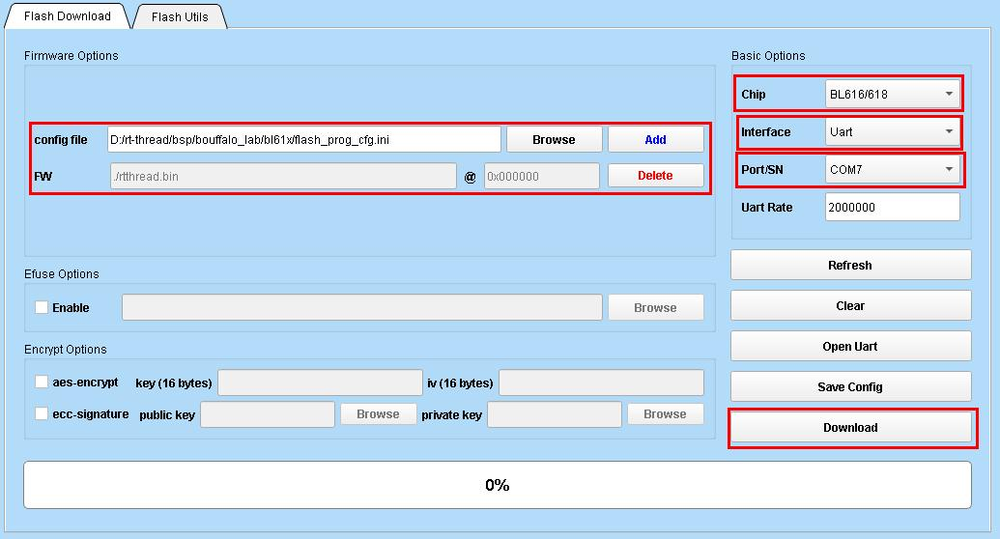
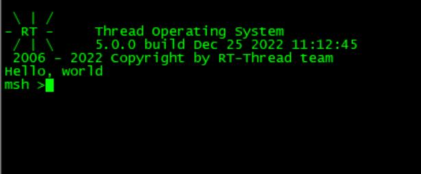

# bouffalo_lab bsp

## 1. 简介

bouffalo_lab bsp针对bouffalo_lab的系列AIoT芯片，采用bouffalo_lab最新**LHAL** 驱动库，驱动库与[bouffalo_sdk](https://github.com/bouffalolab/bouffalo_sdk)(原bl_mcu_sdk)代码同步，当前commitid:`e6e8da79a50aeb4fcb67ac380c3bd8885cd56faf`

目前支持以下芯片：

|      | 芯片型号                 | 内核                                     |
| ---- | :----------------------- | ---------------------------------------- |
| 1    | bl60x(bl602/bl604)       | RISC-V SiFive E24                        |
| 2    | bl70x(bl702/bl704/bl706) | RISC-V SiFive E24                        |
| 3    | bl61x(bl616/bl618)       | RISC-V T-Head E907                       |
| 4    | bl808                    | RISC-V T-Head E902(lp)+E907(m0)+C906(d0) |

**LHAL** 是博流为统一通用外设接口而设计的驱动库，代码精炼并且支持博流所有系列芯片。

|   外设   | BL602/BL604 | BL702/BL704/BL706 | BL616/BL618 | BL808 |
| :------: | :---------: | :---------------: | :---------: | :---: |
|   ADC    |      ○      |         √         |      √      |   ○   |
|   CAM    |      -      |         ×         |      ×      |   ×   |
|   CKS    |      ○      |         √         |      √      |   ○   |
|   DAC    |      ○      |         √         |      √      |   ○   |
|   DMA    |      ○      |         √         |      √      |   √   |
|  EFUSE   |      ×      |         √         |      √      |   √   |
|   EMAC   |      -      |         √         |      √      |   √   |
|  FLASH   |      √      |         √         |      √      |   √   |
|   GPIO   |      ○      |         √         |      √      |   √   |
|   I2C    |      ○      |         √         |      √      |   ○   |
|   I2S    |      ○      |         ○         |      √      |   ○   |
|    IR    |      ○      |         √         |      √      |   ○   |
|  MJPEG   |      ×      |         ×         |      √      |   √   |
|  PWM_v1  |      ○      |         √         |      -      |   -   |
|  PWM_v2  |      -      |         -         |      √      |   √   |
|   RTC    |      ○      |         √         |      √      |   √   |
| SEC_AES  |      ○      |         √         |      √      |   √   |
| SEC_SHA  |      ○      |         √         |      √      |   √   |
| SEC_TRNG |      ○      |         √         |      √      |   √   |
| SEC_PKA  |      ○      |         √         |      √      |   √   |
|   SPI    |      ○      |         √         |      √      |   √   |
|  TIMER   |      ○      |         √         |      √      |   √   |
|   UART   |      √      |         √         |      √      |   √   |
|  USB_v1  |      -      |         √         |      -      |   -   |
|  USB_v2  |      -      |         -         |      √      |   √   |
|   WDG    |      ○      |         √         |      √      |   ○   |

备注：**√** 表示已支持；**×** 表示未支持；**○** 表示已支持但未测试；**-** 表示没有该外设。


## 2.  环境搭建及编译

bl60x/bl70x/bl61x可在对应芯片直接编译；bl808是多核异构架构，分为m0、lp、d0，每个核需要单独编译并烧录到对应的位置，bl808三核使用详细参考[bl808三核使用指南](./bl808/README.md)。

以下操作以单核bl61x为例，其他芯片操作类同。

### 2.1. 下载

请至对应下载链接下载芯片的工具链

| 芯片型号    | 下载地址                                                     |
| ----------- | ------------------------------------------------------------ |
| bl60x/bl70x | [Linux](https://gitee.com/bouffalolab/toolchain_gcc_sifive_linux)/[windows](https://gitee.com/bouffalolab/toolchain_gcc_sifive_windows) |
| bl61x/bl808 | [T-Head官网](https://occ.t-head.cn/community/download?id=4073475960903634944)或[Linux](https://gitee.com/bouffalolab/linuxtoolchain_gcc_t-head)/[windows](https://gitee.com/bouffalolab/toolchain_gcc_t-head_windows) |

### 2.2. 设置

Windows下请使用使用[env工具][1]，使用命令 `tar -xvf Xuantie-900-gcc-elf-newlib-mingw-V2.6.1-20220906.tar.gz` 解压交叉编译器，使用Windows下解压工具直接解压可能出现Windows下编译错误。

在`rtconfig.py`中将risc-v工具链的本地路径加入 `EXEC_PATH` 或通过 `RTT_EXEC_PATH` 环境变量指定路径

Windows：

```
set RTT_EXEC_PATH=C:\Users\xxxx\Downloads\Xuantie-900-gcc-elf-newlib-x86_64-V2.6.1\bin
```

Linux:

```
export RTT_EXEC_PATH=/opt/Xuantie-900-gcc-elf-newlib-x86_64-V2.6.1/bin
```

### 2.3. 编译

Windows下推荐使用[env工具][1]，在console下进入bsp/bouffalo_lab/bl61x目录中，运行：

    cd bsp/bouffalo_lab/bl61x
    menuconfig
    pkgs --update

如果在Linux平台下，可以先执行：

    scons --menuconfig

它会自动下载env相关脚本到~/.env目录，然后执行

    source ~/.env/env.sh
    
    cd bsp/bouffalo_lab/bl61x
    pkgs --update

更新完软件包后，执行 `scons -j10` 或 `scons -j10 --verbose` 来编译这个板级支持包。或者通过 `scons --exec-path="GCC工具链路径"` 命令，在指定工具链位置的同时直接编译。

如果编译正确无误，会产生rtthread.elf、rtthread.bin文件；编译完成后自动调用`libraries/bl_mcu_sdk/tools/bflb_tools/bflb_fw_post_proc`对rtthread.bin进行打包处理以用于后续`bouffalo_flash_cube`工具烧录。

脚本会自动采用curl命令行方式下载`bflb_fw_post_proc`，如自动下载失败，可采用手工方式下载对应操作系统文件后保存至`libraries/bl_mcu_sdk/tools/bflb_tools/bflb_fw_post_proc`

| 下载地址1 | [windows](https://raw.githubusercontent.com/bouffalolab/bl_mcu_sdk/master/tools/bflb_tools/bflb_fw_post_proc/bflb_fw_post_proc.exe)/[Linux](https://raw.githubusercontent.com/bouffalolab/bl_mcu_sdk/master/tools/bflb_tools/bflb_fw_post_proc/bflb_fw_post_proc-ubuntu)/[macos](https://raw.githubusercontent.com/bouffalolab/bl_mcu_sdk/master/tools/bflb_tools/bflb_fw_post_proc/bflb_fw_post_proc-macos) |
| --------- | ------------------------------------------------------------ |
| 下载地址2 | [bflb_fw_post_proc-win.tar.gz](https://gitee.com/flyingcys/bflb_tools/releases/download/v1.0.4/bflb_fw_post_proc-win.tar.gz)/[bflb_fw_post_proc-linux.tar.gz](https://gitee.com/flyingcys/bflb_tools/releases/download/v1.0.4/bflb_fw_post_proc-linux.tar.gz)/[bflb_fw_post_proc-macos.tar.gz](https://gitee.com/flyingcys/bflb_tools/releases/download/v1.0.4/bflb_fw_post_proc-macos.tar.gz) |
| 下载地址3 | [bflb_fw_post_proc-win.tar.gz](https://github.com/flyingcys/bflb_tools/releases/download/v1.0.4/bflb_fw_post_proc-win.tar.gz)/[bflb_fw_post_proc-linux.tar.gz](https://github.com/flyingcys/bflb_tools/releases/download/v1.0.4/bflb_fw_post_proc-linux.tar.gz)/[bflb_fw_post_proc-macos.tar.gz](https://github.com/flyingcys/bflb_tools/releases/download/v1.0.4/bflb_fw_post_proc-macos.tar.gz) |


## 3. 下载烧录

### 3.1. 烧录工具下载

当前bsp必须使用`bouffalo_flash_cube-1.0.4`工具进行烧录，使用其他工作无法正常运行。

- 烧录工具下载地址1：[百度网盘](https://pan.baidu.com/s/1eG9pkxf3riAqQAu9aXiOjw?pwd=miv1)

- 烧录工具下载地址2：

[bouffalo_flash_cube-win.zip](https://gitee.com/flyingcys/bflb_tools/releases/download/v1.0.4/bouffalo_flash_cube-win.zip)/[bouffalo_flash_cube-win.tar.gz](https://gitee.com/flyingcys/bflb_tools/releases/download/v1.0.4/bouffalo_flash_cube-win.tar.gz)

[bouffalo_flash_cube-linux.zip](https://gitee.com/flyingcys/bflb_tools/releases/download/v1.0.4/bouffalo_flash_cube-linux.zip)/[bouffalo_flash_cube-linux.tar.gz](https://gitee.com/flyingcys/bflb_tools/releases/download/v1.0.4/bouffalo_flash_cube-linux.tar.gz)

[bouffalo_flash_cube-macos.zip](https://gitee.com/flyingcys/bflb_tools/releases/download/v1.0.4/bouffalo_flash_cube-macos.zip)/[bouffalo_flash_cube-macos.tar.gz](https://gitee.com/flyingcys/bflb_tools/releases/download/v1.0.4/bouffalo_flash_cube-macos.tar.gz)

- 烧录工具下载地址3：

[bouffalo_flash_cube-win.zip](https://github.com/flyingcys/bflb_tools/releases/download/v1.0.4/bouffalo_flash_cube-win.zip)/[bouffalo_flash_cube-win.tar.gz](https://github.com/flyingcys/bflb_tools/releases/download/v1.0.4/bouffalo_flash_cube-win.tar.gz)

[bouffalo_flash_cube-linux.zip](https://github.com/flyingcys/bflb_tools/releases/download/v1.0.4/bouffalo_flash_cube-linux.zip)/[bouffalo_flash_cube-linux.tar.gz](https://github.com/flyingcys/bflb_tools/releases/download/v1.0.4/bouffalo_flash_cube-linux.tar.gz)

[bouffalo_flash_cube-macos.zip](https://github.com/flyingcys/bflb_tools/releases/download/v1.0.4/bouffalo_flash_cube-macos.zip)/[bouffalo_flash_cube-macos.tar.gz](https://github.com/flyingcys/bflb_tools/releases/download/v1.0.4/bouffalo_flash_cube-macos.tar.gz)


### 3.2. GUI方式下载

1. 连接好串口并在工具上选择对应的串口号

2. 打开对应芯片文件夹下的flash_prog_cfg.ini文件

3. 按住开发板上的boot按钮后重新上电，进入下载状态

4. 点击"Download"开始下载




### 3.2. 命令行下载

命令行下载可使用`bsp/bouffalo_lab`目录下的`bouffalo_flash_cube.sh`脚本，输入`./bouffalo_flash_cube.sh bl616 /dev/ttyUSB1`，脚本会自动采用curl命令行方式下载`bouffalo_flash_cube`。

如自动下载失败，可采用手工方式下载对应操作系统文件后保存至`libraries/bl_mcu_sdk/tools/bflb_tools/bouffalo_flash_cube`目录。

其中：

- bl616：芯片名称
- /dev/ttyUSB1：下载串口号，linux下为/dev/ttyUSBx或/dev/ttyACMx，windows下为COMx


### 4.  运行

如果编译 & 烧写无误，当复位设备后，会在串口上看到RT-Thread的启动logo信息：




## 5. 支持开发板列表

|       | 开发板型号             |
| ----- | ---------------------- |
| bl602 | BL602-IoT-3S/BL-HWC-G1 |
| bl702 | Maix Zero Sense        |
| bl616/bl618 | M0S Dock/M0P Dock               |
| bl808 | M1s Dock               |


## 6. 驱动支持列表

| 驱动 | 支持情况 | 备注              |
| :--- | :------- | :---------------- |
| UART | 支持     | 默认波特率2000000 |
| GPIO | 支持     |                   |
| I2C  | 支持     |                   |
| SPI  | 支持     | 支持DMA            |
| PWM  | 支持     |                   |
| ADC  | 支持     |                   |
| RTC  | 支持     |                   |
| WDT  | 支持     |                   |
| HWTIMER  | 支持     |                   |
| FLASH  | 支持     |                   |


## 7. 联系人信息

维护人：[flyingcys](https://github.com/flyingcys)


## 8. 参考

* 芯片[datasheet][2]

  [1]: https://www.rt-thread.org/download.html#download-rt-thread-env-tool
  [2]: https://github.com/bouffalolab/bl_docs

