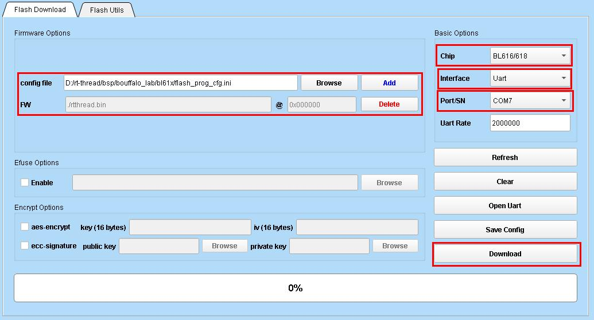
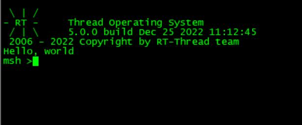

**English** | [中文](README.md)
# bouffalo_lab bsp

## 1. Introduction

bouffalo_lab bsp is a board support package for bouffalo_lab's series of AIoT chips. It adopts the latest **LHAL** driver library from bouffalo_lab, which is synchronized with the [bouffalo_sdk](https://github.com/bouffalolab/bouffalo_sdk) (formerly known as bl_mcu_sdk) code at commit id: `e6e8da79a50aeb4fcb67ac380c3bd8885cd56faf`.

Currently, the following chips are supported:

|      | Chip Model                | Kernel                                     |
| ---- | :----------------------- | ---------------------------------------- |
| 1    | bl60x(bl602/bl604)       | RISC-V SiFive E24                        |
| 2    | bl70x(bl702/bl704/bl706) | RISC-V SiFive E24                        |
| 3    | bl61x(bl616/bl618)       | RISC-V T-Head E907                       |
| 4    | bl808                    | RISC-V T-Head E902(lp)+E907(m0)+C906(d0) |

**LHAL** is a driver library designed by bouffalo_lab for unified general peripheral interfaces. The code is concise and supports all series of bouffalo_lab chips.

|   Peripheral   | BL602/BL604 | BL702/BL704/BL706 | BL616/BL618 | BL808 |
| :------: | :---------: | :---------------: | :---------: | :---: |
|   ADC    |      ○      |         √         |      √      |   ○   |
|   CAM    |      -      |         ×         |      ×      |   ×   |
|   CKS    |      ○      |         √         |      √      |   ○   |
|   DAC    |      ○      |         √         |      √      |   ○   |
|   DMA    |      ○      |         √         |      √      |   √   |
|  EFUSE   |      ×      |         √         |      √      |   √   |
|   EMAC   |      -      |         √         |      √      |   √   |
|  FLASH   |      √      |         √         |      √      |   √   |
|   GPIO   |      ○      |         √         |      √      |   √   |
|   I2C    |      ○      |         √         |      √      |   ○   |
|   I2S    |      ○      |         ○         |      √      |   ○   |
|    IR    |      ○      |         √         |      √      |   ○   |
|  MJPEG   |      ×      |         ×         |      √      |   √   |
|  PWM_v1  |      ○      |         √         |      -      |   -   |
|  PWM_v2  |      -      |         -         |      √      |   √   |
|   RTC    |      ○      |         √         |      √      |   √   |
| SEC_AES  |      ○      |         √         |      √      |   √   |
| SEC_SHA  |      ○      |         √         |      √      |   √   |
| SEC_TRNG |      ○      |         √         |      √      |   √   |
| SEC_PKA  |      ○      |         √         |      √      |   √   |
|   SPI    |      ○      |         √         |      √      |   √   |
|  TIMER   |      ○      |         √         |      √      |   √   |
|   UART   |      √      |         √         |      √      |   √   |
|  USB_v1  |      -      |         √         |      -      |   -   |
|  USB_v2  |      -      |         -         |      √      |   √   |
|   WDG    |      ○      |         √         |      √      |   ○   |

Note: **√** means supported; **×** means unsupported; **○** means supported but not tested; **-** means the peripheral is not available.


## 2. Environment Setup and Compilation

bl60x/bl70x/bl61x can be directly compiled for the corresponding chips. bl808 is a multi-core heterogeneous architecture, divided into m0, lp, and d0. Each core needs to be compiled separately and burned to the corresponding location. Please refer to [bl808 triple-core user guide](./bl808/README_en.md) for detailed usage.

The following operations are based on the single-core bl61x chip, and the operations for other chips are the same.

### 2.1. Download

Please download the toolchain for the corresponding chip using the download links below.

| Chip Model | Download Link                                                 |
| ----------- | ------------------------------------------------------------ |
| bl60x/bl70x | [Linux](https://gitee.com/bouffalolab/toolchain_gcc_sifive_linux)/[windows](https://gitee.com/bouffalolab/toolchain_gcc_sifive_windows) |
| bl61x/bl808 | [T-Head Website](https://occ.t-head.cn/community/download?id=4073475960903634944) or [Linux](https://gitee.com/bouffalolab/linuxtoolchain_gcc_t-head)/[windows](https://gitee.com/bouffalolab/toolchain_gcc_t-head_windows) |

### 2.2. Setup

For Windows, please use the [env tool][1] and extract the cross-compiler with the command `tar -xvf Xuantie-900-gcc-elf-newlib-mingw-V2.6.1-20220906.tar.gz`. Extracting the cross-compiler directly with Windows tools may cause compilation errors on Windows.

Add the path of the RISC-V toolchain to `EXEC_PATH` in `rtconfig.py` or specify the path using the `RTT_EXEC_PATH` environment variable.

Windows:

```
set RTT_EXEC_PATH=C:\Users\xxxx\Downloads\Xuantie-900-gcc-elf-newlib-x86_64-V2.6.1\bin
```

Linux:

```
export RTT_EXEC_PATH=/opt/Xuantie-900-gcc-elf-newlib-x86_64-V2.6.1/bin
```

### 2.3. Compilation

For Windows, it is recommended to use the [env tool][1]. Open the console and navigate to the bsp/bouffalo_lab/bl61x directory, then run:

    cd bsp/bouffalo_lab/bl61x
    menuconfig
    pkgs --update

If you are using Linux, you can execute:

    scons --menuconfig

It will automatically download the env-related scripts to the ~/.env directory, then execute:

    source ~/.env/env.sh
    
    cd bsp/bouffalo_lab/bl61x
    pkgs --update

After updating the software packages, use the command `scons -j10` or `scons -j10 --verbose` to compile the board support package. Alternatively, you can use the `scons --exec-path="GCC toolchain path"` command to specify the toolchain path and compile at the same time.

If the compilation is successful, the rtthread.elf and rtthread.bin files will be generated. After the compilation, the script will automatically call `libraries/bl_mcu_sdk/tools/bflb_tools/bflb_fw_post_proc` to package the rtthread.bin for subsequent burning using the `bouffalo_flash_cube` tool.

The script will automatically download `bflb_fw_post_proc` using the curl command line method. If the automatic download fails, you can manually download the corresponding file for your operating system and save it to the `libraries/bl_mcu_sdk/tools/bflb_tools/bflb_fw_post_proc` directory.

| Download Link 1 | [windows](https://raw.githubusercontent.com/bouffalolab/bl_mcu_sdk/master/tools/bflb_tools/bflb_fw_post_proc/bflb_fw_post_proc.exe)/[Linux](https://raw.githubusercontent.com/bouffalolab/bl_mcu_sdk/master/tools/bflb_tools/bflb_fw_post_proc/bflb_fw_post_proc-ubuntu)/[macos](https://raw.githubusercontent.com/bouffalolab/bl_mcu_sdk/master/tools/bflb_tools/bflb_fw_post_proc/bflb_fw_post_proc-macos) |
| -------------- | ------------------------------------------------------------ |
| Download Link 2 | [bflb_fw_post_proc-win.tar.gz](https://gitee.com/flyingcys/bflb_tools/releases/download/v1.0.4/bflb_fw_post_proc-win.tar.gz)/[bflb_fw_post_proc-linux.tar.gz](https://gitee.com/flyingcys/bflb_tools/releases/download/v1.0.4/bflb_fw_post_proc-linux.tar.gz)/[bflb_fw_post_proc-macos.tar.gz](https://gitee.com/flyingcys/bflb_tools/releases/download/v1.0.4/bflb_fw_post_proc-macos.tar.gz) |
| Download Link 3 | [bflb_fw_post_proc-win.tar.gz](https://github.com/flyingcys/bflb_tools/releases/download/v1.0.4/bflb_fw_post_proc-win.tar.gz)/[bflb_fw_post_proc-linux.tar.gz](https://github.com/flyingcys/bflb_tools/releases/download/v1.0.4/bflb_fw_post_proc-linux.tar.gz)/[bflb_fw_post_proc-macos.tar.gz](https://github.com/flyingcys/bflb_tools/releases/download/v1.0.4/bflb_fw_post_proc-macos.tar.gz) |


## 3. Download and Flashing

### 3.1. Download the Flashing Tool

The current bsp must use the `bouffalo_flash_cube-1.0.4` tool for flashing, other tools may not work correctly.

- Download Link 1: [Baidu Pan](https://pan.baidu.com/s/1eG9pkxf3riAqQAu9aXiOjw?pwd=miv1)
- Download Link 2: [bouffalo_flash_cube-win.zip](https://gitee.com/flyingcys/bflb_tools/releases/download/v1.0.4/bouffalo_flash_cube-win.zip)/[bouffalo_flash_cube-win.tar.gz](https://gitee.com/flyingcys/bflb_tools/releases/download/v1.0.4/bouffalo_flash_cube-win.tar.gz), [bouffalo_flash_cube-linux.zip](https://gitee.com/flyingcys/bflb_tools/releases/download/v1.0.4/bouffalo_flash_cube-linux.zip)/[bouffalo_flash_cube-linux.tar.gz](https://gitee.com/flyingcys/bflb_tools/releases/download/v1.0.4/bouffalo_flash_cube-linux.tar.gz), [bouffalo_flash_cube-macos.zip](https://gitee.com/flyingcys/bflb_tools/releases/download/v1.0.4/bouffalo_flash_cube-macos.zip)/[bouffalo_flash_cube-macos.tar.gz](https://gitee.com/flyingcys/bflb_tools/releases/download/v1.0.4/bouffalo_flash_cube-macos.tar.gz)
- Download Link 3: [bouffalo_flash_cube-win.zip](https://github.com/flyingcys/bflb_tools/releases/download/v1.0.4/bouffalo_flash_cube-win.zip)/[bouffalo_flash_cube-win.tar.gz](https://github.com/flyingcys/bflb_tools/releases/download/v1.0.4/bouffalo_flash_cube-win.tar.gz), [bouffalo_flash_cube-linux.zip](https://github.com/flyingcys/bflb_tools/releases/download/v1.0.4/bouffalo_flash_cube-linux.zip)/[bouffalo_flash_cube-linux.tar.gz](https://github.com/flyingcys/bflb_tools/releases/download/v1.0.4/bouffalo_flash_cube-linux.tar.gz), [bouffalo_flash_cube-macos.zip](https://github.com/flyingcys/bflb_tools/releases/download/v1.0.4/bouffalo_flash_cube-macos.zip)/[bouffalo_flash_cube-macos.tar.gz](https://github.com/flyingcys/bflb_tools/releases/download/v1.0.4/bouffalo_flash_cube-macos.tar.gz)

### 3.2. Flashing via GUI

1. Connect the serial port and select the corresponding port on the tool.

2. Open the flash_prog_cfg.ini file in the corresponding chip folder.

3. Hold down the boot button on the development board, then power on the board to enter flashing mode.

4. Click "Download" to start the flashing process.




### 3.2. Flashing via Command Line

You can use the `bouffalo_flash_cube.sh` script in the `bsp/bouffalo_lab` directory to flash the chip via command line. Enter `./bouffalo_flash_cube.sh bl616 /dev/ttyUSB1` and the script will automatically download `bouffalo_flash_cube` using the curl command line method.

If the automatic download fails, you can manually download the corresponding file for your operating system and save it to the `libraries/bl_mcu_sdk/tools/bflb_tools/bouffalo_flash_cube` directory.

- bl616: chip name (bl808: simultaneous flashing of three cores; or enter: bl808-m0/bl808-lp/bl808-d0 to flash the corresponding core individually, but m0 must be flashed for normal operation)
- /dev/ttyUSB1: download serial port number (in Linux it is /dev/ttyUSBx or /dev/ttyACMx, in Windows it is COMx)


### 4. Running

If the compilation and flashing are successful, when you reset the device, you will see the RT-Thread startup logo information on the serial port:




## 5. Supported Development Boards

|       | Board Model             |
| ----- | ---------------------- |
| bl602 | BL602-IoT-3S/BL-HWC-G1 |
| bl702 | Maix Zero Sense        |
| bl616/bl618 | M0S Dock/M0P Dock               |
| bl808 | M1s Dock               |


## 6. Driver Support List

| Driver | Support Status | Remarks                |
| :----- | :------------- | :--------------------- |
| UART   | Supported      | Default baud rate 2000000 |
| GPIO   | Supported      |                        |
| I2C    | Supported      |                        |
| SPI    | Supported      | Supports DMA            |
| PWM    | Supported      |                        |
| ADC    | Supported      |                        |
| RTC    | Supported      |                        |
| WDT    | Supported      |                        |
| HWTIMER | Supported     |                          |
| FLASH  | Supported      |                        |
| SDCARD  | Supported      |                        |


## 7. Contact Information

Maintainer: [flyingcys](https://github.com/flyingcys)


## 8. References

* Chip [datasheet][2]

  [1]: https://www.rt-thread.org/download.html#download-rt-thread-env-tool
  [2]: https://github.com/bouffalolab/bl_docs