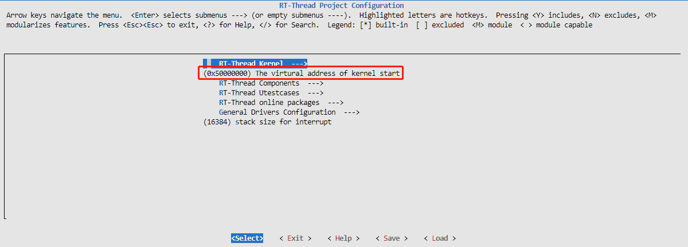
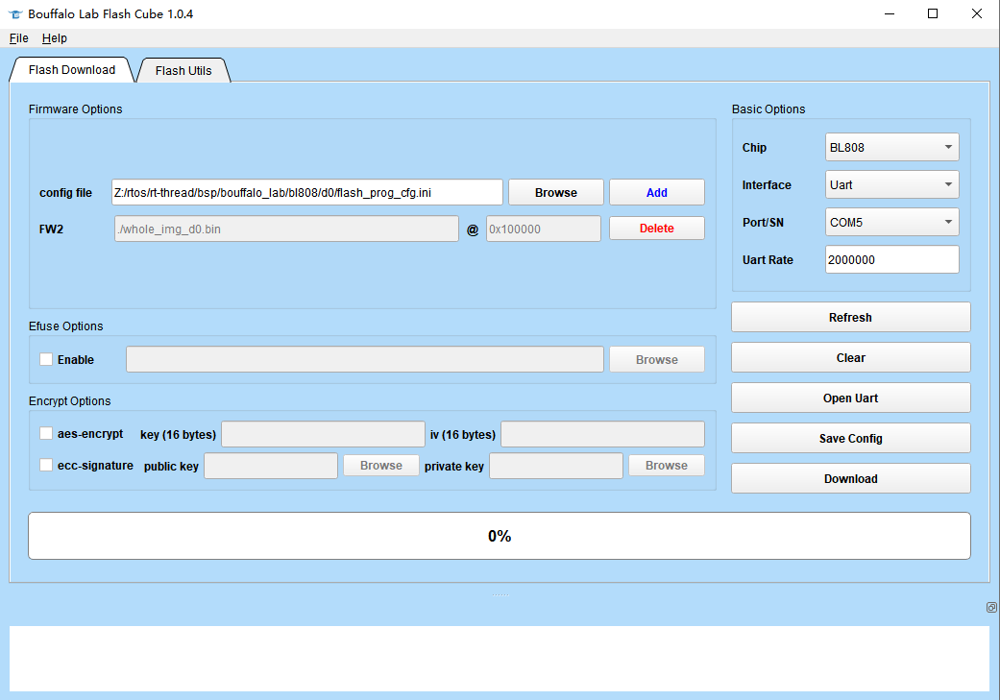
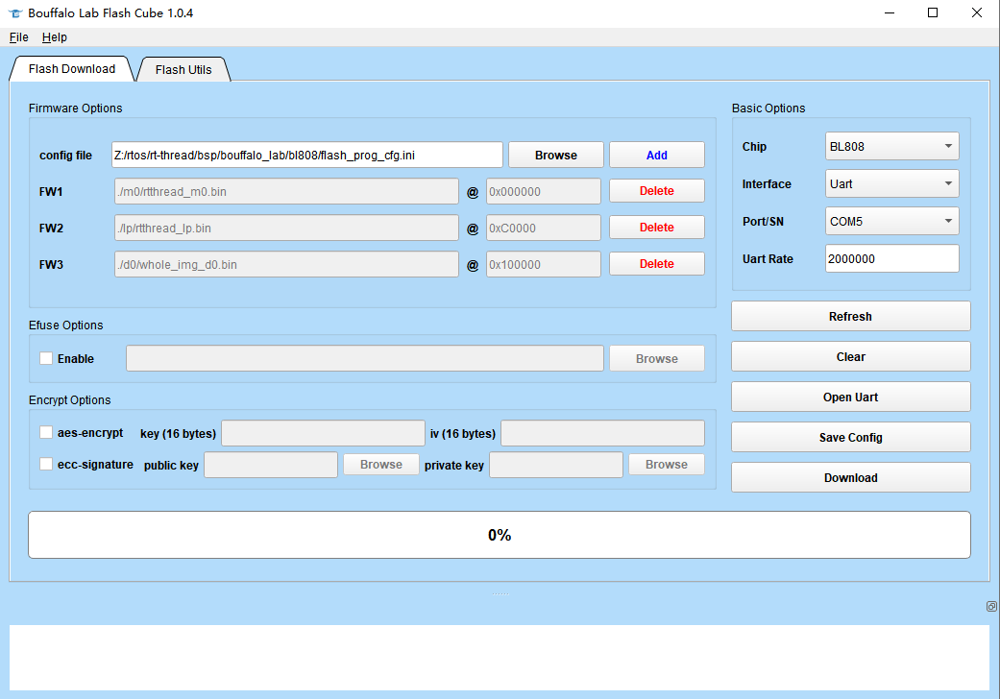

**English** | [中文](README.md)
# BL808 Board Support Package Documentation

## 1. Introduction

BL808 is a highly integrated AIoT chip with wireless connectivity units such as Wi-Fi/BT/BLE/Zigbee, multiple CPUs, audio and video codec, and AI hardware accelerator. It is suitable for various high-performance and low-power applications.

The BL808 chip consists of two subsystems: wireless and multimedia.

The wireless subsystem includes a RISC-V 32-bit high-performance CPU (m0) and integrated Wi-Fi/BT/Zigbee wireless subsystem, which enables various wireless connections and data transmission for diverse connectivity and user experiences.
The multimedia subsystem includes a RISC-V 64-bit ultra-high-performance CPU (d0) and integrated DVP/CSI/H264/NPU video processing modules, which can be widely used in video surveillance, smart speakers, and other AI applications.

The components of the multimedia subsystem include:

- NPU HW NN co-processor (BLAI-100) for AI applications
- Camera interface
- Audio codec
- Video codec
- Sensors
- Display interface

The power management unit controls the low-power mode. It also supports various security features.

Peripheral interfaces include USB2.0, Ethernet, SD/MMC, SPI, UART, I2C, I2S, PWM, GPDAC/GPADC, ACOMP, PIR, Touch, IR remote, Display, and GPIO.

It supports flexible GPIO configuration, with a maximum of 40 GPIO pins.

The chip specifications are as follows:

| Hardware | Description                           |
| -------- | ------------------------------------- |
| Chip Model | bl808                                 |
| CPU        | Three-core heterogeneous RISC-V CPUs: <br />RV64GCV 480MHz<br />RV32GCP 320MHz<br />RV32EMC 160MHz |
| RAM        | 768KB SRAM + 64MB UHS PSRAM           |
| Peripherals | Built-in AES and SHA256 algorithm accelerators |
| AI NN general hardware accelerator | BLAI-100 for video/audio detection/recognition, 100GOPS computational power |
| Camera Interface | DVP and MIPI-CSI                        |
| Display Interface | SPI, DBI, DPI (RGB)                   |
| Wireless | Supports Wi-Fi 802.11 b/g/n<br />Supports Bluetooth 5.x Dual-mode (BT+BLE)<br />Supports Wi-Fi/Bluetooth coexistence |


## 2. RT-Thread Versions

BL808 is a three-core heterogeneous architecture, including m0, lp, and d0 cores. The current BSP supports all three cores running simultaneously and uses different RT-Thread versions for each core.

| Name        | Core  | RT-Thread Version |
| ----------- | ----- | ---------------- |
| M0          | E907  | RT-Thread Standard Edition |
| LP          | E902  | RT-Thread Nano   |
| D0          | C906  | RT-SMART         |


## 3. Compilation Instructions

BL808 is a three-core heterogeneous architecture, including m0, lp, and d0 cores. Each core needs to be compiled separately and burned to the corresponding location.

Flashing addresses:

| Name | Core  | Flash Address | Description                                                  |
| ---- | ----- | ------------- | ------------------------------------------------------------ |
| M0   | E907  | 0x00000       |                                                              |
| LP   | E902  | 0xC0000       | Modify the lp flash address in `bsp/bouffalo_lab/bl808/lp/board/linker_scripts/bl808_flash_lp.ld` and `bsp/bouffalo_lab/bl808/m0/board/board.h` `CONFIG_LP_FLASH_ADDR` address |
| D0   | C906  | 0x100000      | Set in the SPL file. To adjust the d0 flash address, the SPL file and the packaged file `bsp/bouffalo_lab/bl808/d0/merge_rtsmart.py` need to be recompiled |


### 3.1. m0/lp

- #### Toolchain Download

Download the RISC-V toolchain from [Download Link 1](https://occ.t-head.cn/community/download?id=4073475960903634944) or [Download Link 2](https://dl.sipeed.com/shareURL/others/toolchain).

For Windows, use the [env tool][1] and extract the cross-compiler with the command `tar -xvf Xuantie-900-gcc-elf-newlib-mingw-V2.6.1-20220906.tar.gz`. Extracting the cross-compiler directly with Windows tools may cause compilation errors on Windows.

Add the path of the RISC-V toolchain to `EXEC_PATH` in `rtconfig.py` or specify the path using the `RTT_EXEC_PATH` environment variable.

Windows:
```
set RTT_EXEC_PATH=C:\Users\xxxx\Downloads\Xuantie-900-gcc-elf-newlib-x86_64-V2.6.1\bin
```

Linux:
```
export RTT_EXEC_PATH=/opt/Xuantie-900-gcc-elf-newlib-x86_64-V2.6.1/bin
```

- ### Compilation

For Windows, it is recommended to use the [env tool][1]. Open the console and navigate to the bsp/bl808 directory, then select the core, m0 or lp, and run:

    cd bsp/bl808/m0
    menuconfig
    pkgs --update

If you are using Linux, you can execute:

    scons --menuconfig

It will automatically download the env-related scripts to the ~/.env directory, then execute:

    source ~/.env/env.sh
    
    cd bsp/bl808/m0
    pkgs --update

After updating the software packages, use the command `scons -j10` or `scons -j10 --verbose` to compile the board support package. Alternatively, you can use the `scons --exec-path="GCC toolchain path"` command to specify the toolchain path and compile at the same time.

If the compilation is successful, the rtthread.elf and rtthread_m0.bin files will be generated. The rtthread_m0.bin file needs to be burned into the device for execution.  


- #### Note

  Since BL808 is a three-core heterogeneous architecture, the lp and d0 cores are started through the m0 core. It is necessary to burn the m0 core correctly to enable all three cores to run properly.

  Configuration file for m0 flashing: `bsp/bouffalo_lab/bl808/m0/flash_prog_cfg.ini`

  

### 3.2. d0

bl808-d0 runs in S-mode and supports RT-Smart. The cross-compiler used is `riscv64-unknown-linux-musl-gcc`. Please refer to the [Build Kernel Image](https://www.rt-thread.org/document/site/#/rt-thread-version/rt-thread-smart/quick-start/qemu-linux/quickstart?id=%e6%9e%84%e5%bb%ba%e5%86%85%e6%a0%b8%e9%95%9c%e5%83%8f) for compilation instructions.

The starting address of the kernel virtual address is `0x50000000`.



After the bl808-d0 is compiled, use the `merge_rtsmart.py` script to merge `hw.dtb.5M`, `spl_bl808_d0.bin`, `opensbi_v0.6.bin`, and `rtthread_d0.bin` into the final flash file `whole_img_d0.bin`, which should be burned at address `0x100000`. Otherwise, the board will not be able to start.

The pre-compiled bin files are located in the `bsp/bouffalo_lab/bl808/d0/pre_build_bin` folder. If there are any modification requirements, you can download the [Low-Starup-BL808](https://github.com/flyingcys/Low-Starup-BL808) repository and modify it.

The separate flashing file for d0 is `bsp/bouffalo_lab/bl808/d0/flash_prog_cfg.ini`.




### 3.3. Compilation and Flashing of Three Cores Simultaneously

- You can run `bsp/bouffalo_lab/bl808/build_bl808_all.sh` to compile m0, lp, d0 cores one by one.
- You can use the `bsp/bouffalo_lab/bl808/flash_prog_cfg.ini` flashing configuration file to flash m0, lp, and d0 cores simultaneously.




## 4. FAQ

- In a Windows environment, when connecting the development board to the computer via the UART interface, only two USB converter devices are recognized, but the corresponding serial port device is not recognized.
  - Go to Device Manager, right-click on the corresponding USB converter device, go to Properties, and in the Advanced Settings, check the vcp option. After refreshing, you will see the corresponding serial port device.
  - Alternatively, you can install the following driver to solve the problem:  https://dl.sipeed.com/shareURL/MAIX/tools/ftdi_vcp_driver
- When connecting the computer to the board's UART port using a TypeC data cable, two serial ports will appear on the computer (if the mouse cannot move, unplug the USB and check [Updating the board's bl702 firmware](https://wiki.sipeed.com/hardware/zh/maix/m1s/other/start.html) for a solution).