# Core-V-MCU BSP 说明

[English](readme_EN.md) | **中文**

## 1 MCU简介

Core-V-MCU的目的是展示cv32e40p，这是Open Hardware Group(OpenHW)提供的经过充分验证的RISC-V内核。cv32e40p核心连接到一组具有代表性的外围设备。

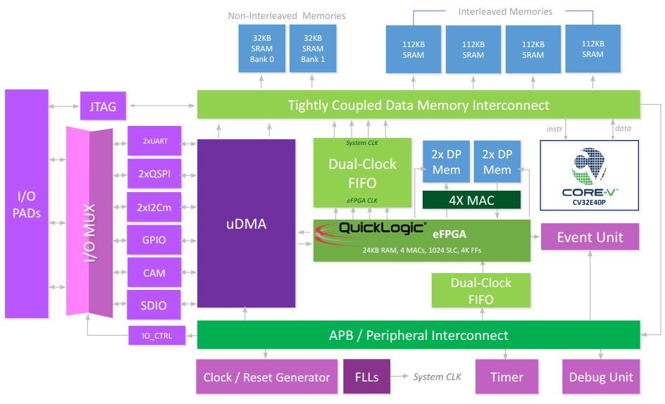

**Core-V-MCU资源：**

- 2xUART
- 2xI2C master
- 1xI2C slave
- 2xQSPI master
- 1xCAMERA
- 1xSDIO
- 4xPWM
- eFPGA with 4 math units

更多信息请访问[Core-V-MCU介绍](https://docs.openhwgroup.org/projects/core-v-mcu/doc-src/overview.html)

更多资源[OpenHW官网](https://www.openhwgroup.org/)

## 2 编译说明

板级包支持 RISC-V GCC 开发环境，以下是具体版本信息：

| IDE/编译器 | 已测试版本              |
| ---------- | ----------------------- |
| GCC        | riscv32-unknown-elf-gcc |

## 3 使用说明

>本章节是为在Core-V-MCU上使用RT-Thread的用户提供，Core-V-MCU目前没有实际的硬件，采用QEMU的方式实现模拟,本文使用的qemu为ubuntu18.04环境下编译qemu。

### 3.1 使用Env编译BSP

本节讲解如何使用Env工具来编译BSP工程。

#### 3.1.1 编译BSP

1. 准备工作1：[下载Linux环境下GCC编译工具链](https://github.com/Yaochenger/openhw-/tree/master/toolchain))，将下载的工具链放在自己的Linux环境下。

2. 准备工作2：在Linux环境下安装ENV，在控制台运行以下命令。

   ```shell
   wget https://gitee.com/RT-Thread-Mirror/env/raw/master/install_ubuntu.sh
   chmod 777 install_ubuntu.sh
   ./install_ubuntu.sh --gitee
   ```

3. 准备工作3：在Linux环境下编译PLCT实验室提供的[qemu]([plctlab/plct-qemu at plct-corev-upstream-sync-dma (github.com)](https://github.com/plctlab/plct-qemu/tree/plct-corev-upstream-sync-dma)),参考README.rst中给出的编译方法编译Linux环境下的qemu，或使用笔者编译好的[qemu](https://github.com/Yaochenger/openhw-/releases/tag/qemu-linux)。

4. Windows环境下载RT-Thread[最新源码](https://github.com/RT-Thread/rt-thread/archive/refs/heads/master.zip)，此步骤同样可以在Linux环境下完成。

5. Windows环境下载当前BSP根目录下打开Env工具并执行以下命令编译,`scons --exec-path=工具链路径`，Windows下的工具链可以直接使用RT-Studio下载，工具链的路径依据用户的具体环境进行配置，此步骤同样可以在Linux环境下完成，示例命令如下：

   ```shell
   scons --exec-path=D:\RT-ThreadStudio\repo\Extract\ToolChain_Support_Packages
   \RISC-V\RISC-V-GCC-RV32\2022-04-12\bin
   ```

    在指定工具链位置的同时直接编译，编译后生成rtthread.elf文件。

   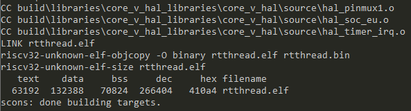

6. 试运行rtthread.elf，将上步生成的rtthread.elf拷贝到编到编译的qemu工具的bin文件目录下，执行以下命令

   ```shell
   ./qemu-system-riscv32 -M core_v_mcu -bios none -kernel rtthread.elf -nographic -monitor none -serial stdio
   ```

   运行结果如下：

   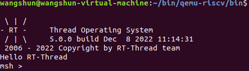

   7.运行以下命令生成完整可拷贝的工程 

```shell
scons --dist
```

将生成的独立工程拷贝到Linux环境下。

### 3.2Liunx环境下编译运行工程

#### 3.2.1 配置工程

1.在上文拷贝的完整的工程根目录下找到**rtconfig.h**,去掉该文件中的预编译命令**#ifndef RT_CONFIG_H__**,**#define RT_CONFIG_H__**,**#ifndef RT_CONFIG_H__**,**#endif**,一定要执行这步操作，否则会编译报错。

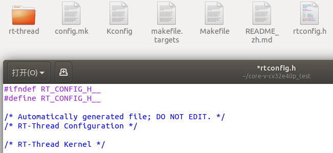

2.执行以下命令生成makefile工程

```shell
scons --target=makefile
```

3.在命令行输入**make**编译工程

4.运行以下命令，启动qemu运行编译出rtthread.elf，`/home/wangshun/bin/qemu-riscv/bin/qemu-system-riscv32`为Linux环境的工具链路径，这里设置为用户的工具链路径。

```shell
/home/wangshun/bin/qemu-riscv/bin/qemu-system-riscv32 -M core_v_mcu -bios none -kernel rtthread.elf -nographic -monitor none -serial stdio
```

BSP支持RT-Thread的Finsh组件，输入version可以查看rt-thread的版本信息，Tap键可以查看支持的命令，运行结果如下：

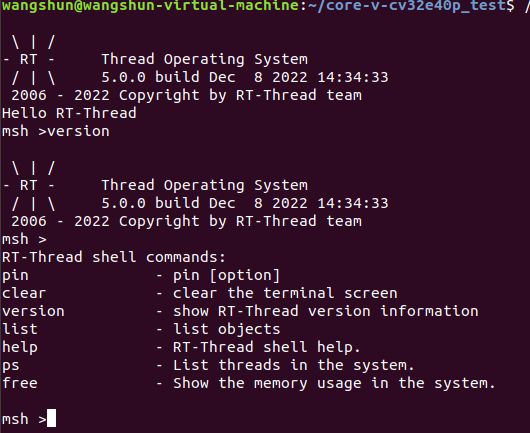

至此，基于Core-V-MCU的RT-Thread工程的配置与运行测试完成。

### 3.3 将RT-Thread工程导入OpenHW的Core-V-IDE

1.下载安装[core-v-sdk](https://github.com/openhwgroup/core-v-sdk),按照[README.md](https://github.com/openhwgroup/core-v-sdk#readme)中的步骤安装Linux环境下的IDE。

2.在主目录下创建workspace文件夹，打开IDE将workspace文件夹作为工作路径。

3.选择`Import projects选项 `。

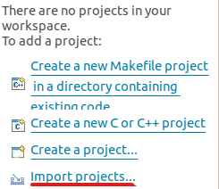

4.选择`Existing Code as Makefile Project选项`

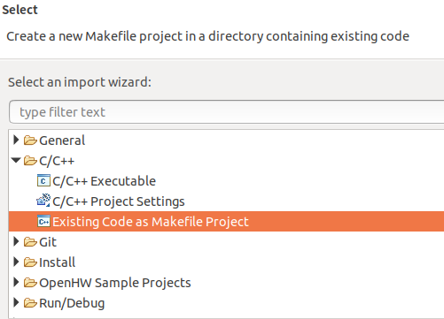

5.设置如下

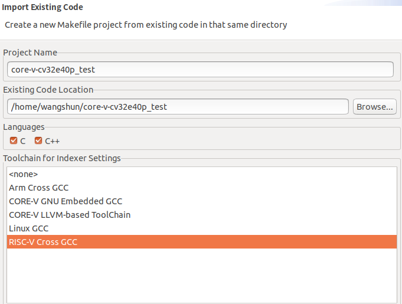

6.工程配置设置

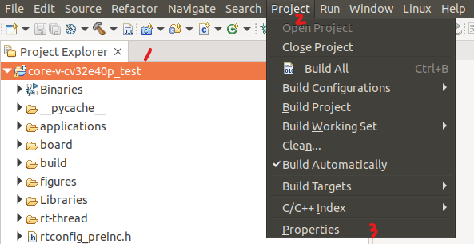

7.修改编译命令

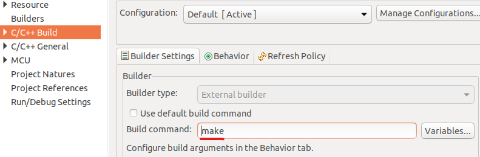

8.清空工程编译出的文件，重新编译工程

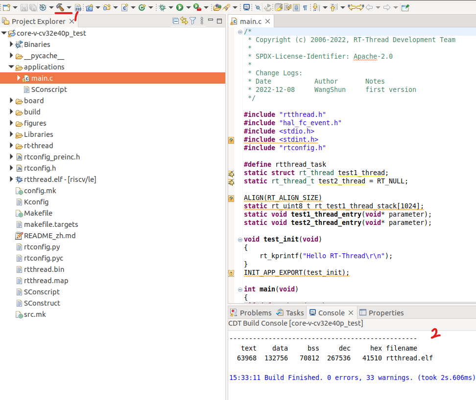

9.在使用IDE编译的工程的根目录下运行以下命令，结果和**3.2.1**运行的结果一致IDE下的工程便配置完成，至此，IDE导入Core-V-MCU的RT-Thread工程的导入与运行测试完成。

```shell
/home/wangshun/bin/qemu-riscv/bin/qemu-system-riscv32 -M core_v_mcu -bios none -kernel rtthread.elf -nographic -monitor none -serial stdio
```

### 3.4调试配置

1.Debug Configurations 配置

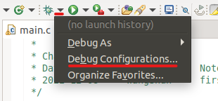

2.双击`GDB OpenOCD Debugging`，生成调试配置选项

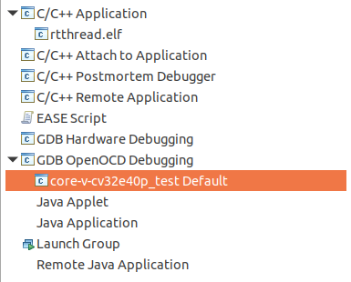

3.导入片上外设寄存器文件

文件路径`OpenHW/CORE-V-SDKv0.0.0.4/registers/csr`,具体路径根据用户安装的SDK路径配置。

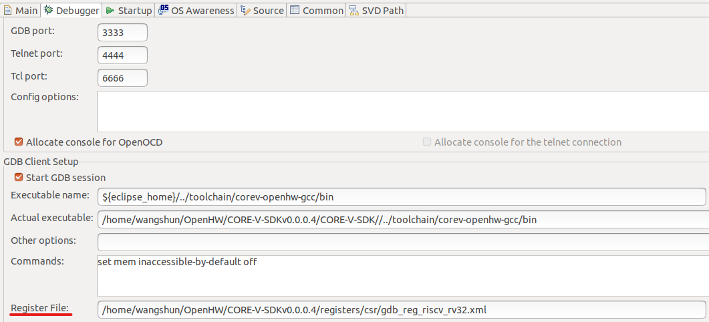

3.导入片上外设寄存器文件

文件路径`/home/wangshun/OpenHW/CORE-V-SDKv0.0.0.4/registers/peripheral`,具体路径根据用户安装的SDK路径配置。

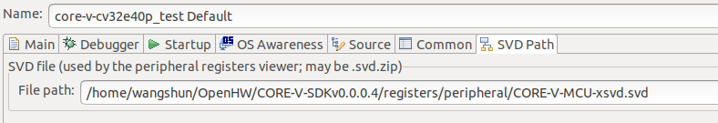

3.配置qemu运行环境

取消`Start OpenOCD locally的勾选`，配置参数如下

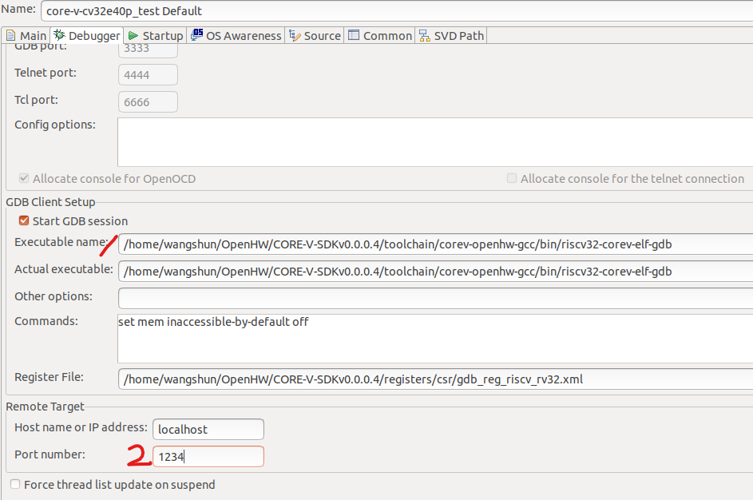

4.运行下述指令

```shell
/home/wangshun/bin/qemu-riscv/bin/qemu-system-riscv32 -M core_v_mcu -bios none -kernel rtthread.elf -nographic -monitor none -serial stdio -s -S
```

5.点击debug开始调试

 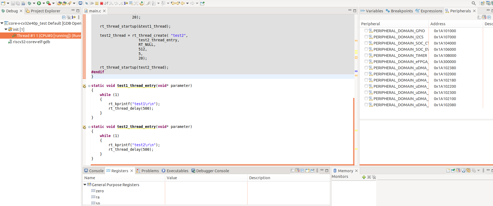

### 4.CLI组件

​	OPENHW提供的FreeRTOS工程支持一个CLI组件用于测试，在使用RT-Thread时为了兼容原有的CLI，所以将原来的CLI做成了独立的软件包，同时该软件包自动开启FreeRTOS兼容层，所以该软件包既可以支持原有的CLI组件，同时用户可以自行选择使用FreeRTOS的API或者RT-Thread的API。

#### 4.1使用方法

​	在ENV工具中使用menuconfig配置开启CorevMCU_CL软件包，将example.c中的示例代码放到main.c提示的地方。使用menuconfig配置的步骤如下：

> `RT-Thread online packages`
>     `miscellaneous packages --->`
>        ` [*] CorevMCU_CLI`

