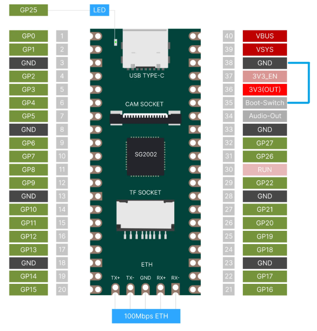

<!-- TOC -->

- [1. 概述](#1-概述)
	- [1.1. 驱动支持列表](#11-驱动支持列表)
- [2. 构建说明](#2-构建说明)
	- [2.1. Toolchain 下载](#21-toolchain-下载)
	- [2.2. 依赖安装](#22-依赖安装)
	- [2.3. 执行构建](#23-执行构建)
		- [2.3.1. 开发板选择](#231-开发板选择)
		- [2.3.2. 开启 RT-Smart](#232-开启-rt-smart)
		- [2.3.3. 编译大核固件 `boot.sd`](#233-编译大核固件-bootsd)
- [3. 运行](#3-运行)
	- [3.1. RT-Thread 标准版的例子](#31-rt-thread-标准版的例子)
	- [3.2. RT-Thread Smart 版的例子](#32-rt-thread-smart-版的例子)
- [4. 联系人信息](#4-联系人信息)

<!-- /TOC -->

# 1. 概述

本文档用于介绍 BSP "cv18xx_aarch64"，该 BSP 目前仅支持 Milk-V Duo 256M 的 ARM Cortex A53 大核。支持 RT-Thread 标准版和 RT-Thread Smart 版内核。

## 1.1. 驱动支持列表

| 驱动  | 支持情况 | 备注              |
| :---- | :------- | :---------------- |
| uart  | 支持     | 默认波特率115200  |

# 2. 构建说明

**注：当前 bsp 只支持 Linux 环境下编译，推荐 ubuntu 22.04**

## 2.1. Toolchain 下载

用于编译 RT-Thread 标准版和 RT-Thread Smart 版的工具链可以通用，下载地址：<https://github.com/RT-Thread/toolchains-ci/releases/download/v1.7/aarch64-linux-musleabi_for_x86_64-pc-linux-gnu_stable.tar.bz2>。

正确解压后(假设解压到 `/opt` 下, 也可以自己设定解压后的目录)，导出如下环境变量，建议将这些 export 命令写入 `~/.bashrc`。

```shell
export RTT_CC="gcc"
export RTT_CC_PREFIX=aarch64-linux-musleabi-
export RTT_EXEC_PATH=/opt/aarch64-linux-musleabi_for_x86_64-pc-linux-gnu/bin
```

## 2.2. 依赖安装

参考 [bsp cvitek 的 README.md 文件](../README.md)。

## 2.3. 执行构建

首先确保 RISC-V 小核已经构建完成并生成了 `rtthread.bin` 。Duo 256m 的小核是一个 RISC-V 的 core，对应的 bsp 是 `bsp/cvitek/c906_little`。具体构建的说明参考 [bsp cvitek 的 README.md 文件](../README.md)。构建过后会生成小核的内核镜像文件 `rtthread.bin`，在使用 `rttpkgtool` 制作ARM架构`fip.bin`固件时会使用到。

 `rttpkgtool` 目录下有对应开发板和架构制作固件时所需使用的预编译文件，也可以在 `rttpkgtool` 目录下运行 `./prebuild.sh` 命令来重新制作预编译文件 参考[ rttpkgtool 的 README.md 文件](../rttpkgtool/README.md)。

### 2.3.1. 开发板选择

```shell
$ scons --menuconfig
```

选择当前需要编译的目标开发板类型，默认是 "milkv-duo256m"，目前也仅支持了 "milkv-duo256m"。

### 2.3.2. 开启 RT-Smart

目前 ARM 的大核默认没有开启 RT-Smart，默认配置是 RT 标准版，如果要对大核启用 RT-Smart，可以按如下方式设置。

```shell
RT-Thread Kernel  --->
    [*] Enable RT-Thread Smart (microkernel on kernel/userland)
```

### 2.3.3. 编译固件 

```shell
$ scons
```

scons 会执行如下步骤的工作：

- 如果编译正确无误，在 `$CWD` 下会产生 `rtthread.bin` 文件。
- 通过运行 `../build.sh -a` ，利用 rttpkgtool 下提供的可以在 ARM 核上运行的 `fsbl`、`uboot` 等预编译文件，打包生成可供 ARM 大核解析和运行的 `fip.bin`。`fip.bin` 会生成在 `$CWD/../output/milkv-duo256m/` 下。
- 在 `$CWD/../output/milkv-duo256m/` 下生成 `fip.bin`和`boot.sd` 文件，`fip.bin`中封装了RISCv小核对应的`rtthread.bin`, `boot.sd` 中封装了 ARM 大核对应的 `Image` (与`rtthread.bin`等同)。

# 3. 运行

1. 将 SD 卡分为 2 个分区，第 1 个分区的分区格式为 `FAT32`，用于存放 `fip.bin` 和 `boot.sd` 文件，第 2 个分区可选，如果有可用于作为数据存储分区或者存放文件系统。

2. 将 `fip.bin` 和 `boot.sd` 复制到 SD 卡第一个分区中。`fip.bin` 是小核启动固件，如果只关注 ARM 大核系统，后续只需更新大核的固件，即更新 `boot.sd` 文件即可。

3. Duo256M 的大核可以选择使用 RISC-V 或者 ARM，默认使用的是 RISC-V 核，所以这里需要通过短接物理引脚 35（Boot-Switch）和 GND 来切换到 ARM 核，如下图所示。具体参考 [Milk-V Duo 256M 的官方说明](https://milkv.io/zh/docs/duo/getting-started/duo256m#risc-v-%E4%B8%8E-arm-%E5%88%87%E6%8D%A2)。

   

4. 配置 **串口0** 参数： 115200 8N1 ，硬件和软件流控为关。

开发板上电运行后会先执行BL1 BootROM程序，这段程序是芯片厂烧写在芯片内部，它会加载我们制作的 Fip.bin 固件,也就是从BL2开始往后的代码，运行到BLCP代码段后加载小核的 `rtthread.bin` 运行,运行到 uboot 代码段后会自动调用 bootcmd 解析 `boot.sd` 文件，然后大核加载 `rtthread.bin`运行。

SOC双核启动流程如下：
```shell
BL1( BootROM )
  ↓
BL2( b12.bin )    →   加载BLCP   →  初始化协处理器 
  |                       ↓
  ↓                  BL3.2( empty.bin )  →  加载小核RT-Thread ( rtthread.bin )
BL3.1( OpenSBI )
  ↓
BL3.3( U-Boot )  →  加载大核RT-Thread ( Boot.sd )
```

## 3.1. RT-Thread 标准版的例子

```shell
......

U-Boot 2021.10-ga57aa1f29b (Apr 20 2024 - 23:53:08 +0800)cvitek_cv181x

......

Starting kernel ...

[I/rtdm.ofw] Booting RT-Thread on physical CPU 0x0
[I/rtdm.ofw] Machine model: SOPHGO ASIC. ARM.
[I/rtdm.ofw] Memory node(1) ranges: 0x0000000080000000 - 0x000000008fe00000
[E/rtdm.ofw] Allocating reserved memory in setup is not yet supported
[E/rtdm.ofw] Allocating reserved memory in setup is not yet supported
[I/mm.memblock] System memory:
[I/mm.memblock]                    [0x0000000080000000, 0x000000008fe00000]
[I/mm.memblock] Reserved memory:
[I/mm.memblock]                    [0x0000000080000000, 0x0000000080080000]
[I/mm.memblock]                    [0x0000000080200000, 0x00000000802dd000]
[I/mm.memblock]                    [0x00000000802dd000, 0x00000000842dd000]
[I/mm.memblock]                    [0x00000000842dd000, 0x00000000844dd000]
[I/mm.memblock]                    [0x00000000844dd000, 0x00000000844e2000]
[I/mm.memblock] physical memory region [0x0000000080080000-0x0000000080200000] installed to system page
[I/mm.memblock] physical memory region [0x00000000844e2000-0x000000008fe00000] installed to system page
[I/mm.memblock] 195 MB memory installed to system page
[I/drv.pinmux] Pin Name = "UART0_RX", Func Type = 281, selected Func [0]

[I/drv.pinmux] Pin Name = "UART0_TX", Func Type = 282, selected Func [0]

[I/osi.psci] Using PSCI v1.0 Function IDs
[I/rtdm.ofw] Console: uart0 (<no-node>)

 \ | /
- RT -     Thread Operating System
 / | \     5.2.0 build Dec 25 2024 14:16:49
 2006 - 2024 Copyright by RT-Thread team
[I/rtdm.mnt] File system initialization done
Hello AARCH64 !
msh />
```

## 3.2. RT-Thread Smart 版的例子

```shell
U-Boot 2021.10-ga57aa1f29b (Apr 20 2024 - 23:53:08 +0800)cvitek_cv181x

......

Starting kernel ...

[I/rtdm.ofw] Booting RT-Thread on physical CPU 0x0
[I/rtdm.ofw] Machine model: SOPHGO ASIC. ARM.
[I/rtdm.ofw] Memory node(1) ranges: 0x0000000080000000 - 0x000000008fe00000
[E/rtdm.ofw] Allocating reserved memory in setup is not yet supported
[E/rtdm.ofw] Allocating reserved memory in setup is not yet supported
[I/mm.memblock] System memory:
[I/mm.memblock]                    [0x0000000080000000, 0x000000008fe00000]
[I/mm.memblock] Reserved memory:
[I/mm.memblock]                    [0x0000000080000000, 0x0000000080080000]
[I/mm.memblock]                    [0x0000000080200000, 0x0000000080346000]
[I/mm.memblock]                    [0x0000000080346000, 0x0000000084346000]
[I/mm.memblock]                    [0x0000000084346000, 0x0000000084546000]
[I/mm.memblock]                    [0x0000000084546000, 0x000000008454b000]
[I/mm.memblock] physical memory region [0x0000000080080000-0x0000000080200000] installed to system page
[I/mm.memblock] physical memory region [0x000000008454b000-0x000000008fe00000] installed to system page
[I/mm.memblock] 195 MB memory installed to system page
[I/drv.pinmux] Pin Name = "UART0_RX", Func Type = 281, selected Func [0]

[I/drv.pinmux] Pin Name = "UART0_TX", Func Type = 282, selected Func [0]

[I/osi.psci] Using PSCI v1.0 Function IDs
[I/rtdm.ofw] Console: uart0 (<no-node>)

 \ | /
- RT -     Thread Smart Operating System
 / | \     5.2.0 build Dec 25 2024 12:10:56
 2006 - 2024 Copyright by RT-Thread team
[I/drivers.serial] Using /dev/ttyS0 as default console
[I/rtdm.mnt] File system initialization done
Hello AARCH64 !
msh />
```

# 4. 联系人信息

维护人：[liYony](https://github.com/liYony)
