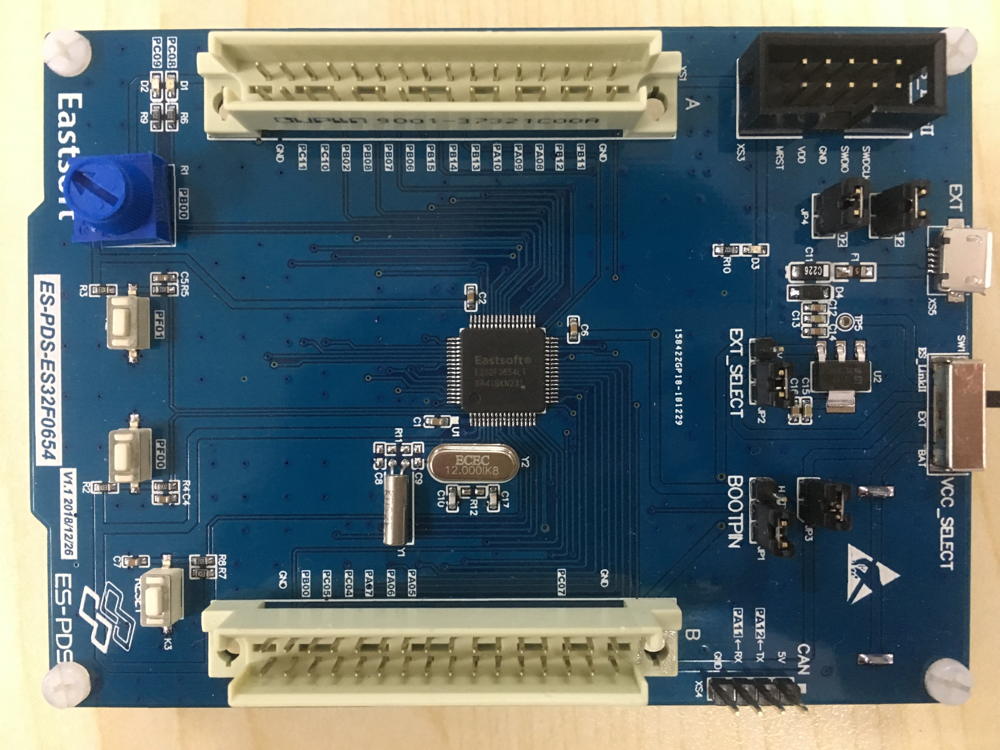
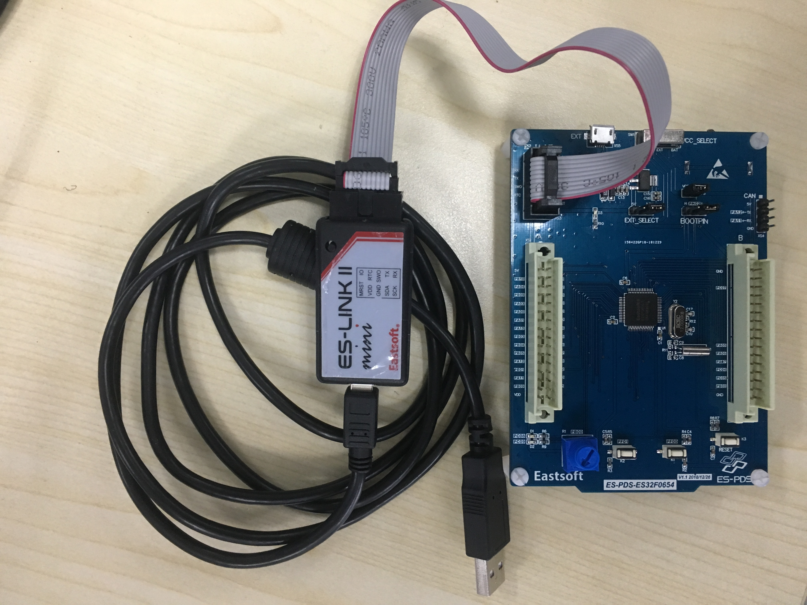
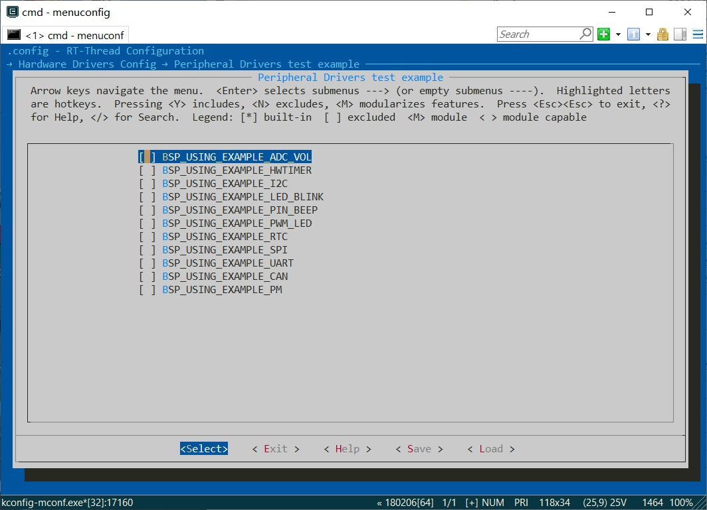

# ES-PDS-ES32F0654 开发板 BSP 说明
标签： EastSoft、国产MCU、Cortex-M0、ES32F0654LT

## 1. 简介

本文档为上海东软载波微电子开发团队为 ES-PDS-ES32F0654 开发板提供的 BSP (板级支持包) 说明。
通过阅读本文档，开发者可以快速地上手该 BSP，将 RT-Thread 运行在开发板上。

### 1.1  开发板介绍

主要内容如下：
ES-PDS-ES32F0654 是东软载波微电子官方推出的一款基于 ARM Cortex-M0 内核的开发板，最高主频为 48MHz，可满足基础功能测试及高端功能扩展等开发需求。

开发板外观如下图所示：

ES-PDS-ES32F0654-V1.1



该开发板常用 **板载资源** 如下：

- MCU：ES32F0654LT，主频 48MHz，32KB SRAM，256KB FLASH，54 GPIOs
- 外部模块：SPI FLASH (MX25L64，8MB)、I2C EEPROM (M24C04，512B)
- 常用外设
  - 可调电阻：1个，(PB00)
  - LED：2个，(PC8/PC9)
  - 按键：3个，K1(PF00)，K2（PF01)，RESET(MRST)
- 常用接口：GPIO、UART、SPI、I2C
- 调试接口，ESLinkⅡ(EastSoft 官方推出的开发工具，有标准版和mini版两种版本，均自带 CDC 串口功能) SWD 下载

外设支持:

本 BSP 目前对外设的支持情况如下：

| **板载外设**      | **支持情况** | **备注**                             |
| :---------------- | :----------: | :------------------------------------|
| SPI FLASH         |     支持     | SPI0                                 |
| **片上外设**      | **支持情况** | **备注**                             |
| GPIO              |     支持     | 54 GPIOs                             |
| UART              |     支持     | UART0/1/2/3                          |
| SPI               |     支持     | SPI0/1                               |
| I2C               |     支持     | I2C0/1                               |
| CAN               |     支持     | CAN0                                 |
| PWM               |     支持     | PWM0/1/2/3                           |
| TIMER             |     支持     | TIMER0/1/2/3                         |
| RTC               |     支持     | RTC                                  |
| PM                |     支持     | Power Management                     |
| ADC               |     支持     | ADC0                                 |

### 1.2  注意事项

- 本BSP中，UART2和TIMER1不能同时使用，UART3和TIMER2不能同时使用

更多详细信息请咨询[上海东软载波微电子技术支持](http://www.essemi.com/)

## 2. 快速上手

本 BSP 为开发者提供 MDK5 工程。下面以 MDK5 开发环境为例，介绍如何将系统运行起来。

### 硬件连接

使用 ESLinkⅡ (自带 CDC 串口)或 Jlink 等调试工具连接开发板到 PC，拨动开关选择使用调试工具供电或使用外部电源供电。若使用 Jlink 等调试工具，还需要将 UART2_TX(PC12)、UART2_RX(PD2)、GND 接到串口工具上。

使用ESlinkⅡ(mini)连接开发板如下图所示：

ESLinkⅡ(mini) + ES-PDS-ES32F0654-V1.1



### 编译下载

双击 project.uvprojx 文件，打开 MDK5 工程，工程默认配置使用 JLink 下载程序，在通过 JLink 连接开发板的基础上，点击下载按钮即可下载程序到开发板，如果使用 ESLinkⅡ，则选择 "CMSIS-DAP Debugger"，连接正常后即可编译并下载程序到开发板。

### 运行结果

下载程序成功之后，系统会自动运行，观察串口输出的信息，同时开发板LED闪烁。

```bash
 \ | /
- RT -     Thread Operating System
 / | \     4.0.0 build Jan 28 2019
 2006 - 2018 Copyright by rt-thread team
msh >
```
## 3. 进阶使用

此 BSP 默认只开启了 GPIO 和 uart2 的功能，如果需使用 Flash 等更多高级功能，需要利用 ENV 工具对 BSP 进行配置，步骤如下：

1. 在 bsp 下打开 env 工具。

2. 输入`menuconfig`命令配置工程，配置好之后保存退出。

    a）如果需要使用内核用例，先配置rt-thread内核，如图：

    

    然后配置内核用例，如图：

    

    b）如果需要使用驱动用例：先使能驱动，如图：

    

    然后配置驱动用例，如图：

    

    

3. 输入`pkgs --update`命令更新软件包。

4. 输入`scons --target=mdk5/iar` 命令重新生成工程。

更多 Env 工具的详细介绍请参考 [RT-Thread 文档中心](https://www.rt-thread.org/document/site/)

## 4. 联系人信息

- [liuhongyan](https://gitee.com/liuhongyan98) 

## 5. 参考

- [ EastSoft 官网](http://www.essemi.com)

