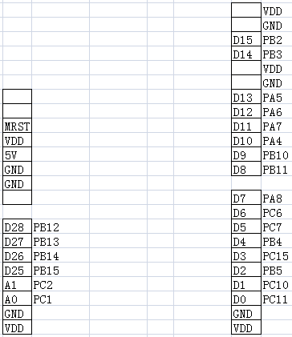

# ES32VF2264的Arduino生态兼容说明

## 1 RTduino - RT-Thread的Arduino生态兼容层

ES32VF2264已经适配了[RTduino软件包](https://github.com/RTduino/RTduino)，可正常使用全部功能，包含GPIO、PWM、I2C、SPI、UART功能。除标准arduino uno的接口外，该开发板还额外添加了4个led和一组方向键对应的GPIO，由于设计原因，该开发板仅有A0-A1两个ADC可用，原本对应A2-A5的ADC被换为了数字接口(可用作SPI1)。更多信息，请参见[RTduino软件包说明文档](https://github.com/RTduino/RTduino)

### 1.1 使用CDK+Env

1. Env 工具下敲入 menuconfig 命令，或者 RT-Thread Studio IDE 下选择 RT-Thread Settings：

```Kconfig
Hardware Drivers Config --->
    Onboard Peripheral Drivers --->
        [*] Compatible with Arduino Ecosystem (RTduino)
```

2. 进入RTduino配置，打开需要使用的各项配置 (SPI,I2C,Adafrui等)

```Kconfig
RT-Thread online packages --->
    system packages --->
        RTduino: Arduino Ecological Compatibility Layer
```

3. 使用 pkgs --update下载RTduino包及其他软件包
4. 使用scons --target=cdk生成代码

## 2 Arduino引脚排布

该BSP遵照Arduino UNO板的引脚排列方式，并额外扩展了一些LED和按键，更多引脚布局相关信息参见 [pins_arduino.c](pins_arduino.c) 和 [pins_arduino.h](pins_arduino.h)。

arduino引脚排布参见下图(或arduino_pins.xlsx)。

注意，由于设计原因，左边部分原本对应Arduino的A2-A5这4个ADC接口不可用，可以作为普通数字IO或SPI1使用。



各引脚功能参见下表

| Arduino引脚编号 | ES32引脚编号 | 备注             |
| --------------- | ------------ | ---------------- |
| D0              | PC11         | CUART2 RX        |
| D1              | PC10         | CUART2 TX        |
| D2              | PB5          | 普通IO           |
| D3              | PC15         | PWM3 通道4       |
| D4              | PB4          | 普通IO           |
| D5              | PC7          | PWM2 通道2       |
| D6              | PC6          | PWM0 通道1       |
| D7              | PA8          | 普通IO           |
| D8              | PB11         | 普通IO           |
| D9              | PB10         | 普通IO           |
| D10             | PA4          | SPI片选/普通IO   |
| D11             | PA7          | SPI0_MOSI/普通IO |
| D12             | PA6          | SPI0_MISO/普通IO |
| D13             | PA5          | SPI0_SCK/普通IO  |
| D14             | PB3          | I2C0_SDA         |
| D15             | PB2          | I2C0_SCL         |
| D16             | PA15         | LED4             |
| D17             | PC12         | LED5             |
| D18             | PC13         | LED6             |
| D19             | PC14         | LED7             |
| D20             | PB7          | KEY_UP           |
| D21             | PB9          | KEY_DOWN         |
| D22             | PB6          | KEY_LEFT         |
| D23             | PB8          | KEY_RIGHT        |
| D24             | PD2          | KEY_CENTER       |
| D25             | PB15         | SPI1_MOSI/普通IO |
| D26             | PB14         | SPI1_MISO/普通IO |
| D27             | PB13         | SPI1_SCK/普通IO  |
| D28             | PB12         | SPI片选/普通IO   |
| A0              | PC1          | ADC              |
| A1              | PC2          | ADC              |


## 3 I2C总线

ES32-Arduino支持的I2C总线是：i2c0。

I2C的引脚都是被RT-Thread I2C设备框架接管的，不需要直接操控这两个引脚。

在RTduino中选择启用<Wire.h>即可使用。

或者在RTduino中开启Adafruit_Bus后，可使用`Adafruit_I2CDevice.h`控制

## 4 SPI总线

ES32-Arduino的SPI总线是spi0、spi1， `SCK`、`MISO`、`MOSI`引脚是被RT-Thread SPI设备框架接管的，不需要直接操控这3个引脚。

在RTduino中选择启用<SPI.h>即可使用，用户需要自行控制片选。

或者在RTduino中开启Adafruit_Bus后，使用`Adafruit_SPIDevice.h`控制。

## 5 测试说明

在applications/arduino_pinout/examples/arduino_examples.cpp文件中，已经根据功能预设了一系列函数用于测试arduino各个功能,可根据测试需要，取消注释对应的宏定义即可启用对应的测试。如果需要测试，请将arduino_examples.cpp文件的内容覆盖到applications/arduino_main.cpp文件中

1. RTduino各功能测试

目前支持的测试如下：

| 宏定义                 | 名称            | 描述                                                         |
| ---------------------- | --------------- | ------------------------------------------------------------ |
| ARDU_TEST_GPIO         | 数字GPIO测试    | 测试数字管脚的输出功能，包括两个管脚输出高/低电平，一个管脚输出一个0.5s周期的方波 |
| ARDU_TEST_PWM          | 模拟PWM输出测试 | PWM功能输出测试，分别在三个PWM管脚输出不同的三种占空比的方波 |
| ARDU_TEST_UART         | UART测试        | 在cuart2串口不断打印"Hello"                                  |
| ARDU_TEST_ADAFRUIT_I2C | AdafruitI2C测试 | 使用AdafruitI2C库发送数据，测试正常可以收到不断发送的"HelloRTduinoHello" |
| ARDU_TEST_ADAFRUIT_SPI | AdafruitSPI测试 | 使用AdafruitSPI库发送数据，测试正常可收到不断的"TEST"        |
| ARDU_TEST_I2C          | I2C测试         | 通过I2C接口发送数据，测试正常可收到不断的"Hello"             |
| ARDU_TEST_SPI          | SPI测试         | 通过SPI接口发送和接收数据，测试正常可收到不断的"ABCD"        |
| ARDU_TEST_INT          | 中断测试        | 测试外部中断，按下方向键的中键会打印相关信息                 |
| ARDU_TEST_DIGITAL_READ | 数字读测试      | 不断读取各个方向键的状态，并在按下时输出信息                 |
| ARDU_TEST_ADC_READ     | ADC测试         | 循环读取各个ADC的数据，并通过串口打印                        |

## 6 其他说明

### 1.ADC
目前ES32的ADC返回的是原始值(范围0-4095)，需要计算转换为实际的电压值，暂时不支持分辨率调节。
### 2.对非数字IO的管脚不要调用pinMode
非数字IO的管脚在其他地方已经初始化了，再次调用pinMode会使他变为普通管脚且无法再重新初始化为非数字IO的功能。即对于任意管脚可以调用pinMode使它变为数字IO管脚，但这一过程不可逆，原有的预设功能将会失效
### 3.SPI/I2C/UART使用

默认开启了spi0、spi1、i2c0、cuart1(默认控制台串口)、cuart2,如果需要使用其他的spi/i2c/uart可以在配置中启用，并在初始化时指定名称即可。如果想要调整管脚信息，可以使用ESCodeMaker辅助，但要注意打开对应的外设。

SPI必须先调用begin才能使用其他函数

### 4.C++异常和RTTI

若使用c++异常，则该机制会占用大量内存(~18k),该内存会在C++部分初始化时使用malloc申请。在编译参数中加入-fno-exceptions禁用c++异常机制可去除该问题。

若使用RTTI(运行时类型识别)，会需要额外的stdc++库支持，需要在CDK的Linker页面中，在Library Name中添加"stdc++"，可通过在编译参数中加入-fno-rtti禁用，但由于CDK不区分C和C++的编译参数，会导致编译C文件时产生警告"warning: command-line option '-fno-rtti' is valid for C++/D/ObjC++ but not for C"。

本BSP默认**禁用异常**，**连接stdc++库**。

### 5.已知问题

1. 开启C++选项后，即使未选择使用C++ thread，也会引入thread支持，此支持需要使用event，若未开启则会编译报错。需要在"RT-Thread Kernel → Inter-Thread communication"中，开启"Enable Event Flag"
2. rt_atomic.h文件循环包含导致编译报错，临时解决方案：在编译器的宏定义中添加"__RT_ATOMIC_H\_\_"，临时屏蔽该文件，之后的解决方案等待rt-thread更新

## 7 参考资料

- [工程师笔记 | 使用RT-Thread的Arduino兼容层开发ES32应用程序](https://mp.weixin.qq.com/s/O693pgCLl1xOGxE9O7zaHA)
