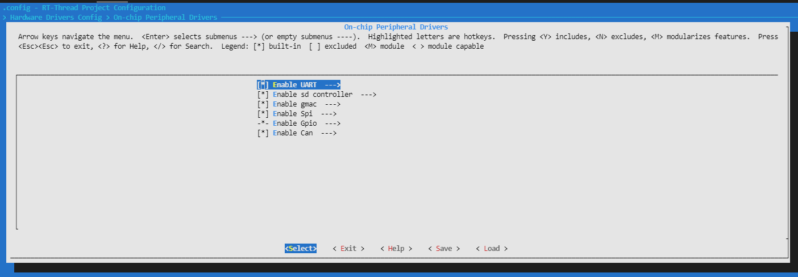
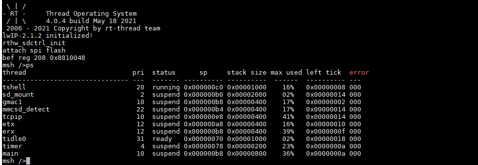
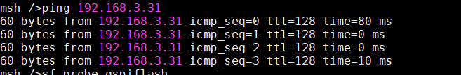
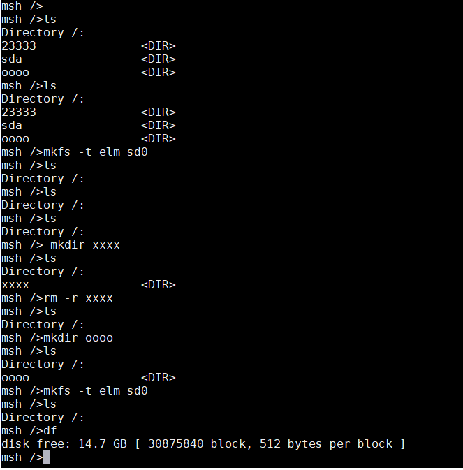

# ft2004 四核开发板 BSP 说明

## 简介

本文档为 飞腾技术公司 ft2000/4 开发板的 BSP (板级支持包) 说明。

主要内容如下：

- 开发板资源介绍
- BSP 外设支持
- 使用方法
- 相关实验

### 1. 开发板资源介绍

FT-2000/4 是一款面向桌面应用的高性能通用 4 核处理器。每 2 个核构成 1
个处理器核簇（Cluster），并共享 L2 Cache。主要技术特征如下：

- 兼容 ARM v8 64 位指令系统，兼容 32 位指令
- 支持单精度、双精度浮点运算指令
- 支持 ASIMD 处理指令
- 集成 2 个 DDR4 通道，可对 DDR 存储数据进行实时加密
- 集成 34 Lane PCIE3.0 接口：2 个 X16（每个可拆分成 2 个 X8），2 个 X1
- 集成 2 个 GMAC，RGMII 接口，支持 10/100/1000 自适应
- 集成 1 个 SD 卡控制器，兼容 SD 2.0 规范
- 集成 1 个 HDAudio，支持音频输出，可同时支持最多 4 个 Codec
- 集成 SM2、SM3、SM4 模块
- 集成 4 个 UART，1 个 LPC，32 个 GPIO，4 个 I2C，1 个 QSPI，2 个通
  用 SPI，2 个 WDT，16 个外部中断（和 GPIO 共用 IO）
- 集成温度传感器

### 2. BSP 外设支持

| 外设名   | 支持情况 | 备注                   |
| -------- | -------- | ---------------------- |
| ft_gicv3 | 支持     | gicv3 中断控制器       |
| ft_gmac  | 支持     | ft gmac 千兆网卡控制器 |
| ft_i2c   | 支持     | FT I2C                 |
| ft_qspi  | 支持     | FT qspi 控制器         |
| ft_sd    | 支持     | FT mmcsd 控制器        |
| ft_uart  | 支持     | PrimeCell PL011        |
| ft_spi   | 支持     | FT spi 控制器          |
| ft_gpio  | 支持     | FT gpio 控制器         |
| ft_can   | 支持     | FT can 控制器          |

### 3. 使用方法

#### ubuntu 上环境搭建

1. 在 ubuntu 环境下通过指令，下载并安装交叉编译链

```
sudo apt-get install gcc-arm-none-eabi
```

2. 安装之后，通过指令，确定交叉编译链安装完毕

```
arm-none-eabi-gcc -v
```

3. 搭建 tftp 环境

   - 在主机安装 tftp 服务
     > 使用 ubuntu 完成下列操作

   ```
   sudo apt-get install tftp-hpa tftpd-hpa
   sudo apt-get install xinetd
   ```

   - 新建 tftboot 目录，如:
     `/mnt/d/tftboot`

   > 需要给 tftboot 目录执行权限`chmod 777 /**/tftboot`

   - 配置主机 tftpboot 服务

   新建并配置文件/etc/xinetd.d/tftp

   ```
   # /etc/xinetd.d/tftp

   server tftp
   {
   socket_type = dgram
   protocol = udp
   wait = yes
   user = root
   server = /usr/sbin/in.tftpd
   server_args = -s /mnt/d/tftboot
   disable = no
   per_source = 11
   cps = 100 2
   flags = IPv4
   }
   ```

   - 启动主机 tftp 服务

   ```
   sudo service tftpd-hpa start
   ```

   - 修改主机 tftp 配置
     修改/etc/default/tftpd-hpa

   ```
   sudo nano /etc/default/tftpd-hpa
   # /etc/default/tftpd-hpa

   TFTP_USERNAME="tftp"
   TFTP_DIRECTORY="/mnt/d/tftboot"
   TFTP_ADDRESS=":69"
   TFTP_OPTIONS="-l -c -s"
   ```

   - 重启主机 tftp 服务
     > 每次开机要重启一次

   ```
   sudo service tftpd-hpa restart
   ```

   - 测试主机 tftp 服务的可用性
     > 登录 tftp 服务，获取一个文件

   ```
   $ tftp 192.168.4.50
   tftp> get test1234
   tftp> q
   ```

#### 执行

1. 将本 bsp 包拷贝至 RT-THREAD bsp/目录下

1. 在 Ubuntu 终端下，切换至 bsp 目录

```
cd rt-thread/bsp/ft2004
```

3. 使用 scons -c 清空工程缓存

4. 使用 scons --menuconfig 配置需要的外设



5. 使用 scons 编译代码,得到 rtthread.bin，并将 rtthread.bin 放入之前配置的 tftp 路径下。

6. 连接开发板对应串口到 PC, 在终端工具里打开相应的串口（115200-8-1-N）。

7. 将开发板网线接入局域网中

8. 本开发板自带 uboot，使用 uboot 自带 指令进行将 bin 文件下载至 ram 中

```
setenv ipaddr 192.168.x.x      # 设置开发板ip
setenv serverip 192.168.x.x    # 设置tftp服务器ip
setenv gatewayip 192.168.x.x   # 设置网关ip
tftpboot 80100000 rtthread.bin # 在主机 /tftpboot目录中的rtthread.bin文件下载到开发板内存的80100000地址中。
```

7. 执行跳转指令，便可以正常执行

```
bootvx32 80100000
或
boot32 80100000
```



### 5. 相关实验

#### 网卡

- 主机 ping 本机 指令 sudo ping 192.168.3.20 (默认)

- rtt ping 主机 指令 ping 192.168.x.x (根据实际情况)

- 通过界面



#### sd 卡调试

- 通过基本命令进行，mv ，echo ，ls ，cd ，rm ....



#### spi flash 卡调试

- 找一块有 spi flash 插槽的 ft-2004 开发板，插入 sf25s 或 gd25q 系列 spi flash
- 配置 rt-thread 的编译选项，打开 BSP_USE_SPI 和 BSP_USE_GPIO 配置，关闭 BSP_USE_QSPI 配置，打开 rt-thread 的 SFUD 调试开关
- 编译 rt-thread，加载版本启动，启动后显示 spi flash probe 成功
- 执行 sf 基本操作，read, write, erase

#### 推荐指令

1. sf probe S25FS256

2. sf read 0x1FFF000 16

3. sf write 0x1FFF000 16 25 68 78 95 15 75 20

4. sf read 0x1FFF000 16

5. sf erase 0x1FFF000 16

#### can 测试

1. 使用 scons menuconfig 选中 Enable Can

2. 然后选中 Enable can0 ，Enable can0 work in loop back

3. 烧录程序并且烧录

4. 打开 can 盒，将波特率设为 1000000

5. 然后通过 can 盒发送对应的数据（标准帧，扩展帧），就可以看见回复同样的内容

## 6. 参考资源

- ARM Architecture Reference Manual

- FT-2000／4 软件编程手册-V1.4

## 7. 联系人信息

请联系飞腾嵌入式软件部

huanghe@phytium.com.cn

zhugengyu@phytium.com.cn
