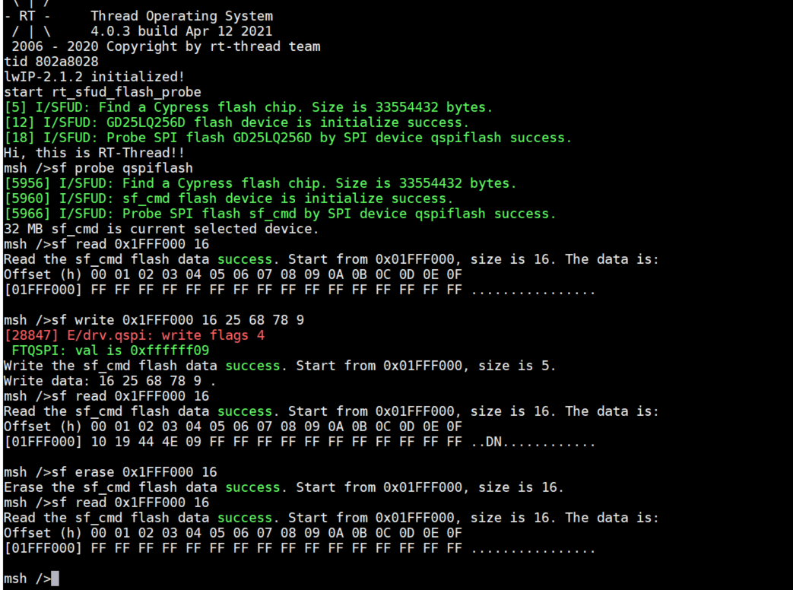

# FT2004-driver ChangeLog

Change log since v0.1.0

# FT2004-driver V0.4.2 Change Log

## bsp/ft_can

1. support can controller

## drivers/rtthread

1. adapt can drivers to rt-thread

# FT2004-driver V0.4.2 Change Log

## bsp/ft_spi

1. support spi ctrl to read and write spi flash in rt-thread
2. notes that spi chip select pin is ctrl in the way of gpio

## bsp/ft_gpio

1. support group A gpio ctrl, include w/r status, change direction

## component/s25fsxx

1. support s24fs serial spi flash operations

## drivers/rtthread

1. adapt spi drivers to rt-thread SFUD flash support component

# FT2004-driver V0.4.1 Change Log

## bsp/ft_i2c

1. support irq read and write for i2c
2. delete unused rtc and eeprom component

# FT2004-driver V0.4.0 Change Log

## component/sdmmc

1. add sd2.0 comand support
2. modify function and variable name by code convention

# FT2004-driver V0.3.2 Change Log

## Docs

1. add ChangeLog.md

## bsp/standlone

1. Added ft_cache.c ft_cache.h

## bsp/ft_gmac

1. Added descriptor cache handling

## drivers/rtthread

1. Modify the bug for drv_qspi

1. Added cache to drv_sdctrl

# FT2004-driver V0.3.1 Change Log

## Docs

1. add ChangeLog.md

## bsp/ft_qspi

1. Complete the writing of QSPI driver

2. Test bsp api in rtthread

## drivers/rtthread

1. add drv_qspi.c

2. Access to the SUFD framework

3. Test functions through the rtthread device management framework

## exhibition

