# GD32  ARM系列 BSP 制作教程

## 1. BSP 框架介绍

BSP 框架结构如下图所示：


GD32 ARM系列BSP架构主要分为三个部分：libraries、tools和具体的Boards，其中libraries包含了GD32的通用库，包括每个系列的Firmware Library以及适配RT-Thread的drivers；tools是生成工程的Python脚本工具；另外就是Boards文件，当然这里的Boards有很多，我这里值列举了GD32407V-START。

## 2. 知识准备

制作一个 BSP 的过程就是构建一个新系统的过程，因此想要制作出好用的 BSP，要对 RT-Thread 系统的构建过程有一定了解，需要的知识准备如下所示：

- 掌握  GD32 ARM系列 BSP 的使用方法
  
  了解 BSP 的使用方法，可以阅读 [BSP 说明文档](../README.md) 中使用教程表格内的文档。

- 了解 Scons 工程构建方法
  
  RT-Thread 使用 Scons 作为系统的构建工具，因此了解 Scons 的常用命令对制作新 BSP 是基本要求。

- 了解设备驱动框架
  
  在 RT-Thread 系统中，应用程序通过设备驱动框架来操作硬件，因此了解设备驱动框架，对添加 BSP 驱动是很重要的。

- 了解 Kconfig 语法
  
  RT-Thread 系统通过 menuconfig 的方式进行配置，而 menuconfig 中的选项是由 Kconfig 文件决定的，因此想要对 RT-Thread 系统进行配置，需要对 kconfig 语法有一定了解。

## 3. BSP移植

### 3.1 Keil环境准备

目前市面通用的MDK for ARM版本有Keil 4和Keil 5：使用Keil 4建议安装4.74及以上；使用Keil 5建议安装5.20以上版本。本文的MDK是5.30。

从MDK的官网可以下载得到MDK的安装包，然后安装即可。

[MDK下载地址](https://www.keil.com/download/product/)


安装完成后会自动打开，我们将其关闭。

接下来我们下载GD32F4xx的软件支持包。

[下载地址](http://www.gd32mcu.com/cn/download)

 

下载好后双击GigaDevice.GD32F4xx_DFP.2.1.0.pack运行即可：

 

点击[Next]即可安装完成。

 

安装成功后，重新打开Keil，则可以在File->Device Database中出现Gigadevice的下拉选项，点击可以查看到相应的型号。

 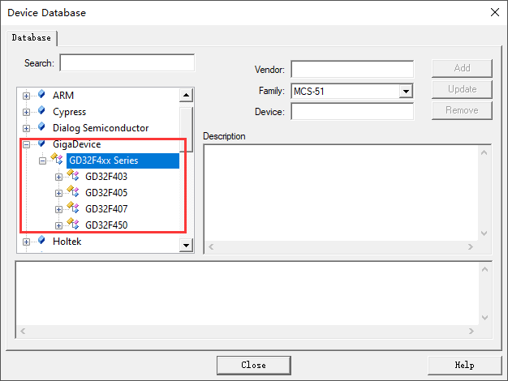

### 3.2 BSP工程制作

**1.构建基础工程**

首先看看RT-Thread代码仓库中已有很多BSP，而我要移植的是Cortex-M4内核。这里我找了一个相似的内核，把它复制一份，并修改文件名为：gd32407v-start。这样就有一个基础的工程。然后就开始增删改查，完成最终的BSP，几乎所有的BSP的制作都是如此。

**2.修改BSP构建脚本**

bsp/gd32/arm/gd32407v-start/SConstruct修改后的内容如下：

```python
import os
import sys
import rtconfig

if os.getenv('RTT_ROOT'):
    RTT_ROOT = os.getenv('RTT_ROOT')
else:
    RTT_ROOT = os.path.normpath(os.getcwd() + '/../../../..')

sys.path = sys.path + [os.path.join(RTT_ROOT, 'tools')]
try:
    from building import *
except:
    print('Cannot found RT-Thread root directory, please check RTT_ROOT')
    print(RTT_ROOT)
    exit(-1)

TARGET = 'rtthread.' + rtconfig.TARGET_EXT

DefaultEnvironment(tools=[])
env = Environment(tools = ['mingw'],
    AS = rtconfig.AS, ASFLAGS = rtconfig.AFLAGS,
    CC = rtconfig.CC, CFLAGS = rtconfig.CFLAGS,
    AR = rtconfig.AR, ARFLAGS = '-rc',
    CXX = rtconfig.CXX, CXXFLAGS = rtconfig.CXXFLAGS,
    LINK = rtconfig.LINK, LINKFLAGS = rtconfig.LFLAGS)
env.PrependENVPath('PATH', rtconfig.EXEC_PATH)

if rtconfig.PLATFORM in ['iccarm']:
    env.Replace(CCCOM = ['$CC $CFLAGS $CPPFLAGS $_CPPDEFFLAGS $_CPPINCFLAGS -o $TARGET $SOURCES'])
    env.Replace(ARFLAGS = [''])
    env.Replace(LINKCOM = env["LINKCOM"] + ' --map rtthread.map')

Export('RTT_ROOT')
Export('rtconfig')

SDK_ROOT = os.path.abspath('./')

if os.path.exists(SDK_ROOT + '/libraries'):
    libraries_path_prefix = SDK_ROOT + '/libraries'
else:
    libraries_path_prefix = os.path.dirname(SDK_ROOT) + '/libraries'

SDK_LIB = libraries_path_prefix
Export('SDK_LIB')

# prepare building environment
objs = PrepareBuilding(env, RTT_ROOT, has_libcpu=False)

gd32_library = 'GD32F4xx_Firmware_Library'
rtconfig.BSP_LIBRARY_TYPE = gd32_library

# include libraries
objs.extend(SConscript(os.path.join(libraries_path_prefix, gd32_library, 'SConscript')))

# include drivers
objs.extend(SConscript(os.path.join(libraries_path_prefix, 'Drivers', 'SConscript')))

# make a building
DoBuilding(TARGET, objs)
```

该文件用于链接所有的依赖文件，主要修改固件库路径，并调用make进行编译。

**3.修改KEIL的模板工程**

双击：template.uvprojx即可修改模板工程。

修改为对应芯片设备:

 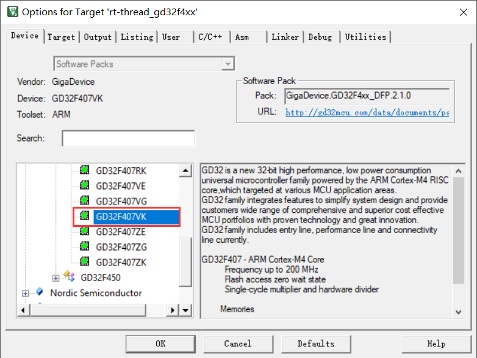

修改FLASH和RAM的配置:

 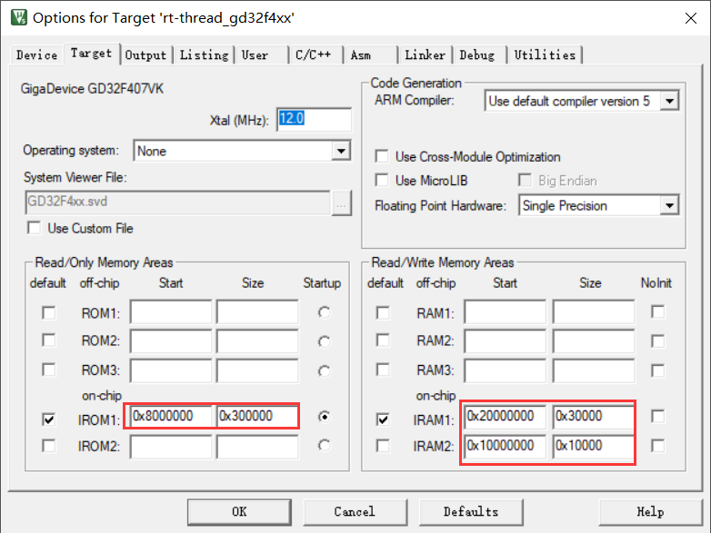

修改可执行文件名字：

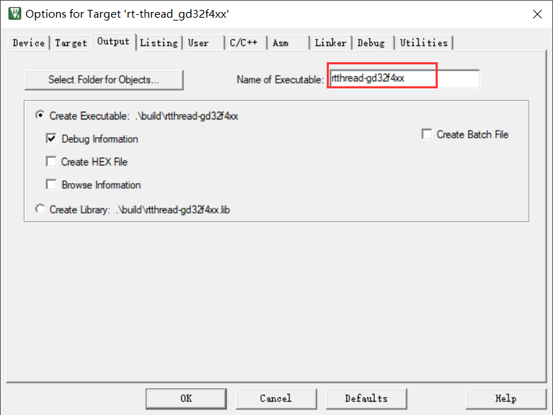

修改默认调试工具：CMSIS-DAP Debugger。

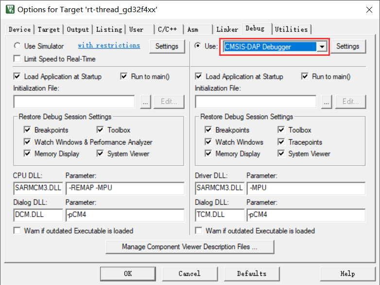

修改编程算法：GD32F4xx FMC。


**4.修改board文件夹**

(1) 修改bsp/gd32/arm/gd32407v-start/board/linker_scripts/link.icf

修改后的内容如下：

```
/*###ICF### Section handled by ICF editor, don't touch! /
/*-Editor annotation file-*/
/* IcfEditorFile="$TOOLKIT_DIR$\config\ide\IcfEditor\cortex_v1_0.xml" */
/*-Specials-*/
define symbol __ICFEDIT_intvec_start__ = 0x08000000;
/*-Memory Regions-*/
define symbol __ICFEDIT_region_ROM_start__ = 0x08000000;
define symbol __ICFEDIT_region_ROM_end__   = 0x082FFFFF;
define symbol __ICFEDIT_region_RAM_start__ = 0x20000000;
define symbol __ICFEDIT_region_RAM_end__   = 0x2002FFFF;
/*-Sizes-*/
define symbol __ICFEDIT_size_cstack__ = 0x2000;
define symbol __ICFEDIT_size_heap__   = 0x2000;
/ End of ICF editor section. ###ICF###*/

export symbol __ICFEDIT_region_RAM_end__;

define symbol __region_RAM1_start__ = 0x10000000;
define symbol __region_RAM1_end__   = 0x1000FFFF;

define memory mem with size = 4G;
define region ROM_region   = mem:[from __ICFEDIT_region_ROM_start__   to __ICFEDIT_region_ROM_end__];
define region RAM_region   = mem:[from __ICFEDIT_region_RAM_start__   to __ICFEDIT_region_RAM_end__];
define region RAM1_region  = mem:[from __region_RAM1_start__   to __region_RAM1_end__];

define block CSTACK    with alignment = 8, size = __ICFEDIT_size_cstack__   { };
define block HEAP      with alignment = 8, size = __ICFEDIT_size_heap__     { };

initialize by copy { readwrite };
do not initialize  { section .noinit };

keep { section FSymTab };
keep { section VSymTab };
keep { section .rti_fn* };
place at address mem:__ICFEDIT_intvec_start__ { readonly section .intvec };

place in ROM_region   { readonly };
place in RAM_region   { readwrite,
                        block CSTACK, block HEAP };                        
place in RAM1_region  { section .sram };
```

该文件是IAR编译的链接脚本，根据《GD32F407xx_Datasheet_Rev2.1》可知，GD32F407VKT6的flash大小为3072KB，SRAM大小为192KB，因此需要设置ROM和RAM的起始地址和堆栈大小等。

(2) 修改bsp/gd32/arm/gd32407v-start/board/linker_scripts/link.ld

修改后的内容如下：

```
/* Program Entry, set to mark it as "used" and avoid gc */
MEMORY
{
    CODE (rx) : ORIGIN = 0x08000000, LENGTH = 3072k /* 3072KB flash */
    DATA (rw) : ORIGIN = 0x20000000, LENGTH =  192k /* 192KB sram */
}
ENTRY(Reset_Handler)
_system_stack_size = 0x200;

SECTIONS
{
    .text :
    {
        . = ALIGN(4);
        _stext = .;
        KEEP(*(.isr_vector))            /* Startup code */
        . = ALIGN(4);
        *(.text)                        /* remaining code */
        *(.text.*)                      /* remaining code */
        *(.rodata)                      /* read-only data (constants) */
        *(.rodata*)
        *(.glue_7)
        *(.glue_7t)
        *(.gnu.linkonce.t*)

        /* section information for finsh shell */
        . = ALIGN(4);
        __fsymtab_start = .;
        KEEP(*(FSymTab))
        __fsymtab_end = .;
        . = ALIGN(4);
        __vsymtab_start = .;
        KEEP(*(VSymTab))
        __vsymtab_end = .;
        . = ALIGN(4);

        /* section information for initial. */
        . = ALIGN(4);
        __rt_init_start = .;
        KEEP(*(SORT(.rti_fn*)))
        __rt_init_end = .;
        . = ALIGN(4);

        . = ALIGN(4);
        _etext = .;
    } > CODE = 0

    /* .ARM.exidx is sorted, so has to go in its own output section.  */
    __exidx_start = .;
    .ARM.exidx :
    {
        *(.ARM.exidx* .gnu.linkonce.armexidx.*)

        /* This is used by the startup in order to initialize the .data secion */
        _sidata = .;
    } > CODE
    __exidx_end = .;

    /* .data section which is used for initialized data */

    .data : AT (_sidata)
    {
        . = ALIGN(4);
        /* This is used by the startup in order to initialize the .data secion */
        _sdata = . ;

        *(.data)
        *(.data.*)
        *(.gnu.linkonce.d*)

        . = ALIGN(4);
        /* This is used by the startup in order to initialize the .data secion */
        _edata = . ;
    } >DATA

    .stack : 
    {
        . = . + _system_stack_size;
        . = ALIGN(4);
        _estack = .;
    } >DATA

    __bss_start = .;
    .bss :
    {
        . = ALIGN(4);
        /* This is used by the startup in order to initialize the .bss secion */
        _sbss = .;

        *(.bss)
        *(.bss.*)
        *(COMMON)

        . = ALIGN(4);
        /* This is used by the startup in order to initialize the .bss secion */
        _ebss = . ;

        *(.bss.init)
    } > DATA
    __bss_end = .;

    _end = .;

    /* Stabs debugging sections.  */
    .stab          0 : { *(.stab) }
    .stabstr       0 : { *(.stabstr) }
    .stab.excl     0 : { *(.stab.excl) }
    .stab.exclstr  0 : { *(.stab.exclstr) }
    .stab.index    0 : { *(.stab.index) }
    .stab.indexstr 0 : { *(.stab.indexstr) }
    .comment       0 : { *(.comment) }
    /* DWARF debug sections.
     * Symbols in the DWARF debugging sections are relative to the beginning
     * of the section so we begin them at 0.  */
    /* DWARF 1 */
    .debug          0 : { *(.debug) }
    .line           0 : { *(.line) }
    /* GNU DWARF 1 extensions */
    .debug_srcinfo  0 : { *(.debug_srcinfo) }
    .debug_sfnames  0 : { *(.debug_sfnames) }
    /* DWARF 1.1 and DWARF 2 */
    .debug_aranges  0 : { *(.debug_aranges) }
    .debug_pubnames 0 : { *(.debug_pubnames) }
    /* DWARF 2 */
    .debug_info     0 : { *(.debug_info .gnu.linkonce.wi.*) }
    .debug_abbrev   0 : { *(.debug_abbrev) }
    .debug_line     0 : { *(.debug_line) }
    .debug_frame    0 : { *(.debug_frame) }
    .debug_str      0 : { *(.debug_str) }
    .debug_loc      0 : { *(.debug_loc) }
    .debug_macinfo  0 : { *(.debug_macinfo) }
    /* SGI/MIPS DWARF 2 extensions */
    .debug_weaknames 0 : { *(.debug_weaknames) }
    .debug_funcnames 0 : { *(.debug_funcnames) }
    .debug_typenames 0 : { *(.debug_typenames) }
    .debug_varnames  0 : { *(.debug_varnames) }
}
```

该文件是GCC编译的链接脚本，根据《GD32F407xx_Datasheet_Rev2.1》可知，GD32F407VKT6的flash大小为3072KB，SRAM大小为192KB，因此CODE和DATA 的LENGTH分别设置为3072KB和192KB，其他芯片类似，但其实地址都是一样的。

(3) 修改bsp/gd32/arm/gd32407v-start/board/linker_scripts/link.sct
修改后的内容如下：

```
; *************************************************************
; *** Scatter-Loading Description File generated by uVision ***
; *************************************************************

LR_IROM1 0x08000000 0x00300000  {    ; load region size_region
  ER_IROM1 0x08000000 0x00300000  {  ; load address = execution address
   *.o (RESET, +First)
   *(InRoot$$Sections)
   .ANY (+RO)
  }
  RW_IRAM1 0x20000000 0x00030000  {  ; RW data
   .ANY (+RW +ZI)
  }
}
```

该文件是MDK的连接脚本，根据《GD32F407xx_Datasheet_Rev2.1》手册，因此需要将 LR_IROM1 和 ER_IROM1 的参数设置为 0x00300000；RAM 的大小为192k，因此需要将 RW_IRAM1 的参数设置为 0x00030000。

(4) 修改bsp/gd32/arm/gd32407v-start/board/board.h文件

修改后内容如下：

```c
#ifndef __BOARD_H__
#define __BOARD_H__

#include "gd32f4xx.h"
#include "drv_usart.h"
#include "drv_gpio.h"

#include "gd32f4xx_exti.h"

#define EXT_SDRAM_BEGIN    (0xC0000000U) /* the begining address of external SDRAM */
#define EXT_SDRAM_END      (EXT_SDRAM_BEGIN + (32U * 1024 * 1024)) /* the end address of external SDRAM */

// <o> Internal SRAM memory size[Kbytes] <8-64>
//  <i>Default: 64
#ifdef __ICCARM__
// Use *.icf ram symbal, to avoid hardcode.
extern char __ICFEDIT_region_RAM_end__;
#define GD32_SRAM_END          &__ICFEDIT_region_RAM_end__
#else
#define GD32_SRAM_SIZE         192
#define GD32_SRAM_END          (0x20000000 + GD32_SRAM_SIZE * 1024)
#endif

#ifdef __CC_ARM
extern int Image$$RW_IRAM1$$ZI$$Limit;
#define HEAP_BEGIN    (&Image$$RW_IRAM1$$ZI$$Limit)
#elif __ICCARM__
#pragma section="HEAP"
#define HEAP_BEGIN    (__segment_end("HEAP"))
#else
extern int __bss_end;
#define HEAP_BEGIN    (&__bss_end)
#endif

#define HEAP_END          GD32_SRAM_END

#endif
```

值得注意的是，不同的编译器规定的堆栈内存的起始地址 HEAP_BEGIN 和结束地址 HEAP_END。这里 HEAP_BEGIN 和 HEAP_END 的值需要和前面的链接脚本是一致的，需要结合实际去修改。

(5) 修改bsp/gd32/arm/gd32407v-start/board/board.c文件

修改后的文件如下：

```c
#include <stdint.h>
#include <rthw.h>
#include <rtthread.h>
#include <board.h>

/**
  * @brief  This function is executed in case of error occurrence.
  * @param  None
  * @retval None
    */
    void Error_Handler(void)
    {
    /* USER CODE BEGIN Error_Handler */
    /* User can add his own implementation to report the HAL error return state */
    while (1)
    {
    }
    /* USER CODE END Error_Handler */
    }

/** System Clock Configuration
*/
void SystemClock_Config(void)
{
    SysTick_Config(SystemCoreClock / RT_TICK_PER_SECOND);
    NVIC_SetPriority(SysTick_IRQn, 0);
}

/**
 * This is the timer interrupt service routine.
 *
    */
  void SysTick_Handler(void)
  {
    /* enter interrupt */
    rt_interrupt_enter();

    rt_tick_increase();

    /* leave interrupt */
    rt_interrupt_leave();
  }

/**
 * This function will initial GD32 board.
 */
    void rt_hw_board_init()
    {
    /* NVIC Configuration */
    #define NVIC_VTOR_MASK              0x3FFFFF80
    #ifdef  VECT_TAB_RAM
    /* Set the Vector Table base location at 0x10000000 */
    SCB->VTOR  = (0x10000000 & NVIC_VTOR_MASK);
    #else  /* VECT_TAB_FLASH  */
    /* Set the Vector Table base location at 0x08000000 */
    SCB->VTOR  = (0x08000000 & NVIC_VTOR_MASK);
    #endif

    SystemClock_Config();

#ifdef RT_USING_COMPONENTS_INIT
    rt_components_board_init();
#endif

#ifdef RT_USING_CONSOLE
    rt_console_set_device(RT_CONSOLE_DEVICE_NAME);
#endif

#ifdef BSP_USING_SDRAM
    rt_system_heap_init((void *)EXT_SDRAM_BEGIN, (void *)EXT_SDRAM_END);
#else
    rt_system_heap_init((void *)HEAP_BEGIN, (void *)HEAP_END);
#endif
}
```

该文件重点关注的就是SystemClock_Config配置，SystemCoreClock的定义在system_gd32f4xx.c中定义的。

(6) 修改bsp/gd32/arm/gd32407v-start/board/Kconfig文件
修改后内容如下：

```config
menu "Hardware Drivers Config"
config SOC_SERIES_GD32F4xx
    default y

config SOC_GD32407V
    bool 
    select SOC_SERIES_GD32F4xx
    select RT_USING_COMPONENTS_INIT
    select RT_USING_USER_MAIN
    default y

menu "Onboard Peripheral Drivers"

endmenu

menu "On-chip Peripheral Drivers"

    config BSP_USING_GPIO
        bool "Enable GPIO"
        select RT_USING_PIN
        default y

    menuconfig BSP_USING_UART
        bool "Enable UART"
        default y
        select RT_USING_SERIAL
        if BSP_USING_UART
            config BSP_USING_UART1
                bool "Enable UART1"
                default y

            config BSP_UART1_RX_USING_DMA
                bool "Enable UART1 RX DMA"
                depends on BSP_USING_UART1 && RT_SERIAL_USING_DMA
                default n
        endif

    menuconfig BSP_USING_SPI
        bool "Enable SPI BUS"
        default n
        select RT_USING_SPI
        if BSP_USING_SPI
            config BSP_USING_SPI1
                bool "Enable SPI1 BUS"
                default n

            config BSP_SPI1_TX_USING_DMA
                bool "Enable SPI1 TX DMA"
                depends on BSP_USING_SPI1
                default n

            config BSP_SPI1_RX_USING_DMA
                bool "Enable SPI1 RX DMA"
                depends on BSP_USING_SPI1
                select BSP_SPI1_TX_USING_DMA
                default n
        endif

    menuconfig BSP_USING_I2C1
        bool "Enable I2C1 BUS (software simulation)"
        default n
        select RT_USING_I2C
        select RT_USING_I2C_BITOPS
        select RT_USING_PIN
        if BSP_USING_I2C1
            config BSP_I2C1_SCL_PIN
                int "i2c1 scl pin number"
                range 1 216
                default 24
            config BSP_I2C1_SDA_PIN
                int "I2C1 sda pin number"
                range 1 216
                default 25
        endif
    source "../libraries/gd32_drivers/Kconfig"

endmenu

menu "Board extended module Drivers"

endmenu

endmenu
```

这个文件就是配置板子驱动的，这里可根据实际需求添加。

(7) 修改bsp/gd32/arm/gd32407v-start/board/SConscript文件

修改后内容如下：

```python
import os
import rtconfig
from building import *

Import('SDK_LIB')

cwd = GetCurrentDir()

# add general drivers
src = Split('''
board.c
''')

path =  [cwd]

startup_path_prefix = SDK_LIB

if rtconfig.PLATFORM in ['gcc']:
    src += [startup_path_prefix + '/GD32F4xx_Firmware_Library/CMSIS/GD/GD32F4xx/Source/GCC/startup_gd32f4xx.s']
elif rtconfig.PLATFORM in ['armcc', 'armclang']:
    src += [startup_path_prefix + '/GD32F4xx_Firmware_Library/CMSIS/GD/GD32F4xx/Source/ARM/startup_gd32f4xx.s']
elif rtconfig.PLATFORM in ['iccarm']:
    src += [startup_path_prefix + '/GD32F4xx_Firmware_Library/CMSIS/GD/GD32F4xx/Source/IAR/startup_gd32f4xx.s']

CPPDEFINES = ['GD32F407']
group = DefineGroup('Drivers', src, depend = [''], CPPPATH = path, CPPDEFINES = CPPDEFINES)

Return('group')
```

该文件主要添加board文件夹的.c文件和头文件路径。另外根据开发环境选择相应的汇编文件，和前面的libraries的SConscript语法是一样，文件的结构都是类似的，这里就没有注释了。

到这里，基本所有的依赖脚本都配置完成了，接下来将通过menuconfig配置工程。

**5.menuconfig配置**
关闭套接字抽象层。


关闭网络设备接口。


关闭LWIP协议栈。


GD32407V-START板载没有以太网，因此这里主要是关闭网络相关的内容，当然GD32407V-START的资源丰富，不关这些其实也不影响，如果是其他MCU，根据实际需求自行修改吧。

**6.驱动修改**
一个基本的BSP中，串口是必不可少的，所以还需要编写串口驱动，这里使用的串口2作为调试串口。
板子上还有LED灯，主要要编写GPIO驱动即可。

关于串口和LED的驱动可以查看源码，这里就不贴出来了。

**7.应用开发**

笔者在applications的main.c中添加LED的应用代码，

```c
#include <stdio.h>
#include <rtthread.h>
#include <rtdevice.h>
#include <board.h>

/* defined the LED2 pin: PC6 */
#define LED2_PIN GET_PIN(C, 6)

int main(void)
{
    int count = 1;

    /* set LED2 pin mode to output */
    rt_pin_mode(LED2_PIN, PIN_MODE_OUTPUT);

    while (count++)
    {
        rt_pin_write(LED2_PIN, PIN_HIGH);
        rt_thread_mdelay(500);
        rt_pin_write(LED2_PIN, PIN_LOW);
        rt_thread_mdelay(500);
    }

    return RT_EOK;
}
```

当然，这需要GPIO驱动的支持。

**8.使用ENV编译工程**
在env中执行：scons 

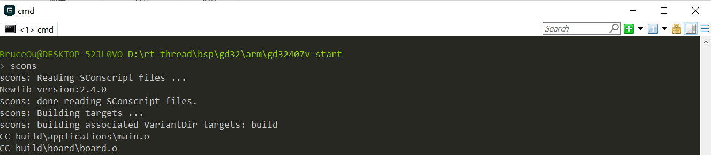

编译成功打印信息如下：

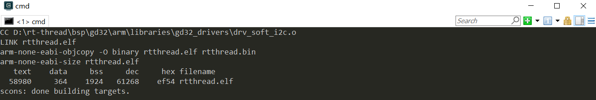

**9.使用env生成MDK工程**
在env中执行：scons --target=mdk5

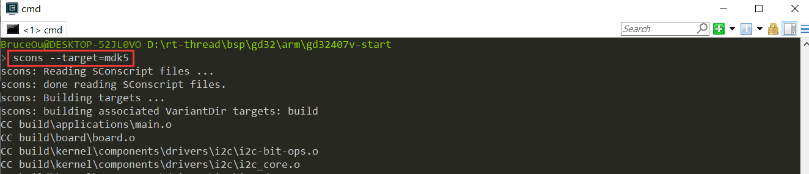

生成MDK工程后，打开MDK工程进行编译


成功编译打印信息如下：


### 3.3 使用GD-Link 下载调试GD32

前面使用ENV和MDK成功编译可BSP，那么接下来就是下载调试环节，下载需要下载器，而GD32部分开发板自带GD-link，可以用开发板上自带的GD-link调试仿真代码，不带的可外接GD-link模块，还是很方便的。具体操作方法如下。

1.第一次使用GD-link插入电脑后，会自动安装驱动。

在Options for Target -> Debug 中选择“CMSIS-DAP Debugger”，值得注意的是，只有Keil4.74以上的版本和Keil5才支持CMSIS-DAP Debugger选项。

 

2.在Options for Target -> Debug ->Settings勾选SWJ、 Port选择 SW。右框IDcode会出现”0xXBAXXXXX”。

 

3.在Options for Target -> Debug ->Settings -> Flash Download中添加GD32的flash算法。

 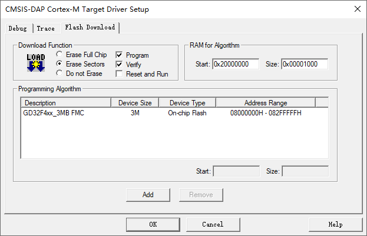

4.单击下图的快捷方式“debug”， 即可使用GD-Link进行仿真。

 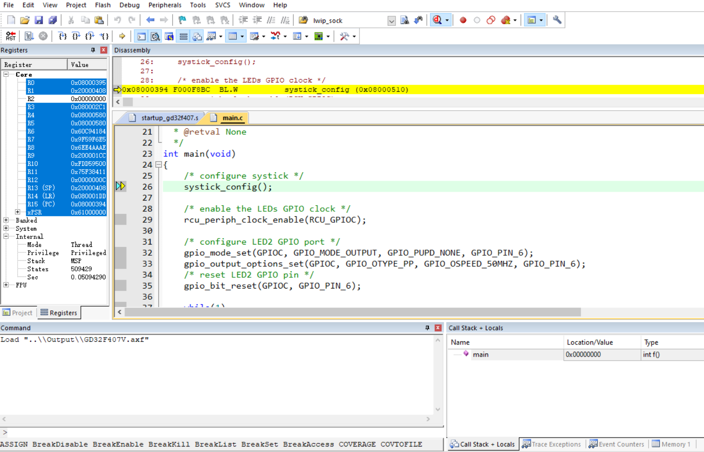

当然啦，也可使用GD-Link下载程序。

 

下载程序成功后，打印信息如下：

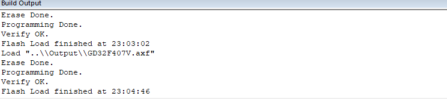

接上串口，打印信息如下：

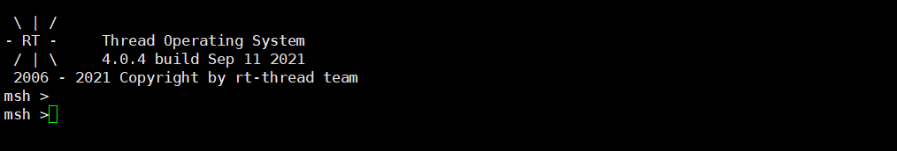

同时LED会不断闪烁。

### 3.4 RT-Thread studio开发

当然，该工程也可导出使用rt-thread studio开发。

先使用scons --dist导出工程。

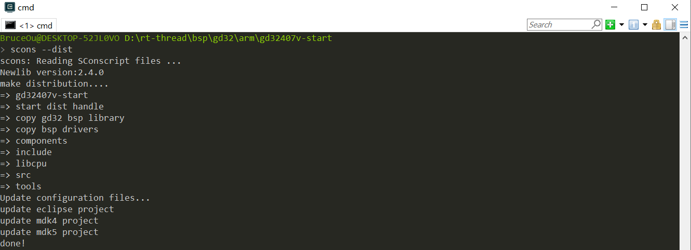

再将工程导入rt-thread studio中

 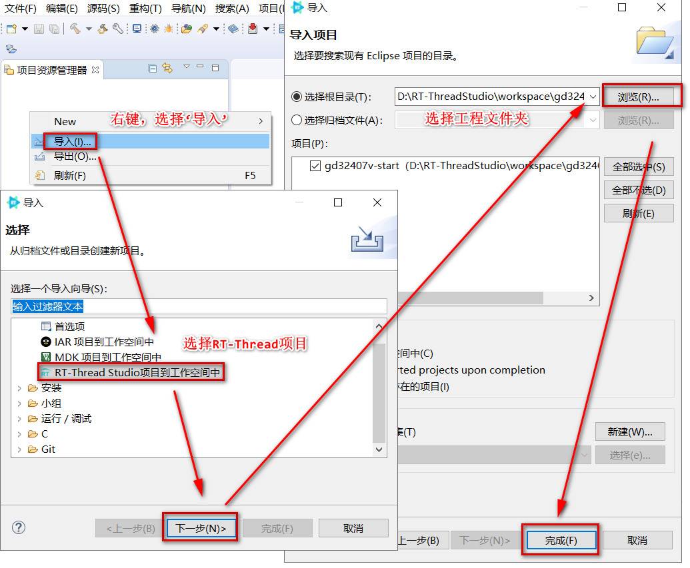

最后，就可在rt-thread studio就可进行开发工作了。

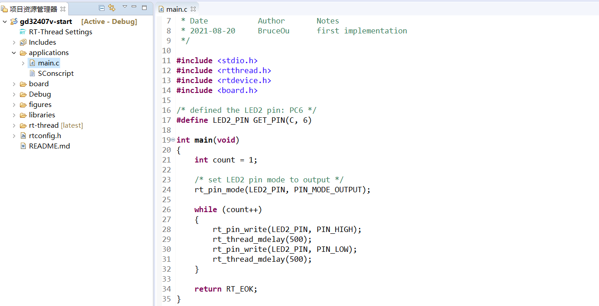

## 4. 规范

本章节介绍 RT-Thread GD32 系列 BSP 制作与提交时应当遵守的规范 。开发人员在 BSP 制作完成后，可以根据本规范提出的检查点对制作的 BSP 进行检查，确保 BSP 在提交前有较高的质量 。

### 4.1 BSP 制作规范

GD32 BSP 的制作规范主要分为 3 个方面：工程配置，ENV 配置和 IDE 配置。在已有的 GD32 系列 BSP 的模板中，已经根据下列规范对模板进行配置。在制作新 BSP 的过程中，拷贝模板进行修改时，需要注意的是不要修改这些默认的配置。BSP 制作完成后，需要对新制作的 BSP 进行功能测试，功能正常后再进行代码提交。

下面将详细介绍 BSP 的制作规范。

#### 4.1.1 工程配置

- 遵从RT-Thread 编码规范，代码注释风格统一
- main 函数功能保持一致
  - 如果有 LED 的话，main 函数里**只放一个**  LED 1HZ 闪烁的程序
- 在 `rt_hw_board_init` 中需要完成堆的初始化：调用 `rt_system_heap_init`
- 默认只初始化 GPIO 驱动和 FinSH 对应的串口驱动，不使用 DMA
- 当使能板载外设驱动时，应做到不需要修改代码就能编译下载使用
- 提交前应检查 GCC/MDK/IAR 三种编译器直接编译或者重新生成后编译是否成功
- 使用 `dist` 命令对 BSP 进行发布，检查使用 `dist` 命令生成的工程是否可以正常使用

#### 4.1.2 ENV 配置

- 系统心跳统一设置为 1000（宏：RT_TICK_PER_SECOND）
- BSP 中需要打开调试选项中的断言（宏：RT_USING_DEBUG）
- 系统空闲线程栈大小统一设置为 256（宏：IDLE_THREAD_STACK_SIZE）
- 开启组件自动初始化（宏：RT_USING_COMPONENTS_INIT）
- 需要开启 user main 选项（宏：RT_USING_USER_MAIN）
- 默认关闭 libc（宏：RT_USING_LIBC）
- FinSH 默认只使用 MSH 模式（宏：FINSH_USING_MSH_ONLY）

#### 4.1.3 IDE 配置

- 使能下载代码后自动运行
- 使能 C99 支持
- 使能 One ELF Section per Function（MDK）
- MDK/IAR 生成的临时文件分别放到build下的 MDK/IAR 文件夹下
- MDK/GCC/IAR 生成 bin 文件名字统一成 rtthread.bin

### 4.2 BSP 提交规范

- 提交前请认真修改 BSP 的 README.md 文件，README.md 文件的外设支持表单只填写 BSP 支持的外设，可参考其他 BSP 填写。查看文档[《GD32 ARM系列驱动介绍》](./GD32 ARM系列驱动介绍.md)了解驱动分类。
- 提交 BSP 分为 2 个阶段提交：
  - 第一阶段：基础 BSP 包括串口驱动和 GPIO 驱动，能运行 FinSH 控制台。完成 MDK4、MDK5 、IAR 和 GCC 编译器支持，如果芯片不支持某款编译器（比如MDK4）可以不用做。 BSP 的 README.md 文件需要填写第二阶段要完成的驱动。
  - 第二阶段：完成板载外设驱动支持，所有板载外设使用 menuconfig 配置后就能直接使用。若开发板没有板载外设，则此阶段可以不用完成。不同的驱动要分开提交，方便 review 和合并。
- 只提交 BSP 必要的文件，删除无关的中间文件，能够提交的文件请对照其他 BSP。
- 提交 GD32 不同系列的 Library 库时，请参考 f1/f4 系列的 HAL 库，删除多余库文件
- 提交前要对 BSP 进行编译测试，确保在不同编译器下编译正常
- 提交前要对 BSP 进行功能测试，确保 BSP 的在提交前符合工程配置章节中的要求