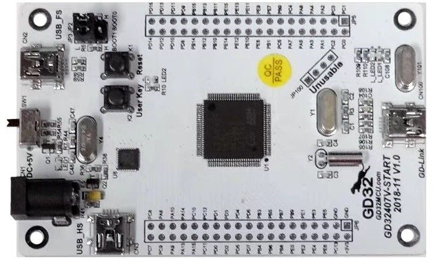
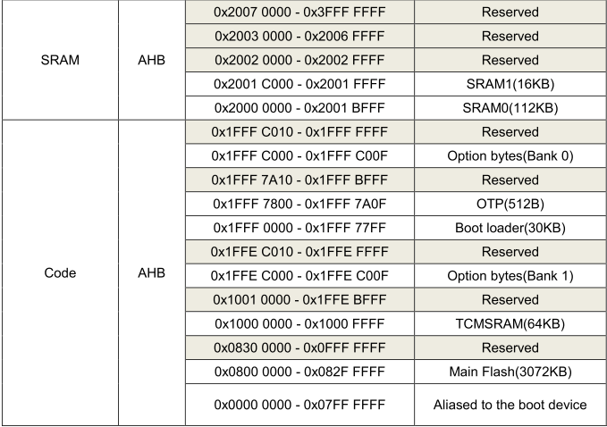

# GD32405RG BSP说明

## 简介

GD32405RG是-兆易创新推出的一款GD32F4XX系列的MCU，最高主频高达168M。参考GD32F407V-START开发板BSP

开发板外观如下图所示(仅芯片，没有开发板图片，下图为GD32407V-START开发板)：



该开发板常用 **板载资源** 如下：

- GD32405RGT6，主频 168MHz(最高200MHz)，1024KB FLASH ，128KB RAM + 64KB TCMRAM (其他F4 BSP的RAM存在问题，实际的RAM布局应该像我这样)
  

- 常用接口：USB 接口

- 调试接口：DAP-LINK

## 外设支持

本 BSP 目前对外设的支持情况如下：

| **片上外设** | **支持情况** | **备注**                        |
| :----------- | :----------: | :------------------------------ |
| GPIO         |     支持     | PA0, PA1... ---> PIN: 0, 1...81 |
| UART         |     支持     | UART0 - UART5                   |
| I2C          |     支持     | I2C1                            |
| SPI          |     支持     | SPI0 -  SPI2                    |
| SPI FLASH    |     支持     |                                 |
| ADC          |     支持     | ADC0 - ADC2                     |
| **扩展模块** | **支持情况** | **备注**                        |
| 暂无         |   暂不支持   | 暂不支持                        |

## 使用说明

使用说明分为如下两个章节：

- 快速上手
  
  本章节是为刚接触 RT-Thread 的新手准备的使用说明，遵循简单的步骤即可将 RT-Thread 操作系统运行在该开发板上，看到实验效果 。

- 进阶使用
  
  本章节是为需要在 RT-Thread 操作系统上使用更多开发板资源的开发者准备的。通过使用 ENV 工具对 BSP 进行配置，可以开启更多板载资源，实现更多高级功能。

### 快速上手

本 BSP 为开发者提供 MDK5 工程，并且支持 GCC 开发环境，也可使用RT-Thread Studio开发，IAR/MDK4未做修改，如果您使用IAR/MDK4需要做一些简单修改。下面以 MDK5 开发环境为例，介绍如何将系统运行起来。

#### 硬件连接

使用数据线连接开发板到 PC，使用USB转TTL模块连接PA2(MCU TX)和PA3(MCU RX)，打开电源开关。

#### 编译下载

双击 project.uvprojx 文件，打开 MDK5 工程，编译并下载程序到开发板。

> 工程默认配置使用 DAP-Link  仿真器下载程序，在通过 DAP-Link  连接开发板的基础上，点击下载按钮即可下载程序到开发板

#### 运行结果

下载程序成功之后，系统会自动运行，LED 闪烁。

连接开发板对应串口到 PC , 在终端工具里打开相应的串口（115200-8-1-N），复位设备后，可以看到 RT-Thread 的输出信息:

```bash
 \ | /
- RT -     Thread Operating System
 / | \     4.0.4 build Jan  9 2021
 2006 - 2021 Copyright by rt-thread team
msh >
```

### 进阶使用

此 BSP 默认只开启了 GPIO 和 串口0的功能，如果需使用高级功能，需要利用 ENV 工具对BSP 进行配置，步骤如下：

1. 在 bsp 下打开 env 工具。

2. 输入`menuconfig`命令配置工程，配置好之后保存退出。

3. 输入`pkgs --update`命令更新软件包。

4. 输入`scons --target=mdk5` 命令重新生成工程，或者使用Scons构建

## 注意事项

1. 该BSP使用的外部高速时钟为8MHz，PLL倍频到200MHz，请根据实际情况进行时钟配置。
   board/SConscript中，请根据实际情况修改HXTAL_VALUE：
   ```python
     CPPDEFINES = ['GD32F405', 'HXTAL_VALUE=8000000U']
   ```
   board/board.c中，根据实际情况修改`system_clock_8M_200M`实现：
   ```c
     void rt_hw_board_init()
     {
        /* config system clock HSE 8M to 200M */
        system_clock_8M_200M();

   ```

## 联系人信息

维护人:

- [ShiHongchao](https://gitee.com/shi-hongchao), 邮箱：<hongchao.shi@foxmail.com> 或者 <shi.hc@outlook.com>
