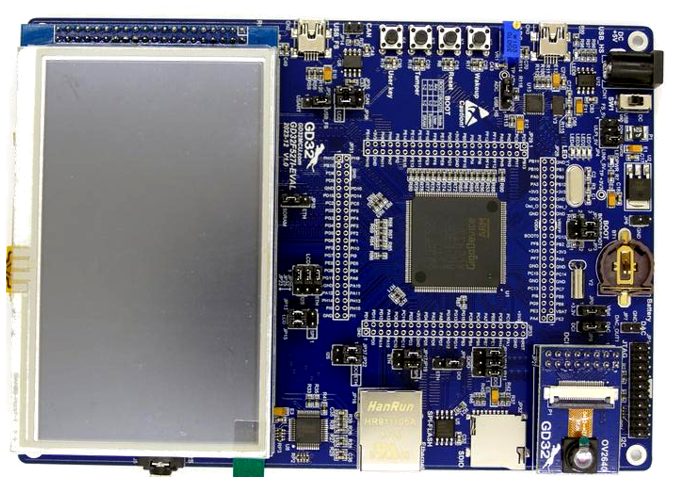

# GDF527I-EVAL开发板BSP说明




## 一 外设支持

本 BSP 目前对外设的支持情况如下：

| **片上外设** | **支持情况** | **备注**                           |
|:-------- |:--------:|:-------------------------------- |
| GPIO     | 支持       | PA0, PA1... ---> PIN: 0, 1...113 |
| UART     | 支持       | UART0 - UART7                    |
| **扩展模块** | **支持情况** | **备注**                           |
| 暂无       | 暂不支持     | 暂不支持                             |

## 二 使用说明

使用说明分为如下两个章节：

- 快速上手
  
  本章节是为刚接触 RT-Thread 的新手准备的使用说明，遵循简单的步骤即可将 RT-Thread 操作系统运行在该开发板上，看到实验效果 。

- 进阶使用
  
  本章节是为需要在 RT-Thread 操作系统上使用更多开发板资源的开发者准备的。通过使用 ENV 工具对 BSP 进行配置，可以开启更多板载资源，实现更多高级功能。

### 三 快速上手

本 BSP 为开发者提供 MDK5工程，支持 GCC 开发环境，也可使用RT-Thread Studio开发。下面以 MDK5 开发环境为例，介绍如何将系统运行起来。

### 3.1 硬件连接

使用调试器连接开发板到 PC，使用USB2TTL连接USART0，并给开发板供电。

### 3.2 编译下载

双击 **project.uvprojx** 文件，打开 MDK5 工程，编译并下载程序到开发板。

> 工程默认配置使用 CMSIS-DAP 仿真器下载程序，在通过 CMSIS-DAP  连接开发板的基础上，点击下载按钮即可下载程序到开发板;
>
> EVAL板载DAP-Link，可直接使用板子DAP-Link下载.

### 3.3 运行结果

下载程序成功之后，系统会自动运行，LED 闪烁。

连接开发板对应串口到 PC , 在终端工具里打开相应的串口（115200-8-1-N），复位设备后，可以看到 RT-Thread 的输出信息:

```apl
 \ | /
- RT -     Thread Operating System
 / | \     5.2.1 build Jul  3 2025 11:53:15
 2006 - 2024 Copyright by RT-Thread team
msh />
```

### 3.4 进阶使用

此 BSP 默认只开启了 GPIO 和 串口1的功能，如果需使用高级功能，需要利用 ENV 工具对BSP 进行配置，步骤如下：

1. 在 bsp 下打开 env 工具。

2. 输入`menuconfig`命令配置工程，配置好之后保存退出。

3. 输入`pkgs --update`命令更新软件包。

4. 输入`scons --target=mdk4/mdk5/iar` 命令重新生成工程。

## 3.5 注意事项

若MDK编译无法运行请更行MDK至较新的版本，在MDK538版本测试通过。

## 四 联系人信息

维护人:

- [yuanzihao](https://github.com/zihao-yuan/), 邮箱：<y@yzh.email>
- [Guozhanxin](https://github.com/Guozhanxin)
