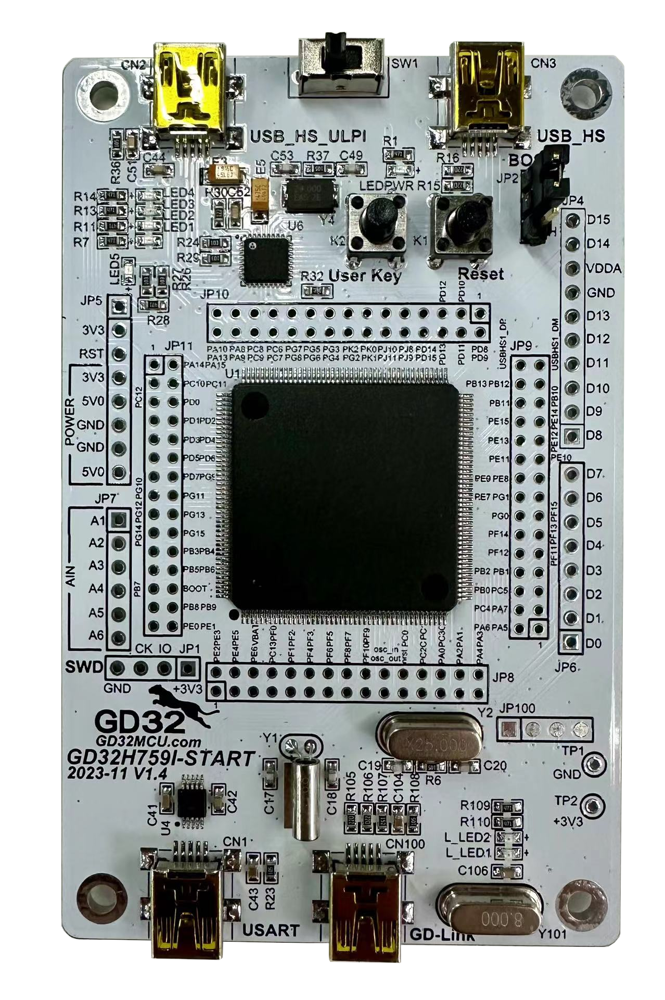

# GD32H759I-START 开发板 BSP 说明

## 简介

GDH759I-START 是-兆易创新推出的一款 GD32H7 系列的评估板，最高主频高达 600M，该开发板具有丰富的板载资源，可以充分发挥 GD32H759IM 的芯片性能。

开发板外观如下图所示：



该开发板常用 **板载资源** 如下：

- GD32H759IMT6，主频 600MHz，CPU 内核：ARM Cortex-M7，3840KB FLASH ，1024KB RAM 
- 常用外设
  
  - 用户LED ：4个，LED1 (PC9），LED2（PC10），LED3（PC11），LED4（PC12）
  - 电源指示灯：一个红色LED
  - 按键：2个，User Key（PD15），Reset(NRST)
- 调试接口：GD-LINK

## 外设支持

本 BSP 目前对外设的支持情况如下：

| **片上外设** | **支持情况** | **备注**                           |
|:-------- |:--------:|:-------------------------------- |
| GPIO     | 支持       | PA0, PA1... ---> PIN: 0, 1...121 |
| UART     | 支持       | UART0 - UART3                    |
| **扩展模块** | **支持情况** | **备注**                           |
| 暂无       | 暂不支持     | 暂不支持                             |

## 使用说明

使用说明分为如下两个章节：

- 快速上手
  
  本章节是为刚接触 RT-Thread 的新手准备的使用说明，遵循简单的步骤即可将 RT-Thread 操作系统运行在该开发板上，看到实验效果 。

- 进阶使用
  
  本章节是为需要在 RT-Thread 操作系统上使用更多开发板资源的开发者准备的。通过使用 ENV 工具对 BSP 进行配置，可以开启更多板载资源，实现更多高级功能。

### 快速上手

本 BSP 为开发者提供 MDK5工程，支持 GCC 开发环境，也可使用RT-Thread Studio开发。下面以 MDK5 开发环境为例，介绍如何将系统运行起来。

#### 硬件连接

使用数据线连接开发板 GD-LINK USB 口到 PC，使用另一数据线连接开发板 USART(0) USB 口到 PC，并给开发板供电。

#### 编译下载

双击 project.uvprojx 文件，打开 MDK5 工程，编译并下载程序到开发板。

> 工程默认配置使用 GD-Link 仿真器下载程序，在通过 GD-Link 连接开发板的基础上，点击下载按钮即可下载程序到开发板

#### 运行结果

下载程序成功之后，系统会自动运行，LED 闪烁。

连接开发板对应串口到 PC , 在终端工具里打开相应的串口（115200-8-1-N），复位设备后，可以看到 RT-Thread 的输出信息:

```bash
 \ | /
- RT -     Thread Operating System
 / | \     5.0.0 build Mar  3 2023 00:43:44
 2006 - 2022 Copyright by RT-Thread team
msh />
```

### 进阶使用

此 BSP 默认只开启了 GPIO 和 串口1的功能，如果需使用高级功能，需要利用 ENV 工具对BSP 进行配置，步骤如下：

1. 在 bsp 下打开 env 工具。

2. 输入`menuconfig`命令配置工程，配置好之后保存退出。

3. 输入`pkgs --update`命令更新软件包。

4. 输入`scons --target=mdk4/mdk5/iar` 命令重新生成工程。

## 注意事项

暂无

## 联系人信息

维护人:

- [Astrozen](https://github.com/wirano), 邮箱：<git@wirano.me>
