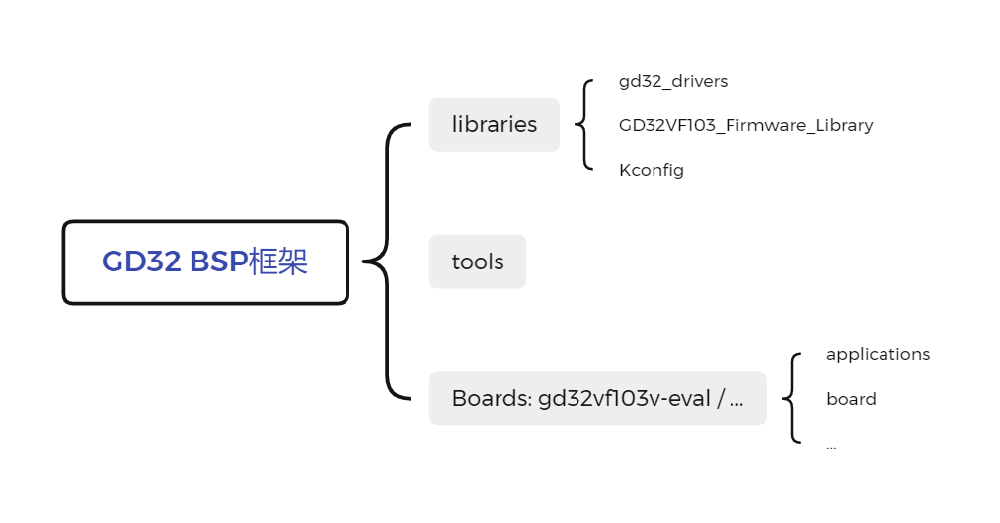
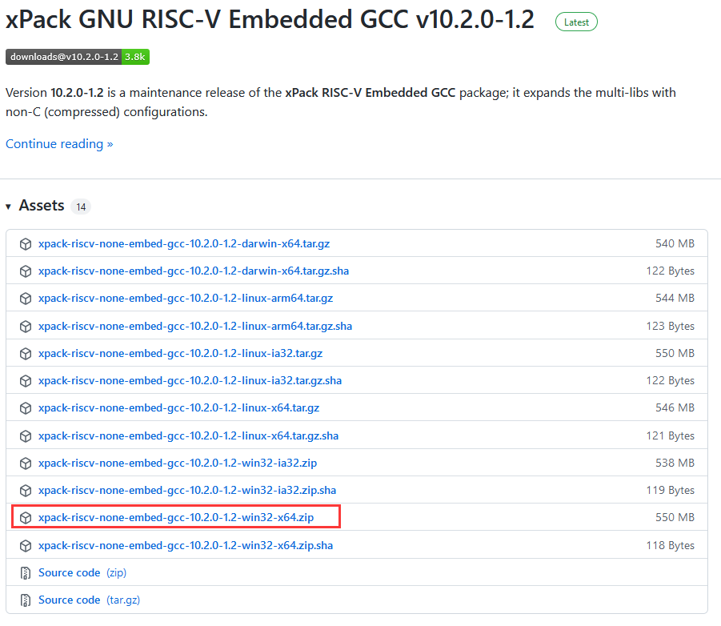
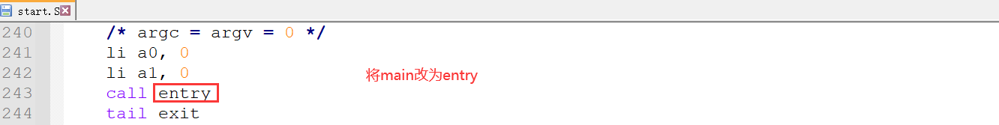
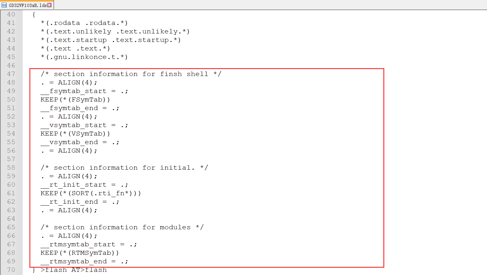
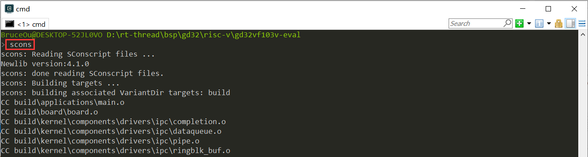
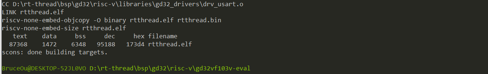
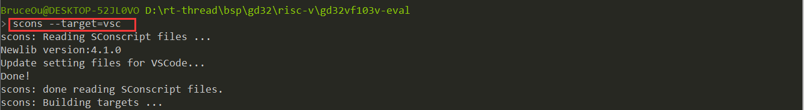
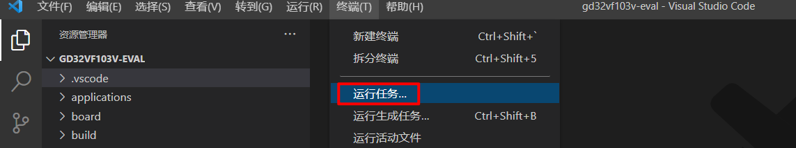
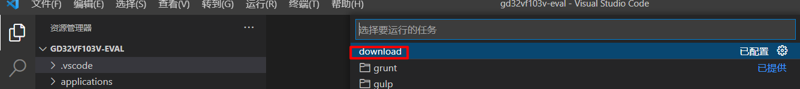
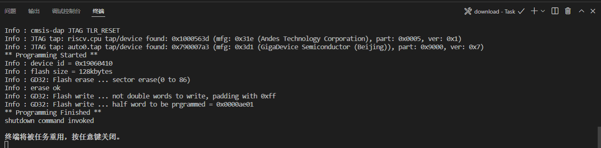

# GD32  RISC-V系列 BSP 制作教程

## 1. BSP 框架介绍

BSP 框架结构如下图所示：



GD32的BSP架构主要分为三个部分：libraries、tools和具体的Boards，其中libraries包含了GD32的通用库，包括每个系列的Firmware Library以及适配RT-Thread的drivers；tools是生成工程的Python脚本工具；另外就是Boards文件，当然这里的Boards有很多，我这里值列举了GD32VF103V_EVAL。

## 2. 知识准备

制作一个 BSP 的过程就是构建一个新系统的过程，因此想要制作出好用的 BSP，要对 RT-Thread 系统的构建过程有一定了解，需要的知识准备如下所示：

- 掌握  GD32  RISC-V系列 BSP 的使用方法
  
  了解 BSP 的使用方法，可以阅读 [BSP 说明文档](../README.md) 中使用教程表格内的文档。

- 了解 RISC-V系列MCU的基本架构与特征
  
- 了解 Scons 工程构建方法
  
  RT-Thread 使用 Scons 作为系统的构建工具，因此了解 Scons 的常用命令对制作新 BSP 是基本要求。

- 了解设备驱动框架
  
  在 RT-Thread 系统中，应用程序通过设备驱动框架来操作硬件，因此了解设备驱动框架，对添加 BSP 驱动是很重要的。

- 了解 Kconfig 语法
  
  RT-Thread 系统通过 menuconfig 的方式进行配置，而 menuconfig 中的选项是由 Kconfig 文件决定的，因此想要对 RT-Thread 系统进行配置，需要对 kconfig 语法有一定了解。

## 3. BSP移植

### 3.1 GCC环境准备

RISC-V系列MCU使用的工具链是xPack GNU RISC-V Embedded GCC。

在配置交叉编译工具链之前，需要下载得到GCC工具链的安装包，然后解压即可，也可配置环境变量。

[GCC工具链下载地址](https://github.com/xpack-dev-tools/riscv-none-embed-gcc-xpack/releases/)



根据自己的主机选择相应的版本，下载完成解压即可。


### 3.2 BSP工程制作

**1.构建基础工程**
首先看看RT-Thread代码仓库中已有很多BSP，而我要移植的是RISC-V内核。这里参考GD32 ARM工程。最终目录如下：
```
risc-v
docs # 说明文档
gd32vf103v-eval # 具体BSP
libraries # 库文件
  gd32_drivers
  GD32VF103_Firmware_Library # GD官方固件库
tools
  OpenOCD # OpenOCD 下载调试工具
README.md
```
**2.修改BSP构建脚本**
bsp/gd32/risc-v/gd32vf103v-eval/SConstruct修改后的内容如下：
```python
import os
import sys
import rtconfig

if os.getenv('RTT_ROOT'):
    RTT_ROOT = os.getenv('RTT_ROOT')
else:
    RTT_ROOT = os.path.normpath(os.getcwd() + '/../../../..')

sys.path = sys.path + [os.path.join(RTT_ROOT, 'tools')]
try:
    from building import *
except:
    print('Cannot found RT-Thread root directory, please check RTT_ROOT')
    print(RTT_ROOT)
    exit(-1)

TARGET = 'rtthread.' + rtconfig.TARGET_EXT

DefaultEnvironment(tools=[])
env = Environment(tools = ['mingw'],
    AS = rtconfig.AS, ASFLAGS = rtconfig.AFLAGS,
    CC = rtconfig.CC, CCFLAGS = rtconfig.CFLAGS,
    AR = rtconfig.AR, ARFLAGS = '-rc',
    CXX = rtconfig.CXX, CXXFLAGS = rtconfig.CXXFLAGS,
    LINK = rtconfig.LINK, LINKFLAGS = rtconfig.LFLAGS)
env.PrependENVPath('PATH', rtconfig.EXEC_PATH)
env['ASCOM'] = env['ASPPCOM']

Export('RTT_ROOT')
Export('rtconfig')

SDK_ROOT = os.path.abspath('./')

if os.path.exists(SDK_ROOT + '/libraries'):
    libraries_path_prefix = SDK_ROOT + '/libraries'
else:
    libraries_path_prefix = os.path.dirname(SDK_ROOT) + '/libraries'

SDK_LIB = libraries_path_prefix
Export('SDK_LIB')

# prepare building environment
# objs = PrepareBuilding(env, RTT_ROOT, has_libcpu=False)
objs = PrepareBuilding(env, RTT_ROOT)

gd32_library = 'GD32VF103_Firmware_Library'
rtconfig.BSP_LIBRARY_TYPE = gd32_library

# include libraries
objs.extend(SConscript(os.path.join(libraries_path_prefix, gd32_library, 'SConscript')))

# include drivers
objs.extend(SConscript(os.path.join(libraries_path_prefix, 'gd32_drivers', 'SConscript')))

# make a building
DoBuilding(TARGET, objs)
```
该文件用于链接所有的依赖文件，并调用make进行编译。该文件主要修改固件库的路径。

bsp/gd32/risc-v/gd32vf103v-eval/rtconfig.py修改后的内容如下：
```python
import os

# toolchains options
ARCH='risc-v'
CPU='bumblebee'
CROSS_TOOL='gcc'

# bsp lib config
BSP_LIBRARY_TYPE = None

if os.getenv('RTT_CC'):
    CROSS_TOOL = os.getenv('RTT_CC')
if os.getenv('RTT_ROOT'):
    RTT_ROOT = os.getenv('RTT_ROOT')

# cross_tool provides the cross compiler
# EXEC_PATH is the compiler execute path, for example, CodeSourcery, Keil MDK, IAR
if  CROSS_TOOL == 'gcc':
    PLATFORM    = 'gcc'
    EXEC_PATH   = EXEC_PATH   = r'D:/gcc/xpack-riscv-none-embed-gcc-10.2.0-1.2/bin'
else:
    print('Please make sure your toolchains is GNU GCC!')
    exit(0)

if os.getenv('RTT_EXEC_PATH'):
    EXEC_PATH = os.getenv('RTT_EXEC_PATH')

CORE = 'risc-v'
BUILD = 'debug'
MAP_FILE = 'rtthread.map'
LINK_FILE = '../libraries/GD32VF103_Firmware_Library/RISCV/env_Eclipse/GD32VF103xB.lds'

if PLATFORM == 'gcc':
    # toolchains
    PREFIX = 'riscv-none-embed-'
    CC = PREFIX + 'gcc'
    AS = PREFIX + 'gcc'
    AR = PREFIX + 'ar'
    CXX = PREFIX + 'g++'
    LINK = PREFIX + 'gcc'
    TARGET_EXT = 'elf'
    SIZE = PREFIX + 'size'
    OBJDUMP = PREFIX + 'objdump'
    OBJCPY = PREFIX + 'objcopy'

    DEVICE = ' -march=rv32imac -mabi=ilp32 -DUSE_PLIC -DUSE_M_TIME -DNO_INIT -mcmodel=medany -msmall-data-limit=8 -L.  -nostartfiles  -lc '
    CFLAGS = DEVICE
    CFLAGS += ' -save-temps=obj'
    AFLAGS = '-c'+ DEVICE + ' -x assembler-with-cpp'
    AFLAGS += ' -Iplatform -Ilibraries/RISCV/include -Ilibraries/RISCV/env_Eclipse'
    LFLAGS = DEVICE
    LFLAGS += ' -Wl,--gc-sections,-cref,-Map=' + MAP_FILE
    LFLAGS += ' -T ' + LINK_FILE
    LFLAGS += ' -Wl,-wrap=memset'
    
    CPATH = ''
    LPATH = ''
    
    if BUILD == 'debug':
        CFLAGS += ' -O0 -g3'
        AFLAGS += ' -g3'
    else:
        CFLAGS += ' -O2'
    
    CXXFLAGS = CFLAGS 
    
    POST_ACTION = OBJCPY + ' -O binary $TARGET rtthread.bin\n' + SIZE + ' $TARGET \n'

def dist_handle(BSP_ROOT, dist_dir):
    import sys
    cwd_path = os.getcwd()
    sys.path.append(os.path.join(os.path.dirname(BSP_ROOT), 'tools'))
    from sdk_dist import dist_do_building
dist_do_building(BSP_ROOT, dist_dir)
```
该文件编译参数，主要关注链接脚本和交叉编译工具链，工具链的地址需要根据实际的地址修改，gd32vf103v-eval开发板使用的芯片是GD32VF103VB，因此其链接脚本是GD32VF103xB.lds。

**3.修改board文件夹**
(1) 修改bsp/gd32/risc-v/gd32vf103v-eval/board/Kconfig文件

修改后内容如下：
```
menu "Hardware Drivers Config"

config SOC_SERIES_GD32VF103V
    bool
    default y

config SOC_GD32VF103V
    bool
    select SOC_SERIES_GD32VF103V
    select RT_USING_COMPONENTS_INIT
    select RT_USING_USER_MAIN
    default y

menu "Onboard Peripheral Drivers"

endmenu

menu "On-chip Peripheral Drivers"

    config BSP_USING_GPIO
        bool "Enable GPIO"
        select RT_USING_PIN
        default y
    
    menuconfig BSP_USING_UART
        bool "Enable UART"
        default y
        select RT_USING_SERIAL
        if BSP_USING_UART
            config BSP_USING_UART0
                bool "Enable UART0"
                default y
    
            config BSP_UART0_RX_USING_DMA
                bool "Enable UART0 RX DMA"
                depends on BSP_USING_UART0 
                select RT_SERIAL_USING_DMA
                default n
    
            config BSP_USING_UART1
                bool "Enable UART1"
                default n
    
            config BSP_UART1_RX_USING_DMA
                bool "Enable UART1 RX DMA"
                depends on BSP_USING_UART1 
                select RT_SERIAL_USING_DMA
                default n
    
            config BSP_USING_UART2
                bool "Enable UART2"
                default n
    
            config BSP_UART2_RX_USING_DMA
                bool "Enable UART2 RX DMA"
                depends on BSP_USING_UART2 
                select RT_SERIAL_USING_DMA
                default n
    
            config BSP_USING_UART3
                bool "Enable UART3"
                default n
    
            config BSP_UART3_RX_USING_DMA
                bool "Enable UART3 RX DMA"
                depends on BSP_USING_UART3 
                select RT_SERIAL_USING_DMA
                default n
    
            config BSP_USING_UART4
                bool "Enable UART4"
                default n
    
            config BSP_UART4_RX_USING_DMA
                bool "Enable UART4 RX DMA"
                depends on BSP_USING_UART4 
                select RT_SERIAL_USING_DMA
                default n
        endif
    
    menuconfig BSP_USING_SPI
        bool "Enable SPI BUS"
        default n
        select RT_USING_SPI
        if BSP_USING_SPI
            config BSP_USING_SPI1
                bool "Enable SPI1 BUS"
                default n
    
            config BSP_SPI1_TX_USING_DMA
                bool "Enable SPI1 TX DMA"
                depends on BSP_USING_SPI1
                default n
                
            config BSP_SPI1_RX_USING_DMA
                bool "Enable SPI1 RX DMA"
                depends on BSP_USING_SPI1
                select BSP_SPI1_TX_USING_DMA
                default n
        endif
    
    menuconfig BSP_USING_I2C1
        bool "Enable I2C1 BUS (software simulation)"
        default n
        select RT_USING_I2C
        select RT_USING_I2C_BITOPS
        select RT_USING_PIN
        if BSP_USING_I2C1
            config BSP_I2C1_SCL_PIN
                int "i2c1 scl pin number"
                range 1 216
                default 24
            config BSP_I2C1_SDA_PIN
                int "I2C1 sda pin number"
                range 1 216
                default 25
        endif
    
    menuconfig BSP_USING_ADC
        bool "Enable ADC"
        default n
        select RT_USING_ADC
        if BSP_USING_ADC
            config BSP_USING_ADC0
                bool "Enable ADC0"
                default n
    
            config BSP_USING_ADC1
                bool "Enable ADC1"
                default n
    
            config BSP_USING_ADC2
                bool "Enable ADC2"
                default n
        endif
    
    menuconfig BSP_USING_TIM
        bool "Enable timer"
        default n
        select RT_USING_HWTIMER
        if BSP_USING_TIM
            config BSP_USING_TIM10
                bool "Enable TIM10"
                default n
    
            config BSP_USING_TIM11
                bool "Enable TIM11"
                default n
    
            config BSP_USING_TIM12
                bool "Enable TIM13"
                default n
        endif
    
    menuconfig BSP_USING_ONCHIP_RTC
        bool "Enable RTC"
        select RT_USING_RTC
        default n
        if BSP_USING_ONCHIP_RTC
            choice
                prompt "Select clock source"
                default BSP_RTC_USING_LSE
    
                config BSP_RTC_USING_LSE
                    bool "RTC USING LSE"
    
                config BSP_RTC_USING_LSI
                    bool "RTC USING LSI"
            endchoice
        endif
    
    config BSP_USING_WDT
        bool "Enable Watchdog Timer"
        select RT_USING_WDT
        default n
    
    source "../libraries/gd32_drivers/Kconfig"

endmenu

menu "Board extended module Drivers"

endmenu

endmenu
```
这个文件就是配置板子驱动的，这里可根据实际需求添加。

(2) 修改bsp/gd32/risc-v/gd32vf103v-eval/board/SConscript文件
修改后内容如下：
```python
import os
import rtconfig
from building import *

Import('SDK_LIB')

cwd = GetCurrentDir()

# add general drivers
src = Split('''
board.c
''')

path =  [cwd]

startup_path_prefix = SDK_LIB

if rtconfig.PLATFORM in ['gcc']:
    src += [startup_path_prefix + '/GD32VF103_Firmware_Library/RISCV/env_Eclipse/start.S']
    src += [startup_path_prefix + '/GD32VF103_Firmware_Library/RISCV/env_Eclipse/entry.S']

CPPDEFINES = ['GD32VF103V_EVAL']
group = DefineGroup('Drivers', src, depend = [''], CPPPATH = path, CPPDEFINES = CPPDEFINES)


Return('group')
```
该文件主要添加board文件夹的.c文件和头文件路径。另外根据开发环境选择相应的汇编文件，和前面的libraries的SConscript语法是一样，文件的结构都是类似的，这里就没有注释了。

到这里，基本所有的依赖脚本都配置完成了。

**4.固件库修改**
(1) 修改bsp/gd32/risc-v/libraries/GD32VF103_Firmware_Library/RISCV/env_Eclipse/start.S
GCC 环境下的启动是由 entry() 函数调用的启动函数 rt_thread_startup()，所以需要修改启动文的C语言入口。




(2) 修改bsp/gd32/risc-v/libraries/GD32VF103_Firmware_Library/RISCV/env_Eclipse/GD32VF103xB.lds
GD32VF103xB.lds文件需要新增RT-Thread堆栈的位置，否则无法正常运转，新增代码如下：
```
/* section information for finsh shell */
. = ALIGN(4);
__fsymtab_start = .;
KEEP(*(FSymTab))
__fsymtab_end = .;
. = ALIGN(4);
__vsymtab_start = .;
KEEP(*(VSymTab))
__vsymtab_end = .;
. = ALIGN(4);

/* section information for initial. */
. = ALIGN(4);
__rt_init_start = .;
KEEP(*(SORT(.rti_fn*)))
__rt_init_end = .;
. = ALIGN(4);

/* section information for modules */
. = ALIGN(4);
__rtmsymtab_start = .;
KEEP(*(RTMSymTab))
__rtmsymtab_end = .;
```



**5.驱动修改**
一个基本的BSP中，串口是必不可少的，所以还需要编写串口驱动，这里使用的串口0作为调试串口。

板子上还有LED灯，主要编写GPIO驱动即可。

关于串口和LED的驱动可以查看源码，这里就不贴出来了。

**6.应用开发**
笔者在applications的main.c中添加LED的应用代码，

```c
#include <stdio.h>
#include <rtthread.h>
#include <rtdevice.h>
#include <board.h>

/* defined the LED1 pin: PC0 */
#define LED1_PIN GET_PIN(C, 0)

int main(void)
{
    int count = 1;

    /* set LED1 pin mode to output */
    rt_pin_mode(LED1_PIN, PIN_MODE_OUTPUT);
    
    while (count++)
    {
        rt_pin_write(LED1_PIN, PIN_HIGH);
        rt_thread_mdelay(500);
        rt_pin_write(LED1_PIN, PIN_LOW);
        rt_thread_mdelay(500);
    }
    
    return RT_EOK;
}
```

当然，这需要GPIO驱动的支持。

**7.使用ENV编译工程**
在env中执行：scons 



编译成功打印信息如下：

 

**8.使用VS Code开发GD32**
在env中执行：scons --target=vsc



这样就可方便使用VSCode开发GD32了，当然，这里只是生成了c_cpp_properties.json，要想使用VS Code下载代码还需要更多的配置，下一节讲解。

### 3.3固件下载
前面使用ENV成功编译GD32VF103V-SEVAL的固件，那么接下来就是下载环节，下载方式很多，笔者这里讲解使用OpenOCD工具下载。

OpenOCD是用于对RISC-V进行下载仿真的软件工具，是一个开源软件包。当然啦，要想使用OpenOCD下载固件，需要GD-Link或者J-Link的支持。OpenOCD软件包已经放在bsp/gd32/risc-v/tools，只需要简单配置就可以，笔者这里使用VS Code开发。

**1.新建bsp/gd32/risc-v/gd32vf103v-eval/.vscode/tasks.json**

tasks.json的作用就是配置工程的编译、下载等工作。如果没有则需要创建tasks.json文件，内容如下：
```json
{
    "version": "2.0.0",
    "tasks": [
        {
            "label": "download",
            "type": "shell",
            "command": "../tools/OpenOCD/bin/openocd.exe",
            "args": [
                "-f",
                "../tools/interface/openocd_gdlink_riscv.cfg",
                "-c",
                "program rtthread.elf exit"
            ] 
        }
    ]
}
```
这个文件创建了一个任务，任务名为download，用于在线下载固件。
选择“终端->运行任务…”



选择task中配置的命令download。



稍等片刻，即可下载成功。




固件下载成后，接上串口0，打印信息如下：


同时LED会不断闪烁。


## 4. 规范

本章节介绍 RT-Thread GD32 系列 BSP 制作与提交时应当遵守的规范 。开发人员在 BSP 制作完成后，可以根据本规范提出的检查点对制作的 BSP 进行检查，确保 BSP 在提交前有较高的质量 。

### 4.1 BSP 制作规范

GD32 BSP 的制作规范主要分为 3 个方面：工程配置，ENV 配置和 IDE 配置。在已有的 GD32 系列 BSP 的模板中，已经根据下列规范对模板进行配置。在制作新 BSP 的过程中，拷贝模板进行修改时，需要注意的是不要修改这些默认的配置。BSP 制作完成后，需要对新制作的 BSP 进行功能测试，功能正常后再进行代码提交。

下面将详细介绍 BSP 的制作规范。

#### 4.1.1 工程配置

- 遵从RT-Thread 编码规范，代码注释风格统一
- main 函数功能保持一致
  - 如果有 LED 的话，main 函数里**只放一个**  LED 1HZ 闪烁的程序
- 在 `rt_hw_board_init` 中需要完成堆的初始化：调用 `rt_system_heap_init`
- 默认只初始化 GPIO 驱动和 FinSH 对应的串口驱动，不使用 DMA
- 当使能板载外设驱动时，应做到不需要修改代码就能编译下载使用
- 提交前应检查 GCC/IAR 编译器直接编译或者重新生成后编译是否成功
- 使用 `dist` 命令对 BSP 进行发布，检查使用 `dist` 命令生成的工程是否可以正常使用

#### 4.1.2 ENV 配置

- 系统心跳统一设置为 1000（宏：RT_TICK_PER_SECOND）
- BSP 中需要打开调试选项中的断言（宏：RT_USING_DEBUG）
- 系统空闲线程栈大小统一设置为 256（宏：IDLE_THREAD_STACK_SIZE）
- 开启组件自动初始化（宏：RT_USING_COMPONENTS_INIT）
- 需要开启 user main 选项（宏：RT_USING_USER_MAIN）
- 默认关闭 libc（宏：RT_USING_LIBC）
- FinSH 默认只使用 MSH 模式（宏：FINSH_USING_MSH_ONLY）

### 4.2 BSP 提交规范

- 提交前请认真修改 BSP 的 README.md 文件，README.md 文件的外设支持表单只填写 BSP 支持的外设，可参考其他 BSP 填写。查看文档[《GD32系列驱动介绍》](./GD32 RISC-V系列驱动介绍.md)了解驱动分类。
- 提交 BSP 分为 2 个阶段提交：
  - 第一阶段：基础 BSP 包括串口驱动和 GPIO 驱动，能运行 FinSH 控制台。完成IAR 和 GCC 编译器支持。 BSP 的 README.md 文件需要填写第二阶段要完成的驱动。
  - 第二阶段：完成板载外设驱动支持，所有板载外设使用 menuconfig 配置后就能直接使用。若开发板没有板载外设，则此阶段可以不用完成。不同的驱动要分开提交，方便 review 和合并。
- 只提交 BSP 必要的文件，删除无关的中间文件，能够提交的文件请对照其他 BSP。
- 提交前要对 BSP 进行编译测试，确保在不同编译器下编译正常
- 提交前要对 BSP 进行功能测试，确保 BSP 的在提交前符合工程配置章节中的要求