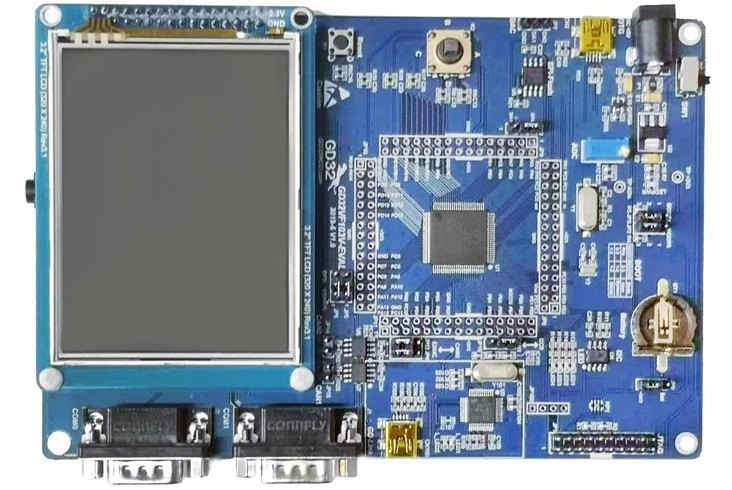

# GD32VF103V_EVAL开发板BSP说明

## 简介

GD32VF103V_EVAL是-兆易创新推出的一款GD32VF1系列的评估板，最高主频高达108M，该开发板具有丰富的板载资源，可以充分发挥 GD32VF103VB 的芯片性能。

开发板外观如下图所示：



该开发板常用 **板载资源** 如下：

- GD32VF103VBT6 ，主频 108MHz，128KB FLASH ，32KB RAM 
- 常用外设
  - LED ：4个，LED1（PC0），LED2（PC2），LED3（PE0），LED4（PE1）
  - 按键：2个，K1（复位按键），K2（用户五向按键，PA0, PC13, PB14, PC5, PC4)
  - General TM * 4 、Advanced TM * 1、Basic TM * 2
  - 系统定时器 * 1
  - 看门狗 * 2
  - RTC * 1
  - USART * 3、UART * 2
  - I2C * 2、I2S * 2
  - SPI * 3
  - CAN2.0B * 2
  - USB2.0 OTG FS * 1
  - TFT-LCD
  - EXMC/SDRAM * 1
  - ADC * 2
  - DAC * 2
  - 最多支持80GPIOs
- 调试接口：GD-Link/J-link

## 外设支持

本 BSP 目前对外设的支持情况如下：

| **片上外设**  | **支持情况** | **备注**                                |
|:--------- |:--------:|:------------------------------------- |
| GPIO      | 支持       | PA0, PA1... ---> PIN: 0, 1...79 |
| UART      | 支持       | UART0 - UART4                         |
| I2C       | 支持       | I2C1                                  |
| SPI       | 支持       | SPI0 - SPI2                           |
| ADC       | 支持       | ADC0 - ADC2                            |
| **扩展模块**  | **支持情况** | **备注**                                |
| 暂无        | 暂不支持     | 暂不支持                                  |

## 使用说明

使用说明分为如下两个章节：

- 快速上手
  
  本章节是为刚接触 RT-Thread 的新手准备的使用说明，遵循简单的步骤即可将 RT-Thread 操作系统运行在该开发板上，看到实验效果 。

- 进阶使用
  
  本章节是为需要在 RT-Thread 操作系统上使用更多开发板资源的开发者准备的。通过使用 ENV 工具对 BSP 进行配置，可以开启更多板载资源，实现更多高级功能。

### 快速上手

本 BSP 为开发者提供 GCC 工程。下面介绍如何将系统运行起来。

#### 硬件连接

使用数据线连接开发板到 PC，使用USB转232连接USART0，打开电源开关。

#### 编译下载

在工程目录下输入`scons `命令编译工程，使用J-link/GD-Link下载程序到开发板。

#### 运行结果

下载程序成功之后，系统会自动运行，LED 闪烁。

连接开发板对应串口到 PC , 在终端工具里打开相应的串口（115200-8-1-N），复位设备后，可以看到 RT-Thread 的输出信息:

```bash
 \ | /
- RT -     Thread Operating System
 / | \     4.1.1 build Jun  8 2022 00:49:01
 2006 - 2022 Copyright by RT-Thread team
msh >
```

### 进阶使用

此 BSP 默认只开启了 GPIO 和 串口0的功能，如果需使用高级功能，需要利用 ENV 工具对BSP 进行配置，步骤如下：

1. 在 bsp 下打开 env 工具。

2. 输入`menuconfig`命令配置工程，配置好之后保存退出。

3. 输入`pkgs --update`命令更新软件包。

4. 输入`scons `命令重新编译工程。

## 注意事项

暂无

## 联系人信息

维护人:

- [BruceOu](https://github.com/Ouxiaolong/), 邮箱：<ouxiaolong@bruceou.cn>