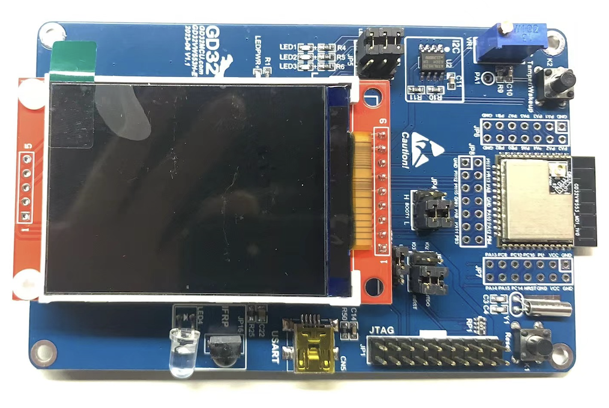
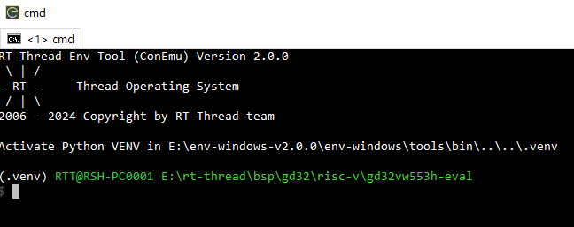
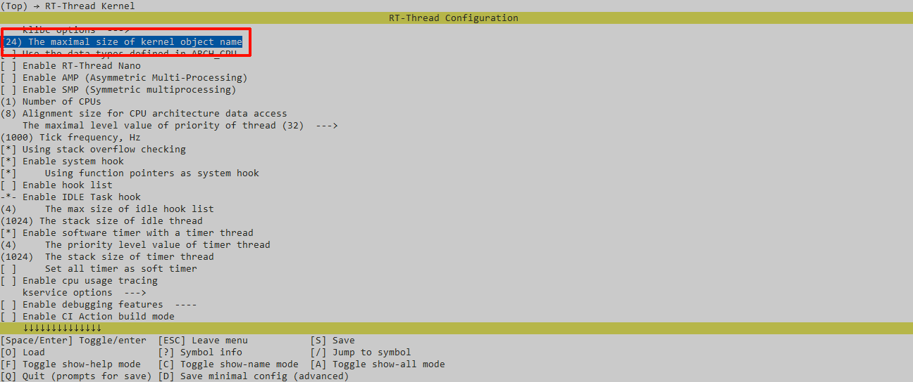
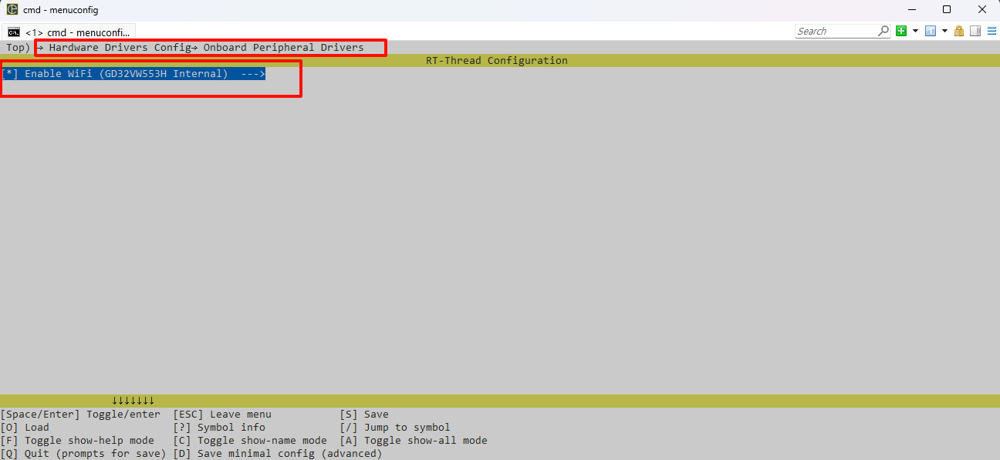
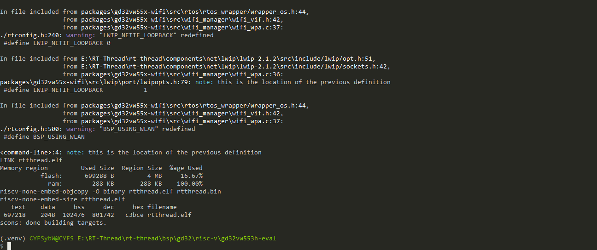
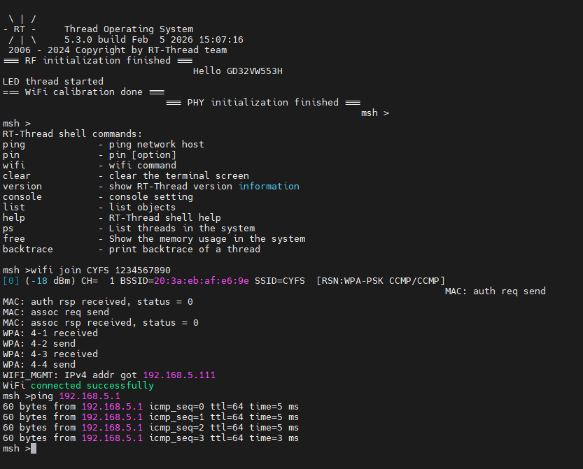
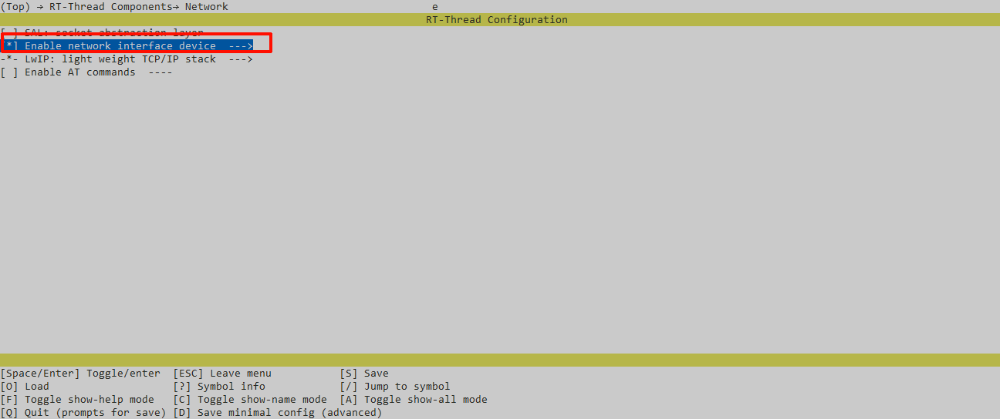
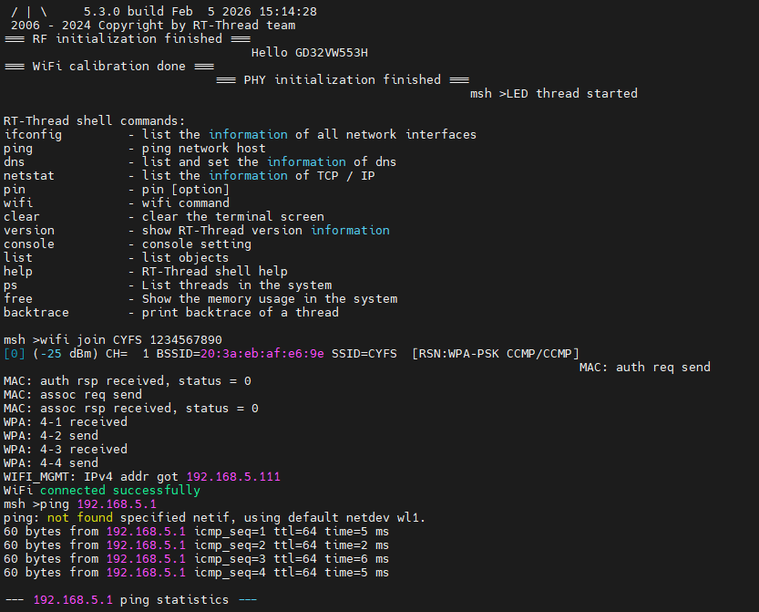

# GD32VW553H_EVAL 开发板BSP说明

## 1 简介

GD32VW553H_EVAL是-兆易创新推出的一款GD32VW系列的评估板。开发板外观如下图所示：



GD32VW553系列双模无线MCU,支持Wi-Fi 6及Bluetooth LE 5.2无线连接，集成了高达4MB Flash及320KB SRAM，另有32KB可配置指令高速缓存(I-Cache)，大幅提升了CPU处理效率。不仅具备出色的无线性能，芯片还配置了丰富的通用有线接口，包含3个U(S)ART、2个I2C、1个SPI以及1个四线制QSPI等, 以及多达29个可编程 GPIO 管脚。内置2个32位通用定时器、2个16位通用定时器、4个16位基本定时器、1个PWM高级定时器和1个12位ADC。供电电压1.8V - 3.6V，并提供了85℃  - 105℃宽温选择，以满足工控互联、照明设备以及插座面板等高温场景应用所需。

面向实时处理和高效通信需求，GD32VW553系列MCU采用了全新的开源指令集架构RISC-V处理器内核，主频可达160MHz，还配备了高级DSP硬件加速器、双精度浮点单元(FPU)以及指令扩展接口等资源，以出色的微架构设计实现了极佳的能效比，并提供了灵活的可扩展性。

## 2 快速上手

### 2.1 环境准备

#### 2.1.1 工具链

首先需要准备BSP编译所需的工具链，[工具链下载链接](https://www.gigadevice.com.cn/product/mcu/mcus-product-selector/gd32vw553hmq6)，在该链接下载应用软件选项中的GD32 Embedded Builder。

工具链的相对路径如下：

> GD32EmbeddedBuilder_v1.5.2.30854\Tools\RISC-V Embedded GCC\8.2.0-2.2-20190521-0004\bin

#### 2.1.2 下载工具

GD32VW553可以使用GD官方工具GD32AllInOneProgrammer下载，[GD32AllInOneProgrammer下载链接](https://www.gd32mcu.com/cn/download?kw=GD32+All-In-One+Programmer&lan=cn)，编译出的固件可使用该软件下载。

#### 2.1.3 RT-Thread ENV工具

RT-Thread的BSP可以使用官方env工具编译，env使用请自行学习，[env下载链接](https://www.rt-thread.org/download.html#download-rt-thread-env-tool)。

#### 2.2 固件编译

使用USB数据线连接板载的GD-Link与串口。

在BSP根路径下使用env工具打开BSP，示例如下：



然后执行pkgs --update命令添加当前BSP所需要的驱动库，示例如下（如果长时间未使用env，可首先

行pkgs --upgrade更新软件包的链接索引）

```powershell
(.venv) RTT@RSH-PC0001 E:\rt-thread\bsp\gd32\risc-v\gd32vw553h-eval
$ pkgs --upgrade
Error message:[Errno 2] No such file or directory: 'E:\\env-windows-v2.0.0\\env-windows\\tools\\bin\\..\\..\\tools\\scripts\\cmds\\.config'
open .config failed
[Use Github server - auto decision based on IP location]
Begin to upgrade env packages.
remote: Enumerating objects: 768, done.
remote: Counting objects: 100% (374/374), done.
remote: Compressing objects: 100% (16/16), done.
Receiving objects:  96% (738/768)
Receiving objects: 100% (768/768), 142.23 KiB | 5.69 MiB/s, done.
Resolving deltas: 100% (462/462), completed with 70 local objects.
From https://github.com/RT-Thread/packages
 * branch              HEAD       -> FETCH_HEAD
==============================>  Env packages upgrade done
(.venv) RTT@RSH-PC0001 E:\rt-thread\bsp\gd32\risc-v\gd32vw553h-eval
$ pkgs --update
```

接下来需要设置工具链字段，示例如下（使用时将下述路径调整为自己的工具链路径）：

```powershell
(.venv) RTT@RSH-PC0001 E:\rt-thread\bsp\gd32\risc-v\gd32vw553h-eval
$ set RTT_EXEC_PATH=E:\GD32\GD32VW5\GD32EmbeddedBuilder_v1.5.4_Rel\Tools\RISC-V Embedded GCC\8.2.0-2.2-20190521-0004\bin
```

接下来执行scons -j128命令编译工程，示例如下：

```powershell
(.venv) RTT@RSH-PC0001 E:\rt-thread\bsp\gd32\risc-v\gd32vw553h-eval
$ scons -j128
```

成功编译会输出下述日志，并在BSP根路径生成**rtthread.bin**固件，该固件即下文需要烧录的固件。

```powershell
LINK rtthread.elf
Memory region         Used Size  Region Size  %age Used
           flash:       66388 B         4 MB      1.58%
             ram:        288 KB       288 KB    100.00%
riscv-none-embed-objcopy -O binary rtthread.elf rtthread.bin
riscv-none-embed-size rtthread.elf
   text    data     bss     dec     hex filename
  65152    1200    7612   73964   120ec rtthread.elf
scons: done building targets.
```

#### 2.3 固件烧录

固件烧录需要使用上述的GD32AllInOneProgrammer软件，烧录说明位于烧录软件下的Doc文件夹，或在线搜索使用方法，下述是烧录的示例：


> 需要注意的是使用上述软件烧录时需要将boot1置为高电平，烧录结束后重新设置为低电平，手动调整板载的boot跳线帽。

#### 2.4 运行结果

烧录完毕后，使用串口连接自己的串口终端软件，即可通过串口与开发板交互，示例如下：

```shell
 \ | /
- RT -     Thread Operating System
 / | \     5.2.1 build Dec 12 2025 14:51:49
 2006 - 2024 Copyright by RT-Thread team
Hello GD32VW553H
msh >
msh >ps
thread   pri  status      sp     stack size max used left tick   error  tcb addr
-------- ---  ------- ---------- ----------  ------  ---------- ------- ----------
tshell    20  running 0x000002d0 0x00001000    31%   0x00000009 OK      0x20002598
tidle0    31  ready   0x00000220 0x00000400    53%   0x00000019 OK      0x20000654
timer      4  suspend 0x00000290 0x00000400    64%   0x00000009 EINTRPT 0x20000ba8
main      10  suspend 0x00000280 0x00001000    17%   0x00000013 EINTRPT 0x200012b8
msh >
```

#### 2.5 配置工程

 BSP 默认只开启了 GPIO 和 串口0的功能，如果需使用高级功能，需要利用 ENV 工具对BSP 进行配置，步骤如下：

1. 在 bsp 下打开 env 工具。
2. 输入`menuconfig`命令配置工程，配置好之后保存退出。
3. 输入`pkgs --update`命令更新软件包。
4. 输入`scons `命令重新编译工程。

## 3 调试下载（VSCode）

首先在BSP根目录下执行下述命令，生成VSCode工程所需文件。

> scons --target=vs

在VSCode安装扩展插件Cortex-Debug，版本v1.4.4。

完成上述工作后，点击运行和调试选项，创建一个launch.json配置文件，配置文件示例如下：

```json
{
    "version": "0.2.0",
    "configurations": 
    [
        {
            "name": "Cortex Debug",
            "cwd": "${workspaceFolder}",
            "executable": "${workspaceFolder}/rtthread.elf",
            "request": "launch",
            "type": "cortex-debug",
            "servertype": "openocd",
            "serverpath": "E:/GD32/GD32VW5/Tools/GD32EmbeddedBuilder_v1.5.2.30854/Tools/OpenOCD/xpack-openocd-0.11.0-3/bin/openocd",
            "configFiles": 
            [
                "${workspaceFolder}/openocd_gdlink.cfg"
            ],
            "runToEntryPoint": "main", 
            "showDevDebugOutput": "raw", 
            "toolchainPrefix": "E:/GD32/GD32VW5/Tools/GD32EmbeddedBuilder_v1.5.2.30854/Tools/RISC-V Embedded GCC/8.2.0-2.2-20190521-0004/bin/riscv-none-embed"
        }
    ]
}
```

上述文件中的部分字段需要根据用户环境进行修改，格式需与示例一致：

- "serverpath”：该字段需要改为用户的openocd所在路径，openocd工具位于GD32EmbeddedBuilder工具包中。
- "toolchainPrefix"：该字段需修改为用户的工具链所在路径，工具链位于GD32EmbeddedBuilder工具包中。

完成上述配置后即可点击调试选项进行调试，调试时boot管脚均置为低电平即可，调试时同样会进行固件下载。

## 4.WIFI使用

使用ENV，menuconfig，修改和使能下面的配置

* 修改 RT_NAME_MAX为24

  

* 使能 BSP_USING_WLAN

  

* 修改LWIP的版本为V2.1.2

  

* 关闭 RT_WLAN_PROT_ENABLE

  

进行编译 scons -jx ，下载。



可以使用help查看wifi指令，下面演示连接wifi以及ping



### 使用NETDEV

* 使能 RT_USING_NETDEV

   

重新编译，下载。

* wifi 连接以及ping 

  

* ifconfig：

  

## 5 注意事项

- Cortex-Debug插件优先选用v1.4.4版本，高版本可能会出现与GDB版本不匹配的问题。

## 联系人信息

维护人:

- [MuChenger](https://github.com/MuChenger), 邮箱：<1516081466@qq.com>