# GD32VF103 #

## 简介

gd32vf103v-eval 是由兆易创新公司推出的基于开源指令集 RISC-V 架构的开发板。

### 板载资源：

| 硬件 | 描述 |
| -- | -- |
| 内核    | Bumblebee                                     |
| 架构       |  32-bit RV32IMAC                                         |
| 主频       | 108 MHz                                              |

## 编译说明

### 导入工程
打开 Eclipse 选择工作空间

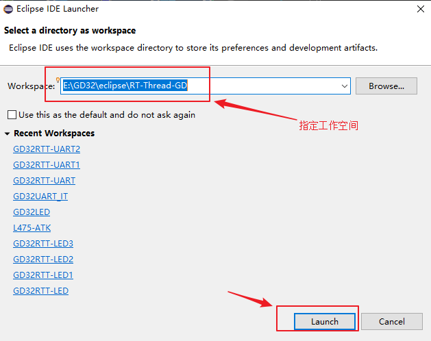

打开 Eclipse 后需要导入 RT-Thread 工程

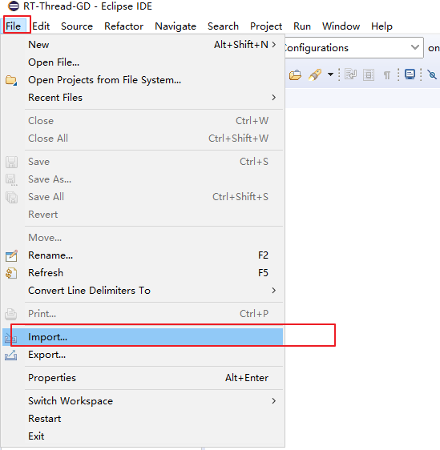

选择以存在的工程，并指定工程路径

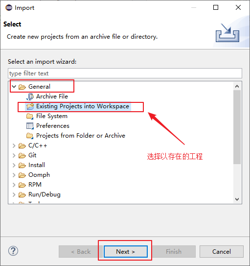

指定工程路径

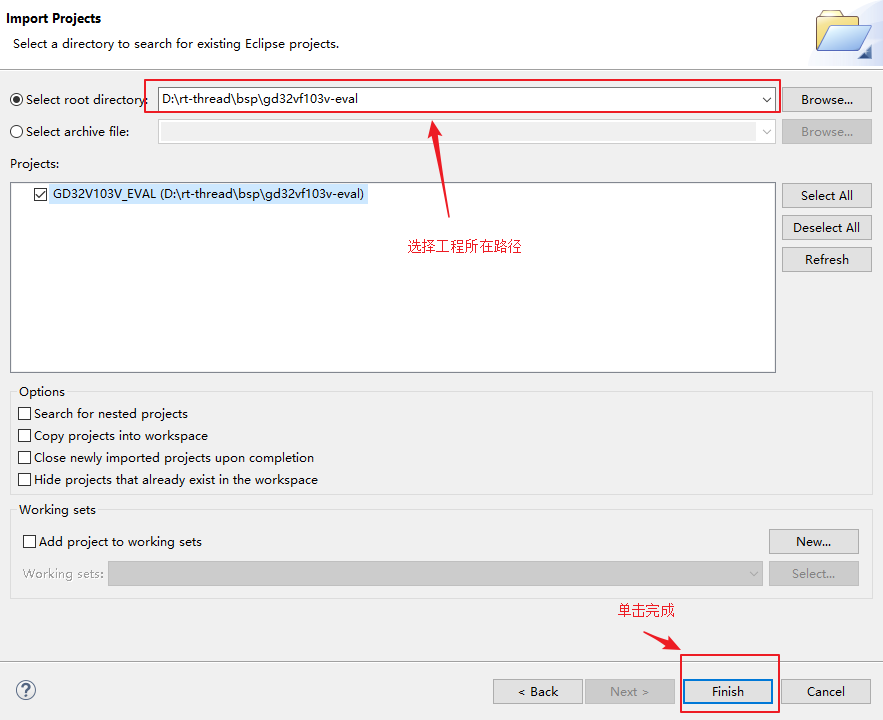


### 添加环境变量
设置 Build Tools Path

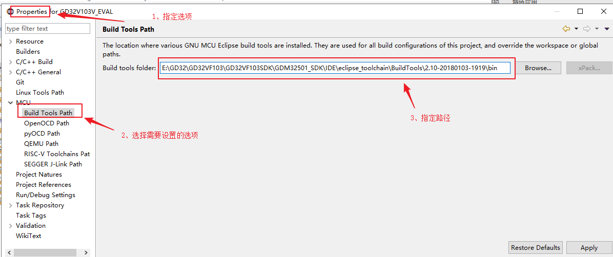

点击 MCU 列表中的 Build Tools Path 选项，为其选择 SDK 文件包中提供的对应工具

设置 OpenOCD Path


点击 MCU 列表中的 OpenOCD Path 选项，为其选择 SDK 文件包中提供的对应工具。

设置 RISC-V Toolchains Path

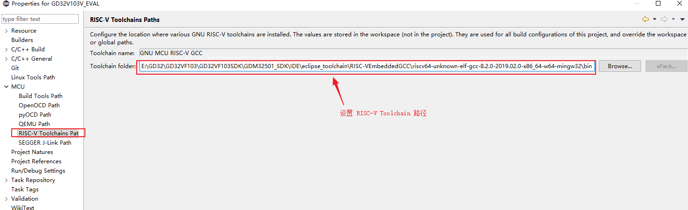

点击 MCU 列表中的 RISC-V Toolchains Paths 选项，为其选择 SDK 文件包中提供的对应工具。

按照以上步骤设置好路径点击编译即可编译工程

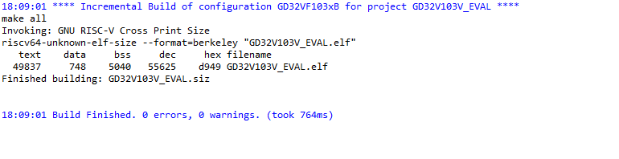

## 烧写及执行

### 替换驱动

1.  执行 JLink_Windows_V622c.exe (可以是任意版本)安装 JLink 驱动程序。
2.  执行 Zadig.exe，点击 Options->List All Devices。
3.  在下图 1 处选择 J-Link，2 处选择 WinUSB， 之后点击 3 处 Replace Driver 进行驱动替换。

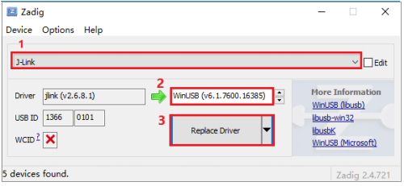

安装完成之后会弹出如下窗口：

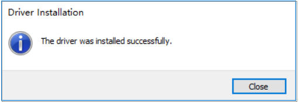

### 配置 GDB 调试

在菜单栏中，点击 Run->Debug Configurations，进入 Debug 配置界面，如下图所示：

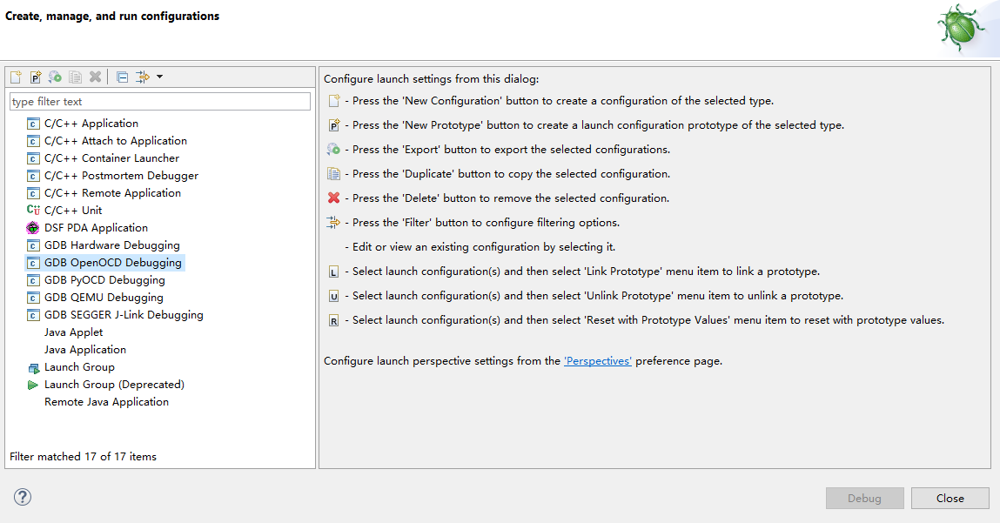

这里使用 OpenOCD 作为 GDB Server，使用GCC工具链中的 GDB 工具作为 GDB Client。双击 GDB OpenOCD Debugging，新建一套 OpenOCD 的配置选项。

Main 选项卡

Main 选项卡配置界面

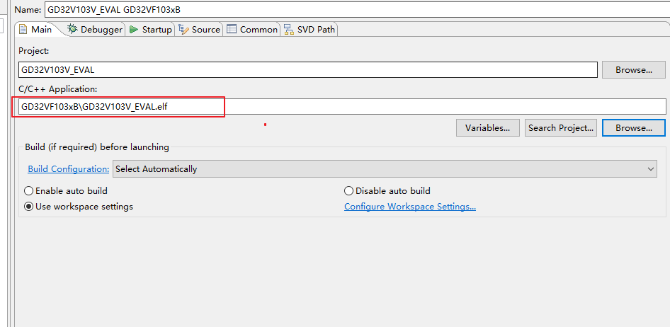

选择当前工程 GD32VF103，并且选择当前型号的可执行文件，例如：GD32VF103xB\GD32VF103xB.elf。

Debugger 选项卡
 Debugger 选项卡配置界面

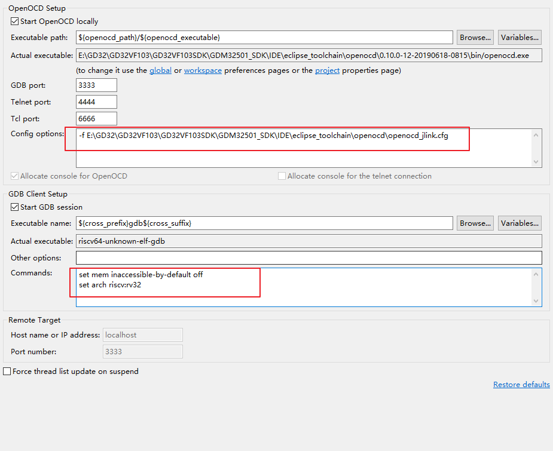

在 Debugger 选项卡中，确认红圈中的配置正确。
其中，“Config options” 是为 OpenOCD 选择配置文件，需要根据当前使用的下载器选择不同的 cfg 文件。

上述配置内容配置好后，点击应用调试。
### 运行结果

下载程序之后，连接串口(115200-N-8-1)，可以看到 RT-Thread 的输出信息：

```
 \ | /
- RT -     Thread Operating System
 / | \     4.0.2 build Jul 24 2019
 2006 - 2019 Copyright by rt-thread team
msh >
```

## 驱动支持情况

| 驱动 | 支持情况  |  备注  |
| ------ | ----  | :------:  |
| USART | 支持 | UART0_TX/RX：GPIO 9/10 |

## 5. 联系人信息

维护人：
- [tyustli](https://github.com/tyustli)

