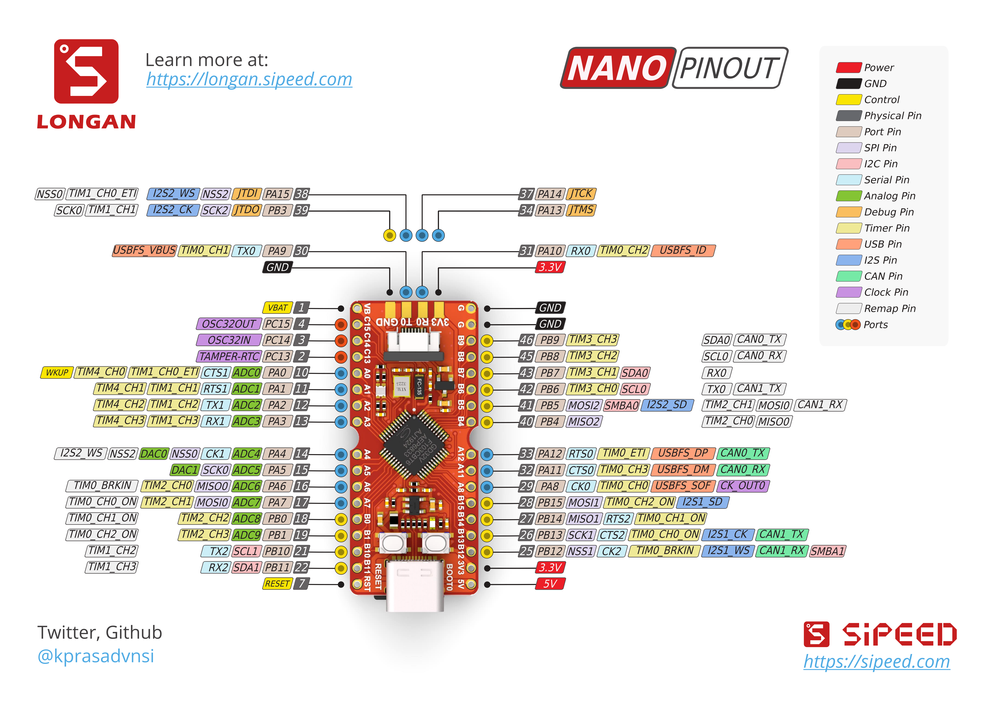
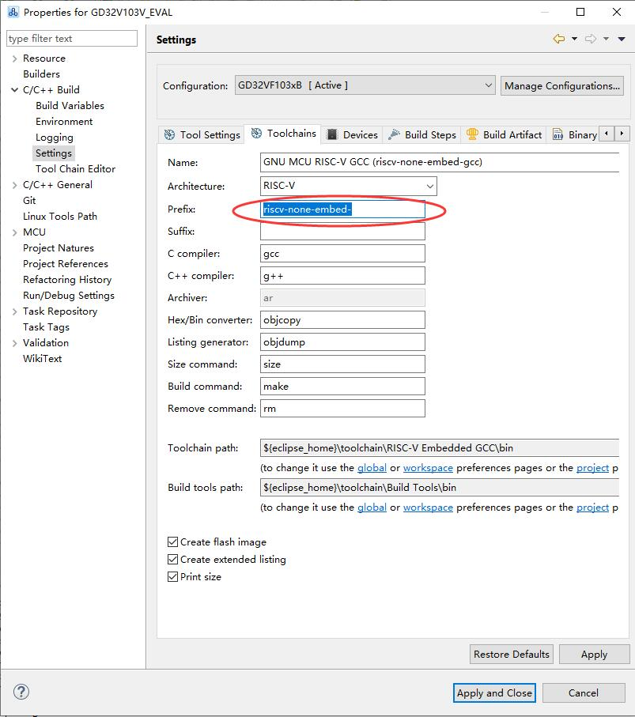

# GD32VF103 Longan Nano 开发板 bsp 说明 #

## 简介

GD32VF103 是由兆易创新公司推出的基于开源指令集 RISC-V 架构的 MCU，而 Longan Nano (龙眼) 则是 sipeed 推出的基于 GD32VF103CBT6 单片机的极简开发板。

## 开发板介绍

Longan Nano 是基于兆易创新(GigaDevice)最新基于 RISC-V 32 位内核的`GD32VF103CBT6` 单片机的极简开发板。方便广大学生、工程师、极客爱好者们接触最新一代的RISC-V处理器。了解其特性。

主芯片为 GD32VF103CBT6 ，基于[芯来科技](http://www.nucleisys.com/).的Bumblebee内核(指令集文档在此下载：http://dl.sipeed.com/LONGAN/Nano/DOC/.。支持 `RV32IMAC` 指令集及`ECLIC` 快速中断功能。内核功耗仅传统 `Cortex-M3` 的1/3.



### 板载资源：

| 硬件 | 描述 |
| -- | -- |
| 内核    | Bumblebee                                     |
| 架构       |  32-bit RV32IMAC                                         |
| 主频       | 108 MHz                                              |
| 内部 Flash | 128 KB |
| 内部 RAM | 32 KB |
| 三色 LED | 红色 (PC13)， 绿色 (PA1)，蓝色 (PA2) |
| TFT 彩屏 | SPI 接口 (SPI1) |
| SD 卡 | SPI 接口 (SPI0) |

## 编译说明

### 1. Scons 编译

编译前需要提前下载好 **RISC-V-GCC** 的工具链，默认使用的是 riscv-none-embed-gcc，可以去芯来科技主页下载 Nuclei Studio，里面就包含了 RISC-V GCC 的工具链: NucleiStudio\toolchain\RISC-V Embedded GCC\bin。


Nuclei Studio 下载: https://www.nucleisys.com/download.php

安装好工具链后，直接在 env 下输入 scons 就可以编译生成 rtthread.bin 文件。

### 2. 使用 Nuclei Studio

除了使用 scons 编译之外，也可以使用上面下载的芯来科技提供的 IDE 编译，使用下面的命令生成 eclipse 项目：

```
scons --target=eclipse
```

编译前确保工具链使用的是  riscv-none-embed-gcc




## 代码上传

编译生成的 bin 和 hex 文件可以使用 GD32 MCU DFU 用 USB 上传，也可以用 GD32 MCU ISP 用 串口上传。


### 运行结果

下载程序之后，连接串口(115200-N-8-1)，可以看到 RT-Thread 的输出信息：

```
 \ | /
- RT -     Thread Operating System
 / | \     4.0.2 build Jul 24 2019
 2006 - 2019 Copyright by rt-thread team
msh >
```

## 驱动支持情况

| 驱动 | 支持情况  |  备注  |
| ------ | ----  | :------:  |
| USART | 支持 | UART0_TX/RX：GPIO 9/10 |
| GPIO | 部分支持 | 暂无中断响应 |

## 5. 联系人信息

维护人：
- [wuhanstudio](https://github.com/wuhanstudio)

