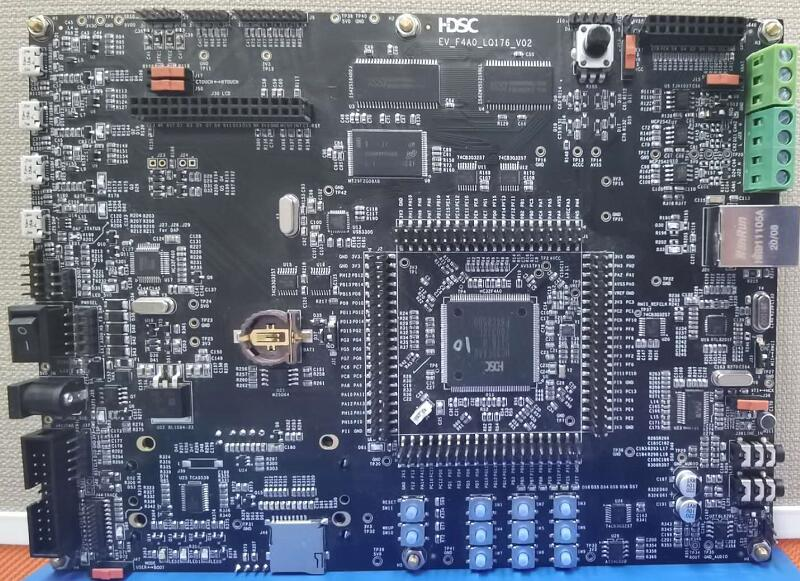

# HDSC EV_F4A0_LQ176 开发板 BSP 说明

## 简介

本文档为华大半导体为 EV_F4A0_LQ176 开发板提供的 BSP (板级支持包) 说明。

主要内容如下：

- 开发板资源介绍
- BSP 快速上手
- 进阶使用方法

通过阅读快速上手章节开发者可以快速地上手该 BSP，将 RT-Thread 运行在开发板上。在进阶使用指南章节，将会介绍更多高级功能，帮助开发者利用 RT-Thread 驱动更多板载资源。

## 开发板介绍

EV_F4A0_LQ176 是 HDSC 官方推出的开发板，搭载 HC32F4A0SITB 芯片，基于 ARM Cortex-M4 内核，最高主频 240 MHz，具有丰富的板载资源，可以充分发挥 HC32F4A0SITB 的芯片性能。

开发板外观如下图所示：



EV_F4A0_LQ176 开发板常用 **板载资源** 如下：

- MCU：HC32F4A0SITB，主频 240MHz，2048KB FLASH ，512KB RAM
- 外部 RAM：IS62WV51216(SRAM,512KB) IS42S16400J(SDRAM,1MB)
- 外部 FLASH: MT29F2G08AB(Nand,256MB) W25Q64(SPI,64M)
- 常用外设
  - LED：11 个，DAP LED (D82), USB LED (D26,D19,D4), Power LED (D39,D83), JTAG LED(D80), MCU LED(D81), user LED(LED0,LED1,LED2)。
  - 按键：11 个，SW0~SW9(矩阵键盘)、WAKEUP(SW10)、RESET。
- 常用接口：USB 转串口、SD 卡接口、以太网接口、LCD 接口、USB HS、USB FS、USB 3300、DVP接口、3.5mm 耳机接口、Line in 接口、喇叭接口
- 调试接口：板载DAP调试器、标准 JTAG/SWD。

开发板更多详细信息请参考华大半导体半导体[EV_F4A0_LQ176](https://www.hdsc.com.cn)

## 外设支持

本 BSP 目前对外设的支持情况如下：

| **板载外设**  | **支持情况** |               **备注**                |
| :------------ | :-----------: | :-----------------------------------: |
| USB 转串口    |      支持     |          使用 UART1                  |
| SPI Flash     |     支持     |           使用 SPI1                   |
| LED           |     支持     |           LED                   |
| **片上外设**  | **支持情况** |               **备注**                |
| :------------ | :-----------: | :-----------------------------------: |
| GPIO          |     支持     | PA0, PA1... PI15 ---> PIN: 0, 1...144 |
| UART          |     支持     |              UART1~10                 |
| SPI           |     支持     |              SPI1~6                   |
| I2C           |     支持     |              软件 I2C                 |
| RTC           |     支持     |      支持外部晶振和内部低速时钟         |
| PWM           |     支持     |                                       |
| HWTIMER       |     支持     |                                       |
| LED           |     支持     |              LED2                     |


## 使用说明

使用说明分为如下两个章节：

- 快速上手

    本章节是为刚接触 RT-Thread 的新手准备的使用说明，遵循简单的步骤即可将 RT-Thread 操作系统运行在该开发板上，看到实验效果 。

- 进阶使用

    本章节是为需要在 RT-Thread 操作系统上使用更多开发板资源的开发者准备的。通过使用 ENV 工具对 BSP 进行配置，可以开启更多板载资源，实现更多高级功能。


### 快速上手

本 BSP 为开发者提供 MDK4、MDK5 和 IAR 工程，并且支持 GCC 开发环境。下面以 MDK5 开发环境为例，介绍如何将系统运行起来。

#### 硬件连接

使用 Type-A to Mini-B 线连接开发板和 PC 供电，D81,D82,D39 会点亮。

#### 编译下载

双击 project.uvprojx 文件，打开 MDK5 工程，编译并下载程序到开发板。

> 工程默认配置使用 J-LINK 下载程序，点击下载按钮即可下载程序到开发板。

#### 运行结果

下载程序成功之后，系统会自动运行，观察开发板上 LED 的运行效果，绿色D81,D82,D39 常亮、绿色 D26 会周期性闪烁。

USB 虚拟 COM 端口默认连接串口 1，在终端工具里打开相应的串口，复位设备后，可以看到 RT-Thread 的输出信息:

```
 \ | /
- RT -     Thread Operating System
 / | \     4.0.3 build Dec 22 2020
 2006 - 2020 Copyright by rt-thread team
Os is Start!!! 
msh >
```

### 进阶使用

此 BSP 默认只开启了 GPIO 和 串口 1 的功能，更多高级功能需要利用 env 工具对 BSP 进行配置，步骤如下：

1. 在 bsp 下打开 env 工具。

2. 输入`menuconfig`命令配置工程，配置好之后保存退出。

3. 输入`pkgs --update`命令更新软件包。

4. 输入`scons --target=mdk4/mdk5/iar` 命令重新生成工程。

## 注意事项

## 联系人信息

维护人:

-  [华大半导体CDT](http://www.hdsc.com.cn/mcu.htm), 邮箱：<mcu@hdsc.com.cn>