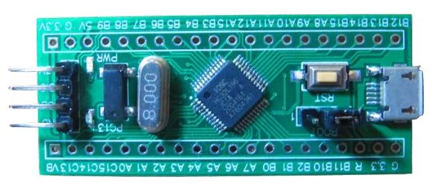

# HDSC HC32L196 核心板 BSP 说明

## 简介

本文档为 HC32L196 核心板 BSP (板级支持包) 说明。

主要内容如下：

- 开发板资源介绍
- BSP 快速上手
- 进阶使用方法

通过阅读快速上手章节开发者可以快速地上手该 BSP ，将 RT-Thread 运行在开发板上。在进阶使用指南章节，将会介绍更多高级功能，帮助开发者利用 RT-Thread 驱动更多板载资源。

## 开发板介绍

HC32L196 核心板搭载 HC32L196 芯片，基于 ARM Cortex-M0+ 内核，最高主频 48MHz。

开发板外观如下图所示：



HC32L196 核心板 **板载资源** 如下：

- MCU: HC32L196JCTA，晶振8MHz，主频 48MHz，256KB FLASH ，32KB RAM
- 常用外设
  - LED: 用户 D2，电源指示灯 D1
  - 按键: RESET
- 调试接口: 标准 SWD
- 供电接口: MicroUSB

开发板更多详细信息请参考[HC32L196 核心板资料，提取码: vtl9](https://pan.baidu.com/s/1WzSHr_Vl2aIVbZ-WJDAHZg)。

## 外设支持

本 BSP 目前对外设的支持情况如下：

| **片上外设**  | **支持情况** |               **备注**                |
| :------------ | :-----------: | :-----------------------------------: |
| GPIO          |     支持     | PA0, PA1... PF15 ---> PIN: 0, 1...95 |
| UART          |     支持     |              UART0, UART1                 |


## 使用说明

使用说明分为如下两个章节：

- 快速上手

    本章节是为刚接触 RT-Thread 的新手准备的使用说明，遵循简单的步骤即可将 RT-Thread 操作系统运行在该开发板上，看到实验效果 。

- 进阶使用

    本章节是为需要在 RT-Thread 操作系统上使用更多开发板资源的开发者准备的。通过使用 ENV 工具对 BSP 进行配置，可以开启更多板载资源，实现更多高级功能。


### 快速上手

本 BSP 为开发者提供 MDK5 工程，并且支持 GCC 开发环境。下面以 MDK5 开发环境为例，介绍如何将系统运行起来。

#### 硬件连接

使用 MicroUSB 线连接核心板和 PC 供电， D1 会点亮。

#### 编译下载

双击 project.uvprojx 文件，打开 MDK5 工程，编译并下载程序到开发板。

> 工程默认配置使用 J-LINK 下载程序，点击下载按钮即可下载程序到开发板。

#### 运行结果

下载程序成功之后，系统会自动运行，观察开发板上 LED 的运行效果， D2 会周期性闪烁。

使用USB转TTL串口模块连接 PA9(TX) 和 PA10(RX)，在终端工具里打开相应的串口，复位设备后，可以看到 RT-Thread 的输出信息:

```
 \ | /
- RT -     Thread Operating System
 / | \     4.0.4 build Sep  7 2021
 2006 - 2021 Copyright by rt-thread team
msh >
```

### 进阶使用

此 BSP 默认只开启了 GPIO 和 串口0串口1 的功能，更多高级功能需要利用 env 工具对 BSP 进行配置，步骤如下：

1. 在 bsp 下打开 env 工具。

2. 输入`menuconfig`命令配置工程，配置好之后保存退出。

3. 输入`pkgs --update`命令更新软件包。

4. 输入`scons --target=mdk5` 命令重新生成工程。

## 注意事项

## 联系人信息

维护人:

-  闻波东, 邮箱：<815611030@qq.com>
