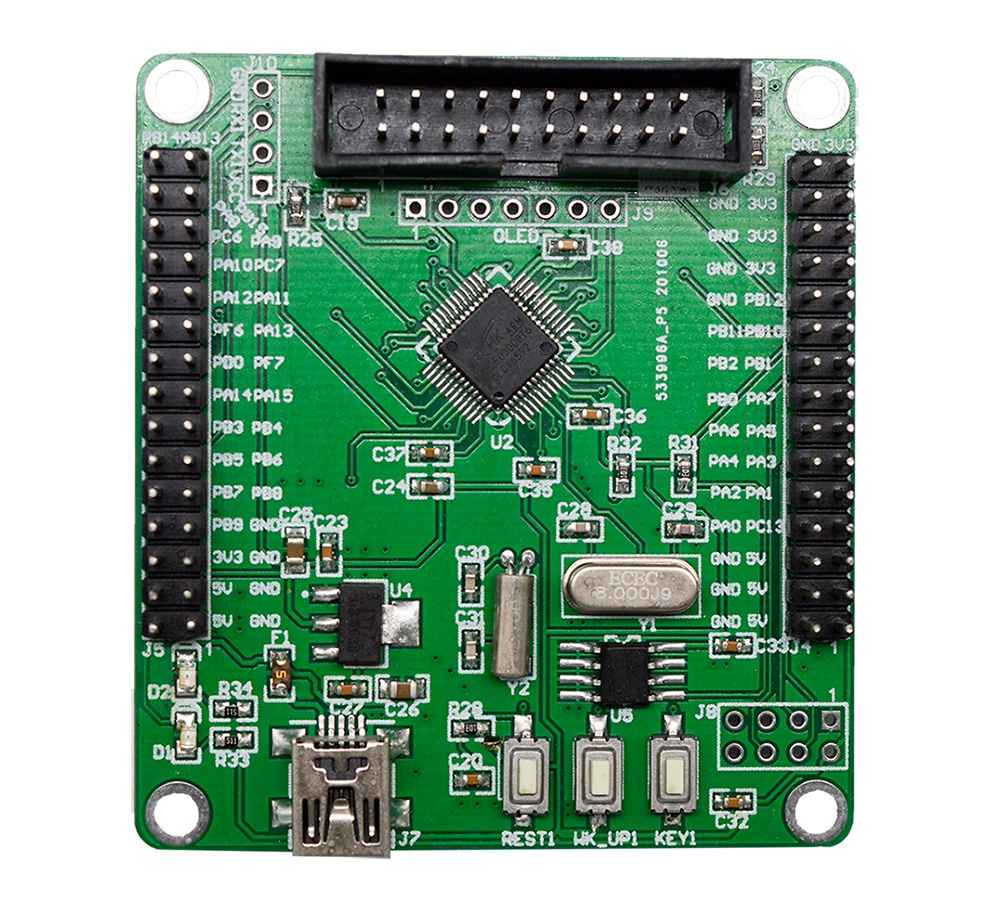

# HK32F030C8T6-MINI BSP 说明

## 简介

开发板外观如下图所示：



HK32F030C8T6-MINI是航顺推出的一款HK32F030C8T6系列的评估板，其搭载的MCU主要资源参数如下：

| 硬件      | 描述          |
| --------- | ------------- |
| 芯片型号  | HK32F030C8T6  |
| CPU       | ARM Cortex M0 |
| 主频      | 72M           |
| 片内SRAM  | 10K           |
| 片内FLASH | 64K           |

## 编译说明

HK32F030C8T6-MINI板级包支持MDK5开发环境和GCC编译器，以下是具体版本信息：

| IDE/编译器 | 已测试版本                   |
| ---------- | ---------------------------- |
| MDK5       | MDK523                       |
| GCC        | GCC 5.4.1 20160919 (release) |

## 板载资源

- MCU：HK32F030C8T6，主频 72MHz，64KB FLASH ，10KB RAM
- 常用外设
  - LED：2个，（VCC、PB4）
  - 按键：2个，KEY1(PA1)、WK_UP（兼具唤醒功能，PA0)
  - NRF24L01接口
  - OLED接口
  - 板载存储：EEPROM(M24C08,8K bits)
- 常用接口：插针串口J10
- 调试接口，JTAG

## 外设支持

本 BSP 目前对外设驱动的支持情况如下：

| 驱动    | 支持情况 |    备注     |
| ------- | -------- | :---------: |
| UART    | 支持     |  USART1/2   |
| GPIO    | 支持     |  PA0...PF7  |
| IIC     | 支持     | GPIO模拟I2C |
| SPI     | 支持     |    SPI1     |
| ADC     | 不支持   |             |
| PWM     | 不支持   |             |
| HWTIMER | 不支持   |             |
| WDT     | 不支持   |             |
| RTC     | 不支持   |             |
| FLASH   | 不支持   |             |

### IO在板级支持包中的映射情况

| IO号 | 板级包中的定义 |
| ---- | -------------- |
| PB4  | LED            |
| PA1  | KEY1           |
| PA0  | KEY_WKUP       |
| PB6  | USART1_TX      |
| PB7  | USART1_RX      |
| PA2  | USART2_TX      |
| PA3  | USART2_RX      |
| PA4  | SPI1_NSS       |
| PA5  | SPI1_SCK       |
| PA6  | SPI1_MISO      |
| PA7  | SPI1_MOSI      |
| PB8  | I2C1_SCL       |
| PB9  | I2C1_SDA       |
| PB10  | I2C2_SCL       |
| PB11  | I2C2_SDA       |

## 使用说明

    本章节是为刚接触 RT-Thread 的新手准备的使用说明，遵循简单的步骤即可将 RT-Thread 操作系统运行在该开发板上，看到实验效果 。

### 快速上手

本 BSP 为开发者提供 MDK4、MDK5 和 IAR 工程，并且支持 GCC 开发环境。下面以 MDK5 开发环境为例，介绍如何将系统运行起来。

#### 硬件连接

使用数据线连接开发板到 PC，打开电源开关。

#### 编译下载

双击 project.uvprojx 文件，打开 MDK5 工程，编译并下载程序到开发板。

> 工程默认配置使用 JLink 下载程序，在通过 JLink 连接开发板的基础上，点击下载按钮即可下载程序到开发板

#### 运行结果

下载程序成功之后，系统会自动运行，观察开发板上 LED 的运行效果，LED 会周期性闪烁。

连接开发板对应串口到 PC , 在终端工具里打开相应的串口（115200-8-1-N），复位设备后，在串口上可以看到 RT-Thread 的输出信息:

```bash
 \ | /
- RT -     Thread Operating System
 / | \     4.0.3 build Mar  9 2020
 2006 - 2020 Copyright by rt-thread team
msh />
```

## 注意事项

可在航顺官方网站进行所需资料下载，如Keil_v5/Keil_v4/IAR等pack安装包和HK-MINI开发板原理图等（http://www.hsxp-hk.com/）

## 联系人信息

维护人:

- [jonas](https://github.com/JonasWen) 