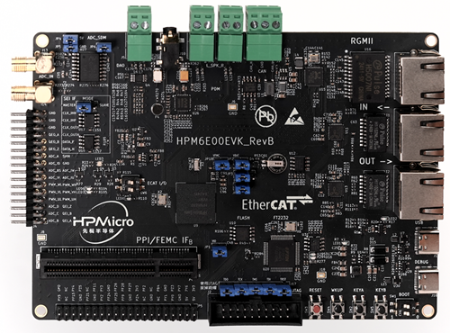

# 先楫 HPM6E00EVK BSP(板级支持包)说明

[English](README.md) |

## 简介

本文档为 HPM6E00EVK 的 BSP (板级支持包) 说明。

本文包含如下部分:

- HPM6E00EVK 板级资源介绍
- 快速上手指南
- 参考链接

通过阅读快速上手章节开发者可以快速地上手该 BSP，将 RT-Thread 运行在开发板上。在进阶使用指南章节，将会介绍更多高级功能，帮助开发者利用 RT-Thread 驱动更多板载资源。

## 板级资源介绍

HPM6800EVK 是由先楫半导体推出的一款基于RISCV内核的开发板，带有丰富的片上资源和板上资源，可用于网络互联、音频和电机控制等应用。

开发板外观如下图所示：




## 板载外设

本 BSP 目前对外设的支持情况如下:


| **板载外设** | **支持情况** | **备注**                              |
| ------------------------ | ----------- | ------------------------------------- |
| USB                      | √           |                                       |
| QSPI Flash               | √           |                                       |
| 以太网                    | √           |                                       |
| GPIO                     | √           |                                       |
| SPI                      | √           |                                       |
| I2C                      | √           |                                       |
| RTC                      | √           |                                       |
| PWM                      | √           |                                       |
| 板载调试器                | √           | ft2232                                |


## 使用说明

### 快速开始

本BSP支持通过`scons`命令来完成编译，在开始之前，需要先准备好开发所需的环境。

#### 准备环境
- 步骤 1: 准备 [RT-Thread ENV](https://www.rt-thread.org/download.html#download-rt-thread-env-tool)
- 步骤 2: 准备 [toolcahin](https://github.com/helloeagleyang/riscv32-gnu-toolchain-win/archive/2022.04.12.zip)
    - 下载并解压到指定的目录，如: `C:\DevTools\riscv32-gnu-toolchain`
- 步骤 3: 设置环境变量： `RTT_RISCV_TOOLCHAIN` 为 `<TOOLCHAIN_DIR>\bin`， 如: `C:\DevTools\riscv32-gnu-toolchain\bin`
- 步骤 4: 准备 [OpenOCD](https://github.com/hpmicro/rtt-debugger-support-package/archive/v0.4.0.zip)
  - 下载并解压到指定目录，如: `C:\DevTools\openocd-hpmicro`
  - 将 `OPENOCD_HPMICRO`环境变量设置为 `<OPENOCD_HPMICRO_DIR>\bin`，如： `C:\DevTools\openocd-hpmicro\bin`

#### 配置和构建工程

通过 RT-Thread ENV 命令行切换目录到当前BSP所在目录后，用户可以:

- 通过 `menuconfig` 命令 配置RT-Thread BSP的功能
- 通过 `scons -jN` 命令完成构建, 其中`N` 最大值可以指定为CP拥有的物理内核数
- 通过 `scons -c` 命令清除构建

#### 硬件连接

- 将BOOT 引脚拨到2'b00
- 通过 TYPE-C线将板上的 `PWR_DEBUG` 连接到电脑

#### 下载 和 调试

- 通过如下命令完成下载:
  ```console
  %OPENOCD_HPMICRO%\openocd.exe -f boards\debug_scripts\probes\ft2232.cfg -f boards\debug_scripts\soc\hpm6e80-single-core.cfg -f boards\debug_scripts\boards\hpm6e00evk.cfg -c "init; halt; flash write_image erase rtthread.elf; reset; shutdown"
  ```

- 通过如下命令实现调试:

  - 通过 `OpenOCD` 来连接开发板:
```console
%OPENOCD_HPMICRO%\openocd.exe -f boards\debug_scripts\probes\ft2232.cfg -f boards\debug_scripts\soc\hpm6e80-single-core.cfg -f boards\debug_scripts\boards\hpm6e00evk.cfg
```
  - 通过 `GDB` 实现调试:
```console
%RTT_EXEC_PATH%\riscv32-unknown-elf-gdb.exe rtthread.elf
```

  - 在`GDB Shell`中使用如下命令来加载和运行:

```console
load
c
```

### **运行结果**

一旦成功下载，程序会自动运行并打印如下结果，板载LED灯会周期性闪烁。

配置好串口终端(串口配置为115200, 8-N-1),按复位键后，串口终端会打印如下日志：

```
 \ | /
- RT -     Thread Operating System
 / | \     5.0.1 build Aug 16 2023 18:18:18
 2006 - 2023 Copyright by RT-Thread team
```

## **参考链接**

- [RT-Thread 文档中心](https://www.rt-thread.org/document/site/#/rt-thread-version/rt-thread-standard/README)
- [RT-Thread Env](https://github.com/RT-Thread/rtthread-manual-doc/blob/master/env/env.md)
- [HPM6800EVK RT-Thread BSP 包](https://github.com/hpmicro/rtt-bsp-hpm6e00evk)