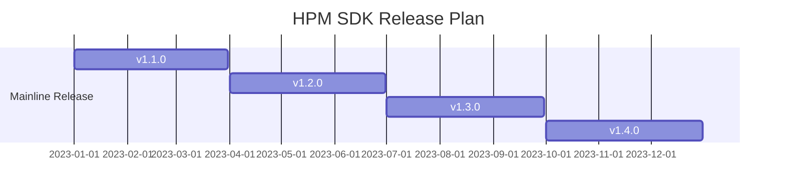

[中文](README_zh.md)

# HPM SDK Overview
The HPM SDK Project is a software development kit based on HPMicro's MCUs, which supports a wide range of MCUs, based on the BSD license, including drivers, middleware and RTOS, such as littlevgl/ lwIP/ TinyUSB/ FreeRTOS, etc. It supports a large number of Boards.

## SDK Directory Structure

| Name | Description |
|--------|--------|
| <HPM_SDK_BASE>/arch | cpu architecture |
| <HPM_SDK_BASE>/boards | board support files |
| <HPM_SDK_BASE>/cmake | cmake extensions |
| <HPM_SDK_BASE>/components | software components |
| <HPM_SDK_BASE>/docs | documentation |
| <HPM_SDK_BASE>/drivers | low level driver files |
| <HPM_SDK_BASE>/middleware | middleware files |
| <HPM_SDK_BASE>/samples | sample source for drivers, middleware, components |
| <HPM_SDK_BASE>/scripts | util scripts |
| <HPM_SDK_BASE>/soc | SoC specific source |
| <HPM_SDK_BASE>/utils | util source |

## SDK Documentation
- Local:
  SDK documentation can be built locally, once it's done, it can be accessed with the following entries:
  - <HPM_SDK_BASE>>/docs/index.html
  - <HPM_SDK_BASE>>/docs/index_zh.html
  > Please refer to <HPM_SDK_BASE>/docs/README.md for more details about documentation building.
- Online:
  - http://hpm-sdk.readthedocs.io/
  - http://hpm-sdk-zh.readthedocs.io/

## HPM SDK Quick Start Guide

### Minimum required version of dependencies are:

  | Name   |   Version |
  | -------|---------- |
  |CMake  |    3.13 |
  | Python |    3.8 |

### Install Dependencies
 - Ubuntu
    - install tools

    ```shell
      sudo apt install build-essential cmake ninja-build libc6-i386 libc6-i386-cross libstdc++6-i386-cross
    ```
    - install python3 (3.8.5 minimum) and pip

    ```shell
      sudo apt install python3 python3-pip
    ```

 - Windows
    - Windows Command Prompt
       The following commands assume you are using cmd.exe, it might differ if you are using PowerShell.
       - Install Chocolatey (https://chocolatey.org/)
         It is a package manager for Windows, with which it's not that difficult to install native Windows dependencies.
        1. Install Chocolatey by the following instructions on the Chocolatey Install (https://chocolatey.org/install) page.
        2. Open "cmd.exe" as "Administrator"
        3. Disable global confirmation to avoid having to confirm installation of individual programs:

        ```Batchfile
          choco feature enable -n allowGlobalConfirmation
        ```

        4. Install CMake

        ```Batchfile
          choco install cmake --installargs 'ADD_CMAKE_TO_PATH=System'
        ```
        5. Install other tools:

        ```Batchfile
          choco install git python ninja
        ```
        6. Close the Administrator command prompt window.

- Prepare Toolchain & Environment Variables
  - Supported toolchains:
    - gnu-gcc <-- default toolchain
    - nds-gcc
  - Toolchain setup:
    - gnu-gcc:
      1. Grab a copy of toolchain zip package and unzip to certain path, take TOOLCHAIN_PATH for example, (riscv32-unknown-elf-gcc is supposed to be found in TOOLCHAIN_PATH/bin)
      2. Declare a system environment variable of "GNURISCV_TOOLCHAIN_PATH" to the path of toolchain:
        - Linux, taking zsh for example (replace TOOLCHAIN_PATH with the path of toolchain on your workstation):
      ```shell
        export GNURISCV_TOOLCHAIN_PATH=TOOLCHAIN_PATH
        export HPM_SDK_TOOLCHAIN_VARIANT=
      ```
        - Windows command prompt:
      ```Batchfile
        set GNURISCV_TOOLCHAIN_PATH=TOOLCHAIN_PATH
        set HPM_SDK_TOOLCHAIN_VARIANT=
      ```
    - nds-gcc:
      1. Grab a copy of toolchain zip package and unzip to certain path, take TOOLCHAIN_PATH for example, (riscv32-elf-gcc is supposed to be found in TOOLCHAIN_PATH/bin)
      2. Declare two system environment variables: "GNURISCV_TOOLCHAIN_PATH" to the path of toolchain; "HPM_SDK_TOOLCHAIN_VARIANT" to "nds-gcc":
        - Linux, taking zsh for example (replace TOOLCHAIN_PATH with the path of toolchain on your workstation):
      ```shell
        export GNURISCV_TOOLCHAIN_PATH=TOOLCHAIN_PATH
        export HPM_SDK_TOOLCHAIN_VARIANT=nds-gcc
      ```
        - Windows command prompt:
      ```Batchfile
        set GNURISCV_TOOLCHAIN_PATH=TOOLCHAIN_PATH
        set HPM_SDK_TOOLCHAIN_VARIANT=nds-gcc
      ```
     Note: For windows, Andes compiler needs following libraries:
             - cygwin1.dll
             - cygncursesw-10.dll
           make sure its path is appended to the system environment variable "PATH".
  - Environment Variables:
    - Using provided scripts to set the environment variable:
      - Linux:
      ```shell
        $ source env.sh
      ```
      - Windows command prompt:
      ```Batchfile
        env.cmd
      ```
    - Manually declare a environment variable of "HPM_SDK_BASE"  to the path of SDK root:
      - Linux, taking zsh for example (assume SDK is located at $HOME/hpm_sdk):
      ```shell
        export HPM_SDK_BASE=$HOME/hpm_sdk
      ```
      - Windows command prompt (assume SDK is located at c:\hpm_sdk):
      ```Batchfile
        set HPM_SDK_BASE=c:\hpm_sdk
      ```

- Install python dependencies
  - Linux:
  ```shell
    pip3 install --user -r "$HPM_SDK_BASE/scripts/requirements.txt"
  ```

  - Window (by default, python3/pip3 is not available after Python 3.x installed on Windows, but only python/pip):

  ```Batchfile
    pip install --user -r "%HPM_SDK_BASE%/scripts/requirements.txt"
  ```

- Build An Application with GNU GCC toolchain
  On finishing the steps mentioned above, SDK projects can be generated and built.
  The following steps describe how a demo can be built:
  1. Go to application directory, taking hello_world for example:

  ```shell
    cd samples/hello_world
  ```

  2. create a directory for build
    - Linux:

    ```shell
      mkdir build
    ```

    - Windows:

    ```Batchfile
      md build
    ```

  3. Change directory to "build"

    ```Batchfile
      cd build
    ```

  4. Generate build files for Ninja:
    ```shell
      cmake -GNinja -DBOARD=hpm6750evk ..
    ```
    Note: if it complains about "CMAKE_MAKE_PROGRAM is not set", please
        append -DCMAKE_MAKE_PROGRAM=YOUR_MAKE_EXECUTABLE_PATH to the previous
        command (NINJA_PATH is the folder in which ninja can be found):

    ```shell
      cmake -GNinja -DBOARD=hpm6750evk -DCMAKE_MAKE_PROGRAM=NINJA_PATH/ninja ..
    ```

  5. Building:

    ```shell
      ninja
    ```

    When it's done the elf and other application related files can be found in the directory of "output", like map file, assembly source or binary file

- Quick Guide to Run/Debug An Application (hello_world):
    1. Wire up the board, including debug probe (by default it supports jlink) and serial port
    2. power up the board
    3. open console connecting to the debug console (target serial port) with baudrate of 115200
    4. get a copy of openocd. it can be installed via package management system or downloaded from sourceforge or github. But please make sure its revision is > 0.11
    5. Go to SDK root directory, run provided environment variable scripts:
    - Linux:
      ```shell
        $ source env.sh
      ```

    - Windows command prompt:
      ```Batchfile
        env.cmd
      ```
      or setup environment variable OPENOCD_SCRIPTS manually:

    - Linux:
      ``` shell
        $ export OPENOCD_SCRIPTS=${HPM_SDK_BASE}/boards/openocd
      ```

    - Windows:
      ```
        set OPENOCD_SCRIPTS=%HPM_SDK_BASE%\boards\openocd
      ```

    6. Start openocd with several configuration files in order of type of probe, type of core, type of board. For example, the following command will setup an openocd gdb server with ft2232 to single core on hpm6750evk

    ```shell
      openocd -f probes/ft2232.cfg -f soc/hpm6750-single-core.cfg -f boards/hpm6750evk.cfg
    ```
    Note: If using FTDI debugger and meet  `Error: libusb_open() failed with LIBUSB_ERROR_NOT_FOUND` , please check the FTDI usb driver. If it is not installed correctly, use [zadig](https://github.com/pbatard/libwdi/releases/download/b730/zadig-2.5.exe) to update:

    Open zadig, click Options-> List All Devices.

    

    Select Dual RS232-HS (Interface 0).

    

    Then click Install Driver or Replace Driver.

    

    7. Go to hello_world directory

    ```shell
      cd samples/hello_world
    ```

    8. open up another terminal to start a gdb client
    - gnu-gcc:

    ```shell
      TOOLCHAIN_PATH/bin/riscv32-unknown-elf-gdb
    ```

    - nds-gcc:

    ```shell
      TOOLCHAIN_PATH/bin/riscv32-elf-gdb
    ```

    9. connect gdb client to the gdbserver started by openocd, (by default, gdbserver port is 3333)

    ```GDB
      gdb> file build/output/demo.elf
      gdb> target remote localhost:3333
      gdb> load
      gdb> b main
      gdb> c
    ```

    10. on the debug console, "hello_world" is printed.

- Build An Application with Segger Embedded Studio
  - Segger Embedded Studio for RISC-V can be downloaded from https://www.segger.com/downloads/embedded-studio/
  - Project file for Segger Embedded Studio will be generated while generating build files for Ninja mentioned in "Build An Application with GNU GCC toolchain"->"4. Generate build files for Ninja"
  - The project file (.emProject) can be found at build/segger_embedded_studio/.

  Note: openocd executable needs to be found in the PATH variable of current console, otherwise debug configuration will not be generated to project file and needs to be configured manually in Segger Embedded Studio later.

# Community Support
- github page: https://hpmicro.github.io
- github: https://github.com/hpmicro/hpm_sdk
- gitee: https://gitee.com/hpmicro/hpm_sdk

