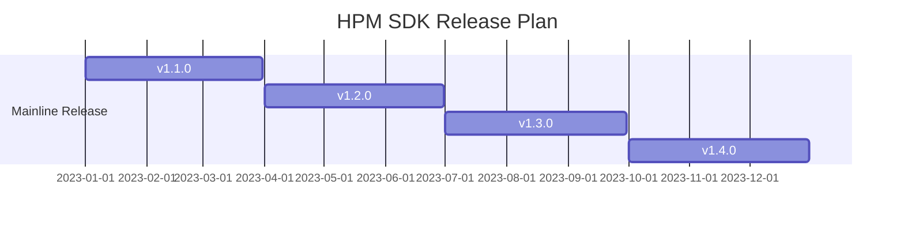

[English](README.md)

# HPM SDK 概述
HPM SDK项目是基于HPMicro 公司的MCU编写的软件开发包，支持多种MCU。基于BSD许可证，包含了底层驱动，中间件和RTOS，例如littlevgl/ lwIP/ TinyUSB/ FreeRTOS等，支持大量评估板。

## HPM SDK 目录结构

| 目录名称 | 描述 |
|--------|--------|
| <HPM_SDK_BASE>/arch | cpu架构相关文件 |
| <HPM_SDK_BASE>/boards | 板级文件 |
| <HPM_SDK_BASE>/cmake | cmake扩展 |
| <HPM_SDK_BASE>/components | 软件组件 |
| <HPM_SDK_BASE>/docs | 文档 |
| <HPM_SDK_BASE>/drivers | 底层驱动文件|
| <HPM_SDK_BASE>/middleware | 中间件 |
| <HPM_SDK_BASE>/samples | 驱动、中间件以及软件组件示例代码 |
| <HPM_SDK_BASE>/scripts | 辅助脚本 |
| <HPM_SDK_BASE>/soc | SoC相关文件 |
| <HPM_SDK_BASE>/utils | 辅助文件 |

## SDK文档
- 本地文档:
  SDK文档可以进行本地编译，成功编译之后可以通过以下入口访问本地文档:
  - <HPM_SDK_BASE>>/docs/index.html
  - <HPM_SDK_BASE>>/docs/index_zh.html
  > 文档编译方式请参考<HPM_SDK_BASE>/docs/README.md
- 在线文档：
  - http://hpm-sdk.readthedocs.io/
  - http://hpm-sdk-zh.readthedocs.io/

## HPM SDK使用说明

### 依赖软件最低版本要求

| 软件名称 | 版本号 |
|--- | --- |
| CMake | 3.13 |
| Python | 3.8 |

### 安装依赖

- Ubuntu:
  - 安装工具:

```shell
    sudo apt install build-essential cmake ninja-build libc6-i386 libc6-i386-cross libstdc++6-i386-cross
```

  - 安装python3 (3.8.5 minimum) 与pip:

```shell
    sudo apt install python3 python3-pip
```

- Windows:
  - Windows命令行:
  以下所使用的命令都以Windows命令行(cmd.exe)为例:
    - 安装 Chocolatey (<https://chocolatey.org/>):
    该工具为Windows下的包管理软件,通过该工具可以方便地在Windows平台上安装依赖软件:
    1. 根据Chocolatey官方步骤进行安装(<https://chocolatey.org/install>)
    2. 以管理员身份打开"cmd.exe"
    3. 禁用全局安装确认:

      ```Batchfile
          choco feature enable -n allowGlobalConfirmation
      ```

    4. 安装CMake:

      ```Batchfile
          choco install cmake --installargs 'ADD_CMAKE_TO_PATH=System'
      ```

    5. 安装其他工具:

      ```Batchfile
          choco install git python ninja
      ```

    6. 关闭该命令行窗口

## 准备工具链与环境变量配置

- 支持的工具链:
  - gnu-gcc <-- 缺省工具链
  - nds-gcc
- 工具链:
  - gnu-gcc:
      - 下载工具链压缩包,并解压.假定TOOLCHAIN_PATH作为工具链的解压目录(需要满足在TOOLCHAIN_PATH\bin下可以找到riscv32-unknown-elf-gcc)
      - 申明系统环境变量"GNURISCV_TOOLCHAIN_PATH"指向工具链路径:
        - Linux, 以zsh为例(确保将TOOLCHAIN_PATH替换成你自己的路径):
    ```shell
      export GNURISCV_TOOLCHAIN_PATH=TOOLCHAIN_PATH
      export HPM_SDK_TOOLCHAIN_VARIANT=
    ```
    - Windows命令行:
    ```Batchfile
      set GNURISCV_TOOLCHAIN_PATH=TOOLCHAIN_PATH
      set HPM_SDK_TOOLCHAIN_VARIANT=
    ```
  - nds-gcc:
      - 下载工具链压缩包,并解压.假定TOOLCHAIN_PATH作为工具链的解压目录(需要满足在TOOLCHAIN_PATH\bin下可以找到riscv32-elf-gcc)
      - 申明系统环境变量"GNURISCV_TOOLCHAIN_PATH"指向工具链路径:
        - Linux, 以zsh为例(确保将TOOLCHAIN_PATH替换成你自己的路径):
    ```shell
      export GNURISCV_TOOLCHAIN_PATH=TOOLCHAIN_PATH
      export HPM_SDK_TOOLCHAIN_VARIANT=nds-gcc
    ```
    - Windows命令行:
    ```Batchfile
      set GNURISCV_TOOLCHAIN_PATH=TOOLCHAIN_PATH
      set HPM_SDK_TOOLCHAIN_VARIANT=nds-gcc
    ```
    Note: Windows平台上Andes toolchain需要以下cygwin库文件:
           - cygwin1.dll
           - cygncursesw-10.dll
          务必确保以上库文件所在目录被包含在系统环境变量PATH中

- SDK编译所需环境变量设置:
  - 通过运行提供的脚本执行:
    - Linux:

    ```shell
      source env.sh
    ```

    - Windows 命令行:

    ```Batchfile
      env.cmd
    ```

  - 手工设置环境变量"HPM_SDK_BASE"指向SDK根目录:
    - Linux, 以zsh为例(假定$HOME/hpm_sdk为SDK根目录):

    ```shell
      export HPM_SDK_BASE=$HOME/hpm_sdk
    ```

    - Windows 命令行(假定c:\hpm_sdk为SDK根目录):
    ```Batchfile
      set HPM_SDK_BASE=c:\hpm_sdk
    ```

- 安装Python依赖包:
  - Linux:

  ```shell
    pip3 install --user -r "$HPM_SDK_BASE/scripts/requirements.txt"
  ```

  - Window (Windows平台上Python 3.x 安装之后无法找到 python3/pip3, 只有python/pip):
  ```Batchfile
    pip install --user -r "%HPM_SDK_BASE%/scripts/requirements.txt"
  ```

- 使用GNU GCC工具链编译示例应用:
    做完尚书步骤之后, 就可以构建编译SDK示例工程.  以下步骤描述了如何编译hello_world:
    1. 切换到示例应用目录:

    ```shell
      cd samples/hello_world
    ```

    2. 创建build目录:
       - Linux:

        ```shell
          mkdir build
        ```

       - Windows:

        ```Batchfile
          md build
        ```

    3. 切换目录到"build"

    ```shell
      cd build
    ```

    4. 为Ninja-build产生构建文件:

    ```shell
      cmake -GNinja -DBOARD=hpm6750evk ..
    ```

    Note: 如果提示"CMAKE_MAKE_PROGRAM is not set", 可以通过在以上命令中追加"-DCMAKE_MAKE_PROGRAM=YOUR_MAKE_EXECUTABLE_PATH" (NINJA_PATH为ninja-build的目录,在其下可以找到ninja):
        # cmake -GNinja -DBOARD=hpm6750evk -DCMAKE_MAKE_PROGRAM=NINJA_PATH/ninja ..

    5. 编译:

    ```shell
      ninja
    ```

    当编译完成后,生成的elf以及对应的其他文件可以在output目录中找到.

- 运行/调试示例程序说明(hello_world):
    1. 完成评估板连线,包括调试器,串口线以及电源线
    2. 打开电源
    3. 打开串口软件,设置baudrate为115200
    4. 安装openocd(0.11以上)
    5. 切换至SDK根目录, 运行设置环境变量脚本:
    - Linux:

      ```shell
        $ source env.sh
      ```
    - Windows command prompt:

      ```Batchfile
        env.cmd
      ```
    或者手动设置名为OPENOCD_SCRIPTS的环境变量:
    - Linux:
      ``` shell
        $ export OPENOCD_SCRIPTS=${HPM_SDK_BASE}/boards/openocd

      ```
    - Windows:
      ```
        set OPENOCD_SCRIPTS=%HPM_SDK_BASE%\boards\openocd
      ```

    6. 运行openocd, 需要按顺序指定配置文件: 调试器配置, 内核配置, 目标板配置。例如，通过ft2232在hpm6750evk上进行单核调试，可以运行如下命令:

    ```shell
      openocd -f probes/ft2232.cfg -f soc/hpm6750-single-core.cfg -f boards/hpm6750evk.cfg
    ```

    Note: 如果使用FTDI调试器并遇到提示`Error: libusb_open() failed with LIBUSB_ERROR_NOT_FOUND` , 请检查FTDI usb驱动。如果驱动未正确安装，使用 [zadig](https://github.com/pbatard/libwdi/releases/download/b730/zadig-2.5.exe) 更新驱动：

    打开zadig，点击 Options->List All Devices.

    

    选择 Dual RS232-HS (Interface 0).

    

     然后点击 Install Driver 或 Replace Driver.

    

    7. 切换到hello_world目录

    ```shell
      cd samples/hello_world
    ```

    8. 打开另一个终端,启动GDB client:
    - gnu-gcc:

    ```shell
      TOOLCHAIN_PATH/bin/riscv32-unknown-elf-gdb
    ```

    - nds-gcc:

    ```shell
      TOOLCHAIN_PATH/bin/riscv32-elf-gdb
    ```

    9. 连接GDB client到openocd GDB server (缺省状态下, openocd gdbserver 端口为 3333)

    ```GDB
      gdb> file build/output/demo.elf
      gdb> target remote localhost:3333
      gdb> load
      gdb> b main
      gdb> c
    ```
    10. 顺利运行后可以在串口终端上打印"hello_world".

- 使用Segger Embedded Studio for RISC-V编译应用
  - Segger Embedded Studio for RISC-V 可以从 https://www.segger.com/downloads/embedded-studio/ 下载
  - Segger Embedded Studio for RISC-V 工程文件会在 "使用GNU GCC工具链编译示例应用:" -> "4. 为Ninja-build产生构建文件:" 描述的过程中
  - 产生的工程文件(.emProject)可以在build/segger_embedded_studio目录中找到

  注意：openocd可执行文件应该可以通过当前终端的PATH环境变量中可以找到, 否则无法在工程文件中生成相应的调试配置，需要之后在Segger Embedded Studio中手工配置。

## 社区支持
- github page: https://hpmicro.github.io
- github: https://github.com/hpmicro/hpm_sdk
- gitee: https://gitee.com/hpmicro/hpm_sdk
