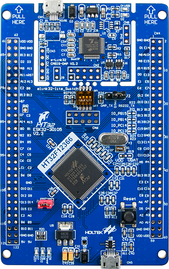

# HT32F12366 BSP 说明

## 简介

ESK32-30105是合泰基于HT32F12366芯片并针对Cortex®-M3入门而设计的评估板。本文档是为ESK32-30105开发板提供的BSP(板级支持包)说明。

主要内容如下：

- 开发板资源介绍
- BSP 快速上手
- 进阶使用方法

通过阅读快速上手章节开发者可以快速地上手该 BSP，将 RT-Thread 运行在开发板上。

## 开发板介绍

ESK32-30105使用32位ARM® Cortex®-M3高性能、低功耗单片机HT32F12366，针对Cortex®-M3入门而设计。开发板外观如下图所示：



该开发板常用 **板载资源** 如下：

- MCU：HT32F12366，主频 96MHz，256KB FLASH ，128KB SRAM
- 常用外设
    - LED：2个，（绿色，PE0、PD15）
- 常用接口：USB 转串口 、USB SLAVE
- 调试接口：板载的 e-Link32 Lite SWD 下载

开发板更多详细信息请参考合泰官网的相关文档 [ESK32-30105](https://www.holtek.com.cn/page/detail/dev_kit/ESK32-30105)。

## 外设支持

本 BSP 目前对外设的支持情况如下：

| **板载外设** | **支持情况** | **备注** |
| :--- | :---: | :--- |
| USB 转串口 | 支持  | 使用 USART0 |
| **片上外设** | **支持情况** | **备注** |
| GPIO | 支持  | PA0, PA1...PE15 ---> PIN: 0, 1...79 |
| USART | 支持  | USART0/1 |
| UART | 支持  | UART0/1 |
| SPI | 支持  | SPI0/1 |
| I2C | 支持  | 硬件 I2C0/1 |
| ADC | 暂不支持  |     |
| WDT | 暂不支持  |     |

## 使用说明

使用说明分为如下两个章节：

- 快速上手
    
    本章节是为刚接触 RT-Thread 的新手准备的使用说明，遵循简单的步骤即可将 RT-Thread 操作系统运行在该开发板上，看到实验效果 。
    
- 进阶使用
    
    本章节是为需要在 RT-Thread 操作系统上使用更多开发板资源的开发者准备的。通过使用 ENV 工具对 BSP 进行配置，可以开启更多片上资源，实现更多高级功能。

### 快速上手

本 BSP 为仅为开发者提供MDK5的工程。下面以 MDK5 开发环境为例，介绍如何将系统运行起来。

#### 硬件连接

使用数据线通过板载的 e-Link32 Lite将芯片连接到 PC。

#### 编译下载

双击 project.uvprojx 文件，打开 MDK5 工程，编译并下载程序到开发板。

> 注：工程默认配置使用CMSIS-DAP下载方式，在通过 e-Link32 Lite 连接开发板的基础上，点击下载按钮即可下载程序到开发板。

#### 运行结果

下载程序成功之后，系统会自动运行，观察开发板上 LED 的运行效果，LED1和LED2交替闪烁。

连接开发板对应串口到 PC（也可以通过e-Link32 Lite的模拟串口将开发板连接到PC）, 在终端工具里调整好串口配置（115200-8-1-N）并打开相应的串口，复位设备后，可以看到 RT-Thread 的输出信息:

> 注：由于RT-Thread的finsh控制台使用的是命令行的输入形式，推荐使用串口调试工具如：Tabby terminal 或者 Tera Term。

```bash
 \ | /
- RT -     Thread Operating System
 / | \     5.1.0 build Apr 10 2024 14:39:43
 2006 - 2024 Copyright by RT-Thread team
msh >
```

### 进阶使用

此 BSP 默认只开启了 GPIO 和 USART0 的功能，如果需使用更多的片上资源，需要利用 ENV 工具对BSP 进行配置，步骤如下：

1.  在 bsp 下打开 env 工具。
    
2.  输入`menuconfig`命令配置工程，配置好之后保存退出。
  
3.  输入`scons --target=mdk5` 命令重新生成工程。

## 注意事项

开发板和芯片的相关资料可以在[合泰官网](https://www.holtek.com.cn/page/index)进行查找和下载，如芯片的数据手册和开发使用手册、开发板的原理图、Keil_v5的pack安装包等。

## 联系人信息

维护人:

- [QT-one](https://github.com/QT-one)