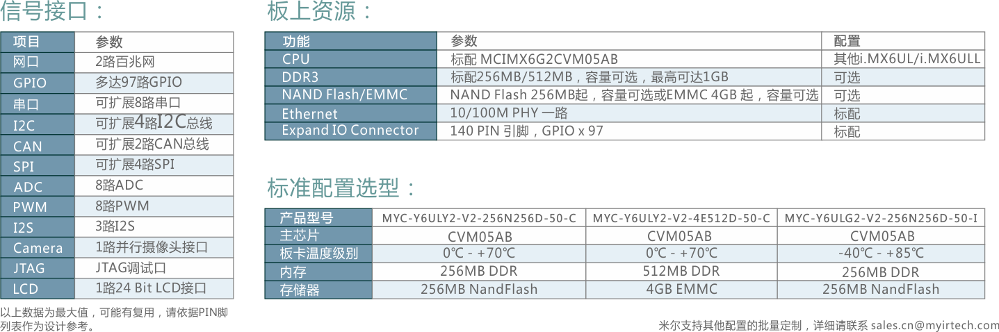

# RT-Thread Smart for i.MX6ULL

这是一份ART-pi smart开发板的BSP，支持smart模式也支持传统的RTOS模式；

ART-pi smart采用了米尔科技的imx6ull核心板，硬件由韦东山团队完成，由社区来完成整体的BSP。硬件规格情况如下：



## 如何编译

如果使用smart的模式，请使用smart sdk环境，然后进入到这个bsp目录，执行

```bash
scons
```

进行编译；

如果使用RTOS模式，请确保在menuconfig中不选择smart模式，然后执行

```bash
scons
```

进行编译。

## 如何运行

* 从eMMC中加载运行

```bash
bootcmd=fatload mmc 1:1 0x80001000 /kernel/rtthread.bin; dcache flush; go 0x80001000
```

* 网络方式启动

```bash
tftp 0x80001000 rtthread.bin
dcache flush
go 0x80001000
```
