# i.MX RT 系列 BSP 制作教程

为了让广大开发者更好、更方便地使用 BSP 进行开发，RT-Thread 开发团队重新整理了现有的 i.MX RT 系列的 BSP，推出了新的 BSP 框架。新的 BSP 框架在易用性、移植便利性、驱动完整性、代码规范性等方面都有较大提升，在新的 BSP 框架下进行开发，可以大大提高应用的开发效率。

和 RT-Thread 以往提供的 i.MX RT 的 BSP 不同，新的框架将不会出现一个 BSP 通过 Env 配置来适配不同开发平台的情况。而是将这些不同的开发平台通过不同的 BSP 文件展示出来。这种方式不仅大大降低了代码的耦合性，减少了 BSP 的维护成本，而且让开发者可以更容易地找到自己需要的资源。

新的 BSP 框架还引入了 MCUXpresso Config Tools 工具，可以使用该工具来对引脚和时钟进行配置。MCUXpresso 工具提供了图形化的配置界面，这种图形化的配置方式对开发者来说更加直观，不仅可以让开发者灵活地配置 BSP 中使用的资源，并且可以让开发者对资源的使用情况一目了然。

新 BSP 框架的主要特性如下：

- 提供多系列 BSP 模板，大大降低新 BSP 的添加难度。
- BSP 驱动文件比较完善，开发者可以方便地使用所有驱动。
- 使用 MCUXpresso 工具配置引脚及时钟。

## 1. BSP 框架介绍

BSP 框架结构如下图所示：

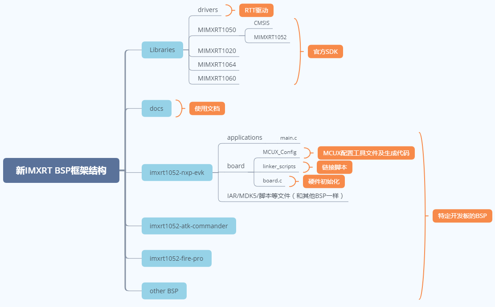

i.MX RT 系列的 BSP 由三部分组成，分别是官方 SDK、通用驱动和特定开发板 BSP，下面的表格以 1050 系列 BSP 为例介绍这三个部分：

| 项目 | 文件夹 | 说明 |
| - | - | :-- |
| 官方 SDK | imxrt/libraries/MIMXRT1050 | 1050 系列官方 SDK |
| drivers | imxrt/libraries/drivers | i.MX RT 系列通用 RTT 驱动 |
| 特定开发板 BSP | imxrt/imxrt1052-nxp-evk | NXP 官方 imxrt1050 EVK 开发板 BSP |

## 2. 知识准备

制作一个 BSP 的过程就是构建一个新系统的过程，因此想要制作出好用的 BSP，要对 RT-Thread 系统的构建过程有一定了解，需要的知识准备如下所示：

- 掌握  i.MX RT 系列 BSP 的使用方法

  了解 BSP 的使用方法，可以阅读 [BSP 说明文档](../README.md) 中使用教程表格内的文档。了解外设驱动的添加方法可以参考《外设驱动添加指南》。

- 了解 scons 工程构建方法

  RT-Thread 使用 scons 作为系统的构建工具，因此了解 scons 的常用命令对制作新 BSP 是基本要求。

- 了解设备驱动框架

  在 RT-Thread 系统中，应用程序通过设备驱动框架来操作硬件，因此了解设备驱动框架，对添加 BSP 驱动是很重要的。

- 了解 kconfig 语法

  RT-Thread 系统通过 menuconfig 的方式进行配置，而 menuconfig 中的选项是由 kconfig 文件决定的，因此想要对 RT-Thread 系统进行配置，需要对 kconfig 语法有一定了解。

- 熟悉 MCUXpresso 工具的使用

  在新的 i.MX RT 系列 BSP 中利用了 MCUXpresso 工具对底层硬件进行配置，因此需要了解 MCUXpresso 工具的使用方法。

## 3. BSP 制作方法

本节以制作野火 `imxrt1052-fire-pro` 开发板的 BSP 为例，讲解如何为一个新的开发板添加 BSP。

BSP 的制作过程分为如下五个步骤：

1. 复制通用模板
2. 使用 MCUXpresso 工具配置工程
3. 修改 BSP 中的 Kconfig 文件
4. 修改构建工程相关文件
5. 重新生成工程

在接下来的章节中将会详细介绍这五个步骤，帮助开发者快速创建所需要的 BSP。

### 3.1 复制通用模板

制作新 BSP 的第一步是复制一份同系列的 BSP 模板作为基础，通过对 BSP 模板的修改来获得新 BSP。目前提供的 BSP 模板系列如下表所示：

| 工程模板 | 说明 |
| ------- | ---- |
| libraries/templates/imxrt1050xxx | 1050 系列 BSP 模板 |

本次示例所用的 1050 系列 BSP 模板文件夹结构如下所示：

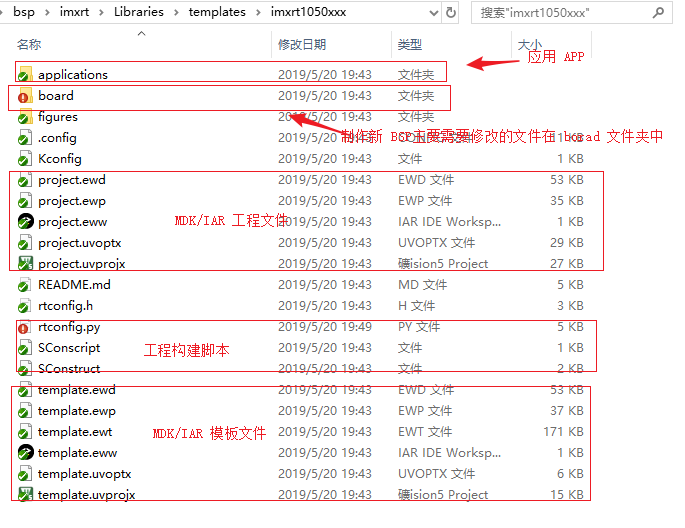

本次制作的 BSP 为 1050 系列，因此拷贝模板文件夹下的 `imxrt1050xxx` 文件夹，并将该文件夹的名称改为 `imxrt1052-fire-pro` ，注意文件夹命名规则为：芯片型号 + 厂家名 + 板子名称。如下图所示：

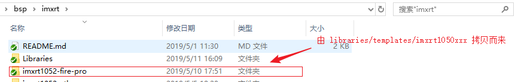

在接下来的 BSP 的制作过程中，将会修改 board 文件夹内的配置文件，将 1050 系列的 BSP 模板变成一个适用于野火 `imxrt1052-fire-pro` 开发板的 BSP ，下表总结了 board 文件夹中需要修改的内容：

| 项目 | 需要修改的内容说明 |
|-------------|-------------------------------------------------------|
| MCUX_Config （文件夹）| MCUX_Config 工程 |
| linker_scripts （文件夹）| 链接脚本 |
| Kconfig | 芯片型号、系列、外设资源 |
| SConscript | 芯片启动文件、目标芯片型号 |

### 3.2 使用 MCUXpresso 配置工程

没有安装 MCUXpresso 软件可以访问[ NXP 官网](https://www.nxp.com/cn/support/developer-resources/software-development-tools/mcuxpresso-software-and-tools:MCUXPRESSO )下载 MCUXpresso 软件。

在制作 BSP 的第二步，需要创建一个基于目标芯片的 MCUXpresso 工程。默认的 MCUXpresso 工程在 MCUX_Config 文件夹中，双击打开 `MCUX_Config.mex` 工程，如下图所示：

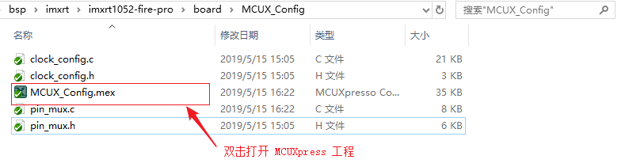

使用 MCUXpresso 工具的一个好处就是可以图形化的配置引脚，不同子系列的芯片外设之间的区别一般是使用的引脚不一样，使用 RT-Thread 外设驱动的第一步就是需要配置外设对应的引脚，而外设的初始化不需要使用工具配置，这个过程在 RT-Thread 外设驱动中完成。

1. 配置外设引脚：BSP 需要一个串口用来做控制台输出，按照下图所示配置串口外设的对应的引脚，只需选择引脚对应的信号为串口外设的接收或者发送即可，无需配置其他参数。

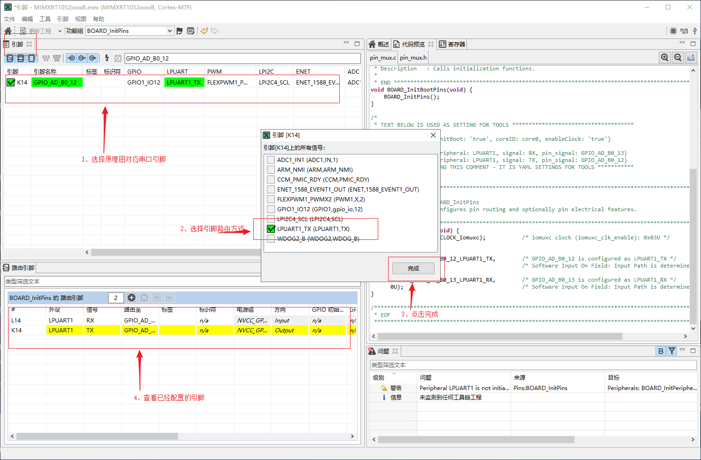

2. 配置时钟：时钟配置工具可以配置 MCU 内部的时钟线上的时钟，外设模块的 clock gate 默认是关闭的，外设初始化的时候才会被打开。如下图所示可以配置串口外设时钟频率：

3. 导出引脚及时钟配置代码相关源文件到 BSP 的 MCUX_Config 文件夹中，引脚配置对应源文件为 `pin_mux.c` 和 `pin_mux.h`，时钟配置对应源文件为 `clock_config.c` 和 `clock_config.h` 。

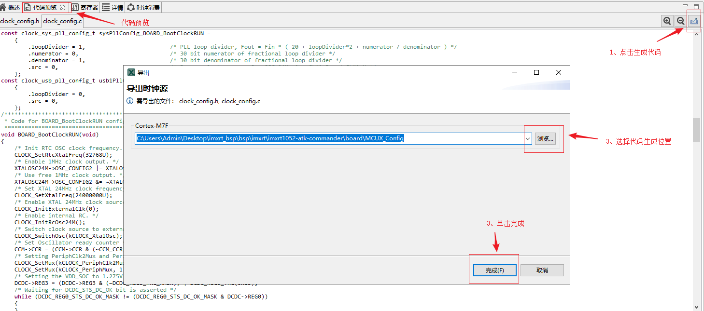

最终 MCUXpresso 生成的工程目录结构如下图所示：

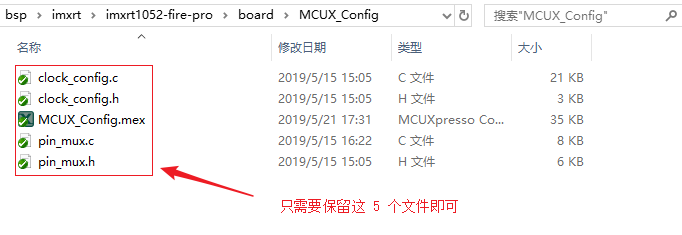

### 3.3 修改 Kconfig 选项

在本小节中修改 `board/Kconfig` 文件的内容有如下两点：

- 芯片型号
- BSP 上的外设支持选项

芯片型号和系列的修改如下表所示：

| 宏定义             | 意义     | 格式               |
| ------------------ | -------- | ------------------ |
| SOC_MIMXRT1052CVL5B    | BSP 芯片型号 | SOC_MIMXRT10xxx       |
| SOC_IMXRT1050_SERIES    | BSP 芯片系列 | SOC_IMXRT10xx_SERIES,i.MX RT 目前包括1015、1020、1050、1060及1064系列       |

关于 BSP 上的外设支持选项，一个初次提交的 BSP 仅仅需要支持 GPIO 驱动和串口驱动即可，因此在配置选项中只需保留这两个驱动配置项，如下图所示：

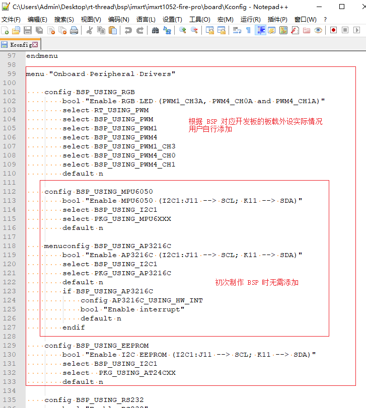

### 3.4 修改工程构建相关文件

接下来需要修改用于构建工程相关的文件。

#### 3.4.1 修改链接脚本

**linker_scripts** 链接文件如下图所示：

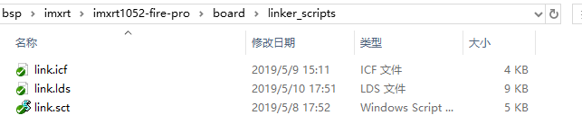

下面以 MDK 使用的链接脚本 link.sct 为例，演示如何修改链接脚本：

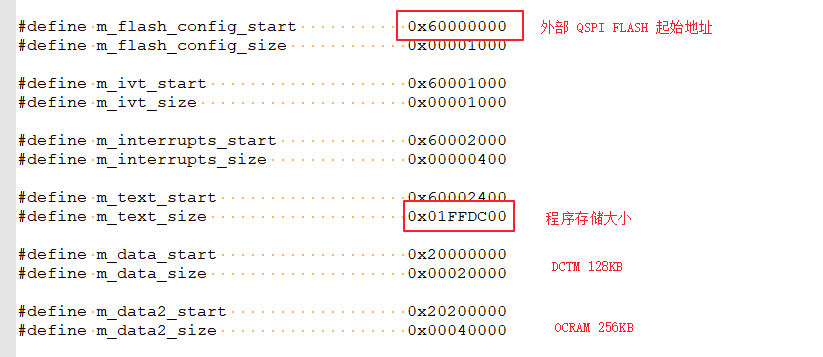

本次制作 BSP 使用的芯片为 MIMIRT1052CVL5B，开发板外接的 QSPI FLASH 大小为 32MB，因此修 m_text_size 为 0x1fffdbff。m_text_size、m_interrupts_size 和 m_flash_config_size 的大小合计为 32MB。

其他两个链接脚本的文件分别为 IAR 使用的 link.icf 和 GCC 编译器使用的 link.lds，修改的方式也是类似的，如下图所示：

- link.icf 修改内容

  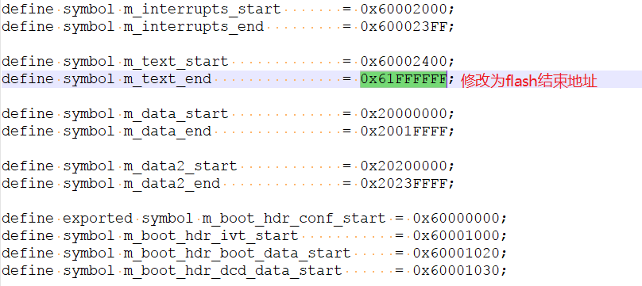

- link.lds 修改内容

  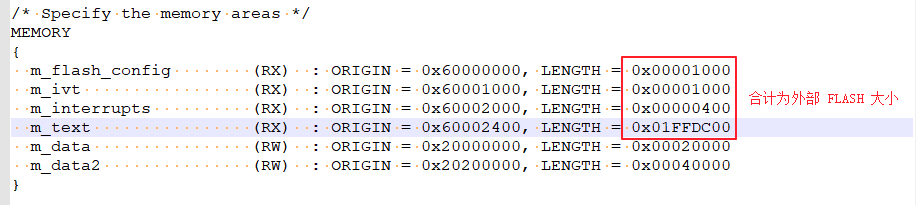

####  3.4.2 修改构建脚本

在这一步中需要修改芯片型号，具体可以参考 SDK 下面的 `fsl_device_registers.h` 文件来确定芯片型号，修改内容如下图所示：

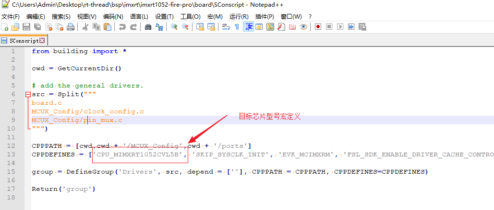

#### 3.4.3 修改工程模板

**template** 文件是生成 MDK/IAR 工程的模板文件，通过修改该文件可以设置工程中使用的芯片型号以及下载方式。MDK4/MDK5/IAR 的工程模板文件，如下图所示：

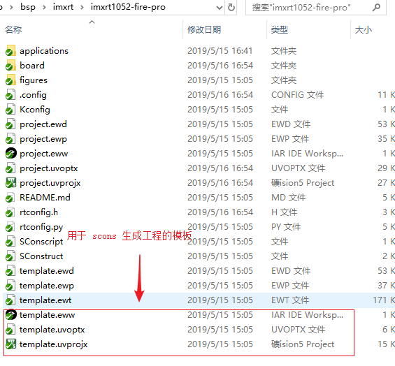

下面以 MDK5 模板的修改为例，介绍如何修改模板配置：

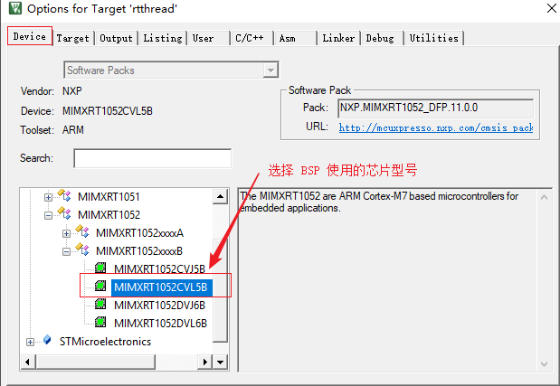

修改程序的默认下载方式：

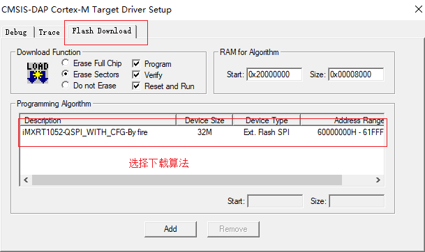

### 3.5 重新生成工程

重新生成工程需要使用 Env 工具。

#### 3.5.1 重新生成 rtconfig.h 文件

在 Env 界面输入命令 menuconfig 对工程进行配置，并生成新的 rtconfig.h 文件。如下图所示：

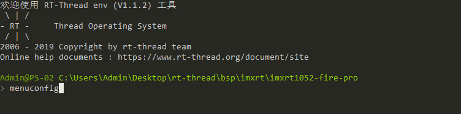

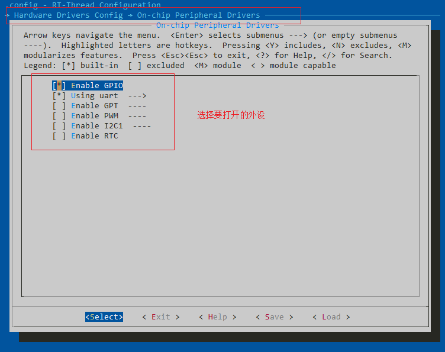

#### 3.5.2 重新 MDK/IAR 工程

下面以重新生成 MDK 工程为例，介绍如何重新生成 BSP 工程。

使用 env 工具输入命令 `scons --target=mdk5` 重新生成工程，如下图所示：

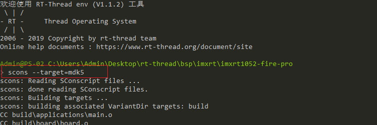

重新生成工程成功：

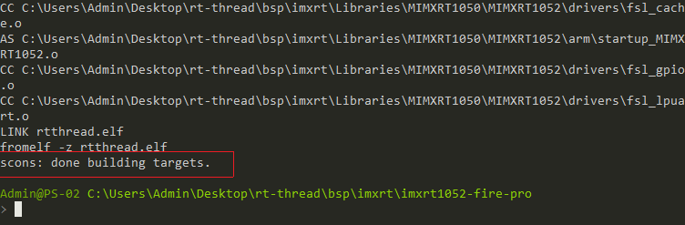

到这一步为止，新的 BSP 就可以使用了。

接下来我们可以分别使用命令 `scons --target=mdk4` 和 `scons --target=iar`，来更新 mdk4 和 IAR 的工程，使得该 BSP 变成一个完整的，可以提交到 GitHub 的 BSP。

感谢每一位贡献代码的开发者，RT-Thread 将与你一同成长。

## 4. 规范

本章节介绍 RT-Thread i.MX RT 系列 BSP 制作与提交时应当遵守的规范 。开发人员在 BSP 制作完成后，可以根据本规范提出的检查点对制作的 BSP 进行检查，确保 BSP 在提交前有较高的质量 。

### 1. BSP 制作规范

i.MX RT BSP 的制作规范主要分为 3 个方面：工程配置，ENV 配置和 IDE 配置。在已有的 i.MX RT 系列 BSP 的模板中，已经根据下列规范对模板进行配置。在制作新 BSP 的过程中，拷贝模板进行修改时，需要注意的是不要修改这些默认的配置。BSP 制作完成后，需要对新制作的 BSP 进行功能测试，功能正常后再进行代码提交。

下面将详细介绍 BSP 的制作规范。

#### 工程配置

- 遵从 RT-Thread 编码规范，代码注释风格统一
- main 函数功能保持一致
  - 如果有 LED 的话，main 函数里只放一个 LED 1HZ 闪烁的程序
- 在 `rt_hw_board_init` 中需要完成堆的初始化：调用 `rt_system_heap_init`
- 默认只初始化 GPIO 驱动和 FinSH 对应的串口驱动，不使用 DMA
- 当使能板载外设驱动时，应做到不需要修改代码就能编译下载使用
- 提交前应检查 GCC/MDK/IAR 三种编译器直接编译或者重新生成后编译是否成功

#### ENV 配置

- 系统心跳统一设置为 1000（宏：RT_TICK_PER_SECOND）
- BSP 中需要打开调试选项中的断言（宏：RT_DEBUG）
- 系统空闲线程栈大小统一设置为 256（宏：IDLE_THREAD_STACK_SIZE）
- 开启组件自动初始化（宏：RT_USING_COMPONENTS_INIT）
- 需要开启 user main 选项（宏：RT_USING_USER_MAIN）
- 默认关闭 libc（宏：RT_USING_LIBC）
- FinSH 默认只使用 MSH 模式（宏：FINSH_USING_MSH_ONLY）

#### IDE 配置

- 使能下载代码后自动运行
- 使能 C99 支持
- 使能 One ELF Setion per Function（MDK）
- keil/iar 生成的临时文件分别放到 build 下的 keil/iar 文件夹下
- MDK/GCC/IAR 生成 bin 文件名字统一成 rtthread.bin

### 2. BSP 提交规范

- 提交前请认真修改 BSP 的 README.md 文件，README.md 文件的外设支持表单只填写 BSP 支持的外设，可参考其他 BSP 填写。查看文档 [i.MX RT 系列驱动介绍](./IMXRT系列驱动介绍.md) 了解驱动分类。
- 提交 BSP 分为 2 个阶段提交：
  - 第一阶段：基础 BSP 包括串口驱动和 GPIO 驱动，能运行 FinSH 控制台。完成 MDK4、MDK5 、IAR 和 GCC 编译器支持，如果芯片不支持某款编译器（比如 MDK4）可以不用做。 BSP 的 README.md 文件需要填写第二阶段要完成的驱动。
  - 第二阶段：完成板载外设驱动支持，所有板载外设使用 menuconfig 配置后就能直接使用。若开发板没有板载外设，则此阶段可以不用完成。不同的驱动也要分开提交，方便 review 和合并。
- 只提交 BSP 必要的文件，删除无关的中间文件，能够提交的文件请对照其他 BSP。
- 提交 i.MX RT 不同系列的 Library 库时，请参考 1050 系列的 FSL 库。
- 提交前要对 BSP 进行编译测试，确保在不同编译器下编译正常。
- 提交前要对 BSP 进行功能测试，确保 BSP 的在提交前符合工程配置章节中的要求。