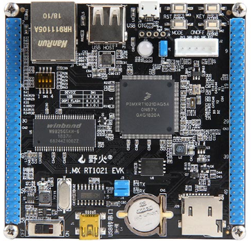

# i.MX RT1021 FIRE EVK 开发板 BSP 说明

## 简介

本文档为 i.MX RT1021 野火 evk 开发板的 BSP (板级支持包) 说明。

主要内容如下：

- 开发板资源介绍
- BSP 快速上手
- 进阶使用方法

通过阅读快速上手章节开发者可以快速地上手该 BSP，将 RT-Thread 运行在开发板上。在进阶使用指南章节，将会介绍更多高级功能，帮助开发者利用 RT-Thread 驱动更多板载资源。

## 开发板介绍

野火 RT1021 开发板是野火电子基于 NXP i.MXRT1021 设计的一款简易型评估板。主芯片采用 IMXRTRT1021DAG5A ，主频 500MHz，板上集成了 32MB SDRAM、32MB Flash、网络、USB 转串口模块。开发板引出所有 IO 口。

开发板外观如下图所示：




该开发板常用 **板载资源** 如下：

- MCU：MIMXRT1021DAG5A，主频 500MHz，256KB RAM
- 外部 RAM：W9825G6KH-6，32MB
- 外部 FLASH：W25Q256JV，32MB
- 常用外设：LED：2个，BLUE（GPIO1_IO29），RGB_LED
- 常用接口：USB 转串口、USB OTG、USB HOST、SD 卡接口、以太网接口
- 调试接口：标准 SWD

开发板更多详细信息请参考野火官方旗舰店[ RT1021 开发板介绍](https://detail.tmall.com/item.htm?abbucket=7&id=600741767722&ns=1&spm=a230r.1.14.16.20b24a6cwDLwL8)。

## 外设支持

本 BSP 目前对外设的支持情况如下：

| **板载外设**      | **支持情况** | **备注**                              |
| :----------------- | :----------: | :------------------------------------- |
| Core LED         |     支持     |  GPIO1_IO29                          |
| RGB LED          |     支持     |                                       |
| SPI Flash        |     支持     |                                       |
| USB 转串口        |     支持     |                                       |
| 以太网            |   暂不支持   |                                       |
| SD卡              |   暂不支持   |                                       |
| CAN               |   暂不支持   |                                       |
| **片上外设**      | **支持情况** | **备注**                              |
| GPIO              |     支持     |   |
| UART              |     支持     | UART1                             |
| SPI               |   暂不支持   | 即将支持                            |
| I2C               |   暂不支持   | 即将支持                             |
| SDIO              |   暂不支持   | 即将支持                              |
| RTC               |   暂不支持   | 即将支持                              |
| PWM               |   暂不支持   | 即将支持                              |


## 使用说明

使用说明分为如下两个章节：

- 快速上手

    本章节是为刚接触 RT-Thread 的新手准备的使用说明，遵循简单的步骤即可将 RT-Thread 操作系统运行在该开发板上，看到实验效果 。

- 进阶使用

    本章节是为需要在 RT-Thread 操作系统上使用更多开发板资源的开发者准备的。通过使用 ENV 工具对 BSP 进行配置，可以开启更多板载资源，实现更多高级功能。


### 快速上手

本 BSP 为开发者提供 MDK5 和 IAR 工程，并且支持 GCC 开发环境。下面以 MDK5 开发环境为例，介绍如何将系统运行起来。

#### 硬件连接

使用 type-c 数据线连接开发板到 PC，打开电源开关。

#### 编译下载

双击 project.uvprojx 文件，打开 MDK5 工程，编译并下载程序到开发板。

> 工程默认配置使用 CMSIS-DAP 仿真器下载程序，点击下载按钮即可下载程序到开发板

#### 运行结果

下载程序成功之后，系统会自动运行，Core LED 以 1 Hz 的频率闪烁。

在终端工具里打开相应的串口（115200-8-1-N），复位设备后，可以看到 RT-Thread 的输出信息:

```bash
 \ | /
- RT -     Thread Operating System
 / | \     5.0.1 build May  2 2023 21:27:42
 2006 - 2022 Copyright by RT-Thread team
msh >
```
### 进阶使用

此 BSP 默认只开启了 GPIO 和 串口1 的功能，如果需使用 SD 卡、Flash 等更多高级功能，需要利用 ENV 工具对BSP 进行配置，步骤如下：

1. 在 bsp 下打开 env 工具。

2. 输入`menuconfig`命令配置工程，配置好之后保存退出。

3. 输入`pkgs --update`命令更新软件包。

4. 输入`scons --target=mdk5/iar` 命令重新生成工程。

本章节更多详细的介绍请参考 [IMXRT 系列 BSP 外设驱动使用教程](../docs/IMXRT系列BSP外设驱动使用教程.md)。

## 联系人信息

维护人:

- [xym-ee](https://github.com/xym-ee), 邮箱：<m@njust.edu.cn>


