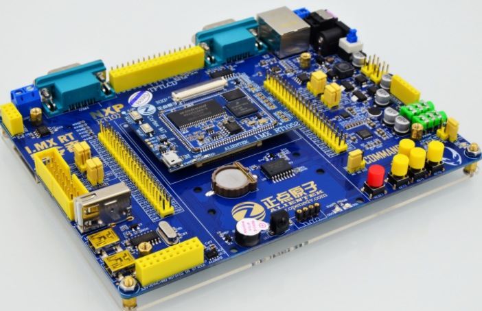
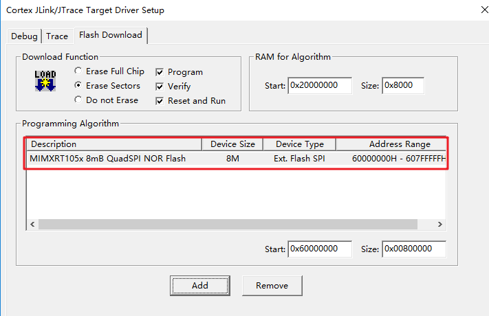

# 正点原子号令者 IMXRT 开发板 BSP 说明

## 简介

本文档为 RT-Thread 开发团队为 imxrt1052-atk-commander 开发板提供的 BSP (板级支持包) 说明。

主要内容如下：

- 开发板资源介绍
- BSP 快速上手
- 进阶使用方法

通过阅读快速上手章节开发者可以快速地上手该 BSP，将 RT-Thread 运行在开发板上。在进阶使用指南章节，将会介绍更多高级功能，帮助开发者利用 RT-Thread 驱动更多板载资源。

## 开发板介绍

探索者 imxrt1052-atk-commander 是正点原子推出的一款基于 ARM Cortex-M7 内核的开发板，最高主频为 600Mhz，该开发板具有丰富的板载资源，可以充分发挥 RT1052CVL5B 的芯片性能。

开发板外观如下图所示：



该开发板常用 ** 板载资源 ** 如下：

- MCU：RT1052CVL5B，主频 100MHz，SRAM：512KB，I/D Cache：32KB。
- 外扩 SDRAM： W9825G6KH， 32M 字节
- 外扩代码 SPI FLASH： W25Q64， 8M 字节
- 外扩数据 SPI FLASH： W25Q256， 32M 字节
- 外扩 EEPROM： AT24C02， 256 字节
- 常用外设
  - LED：2 个，DS0：红色， DS1：绿色
  - 按键，4 个功能按钮
- 常用接口：USB 转串口，可用于程序下载和代码调试
- 调试接口：标准的 JTAG/SWD 调试下载口

开发板更多详细信息请参考正点原子 [号令者 IMXRT 开发板介绍](http://www.openedv.com/forum.php?mod=viewthread&tid=268974)。

## 外设支持

本 BSP 目前对外设的支持情况如下：

| 片上外设 | 支持情况 |               备注                |
| :------------ | :----------: | :-----------------------------------: |
| GPIO         |     支持     | GPIO1~GPIO5  |
| UART         |     支持     |  UART1，UART4      |
| SPI         |     支持      |  SPI3      |
| **板载外设** | **支持情况** |               **备注**                |
| 外扩数据 SPI FLASH    |     支持      |  SPI3      |

## 使用说明

使用说明分为如下两个章节：

- 快速上手

    本章节是为刚接触 RT-Thread 的新手准备的使用说明，遵循简单的步骤即可将 RT-Thread 操作系统运行在该开发板上，看到实验效果 。

- 进阶使用

    本章节是为需要在 RT-Thread 操作系统上使用更多开发板资源的开发者准备的。通过使用 ENV 工具对 BSP 进行配置，可以开启更多板载资源，实现更多高级功能。


### 快速上手

本 BSP 为开发者提供 MDK5 工程。下面以 MDK5 开发环境为例，介绍如何将系统运行起来。

#### 硬件连接

使用 Type-A to Mini-B 线连接开发板的 USB 转串口和 PC 供电，蓝色电源指示灯会点亮。

#### 编译下载

首先需要将需要将 RT1052 的 FLASH下载算法（board目录下的 MIMXRT105x_QuadSPI_4KB_SEC.FLM 文件）拷贝到 MDK 安装路径→ARM→Flash文件夹里面。双击 project.uvprojx 文件，打开 MDK5 工程，按照下图所示选择下载算法并保存设置：



编译工程，工程默认配置使用 JLink 下载程序，点击下载按钮即可下载程序到开发板。

#### 运行结果

下载程序成功之后，系统会自动运行，观察开发板上 LED 的运行效果，绿色 DS1 会周期性闪烁。

USB 转串口默认连接串口 1，在终端工具里打开相应的串口（115200-8-1-N），复位设备后，可以看到 RT-Thread 的输出信息:

```c
 \ | /
- RT -     Thread Operating System
 / | \     4.0.1 build May 24 2019
 2006 - 2019 Copyright by rt-thread team
msh />
```
### 进阶使用

此 BSP 默认只开启了 GPIO 和 串口 1 的功能，更多高级功能需要利用 ENV 工具对 BSP 进行配置，步骤如下：

1. 在 BSP 下打开 env 工具。

2. 输入 `menuconfig` 命令配置工程，配置好之后保存退出。

3. 输入 `pkgs --update` 命令更新软件包。

4. 输入 `scons --target=mdk4/mdk5/iar` 命令重新生成工程。

本章节更多详细的介绍请参考 [STM32 系列 BSP 外设驱动使用教程](../docs/STM32 系列 BSP 外设驱动使用教程. md)。

## 注意事项

暂无

## 联系人信息

维护人:

- [misonyo](https://github.com/misonyo) ，邮箱：<misonyo@foxmail.com>