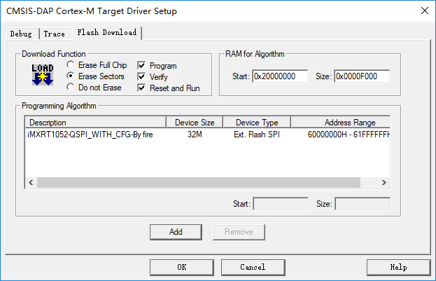

# i.MX RT1052  EVK Pro 开发板 BSP 说明

## 简介

本文档为 RT-Thread 开发团队为野火 i.MX RT1052 EVK Pro 开发板提供的 BSP (板级支持包) 说明。

主要内容如下：

- 开发板资源介绍
- BSP 快速上手
- 进阶使用方法

通过阅读快速上手章节开发者可以快速地上手该 BSP，将 RT-Thread 运行在开发板上。在进阶使用指南章节，将会介绍更多高级功能，帮助开发者利用 RT-Thread 驱动更多板载资源。

## 开发板介绍

i.MX RT1052 EVK Pro 是野火推出的一款基于 ARM Cortex-M7 内核的开发板，最高主频为 600Mhz，该开发板具有丰富的板载资源，可以充分发挥 RT1052 的芯片性能。

开发板外观如下图所示：


该开发板常用**板载资源**如下：

- MCU：i.MX RT1052，主频 600MHz
- 存储：32MB SDRAM、128MB NANDFLASH、32MB QSPI FLASH、2Kb EEPROM
- 常用外设
  - 陀螺仪：MPU6050
  - 光强传感器：AP3216C
  - LED：RGB 彩灯
- 常用接口：USB 转串口、SD 卡接口、以太网接口、LCD 接口、摄像头接口
- 调试接口：标准 JTAG/SWD

开发板更多详细信息请参考野火 [i.MX RT1052 EVK Pro 开发板介绍](https://fire-stm32.taobao.com/index.htm)。

## 外设支持

本 BSP 目前对外设的支持情况如下：

| **板载外设**      | **支持情况** | **备注**                              |
| :----------------- | :----------: | :------------------------------------- |
| USB 转串口        |     支持     |                                       |
| RS232         |     支持         |  UART2|
| RS485             |     支持     |  UART5                             |
| RGB                |     支持     |                           |
| MPU6050 |     支持     |    I2C1               |
| AP3216C              |   支持   |         I2C1                              |
| EEPROM               |   支持   |             I2C1                          |
| **片上外设**      | **支持情况** | **备注**                              |
| GPIO              |     支持     |  |
| UART              |     支持     |      UART1                       |
| I2C               |     支持     |                              |
| RTC               |     支持     |  |
| WDT               |     支持     |                                       |
| PWM               |     支持 |                              |
| GPT               |     支持 |                              |
| CAN               |     支持 |        CAN1                      |

## 使用说明

使用说明分为如下两个章节：

- 快速上手

    本章节是为刚接触 RT-Thread 的新手准备的使用说明，遵循简单的步骤即可将 RT-Thread 操作系统运行在该开发板上，看到实验效果 。

- 进阶使用

    本章节是为需要在 RT-Thread 操作系统上使用更多开发板资源的开发者准备的。通过使用 ENV 工具对 BSP 进行配置，可以开启更多板载资源，实现更多高级功能。


### 快速上手

本 BSP 为开发者提供 MDK5 和 IAR 工程，并且支持 GCC 开发环境。下面以 MDK5 开发环境为例，介绍如何将系统运行起来。

#### 硬件连接

使用数据线连接开发板到 PC，打开电源开关。

#### 编译下载

首先需要将需要将 RT1052 的 FLASH 下载算法（board目录下的MIMXRT105x_QuadSPI_4KB_SEC.FLM 文件）拷贝到 MDK 安装路径→ARM→Flash文件夹里面。双击 project.uvprojx 文件，打开 MDK5 工程，按照下图所示选择下载算法并保存设置：



编译工程，工程默认配置使用 CMSIS-DAP 下载程序，在通过 CMSIS-DAP 连接开发板的基础上，点击下载按钮即可下载程序到开发板

#### 运行结果

下载程序成功之后，系统会自动运行，观察开发板上 LED 的运行效果，蓝色 LED 会周期性闪烁。

连接开发板对应串口到 PC , 在终端工具里打开相应的串口（115200-8-1-N），复位设备后，可以看到 RT-Thread 的输出信息:

```bash
 \ | /
- RT -     Thread Operating System
 / | \     4.0.1 build May 5 2019
 2006 - 2019 Copyright by rt-thread team
msh >
```
### 进阶使用

此 BSP 默认只开启了 GPIO 和 串口 1 的功能，如果需使用 MPU6050 等更多高级外设功能，需要利用 ENV 工具对 BSP 进行配置，步骤如下：

1. 在 bsp 下打开 env 工具。

2. 输入 `menuconfig` 命令配置工程，配置好之后保存退出。

3. 输入 `pkgs --update` 命令更新软件包。

4. 输入 `scons --target=mdk4/mdk5/iar` 命令重新生成工程。

本章节更多详细的介绍请参考 [IMXRT系列BSP外设驱动使用教程](../docs/IMXRT系列BSP外设驱动使用教程.md)。

## 注意事项

暂无

## 联系人信息

维护人:

- [tyustli](https://github.com/tyustli)