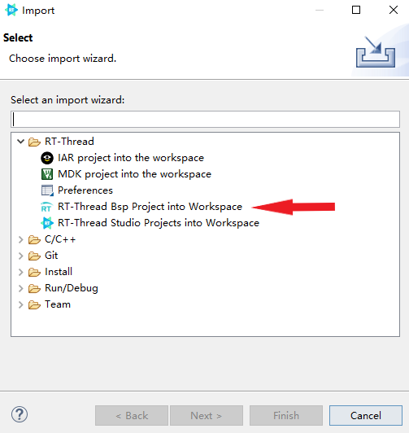
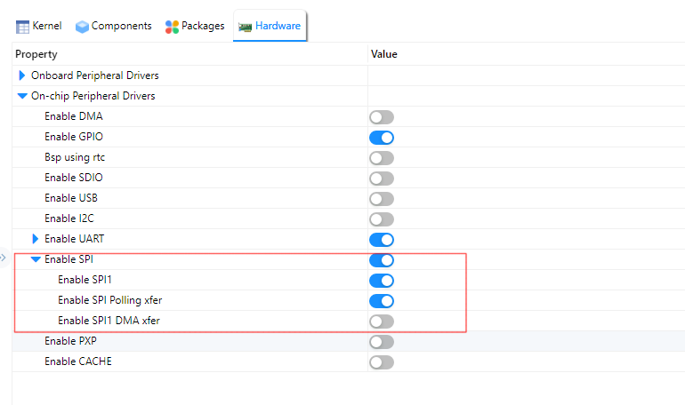
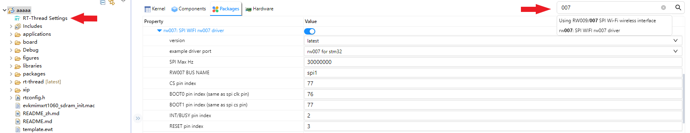

# NXP MIMXRT1060-EVK BSP Introduction

**英文** | [中文](README_zh.md) 

This document records the instruction of the BSP (board support package) that provided by the RT-Thread development team for the MIMXRT1060-EVK development board.

The document is covered in three parts:

- Resources Introduction
- Quickly Get Started
- Advanced Features

By reading the ***Quickly Get Started*** section developers can quickly get their hands on this BSP and run RT-Thread on the board. More advanced features will be introduced in the Advanced Features section to help developers take advantage of RT-Thread to drive more on-board resources.

## 1 Resources Introduction

[](https://github.com/RT-Thread/rt-thread/blob/master/bsp/imxrt/imxrt1060-nxp-evk/figures/MIMXRT1060EVKB.jpg)

Features:

- MCU: MIMXRT1062DVL6A, 600MHz, 4096KB FLASH, 1024KB RAM
- External RAM: IS42S16160J-6BLI, 32MB
- External FLASH: S26KS512SDPBHI02, 64MB
- Common-used Peripherals:
  - LED: One, D18(Green)
  - Button: One
- Common-used Interfaces: USB 、SD Card、Ethernet、LCD, etc
- Debugging interface, standard JTAG/SWD

### 1.1 For more details about these boards, please refer to [NXP Official Website](https://www.nxp.com/part/MIMXRT1060-EVK#/)


### 1.2 Peripherals Condition

Each peripheral supporting condition for this BSP is as follows:

| **On-board Peripherals** | **Support** | **Remark**                            |
| ------------------------ | ----------- | ------------------------------------- |
| USB                      | √           |                                       |
| SPI Flash                | √           |                                       |
| Ethernet                 | √           |                                       |
| **On-chip Peripherals**  | **Support** | **Remark**                            |
| GPIO                     | √           | PA0, PA1... PK15 ---> PIN: 0, 1...176 |
| UART                     | √           | UART1                                 |
| SPI                      |             | Coming Soon                           |
| I2C                      |             | Coming Soon                           |
| SDIO                     |             | Coming Soon                           |
| RTC                      |             | Coming Soon                           |
| PWM                      |             | Coming Soon                           |
| USB Device               |             | Coming Soon                           |
| USB Host                 |             | Coming Soon                           |
| IWG                      |             | Coming Soon                           |
| **Expansion Module**     | **Support** | **Remark**                            |
| LVGL                     | √           |                                       |

### 1.3 Quickly Get Started

This BSP provides MDK4, MDK5, and IAR projects for developers and it supports the GCC development environment. Here's an example of the MDK5 development environment, to introduce how to run the system.

### 1.4 Hardware Connection

Use a cable to connect the development board to the PC and turn on the power switch.

### 1.5 Compile and Download

Double-click the `project.uvprojx` file to open the MDK5 project, compile and download the program to the development board.

> The project defaults to use the CMSIS-DAP emulator to download the program, and as we're connecting the development board via USB, click the Download button can directly download the program to the development board

### 1.6 Running Results

After the program is successfully downloaded, the system runs automatically. Observe the running results of the LED on the development board, the LED will light in 1Hz.

Connect the corresponding serial port of the development board to the PC, and when the corresponding serial port ( 115200-8-1-N) is opened in the terminal tool, the output information of RT-Thread can be seen when the device is reset:

```
 \ | /
- RT -     Thread Operating System
 / | \     4.1.0 build Mar 10 2022 18:07:41
 2006 - 2022 Copyright by RT-Thread team
msh >
```

### 1.7 **Advanced Features**

This BSP only enables GPIO and UART1 by default. If you need more advanced features such as SD Card, Flash, or you need to configure the BSP with RT-Thread homegrown [ENV tool](https://www.rt-thread.io/download.html?download=Env), as follows:

1. Open the ENV tool under the specific BSP folder;
2. Enter `menuconfig` command to configure the project, then save and exit;
3. Enter `pkgs --update` command to update the package;
4. Enter `scons --target=mdk4/mdk5/iar` command to regenerate the project.

More details about NXP MIMXRT1060-EVK , check out [Here](https://github.com/RT-Thread/rt-thread/blob/master/bsp/imxrt/docs/IMXRT%E7%B3%BB%E5%88%97BSP%E5%A4%96%E8%AE%BE%E9%A9%B1%E5%8A%A8%E4%BD%BF%E7%94%A8%E6%95%99%E7%A8%8B.md). 

## 2 MIMXRT1060-EVK User Manual

This manual records the execution instruction of the MIMXRT1060-EVK on RT-Thread homebuilt IDE RT-Thread Studio. 

### 2.1 Preparation

- Clone the RT-Thread repository from GitHub to your local. [Link](https://github.com/RT-Thread/rt-thread)
- Download and install RT-Thread Studio. [Link](https://www.rt-thread.io/studio.html)
- Prepare the [RW007](https://github.com/RT-Thread-packages/rw007/blob/master/README.md) module.

### 2.2 Quickly Get Started

#### 2.2.1 menuconfig to configure the project

Open the directory where the MIMXRT1060-EVK BSP is located and use the menuconfig command in the [ENV tool](https://www.rt-thread.io/download.html?download=Env) to configure the project


#### 2.2.2 Cancel the configuration that is not needed, as follows:

Set the Onboard Peripheral Drivers option:


Set the On-chip Peripheral Drivers option:


### 2.3 Go to File, and click the Import


### 2.4 Import RT-Thread BSP to workspace 



### 2.5 Fill out the project info


### 2.6 Compile project


Till now, the project is compiled, and the preparation is completed.

## 3 Use RT-Studio to Configure BSP Driver 

Each BSP of RT-Thread already has several drivers by default, such as on-chip peripheral driver and on-board peripheral driver, and the drivers can be enabled by opening the corresponding configuration and setting the parameters according to the use environment on RT-Studio IDE. Since the pin has the multiplexing function, it may not have both the available on-chip peripheral driver and on-board peripheral driver at the same time, so it is necessary to check the schematic while enabling the corresponding peripheral drivers.

RT-Thread has a lot of up-for-grab software packages, by using RT-Studio IDE, the software packages can be easily added to the project.


## 4 Connect to Internet: Use the RW007 module

The RW007 is a high-speed WIFI module that uses SPI to communicate with the host. Check the [User Manual](https://github.com/RT-Thread-packages/rw007/blob/master/README.md).

The SPI interface provided by the MIMXRT1060-EVK onboard Arduino interface has duplicate pins with the pins used by the SDIO interface of the SD card, so the on-board SPI interface is not connected by default. We'll be needing you to connect it, check out the location marked DNP in the schematic diagram below (this step is necessary when using the SPI interface). You can use the SPI interface led by the onboard Arduino interface, in this case, the on-board SD card slot is not available.


### 4.1 Configure the onboard SPI peripherals

RW007 supports SPI interface for communication, MIMXRT1060-EVK supports SPI driver, defaults to using polling mode to communicate with RW007 (currently it does not support interrupt and DMA mode to communicate with RW007), the following shows how to use RT-Studio to configure SPI:



### 4.2 Configure the RW007 package using RT-Studio

Click the RT-Thread Settings option on the left, there is a configuration menu will be shown on the right, enter RW007 in the search bar, and select `rw007:SPI WIFI rw007 driver`, the corresponding configuration parameters are as follows:



### 4.3 Plug the RW007 module into the onboard Arduino interface


### 4.4 Modify the RW007 example

Since the default example of the RW007 package is based on the STM32, minor modifications are required on the RT1060-EVK, modify the `rw007_stm32_port.c` file in the example folder in the RW007 package.

Modify the `int wifi_spi_device_init(void)` function, replacing the example with the code given below:

```
int wifi_spi_device_init(void)
{
    char sn_version[32];
    
    rw007_gpio_init();
    rt_hw_spi_device_attach(RW007_SPI_BUS_NAME, "wspi", RW007_CS_PIN);
    rt_hw_wifi_init("wspi");

    rt_wlan_set_mode(RT_WLAN_DEVICE_STA_NAME, RT_WLAN_STATION);
    rt_wlan_set_mode(RT_WLAN_DEVICE_AP_NAME, RT_WLAN_AP);

    rw007_sn_get(sn_version);
    rt_kprintf("\nrw007  sn: [%s]\n", sn_version);
    rw007_version_get(sn_version);
    rt_kprintf("rw007 ver: [%s]\n\n", sn_version);

    return 0;
}
```

### 4.5 After the modification is completed, compile the project and burn the firmware


`rw007 sn` and `rw007 ver` are successfully output, and RW007 driver is successfully connected. 

### 4.6 WIFI connection test

Enter the `wifi scan` command into the shell to search for WIFI.


Enter `wifi` and press `tab` to list wifi-related commands:


Use the ping command to test if the WIFI connection is available:


At this point, the basic environment of the MIMXRT1060-EVK is successfully set up!