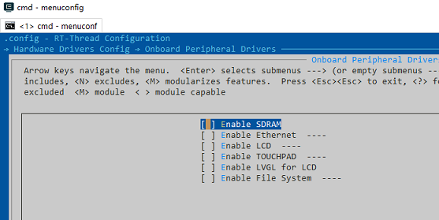
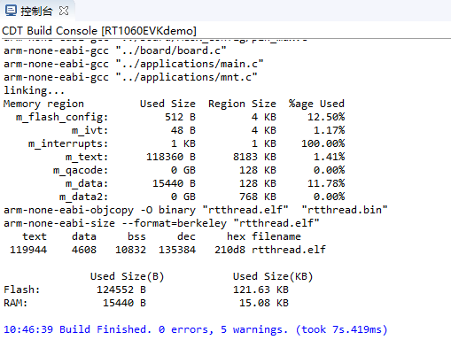
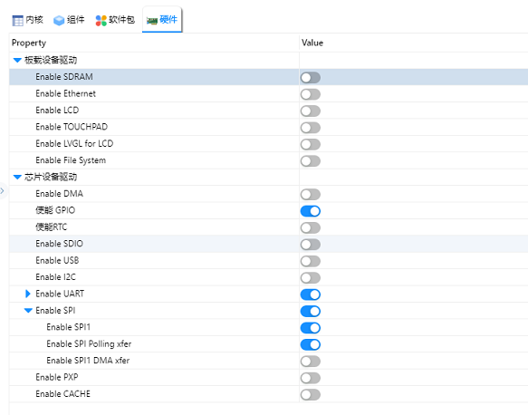
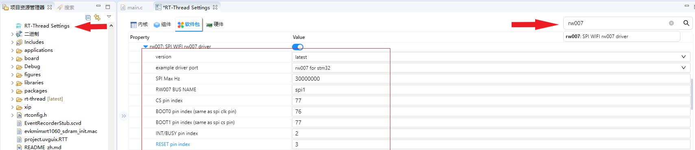
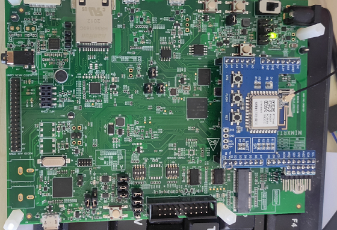
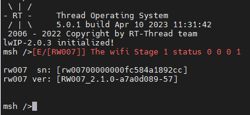

# MIMXRT1060-EVK

**中文** | [英文](README.md) 

## 1 BSP简介

本文档为 MIMXRT1060-EVK 开发板的 BSP (板级支持包) 说明。

主要内容如下：

- 开发板资源介绍
- BSP 快速上手
- 进阶使用方法

通过阅读快速上手章节开发者可以快速地上手该 BSP，将 RT-Thread 运行在开发板上。在进阶使用指南章节，将会介绍更多高级功能，帮助开发者利用 RT-Thread 驱动更多板载资源。

### 1.2 开发板介绍

开发板外观如下图所示：


该开发板常用 **板载资源** 如下：

- MCU：MIMXRT1062DVL6A，主频 600MHz，4096KB FLASH ，1024KB RAM
- 外部 RAM：型号IS42S16160J-6BLI，32MB
- 外部 FLASH：型号S26KS512SDPBHI02，64MB
- 常用外设
  - LED：1个，D18（绿色） 
  - 按键：1个
- 常用接口：USB 转串口、SD 卡接口、以太网接口、LCD 接口等
- 调试接口，标准 JTAG/SWD

开发板更多详细信息请参考【NXP】 [MIMXRT1060-EVK开发板介绍](https://www.nxp.com.cn/design/development-boards/i-mx-evaluation-and-development-boards/i-mx-rt1060-evaluation-kit:MIMXRT1060-EVK)。

### 1.3 外设支持

本 BSP 目前对外设的支持情况如下：

| **板载外设**      | **支持情况** | **备注**                              |
| :----------------- | :----------: | :------------------------------------- |
| USB 转串口        |     支持     |                                       |
| SPI Flash         |     支持     |                                       |
| 以太网            |      支持    |                                       |
| **片上外设** | **支持情况** | **备注**                              |
| GPIO         |     支持     | PA0, PA1... PK15 ---> PIN: 0, 1...176 |
| UART         |     支持     | UART1                                 |
| SPI          |   暂不支持   | 即将支持                              |
| I2C          |   暂不支持   | 即将支持                              |
| SDIO         |   暂不支持   | 即将支持                              |
| RTC          |   暂不支持   | 即将支持                              |
| PWM          |   暂不支持   | 即将支持                              |
| USB Device   |   暂不支持   | 即将支持                              |
| USB Host     |   暂不支持   | 即将支持                              |
| IWG          |   暂不支持   | 即将支持                              |
| **扩展模块** | **支持情况** | **备注**                              |
| LVGL         |     支持     |                                       |

### 1.4 使用说明

使用说明分为如下两个章节：

- 快速上手

    本章节是为刚接触 RT-Thread 的新手准备的使用说明，遵循简单的步骤即可将 RT-Thread 操作系统运行在该开发板上，看到实验效果 。

- 进阶使用

    本章节是为需要在 RT-Thread 操作系统上使用更多开发板资源的开发者准备的。通过使用 ENV 工具对 BSP 进行配置，可以开启更多板载资源，实现更多高级功能。

### 1.6 快速上手

本 BSP 为开发者提供 MDK4、MDK5 和 IAR 工程，以及GCC 开发环境。下面以 MDK5 开发环境为例，介绍如何将系统运行起来。

### 1.7 硬件连接

使用数据线连接开发板到 PC，打开电源开关。

### 1.8 编译下载

双击 project.uvprojx 文件，打开 MDK5 工程，编译并下载程序到开发板。

> 工程默认配置使用 CMSIS-DAP 仿真器下载程序，在通过 USB 连接开发板的基础上，点击下载按钮即可下载程序到开发板

### 1.9 运行结果

下载程序成功之后，系统会自动运行，LED会以1Hz的频率闪烁。

连接开发板对应串口到 PC , 在终端工具里打开相应的串口（115200-8-1-N），复位设备后，可以看到 RT-Thread 的输出信息:

```bash
 \ | /
- RT -     Thread Operating System
 / | \     4.1.0 build Mar 10 2022 18:07:41
 2006 - 2022 Copyright by RT-Thread team
msh >
```
### 1.10 进阶使用

此 BSP 默认只开启了 GPIO 和 串口1 的功能，如果需使用 SD 卡、Flash 等更多高级功能，需要利用 ENV 工具对BSP 进行配置(暂时还不支持，等待第二阶段)，步骤如下：

1. 在 bsp 下打开 env 工具。

2. 输入`menuconfig`命令配置工程，配置好之后保存退出。

3. 输入`pkgs --update`命令更新软件包。

4. 输入`scons --target=mdk/iar` 命令重新生成工程。

本章节更多详细的介绍请参考 [IMXRT 系列 BSP 外设驱动使用教程](../docs/IMXRT系列BSP外设驱动使用教程.md)。

## 2 MIMXRT1060-EVK上手指南

**中文** | [English](MIMXRT1060-EVK User Manual.md)

MIMXRT1060-EVK支持RT-Studio工程，本上手指南以RT-Studio环境的开发说明举例。

### 2.1 准备阶段

- 拉取rt-thread的github仓库到本地，[链接地址](https://github.com/RT-Thread/rt-thread)。

- 下载安装RT-Thread Studio,[链接地址](https://www.rt-thread.org/studio.html)。
- 准备RW007模块。

### 2.2 BSP上手阶段

#### 2.2.1 menuconfig配置工程

打开MIMXRT1060-EVK BSP所在目录，在ENV工具中使用menuconfig命令配置工程


#### 2.2.2 取消暂时不需要的配置，具体操作如下：

Onboard Peripherial Drivers选项设置：



On-chip Peripherial Drivers选项设置：


### 2.3 点击文件，选择导入选项。


### 2.4 选择导入RT-Thread Bsp 到工作空间中


<div STYLE="page-break-after: always;"></div>

### 2.5 按照示例填写工程信息


<div STYLE="page-break-after: always;"></div>

### 2.6 编译工程



工程编译通过，至此，准备阶段完成。

## 3 使用RT-Studio配置BSP驱动

RT-Thread每个BSP已经默认适配了若干片上外设驱动与板载外设驱动，使用RT-Studio将相应的开关直接打开并依据使用环境配置相应参数即可使用。由于各个管脚存在复用功能，所以并不是所有的片上外设驱动与板载外设驱动都可以同时使用，使用时需要结合原理图来合理开启相应的外设驱动。

RT-Thread有许多软件软件包，使用RT-Studio将相应软件包的开关打开便可将软件包添加至工程使用。



## 4 联网实操：使用RW007模块联网

RW007 是由上海睿赛德电子科技有限公司开发的高速 WiFi 模块，使用 SPI 与主机通信。[RW007使用指南链接](https://www.rt-thread.org/document/site/#/rt-thread-version/rt-thread-standard/application-note/packages/rw007_module_using/an0034-rw007-module-using)。

MIMXRT1060-EVK板载arduino接口提供的SPI接口与SD卡的SDIO接口使用的管脚存在重复的管脚，所以板载的SPI接口默认未连接，将下方**原理图中标记DNP的地方连接起来(使用SPI接口一定要做这一步！！！)**便可以使用板载arduino接口引出的SPI接口，此时板载的SD卡槽不可使用。


### 4.1 配置板载SPI外设

RW007可采用SPI接口通讯，MIMXRT1060-EVK支持SPI驱动，默认采用轮询的方式与RW007通讯(暂不支持中断与DMA模式与RW007通讯)，使用RT-Studio配置SPI的具体配置如下:


### 4.2 使用RT-Studio配置RW007软件包

点击左侧的RT-Thread Settings选项，弹出右侧的配置菜单，在搜索栏中输入RW007,选择`rw007:SPI WIFI rw007 driver `，相应配置参数如下：



### 4.3 将RW007模块插入板载的arduino接口



### 4.4 修改RW007示例

由于RW007软件包的默认示例是基于STM32的示例，所以在RT1060-EVK上需进行少量的修改，修改RW007软件包中的example文件夹中的rw007_stm32_port.c文件。

修改`int wifi_spi_device_init(void)`函数，使用下述给出的代码替换原有的示例：

```c
int wifi_spi_device_init(void)
{
    char sn_version[32];
    
    rw007_gpio_init();
    rt_hw_spi_device_attach(RW007_SPI_BUS_NAME, "wspi", RW007_CS_PIN);
    rt_hw_wifi_init("wspi");

    rt_wlan_set_mode(RT_WLAN_DEVICE_STA_NAME, RT_WLAN_STATION);
    rt_wlan_set_mode(RT_WLAN_DEVICE_AP_NAME, RT_WLAN_AP);

    rw007_sn_get(sn_version);
    rt_kprintf("\nrw007  sn: [%s]\n", sn_version);
    rw007_version_get(sn_version);
    rt_kprintf("rw007 ver: [%s]\n\n", sn_version);

    return 0;
}
```

### 4.5 修改完成后，编译工程，烧录固件。



`rw007 sn`与`rw007 ver`可以正常输出无乱码时，RW007驱动成功！

### 4.6 wifi联网测试

在shell中输入`wifi scan`命令搜索WIFI。


输入`wifi`,按`tab`键列出wifi相关命令：


连接目标wifi测试，使用ping命令测试是否连接成功：


至此MIMXRT1060-EVK的基础环境便搭建测试完毕！