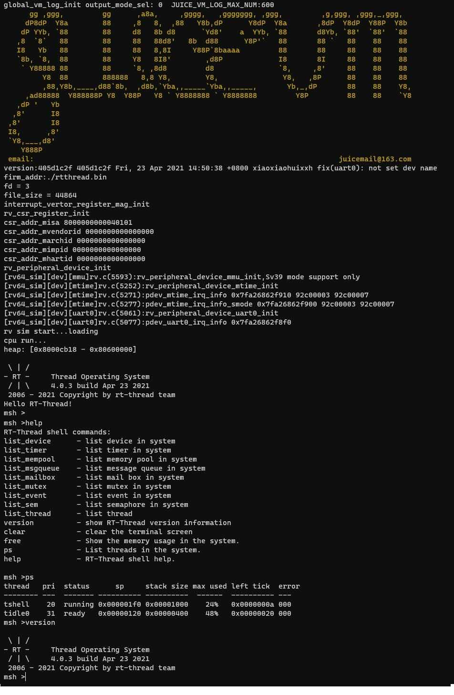

# JuiceVm 虚拟机 BSP 说明

标签： Risc-V 64bit ima、JuiceVm

---

## 简介

本文档为 JuiceVm 开发团队为 JuiceVm 虚拟机提供的 BSP (板级支持包) 说明。

主要内容如下：

- 开发板资源介绍
- BSP 快速上手
- 进阶使用方法

通过阅读快速上手章节开发者可以快速地上手该 BSP，将 RT-Thread 运行在开发板上。在进阶使用指南章节，将会介绍更多高级功能，帮助开发者利用 RT-Thread 驱动更多板载资源。

## 虚拟机介绍

JuiceVm 虚拟机是 juice 开发的一款 Risc-V 64bit ima 虚拟机，Risc-V 64bit 虚拟机界面如下图所示：



该虚拟机常用**资源**如下：

- MCU：Risc-V 64bit ima，300MB RAM，支持M-MODE,S-MODE,
- 常用外设
  - UART0
- 常用接口：UART
- 调试接口: 标准 GDB 【TODO】

更多详细信息请参考【Juice】[JuiceVm 虚拟机](https://whycan.com/t_5844.html)。

## 外设支持

本 BSP 目前对外设的支持情况如下：

|**片上外设**     |**支持情况**|**备注**                             |
| :----------------- | :----------: | :-----------------------------------|
| GPIO              |   暂不支持   | 即将支持                              |
| MMU(SV39)         |   暂不支持   | 即将支持                              |
| UART              |     支持     | UART0                                |
| SDIO              |   暂不支持   | 即将支持                              |
| RTC               |   暂不支持   | 即将支持                              |
| PWM               |   暂不支持   | 即将支持                              |
| USB Device        |   暂不支持   | 即将支持                              |
| USB Host          |   暂不支持   | 即将支持                              |

## 使用说明

使用说明分为如下两个章节：

- 快速上手

    本章节是为刚接触 RT-Thread 的新手准备的使用说明，遵循简单的步骤即可将 RT-Thread 操作系统运行在该开发板上，看到实验效果 。

- 进阶使用

    本章节是为需要在 RT-Thread 操作系统上使用更多开发板资源的开发者准备的。通过使用 ENV 工具对 BSP 进行配置，可以开启更多板载资源，实现更多高级功能。

### 快速上手

本 BSP 为开发者提供 GCC 开发环境。下面以 GCC 开发环境为例，介绍如何将系统运行起来。

#### 编译下载
##### toolchain 下载
- 到 xpack-dev-tools 下载 [点击跳转](https://github.com/xpack-dev-tools/riscv-none-embed-gcc-xpack/releases/tag/v8.3.0-2.1)
  ```
  wget https://github.com/xpack-dev-tools/riscv-none-embed-gcc-xpack/releases/download/v8.3.0-2.1/xpack-riscv-none-embed-gcc-8.3.0-2.1-linux-x64.tar.gz 
  ```
- 解压到/opt目录下 
  ```
  tar vxf xpack-riscv-none-embed-gcc-8.3.0-2.1-linux-x64.tar.gz -C /opt
  ```
- 到rt-thread/bsp/juicevm目录下执行
 ```
 scons
 ```
- 下载 JuiceVm
浏览器打开：
https://whycan.com/files/members/1390/juice_vm_release_for_Linux_57ba985a.zip

- 运行固件
  ./juice_vm_for_Linux.out -a -g ./rtthread.bin

#### 运行结果

在console可以看到 RT-Thread 的输出信息:

```c
global_vm_log_init output_mode_sel: 0  JUICE_VM_LOG_MAX_NUM:600
      gg ,ggg,         gg      ,a8a,     ,gggg,   ,ggggggg, ,ggg,         ,g,ggg, ,ggg,_,ggg,  
     dP8dP  Y8a        88     ,8   8,  ,88   Y8b,dP      Y8dP  Y8a       ,8dP  Y8dP  Y88P  Y8b 
    dP YYb, `88        88     d8   8b d8      `Yd8'    a  YYb, `88       d8Yb, `88'  `88'  `88 
   ,8  `8`   88        88     88   88d8'   8b  d88      Y8P'`   88       88 `   88    88    88 
   I8   Yb   88        88     88   8,8I     Y88P`8baaaa         88       88     88    88    88 
   `8b, `8,  88        88     Y8   8I8'        ,d8P             I8       8I     88    88    88 
    ` Y88888 88        88     `8, ,8d8         d8               `8,     ,8'     88    88    88 
         Y8  88        888888   8,8 Y8,        Y8,               Y8,   ,8P      88    88    88 
         ,88,Y8b,____,d88`8b,  ,d8b,`Yba,,_____`Yba,,_____,       Yb,_,dP       88    88    Y8,
     ,ad88888  Y888888P Y8  Y88P   Y8 ` Y8888888 ` Y8888888         Y8P         88    88    `Y8
   ,dP '   Yb                                                                                  
  ,8'      I8                                                                                  
 ,8'       I8                                                                                  
 I8,      ,8'                                                                                  
 `Y8,___,d8'                                                                                   
    Y888P                                                                                      
 email:                                                                       juicemail@163.com
version:57ba985a 57ba985a Fri, 23 Apr 2021 17:22:20 +0800 xiaoxiaohuixxh feat(Rt-thread): uart port pass
firm_addr:./rtthread.bin
fd = 3
file_size = 44872
interrupt_vertor_register_mag_init
rv_csr_register_init
csr_addr_misa 8000000000040101
csr_addr_mvendorid 0000000000000000
csr_addr_marchid 0000000000000000
csr_addr_mimpid 0000000000000000
csr_addr_mhartid 0000000000000000
rv_peripheral_device_init
[rv64_sim][dev][mmu]rv.c(5593):rv_peripheral_device_mmu_init,Sv39 mode support only
[rv64_sim][dev][mtime]rv.c(5252):rv_peripheral_device_mtime_init
[rv64_sim][dev][mtime]rv.c(5271):pdev_mtime_irq_info 0x7f334d2d0910 92c00003 92c00007
[rv64_sim][dev][mtime]rv.c(5277):pdev_mtime_irq_info_smode 0x7f334d2d0900 92c00003 92c00007
[rv64_sim][dev][uart0]rv.c(5061):rv_peripheral_device_uart0_init
[rv64_sim][dev][uart0]rv.c(5077):pdev_uart0_irq_info 0x7f334d2d08f0
rv sim start...loading
cpu run...
heap: [0x8000cb60 - 0x92c00000]

 \ | /
- RT -     Thread Operating System
 / | \     4.0.3 build Apr 26 2021
 2006 - 2021 Copyright by rt-thread team
Hello RT-Thread!
msh >
```

### 进阶使用

此 BSP 默认只开启了 UART0 的功能和直接运行功能
如果需使用更多功能，可以执行
```
./juice_vm_for_Linux.out
```
查看相关帮助信息开启调试和实时汇编输出功能
## 注意事项

编译参数请使用rv64ima,暂不支持Risc-V的c模块

## 维护人信息

- [Juice](https://github.com/xiaoxiaohuixxh)
- [邮箱](juicemail@163.com)

## 参考资料

* [RT-Thread 文档中心](https://www.rt-thread.org/document/site/)

* [JuiceVm 虚拟机更新发布页](https://whycan.com/t_5844.html)

