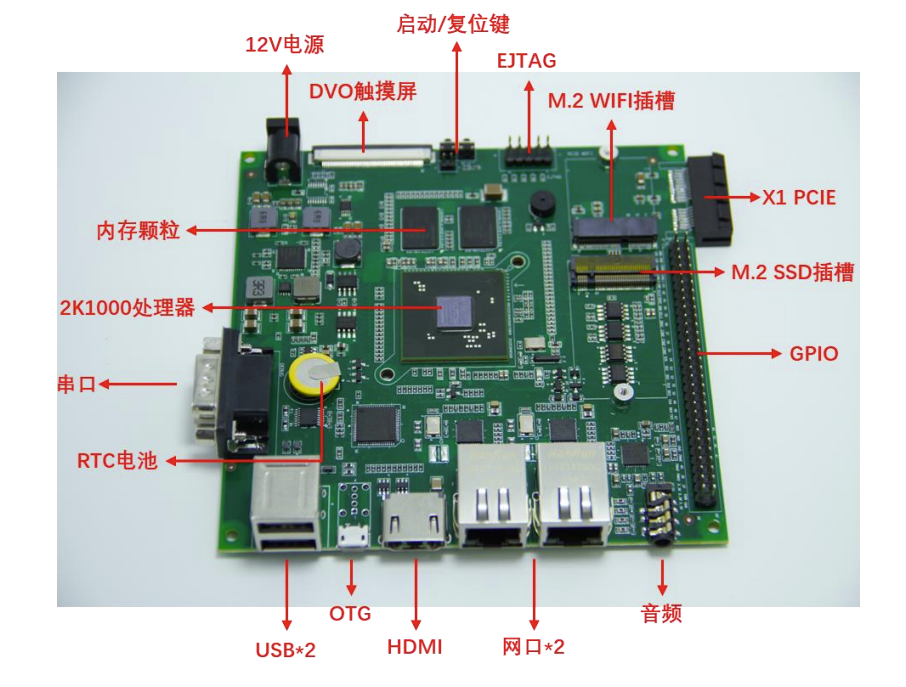

# loongson_pi2 板级支持包说明

## 1. 简介

2K龙芯派采是首款采用2K1000低功耗处理的嵌入式方案验证板，具有资源丰富、接口齐全、低功耗、高可靠的特点。

| 硬件 | 描述 |
| -- | -- |
|芯片型号| 2K1000 |
|CPU| GS264 |
|主频| 1GHz |
|DDR3| 2GB |
|片外Flash| 8Mb SPI FLASH |

[龙芯派][1]搭载 2K1000 处理器（主频 1GHz），板载 DDR3 颗粒，实现 DDR3 的运行存储功能。实现了 GPIO 的输入输出，中断功能。板上集成 1 个网 口，集成 3 个 USB 接口，HDMI 接口，LCD 接口，音频输入/输出，集成 SD 卡接口，集成 2 个 CAN 接口，集成 RTC 计时功能。可以外扩 WIFI 模块。2K 龙芯派可以广泛应用于信息安 全、电力、轨道交通、工业控制、信号处理、数据通信、信息教育等领域。


## 2. 编译说明

环境搭建在**Ubuntu**上进行，首先下载[mips-sde-elf-gcc][2]。该文件存放在网盘中，提取码为ucb2。

**windows**上环境搭建可以下载如下工具链：

[mips-2015.05-19-mips-sde-elf.exe](https://sourcery.mentor.com/GNUToolchain/package13851/public/mips-sde-elf/mips-2015.05-19-mips-sde-elf.exe)

解压到指定的目录，然后修改当前bsp目录下的`rtconfig.py`文件。

```python
if  CROSS_TOOL == 'gcc':
	PLATFORM    = 'gcc'
	EXEC_PATH   = "/opt/mips-2015.05-19-mips-sde-elf-i686-pc-linux-gnu/mips-2015.05/bin/"
```

如果不想修改`rtconfig.py`可以尝试第二种办法：

安装好工具链后，假设工具链安装在`D:\mgc\embedded\codebench`目录下。使用env工具，打开console后，进入到命令行环境中，需要手动设置工具链的环境变量`RTT_EXEC_PATH`：

```
    set RTT_EXEC_PATH=D:\mgc\embedded\codebench\bin
```

或者通过 `scons --exec-path="GCC工具链路径"` 命令，在指定工具链位置的同时直接编译。

使用env工具，可以在console下进入到`bsp/ls2kdev`目录中，然后在控制台输入`scons`即可，可以生成`rtthread.elf`、`rtthread.bin`文件，其中`rtthread.elf`是下载到开发板上的程序。

## 3.程序运行

rt-thread固件目前在龙芯派上推荐使用[pmon][3]通过tftp的方式下载到设备内存中运行。

其中龙芯派硬件分布如下图所示：



首先板子接上12V的电源，然后连接串口，该串口为RS232，所以需要RS232转USB线来进行连接。接着连接`LAN0`网口。

初次上电时，需要按下开发板的`START`按键，听到`滴`启动声后可以在控制台看到串口打印信息。通过启动时在控制台不停的按下字符`c`直到进入到pmon控制台。


需要让开发板和主机处于同一网段，利用pmon的tftp进行固件传输。首先查看主机的ip地址，如果`ifconfig`查看ip是`192.168.12.35`。输入以下指令开始运行。

```
ifaddr syn0 192.168.12.100 
load tftp://192.168.12.35/rtthread.elf;
g
```

其中`ifaddr`是设置pmon设置网络的命令，`syn0`表示第一个网卡。然后从tftp的主机上加载`rtthread.elf`文件，此时主机必须有tftp服务器。`g`表示程序跳转运行。

而后可以看到rtthread程序正常的运行。

```
   zero      at       v0       v1       a0       a1       a2       a3   
 00000000 00000000 00000000 00000000 00000003 aafffea8 8f800000 8f1371d0
    t0       t1       t2       t3       t4       t5       t6       t7   
 00000000 00000000 00000000 00000000 00000000 00000000 00000000 00000000
    s0       s1       s2       s3       s4       s5       s6       s7   
 00000000 00000000 00000000 00000000 00000000 00000000 00000000 00000000
    t8       t9       k0       k1       gp       sp       s8       ra   
 00000000 00000000 00000000 00000000 00000000 aafffe88 00000000 8f0b1418
Current SR: 0x10008080

 \ | /
- RT -     Thread Operating System
 / | \     4.0.3 build Apr  7 2020
 2006 - 2020 Copyright by rt-thread team
Hi, this is RT-Thread!!
msh >
```

## 4.开机自动启动

在调试阶段，可以利用脚本，在pmon阶段从TFTP服务器上获取固件，然后引导启动。这样可以节省开发配置的时间。具体的步骤如下：

**第一步：**
设置开发板的IP地址，在进入pmon的控制台后，输入`set ifconfig syn0:10.1.1.100`。其中`syn0`后面的ip地址为开发板的ip地址，与存放rt-thread固件的TFTP的服务器IP地址在**同一网段**。

**第二步：**

进入龙芯的Debian系统，用管理员权限进入，输入用户名`root`，密码`loongson`。并且修改boot分区下的boot.cfg文件。增加如下：

```
title   TFTPBOOT
 kernel tftp://10.1.1.118/rtthread.elf
 args console=tty root=/dev/sda2
 initrd (wd0,0)/initrd.img
```

其中`tftp://10.1.1.118/rtthread.elf`中的`10.1.1.118`为tftp服务器的ip地址。

**第三步：**

电脑开启TFTP服务器，将路径指向存放有ls2k的rt-thread固件的目录下。

以上三步完成之后，重启系统，就可以省略每次都需要进入pmon的输入命令的麻烦，板子上电后，可以自动从系统TFTP服务器中获取固件，然后启动，大大提高调试代码效率。

## 5.SATA接口的SSD文件系统支持

当前已经支持SATA接口的SSD文件系统驱动，需要通过menuconfig

```
RT-Thread online packages  --->
	 			system packages  --->
	 				lwext4: an excellent choice of ext2/3/4 filesystem for microcontrollers
```

然后输入下面的命令更新软件包

```
pkgs --update
```

输入`scons`编译代码即可使用SATA接口的SSD文件系统。

## 6. 支持情况

| 驱动 | 支持情况  |  备注  |
| ------ | ----  | :------:  |
| UART | 支持 | UART0\UART4,波特率可调 |
| GPIO | 支持 | - |
| PWM | 支持 | - |
| GMAC | 支持 | 网卡驱动 |
| RTC  | 支持 | - |
| SPI | 支持 | - |
| SATA SSD | 支持 | 需要打开lwext4软件包 |

## 7. 联系人信息

维护人：[bernard][4]

[1]: http://ftp.loongnix.org/loongsonpi/pi_2/doc
[2]: https://pan.baidu.com/s/17dbdOE4NAJ-qEW7drVRq2w
[3]: http://ftp.loongnix.org/embedd/ls2k/
[4]: https://github.com/BernardXiong