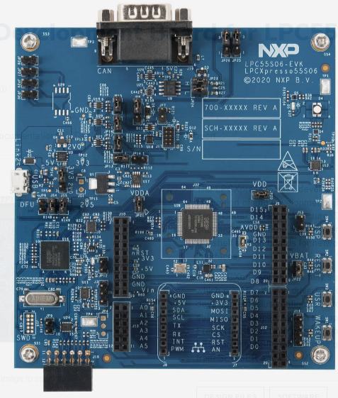

# LPC55S06-EVK 板级支持包

## 1. 简介(Introduction)

LPC55S06 是由恩智浦NXP半导体推出的基于Cortex-M33内核的高性能单片机
包括如下硬件特性：

| 硬件 | 描述 |
| -- | -- |
|芯片型号| LPC55S06 全系列 |
|CPU| Cortex-M33, with FPU |
|主频| 96MHz |
|基本外设| 8个Flexcomm(任意配置为USART/SPI/I2C/I2S) / 1个50MHz SPI / 双USB(1高1全，支持主从) |
|特色| PowerQuad DSP协处理器 / 安全外设:PRINCE/PUF/CASPER/AES-256/HASH |

## 2. 硬件开发环境(Hardware development system)

开发板（EVK）




## 3. 编译说明


| 环境         | 说明                                                 |
| ------------ | ---------------------------------------------------- |
| PC操作系统   | Linux/MacOS/Windows                                  |
| 编译器       | armcc                                                |
| 构建工具     | scons/mdk5                                           |
| 依赖软件环境 | Env工具/(MDK或IAR或arm-none-eabi-gcc)/git/调试器驱动 |

1) 下载源码

```bash
    git clone https://github.com/RT-Thread/rt-thread.git
```

2) 配置工程并准备env

（Linux/Mac）

```bash
    cd rt-thread/bsp/lpc55S06_evk
    scons --menuconfig
    source ~/.env/env.sh
    pkgs --upgrade
```

（Windows）

>在[RT-Thread官网][1]下载ENV工具包

3) 配置芯片型号

（Linux/Mac）

```bash
    scons --menuconfig
```

（Windows(ENV环境中)）

```bash
    menuconfig
```

在menuconfig页面配置并选择对应的芯片型号，若开发环境为MDK/IAR，则需要生成工程

4) 生成工程(Mac/Linux下请跳过此步骤)

（Windows IAR）

```bash
    SET RTT_CC=iar
    scons --target=iar -s
```

（Windows MDK5）*

```bash
    scons --target=mdk5 -s
```

*该板级支持包不支持生成mdk4的工程

**MDK 与 IAR 在生成完成工程之后一定要在工程中手动选择一次芯片信号，否则会产生严重编译错误**


5) 编译

使用MDK或IAR请参见对应教程

（Windows arm-none-eabi-gcc）
使用以下指令设置gcc路径

```bash
    SET RTT_EXEC_PATH=[GCC路径]
```

（Linux/Mac arm-none-eabi-gcc）
使用以下指令设置gcc路径

```bash
    export RTT_EXEC_PATH=[GCC路径]
```

编译（WindowsLinux/Mac arm-none-eabi-gcc）

```bash
    scons -j4
```

或者通过 `scons --exec-path="GCC工具链路径"` 命令，在指定工具链位置的同时直接编译。

出现下列信息即为编译成功

```bash
    LINK rtthread-lpc55S06.elf
    arm-none-eabi-objcopy -O binary rtthread-lpc55s6x.elf rtthread.bin
    arm-none-eabi-size rtthread-lpc55S06.elf
    text    data     bss     dec     hex filename
    41596     356    1456   43408    a990 rtthread-lpc55s6x.elf
    scons: done building targets.
```

## 3. 烧写及执行

烧写可以使用仿真器 ISP等多种方式 此处不再赘述

### 3.1 运行结果

如果编译 & 烧写无误，会在Flexcomm0串口*上看到RT-Thread的启动logo信息：

```bash
 \ | /
- RT -     Thread Operating System
 / | \     4.0.1 build Jul 30 2019
 2006 - 2019 Copyright by rt-thread team
uising armclang, version: 6120001
msh />
```

*默认串口


## 4. 驱动支持情况及计划

| 驱动       | 支持情况 | 备注                         |
| ---------- | :------: | :--------------------------: |
| UART       | 支持     | UART0/2                 |
| GPIO       | 支持     | 自动根据芯片型号选择引脚布局 |
| SPI        | 支持     | 支持High Speed SPI     |
| USB Device | 不支持 | 暂不支持          |
| USB Host   | 不支持  | 暂不支持      |
| Windowed WatchDog | 不支持  | 支持                        |
| ADC | 不支持 | 暂不支持 |
| I2C       | 支持     | 可配合MMA8562          |
| I2C Sensor | 支持     | 获取板上MMA8562加速度传感器数据 |
| RTC        | 支持     | RTC时钟自动配置              |
| SDIO       | 支持     | 操作SD卡                     |
| I2S        | 不支持  | 暂不支持      |

## 6. 联系人信息

维护人:
alex.yang@nxp.com
