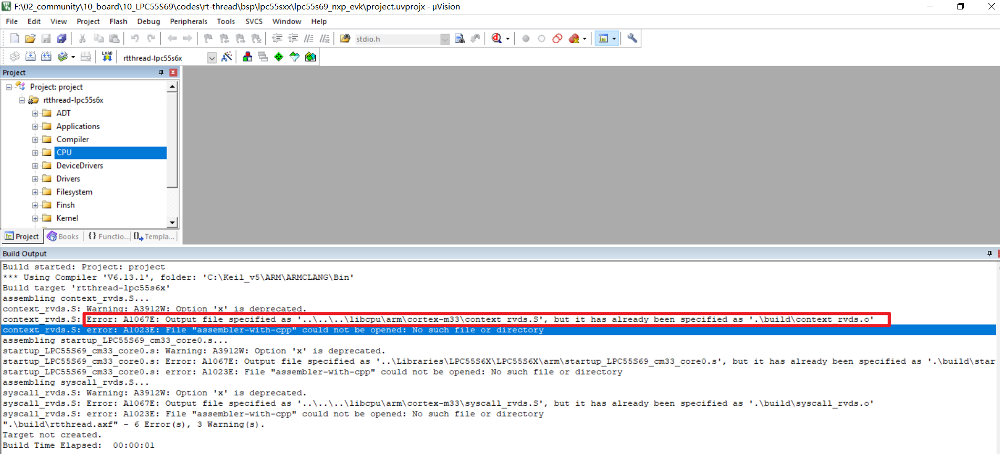

# LPC55S69-EVK BSP Introduction

**English** | [中文](README_zh.md)

## 1. Introduction

The LPC55S69 is a high-performance microcontroller based on the Cortex-M33 core from NXP Semiconductors.
Includes the following hardware features:

| HARDWARE | DESCRIPTION |
| -- | -- |
|Chip model| LPC556x/LPC55S6x Full range |
|CPU| Cortex-M33 Dual Core, with FPU |
|Frequency| 150MHz |
|Basic peripherals| 8 x Flexcomm (optionally configured as USART/SPI/I2C/I2S) / 1 x 50MHz SPI / Dual USB (1 H and 1 Full, Master-Slave Support) |
|Characteristic| PowerQuad DSP coprocessor/security peripheral: PRINCE/PUF/CASPER/AES-256/HASH |

## 2. Hardware development system


## 3. Quickly Get Started


| ENVIRONMENT         | DESCRIPTION                                                  |
| ------------------- | ------------------------------------------------------------ |
| PC Operating System | Linux/MacOS/Windows                                          |
| Compiler            | arm-none-eabi-gcc version 6.3.1 20170620 (release)/armcc/iar |
| Build tools         | scons/mdk5/iar                                               |
| Depends             | Env tool/(MDK or IAR or arm-none-eabi-gcc)/git/debugger driver |

1) Download the source code

```bash
    git clone https://github.com/RT-Thread/rt-thread.git
```

2) Configure the project and prepare the ENV

（Linux/Mac）

```bash
    cd rt-thread/bsp/lpc55s69_evk
    scons --menuconfig
    source ~/.env/env.sh
    pkgs --upgrade
```

（Windows）

>Download the ENV toolkit [RT-Thread][1]

3) Configure the chip model

（Linux/Mac）

```bash
    scons --menuconfig
```

（Windows(use ENV)）

```bash
    menuconfig
```

On the menuconfig page, configure and select the corresponding chip model, if the development environment is MDK/IAR, you need to generate the project.

4) Build Project (please skip this step under Mac/Linux)

（Windows IAR）

```bash
    SET RTT_CC=iar
    scons --target=iar -s
```

（Windows MDK5）*

```bash
    scons --target=mdk5 -s
```

*This board support package does not support projects that generate MDK4

**MDK and IAR must manually select the chip signal once in the project after the project is built, otherwise a serious compilation error will be generated.**

---

Note: Because some versions of Keil5 have issues with AC6 compiler support, it is recommended to upgrade keil to the latest version

> [Download the latest version of Keil here](https://www.keil.com/update/check.asp?P=MDK&V=5.38.0.0&S=)

Some error messages are as follows:



Or you can choose to refer to this forum post:[AC6 compiler error unsupported option '--c99' solution](https://club.rt-thread.org/ask/question/4c744e41ded5efb0.html)

---

5) Compile

To use the MDK or IAR, see the corresponding tutorial

（Windows arm-none-eabi-gcc）
Use the following command to set the GCC path

```bash
    SET RTT_EXEC_PATH=[GCC path]
```

（Linux/Mac arm-none-eabi-gcc）
Use the following command to set the GCC path

```bash
    export RTT_EXEC_PATH=[GCC path]
```

Compile（WindowsLinux/Mac arm-none-eabi-gcc）

```bash
    scons -j4
```

Or use the `scons --exec-path="GCC toolchain path"`command to compile directly while specifying the toolchain location.

The following message indicates that the compilation was successful

```bash
    LINK rtthread-lpc55s69.elf
    arm-none-eabi-objcopy -O binary rtthread-lpc55s6x.elf rtthread.bin
    arm-none-eabi-size rtthread-lpc55s69.elf
    text    data     bss     dec     hex filename
    41596     356    1456   43408    a990 rtthread-lpc55s6x.elf
    scons: done building targets.
```


If compiled correctly, the rtthread-lpc55s6x.elf, rtthread.bin file will be generated. where rtthread .bin binary firmware

## 3. Download and Execution

Programming can use emulators, ISPs, and other ways to repeat them here.

### 3.1 Running Results

If the compilation & programming is correct, you will see the RT-Thread startup logo information on the Flexcomm0 serial port*:

```bash
 \ | /
- RT -     Thread Operating System
 / | \     4.0.1 build Jul 30 2019
 2006 - 2019 Copyright by rt-thread team
uising armclang, version: 6120001
msh />
```

*Default serial port


## 4. Peripheral Condition

| **On-board Peripherals** | **Support** | **Remark**               |
| ---------- | :------: | :--------------------------: |
| UART       | yes | UART0/2                 |
| GPIO       | yes | Automatically selects the pinout based on the chip model |
| SPI        | yes | Support High Speed SPI |
| USB Device | no |           |
| USB Host   | no |       |
| Windowed WatchDog | no |                         |
| ADC | no |  |
| I2C       | yes | Can be used with MMA8562 |
| I2C Sensor | yes | Acquire onboard MMA8562 accelerometer data |
| RTC        | yes | RTC clock auto-configuration |
| SDIO       | yes | Operate the SD card  |
| I2S        | no |       |

## 6. Maintained By

* magicoe@163.com
* alex.yang@nxp.com
